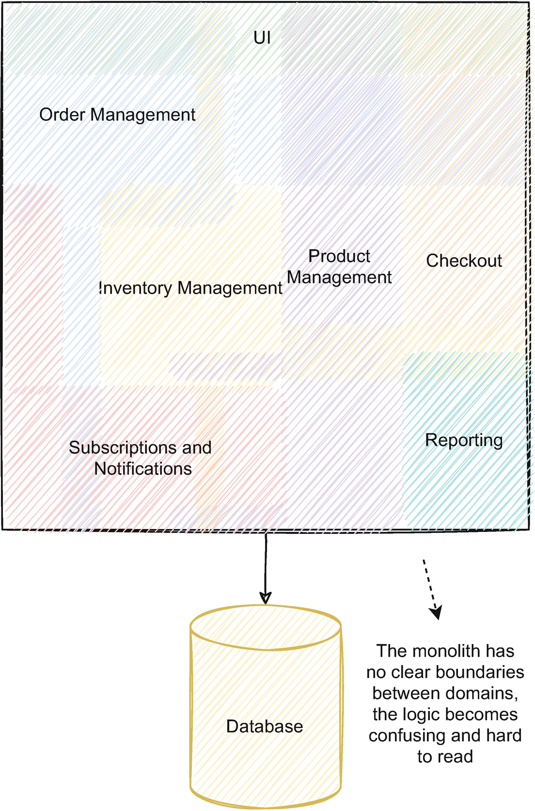
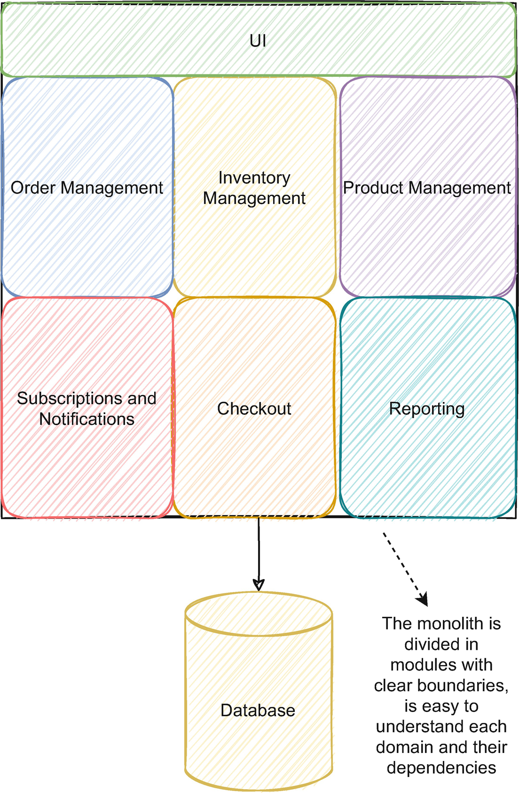
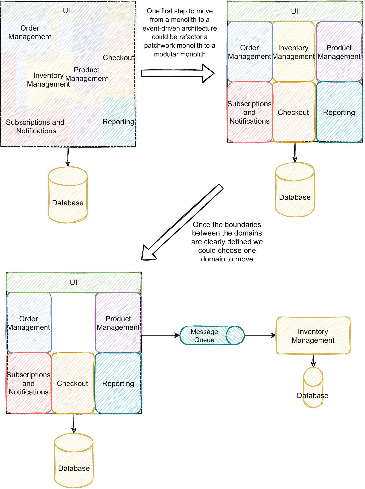
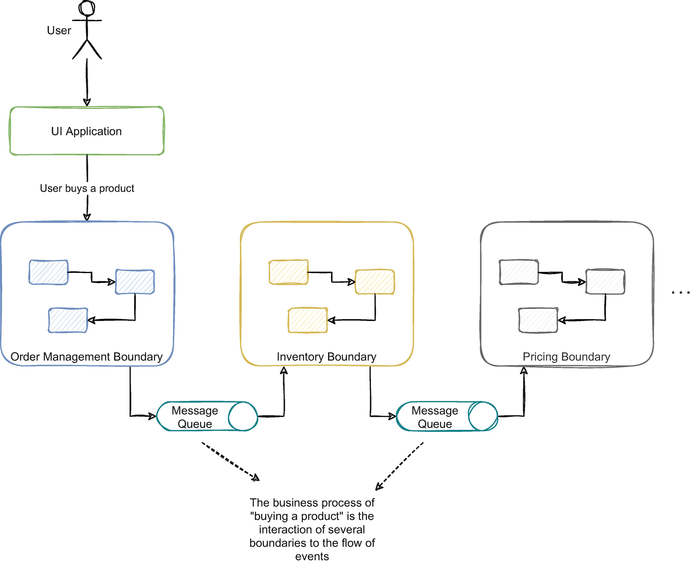
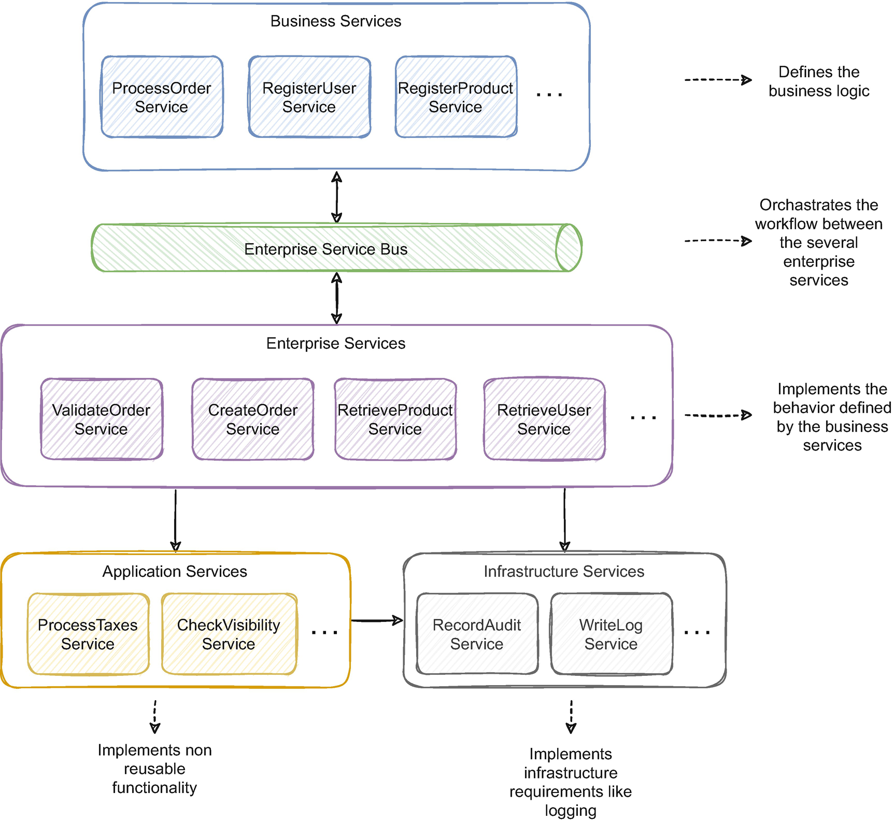
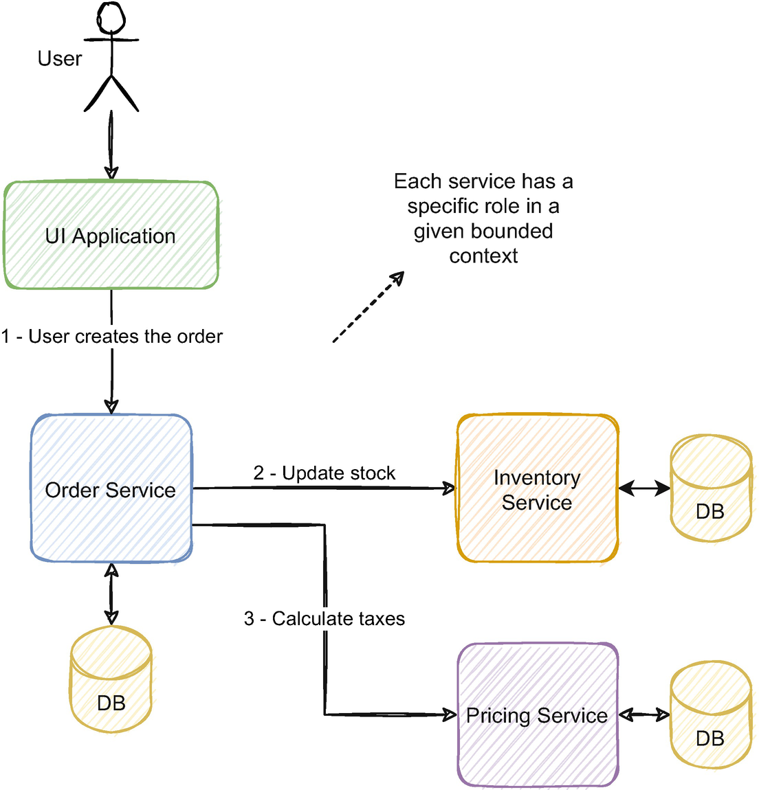
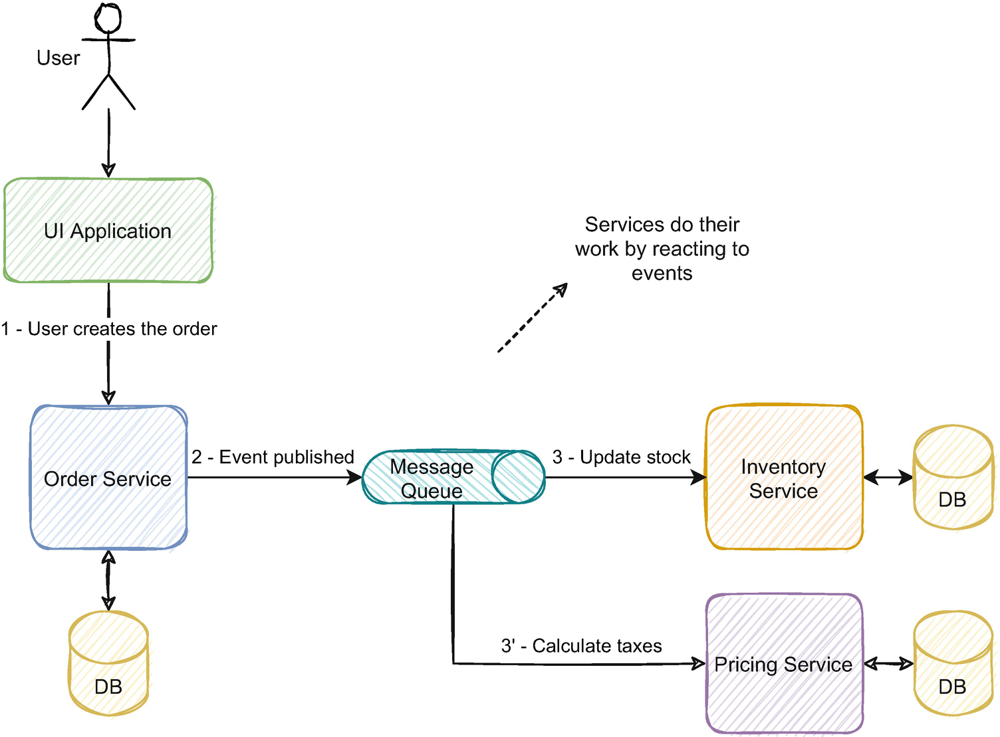
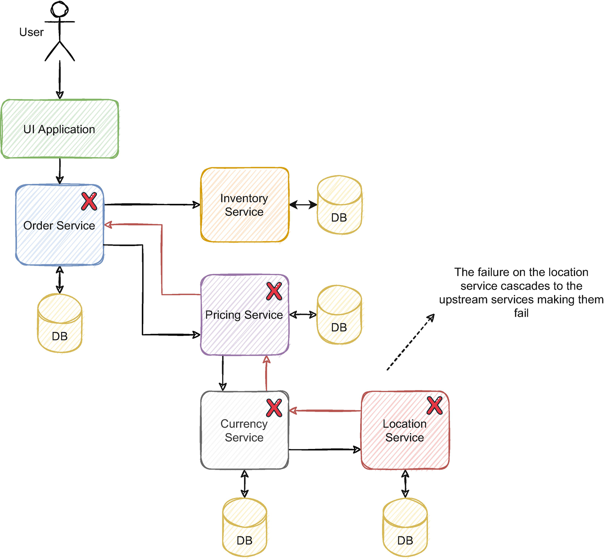

本章涵盖：

- 单体如何阻碍业务增长及其主要限制
- 了解微服务、它们的优势以及它们与事件驱动架构的关系
- 认识到采用事件驱动微服务的潜力以及事件驱动架构的工作原理
- 如何确定你的业务需要迁移到事件驱动架构
- 了解采用微服务事件驱动架构的挑战

你可能和我一样，在单体应用的局限性中挣扎过。它始于一个小团队，在单个应用程序中以快速迭代的工作模式交付价值。业务成功，用例增长并变得更加多样化。更多的开发人员加入以跟上需求。高优先级功能和紧急修复模糊了单一职责的界限，并慢慢将干净代码的做法变成了过去的残余。团队已经超出了应用程序的规模，我们很快就会为包含数百个冲突和复杂锁步发布的合并请求而苦苦挣扎。我第一次将单体迁移到分布式微服务架构时，感觉就像是我们经常容易陷入的荒凉大泥球中的一线希望。
它通常开始顺利：第一个微服务是鲜活的证明，即使在使用复杂架构的大型团队中，上市时间和团队自主性也可以成为软件工程的支柱。不起眼的细节是我们正在走进的根本不同的地狱，而大多数人都没有注意到。在全球电子商务平台上工作时，我记得有一个团队不得不将产品的库存信息迁移到新服务的情况。操作很简单：新服务将从保存库存数据的服务中获取库存信息，执行一些简单的操作，并在内部保存数据。该服务必须执行的操作之一是获取存储库存的仓库的位置，这涉及从位置服务请求数据。库存服务是平台中的重要组成部分，拥有充足的资源，并考虑到操作的额外吞吐量。然而，没有人考虑对定位服务的影响，定位服务是一个在平台中的重要性和相关性显然有限的组件。位置服务中操作增加的吞吐量导致服务因高负载而崩溃。我们很快注意到，在订单履行流程和平台的其他重要部分中使用了明显的次要和外围位置服务。新服务明显无害的数据迁移最终导致主要订单履行流程停止。对我来说，感觉就像微服务架构上的镀金裂开了，露出了下面的缺陷。
当一个看似无害的变化最终影响到一个完全不相关的功能时，分布式微服务架构似乎与单体架构没有什么不同。事实上，我们可能会两全其美，最终得到一个分布式单体。这个结果是我们在构建分布式微服务架构时需要解决的众多挑战之一。应对这些挑战的最可持续的方法之一是通过事件驱动的架构。
在微服务事件驱动架构中，几个解耦的服务相互反应并优雅地编排以完成业务目标。它们提供了不可变的事件序列，使你能够了解数据的目的和演变并解释其业务流程。事件驱动架构令人难以忘怀的美丽潜力在于能够提供具有历史和意义的数据流，使每个消费者能够采用更适合消费者环境的愿景，并在此基础上建立价值。
尽管事件驱动的架构并不新鲜，并且在 ESB（企业服务总线，详见第 1.3 节）中非常流行，但能够持续、实时地向分布式组件提供大量消息的能力无疑是新的。毫无疑问，对于大多数用例，最有价值的数据是最近的数据，但能够提供具有数据历史的可访问流，可以为难题提供强大的解决方案。以迁移数据为例。与在迁移运行时必须处理更改的数据的复杂同步解决方案不同，使用事件流进行同步变得微不足道且有机。
微服务突破了传统应用程序的极限，但有时也会解决更困难的问题。由于固有的耦合，传统上与微服务（如 REST）一起使用的同步通信变得有问题。尽管比单体应用安全得多，但服务的变化可能仍会在不经意间影响底层生态系统。服务之间复杂的同步调用网络难以跟踪，并为级联故障创造了温床。我们还选择微服务，因为它具有可扩展性功能，这可能会受到服务之间同步依赖关系的阻碍（在 1.4 节中进一步详细说明）。尽管我们仍然需要深思熟虑的方法来解决这些问题，但事件驱动架构提供了更高级别的解耦，并从头开始实现真正的进化架构。新消费者可以加入而不影响现有服务。可以在不影响其依赖关系的情况下停用旧服务。
然而，事件驱动架构的异步、分布式特性带来了我们在单体应用中通常认为理所当然的困难挑战。事件驱动也不是灵丹妙药，不应在每个用例中使用。最后，复杂的业务最终会在我们开发的技术解决方案中反映出它们的复杂性。我们的职责和使命是以一种使业务能够在规模、速度或新功能方面增长的方式对这种复杂性进行建模。事件驱动的架构提出了一种方法来做到这一点。

## 1.1 关于单体的真相
本节将讨论单体应用的优势和局限性，以及它们如何限制业务增长。单体应用通常被视为一种反模式，与遗留应用程序密切相关。然而，人们对单体的含义和用法存在很多误解。根据情况，单体可以是一个适当的架构决策，如果不承认这一点，就会限制我们的选择。微服务和事件驱动架构不是一刀切的解决方案；这两种单体都不是万能的解决方案。我们将在 1.1.1 和 1.1.2 小节中进一步详细说明。
我们可以采用许多策略来规避单体应用的限制，但有些限制达到了我们需要更可持续的方法的地步。业务增长的痛苦通常在单体应用程序中开始疼痛，并通过无数症状表现出来。如果不以深思熟虑的方法加以解决，这可能会限制企业的成功，并成为阻碍其发展的球链。单体应用的常见缺点在 1.1.3 小节中详述。
然而，决定转向微服务事件驱动架构需要深思熟虑的决定和充分的理由。事件驱动的微服务可能是单体应用许多限制的解决方案，但它们也是更复杂挑战的根源。迁移到分布式架构需要深思熟虑的准备和合适的肥沃条件来争取。我们在 1.1.4 小节中详细介绍了向事件驱动的微服务的迁移。
本节讨论这些主题，以便为你提供一个整体背景。第 2 章讨论了从单体架构到事件驱动架构的详细迁移，以及实现此目的的用例和策略。

### 1.1.1 典型单体的剖析

企业从某个地方开始，有时是从一个软件开始。该软件添加了新功能；有时成功，有时不成功，企业选择了不同的路线。如果我们足够幸运，那么业务就会繁荣，软件也会增长。由于设计选择或技术债务，新功能在应用程序内部蔓延，旧功能即使被删除也会留下足迹。如果不刻意将域和纪律严明的组织解耦，它很快就会变成一个难以维护的应用程序。

#### 拼凑的巨石

也被称为大泥球，最常见的巨石类型是那些多年来建造的没有明确界限和逻辑纠缠在一起的巨石。我喜欢称它们为拼凑，因为你通常会看到域逻辑的核心集中在一个地方，然后又遍布整个地方，就像拼凑而成的被子。
它们也是处理和维护最麻烦的。该应用程序是一个单一的工件，并且是一次性部署的。所有这些都是在机器中运行的单个进程。多年来，领域逻辑变得错综复杂且难以阅读。
图 1-1 说明了具有多个域的电子商务平台的示例。如果不刻意保持每个域的分离和解耦，来自不同域的所有逻辑就会融合在一起。

> 这种单体更容易受到第 1.1.3 小节中探讨的缺点的影响。

#### 模块化单体

模块化单体被划分为具有明确边界的模块； 代码是解耦的，可以独立演化。 模块化单体应用受益于单体应用的所有优势（是的，它们确实有一些，详见 1.1.2 小节），并且不会受到分布式架构的复杂挑战的影响。
单体通常具有负面联系，因为它们中的大多数都是拼凑而成的。 尽管如此，结构良好的模块化单体仍然可以成为与微服务、SOA（面向服务的架构）或事件驱动的架构一样有效的架构选择。 图 1-2 显示了与之前相同的示例，但所有相互交织的域都组织在清晰的边界内。

每个模块之间的依赖关系被包含、组织和可见。模块应该能够在不影响其他模块的情况下发展；即使我们需要删除其中一个模块，也是可能的，因为依赖项是显式的，并且包含域。
常见的陷阱是违反该原则是多么容易；依赖关系需要一个深思熟虑的策略来保持解耦。这可以通过针对每个边界的 API 来完成，也可以通过自动化测试来进行显式依赖项验证（本文 2 详细介绍了 Root 是如何做到的）。它仍然是一个部署在一起的单一应用程序；即使只更改一个模块，通常也需要部署所有模块。

### 1.1.2 他们没有告诉你关于 Monoliths 的事情；不全是坏事

尽管单体应用的名声很差，但使用一个代码库维护单个应用程序还是有优势的。由于被其限制所淹没，我们经常错过这些优势。我们经常在传统的单进程应用程序中使用一些基本的、众所周知的开发原则，这些原则在使用分布式系统时会变得有缺陷，需要不同的方法。分布式系统更复杂，不具备我们在单体应用中一直认为理所当然的一些特征。本节将详细介绍单体应用的主要优势以及它们如何简化功能的交付。

#### 业务流程可见

使用单个代码库，我们可以快速检查端到端流程。我们可以毫不费力地找到我们想要的任何功能，因为所有功能都在一个存储库中。由于我们可以看到该流程的依赖关系，因此也更容易看到新发展的影响。由于多个服务之间的异步交互，使用事件驱动架构的业务流可能变得难以阅读。要了解业务流程，我们需要了解每个服务之间的事件流。更难理解更大的图景，而在添加新功能时，大图总是很重要的，要么考虑可能的影响，要么了解开发是否适合该功能。在单体应用中，可以（虽然有时很费力）了解它们如何适应整个流程。

#### 没有网络开销和有限的外部依赖

所有不同的模块直接在应用程序内部相互调用。没有通过外部 API 或事件代理通过网络进行的远程调用。由于没有网络开销，此特性可以享受性能提升（尽管受限于扩展限制）。它也不需要处理 API 或事件版本控制和向后兼容性；如果需要进行重大更改，我们可以在单个版本中进行；所有依赖项都在应用程序内部。这个特性简化了需要更深刻变化的特性的开发和发布。
我们应该始终避免重大更改（我们将在第 8 章详细介绍），但有时它们是不可避免的。在事件驱动的架构中，我们需要临时支持一个事件的两个版本，或一个 API 的两个版本，以允许该事件的使用者适应新的事件。这些更改很复杂，因为它们可能会影响多项服务。需要在不同团队之间进行协调，以适应新事件的转变。由于开发了两个事件的发布和消费，然后移除旧的，因此存在相当大的开发开销。在单体应用中，这很简单；我们只是更改那个应用程序并发布它。

#### 本地验证

在单体应用中，可以在本地运行整个环境（虽然我看到应用程序需要几分钟才能构建，而在本地启动又需要几分钟）。通常，我们可以通过运行单个应用程序来添加和验证功能。但是，在事件驱动的架构上，我们会将该功能添加到工作流中的多个服务之一。由于流程的复杂性和所需的大量服务，通常很难在本地运行整个工作流程，每个服务都有其特定的配置和独特的依赖关系（有时甚至在不同的语言和环境中）。大多数服务我们甚至可能不太了解，因为它们属于其他团队。

#### 代码重用

由于所有代码都在应用程序内部，因此很容易重用和构建在现有功能之上。在事件驱动的架构中，每个服务都与其代码库隔离，许多服务将需要类似的功能，显然，共享代码是不可能的。创建跨服务使用的自定义框架可能很有用，但它不像在应用程序内部使用代码那么简单，比如单体应用，并且引入了稍后可能难以管理的耦合。框架也很难调试，如果我们需要用新版本更新所有服务，可能会很麻烦。通常微服务更喜欢复制代码而不是重用以避免耦合。重用代码也会使代码变得不那么有用，因为它需要处理所有可能的用例。框架仍然是日志等常见基础设施功能的宝贵资产。

#### 监控和故障排除

监控单体应用很简单，因为它只是一个应用程序。需要监控的机器数量减少，获取日志也很简单。由于范围缩小到一个应用程序，因此对问题进行故障排除也更容易。在事件驱动的架构中，有数十个或数百个微服务的多个实例。这需要一个完全不同的策略来监控和查明事件。需要一个预先存在的基础设施来管理所有这些微服务的信号和指标。理解一个事件也可以是一个侦探的旅程，如果没有刻意的方法，值得写一部短篇小说。另一方面，由于信息更加本地化，单体应用要简单得多。

#### 端到端测试

单体应用中的端到端测试比事件驱动架构简单得多，而且我敢说，它实际上是可能的，不仅更简单。由于它是单个应用程序，我们可以进行自动化测试来验证整个应用程序的流程。端到端验证通常包含在该应用程序中，因为它们不依赖于外部服务（数据库、缓存等除外）并且可以作为一个整体进行管理。在事件驱动的架构上，该方法必须从单件方法转变为没有端到端测试（或显着减少的数量）并有其他流程来保证质量（我们将在第 10 章中进一步详细介绍这些流程）。

#### 更简单的部署策略

由于只有一个应用程序，因此部署管道只需考虑该应用程序的需求。微服务架构必须支持部署多种不同的服务，这些服务可能用多种其他语言编写并具有多种不同的依赖关系。根据环境的多样性，构建这种管道的开销可大可小。单体应用的部署拓扑通常比微服务架构更简单（也更便宜）。

#### 数据集中

无论好坏，数据通常都集中在一个或多个可访问的数据库中。如果一个新特性需要某种数据，它可以直接从数据库中获取它。开发起来比较简单，但是当应用规模很大时，后果很严重。尽管在实现方面具有优势，但它也是离开单体架构的最常见原因之一。事件驱动架构的挑战之一是从其他服务中获取和管理数据依赖关系（在第 8 章中进一步详述）。

#### 可扩展

我们可以通过在负载均衡器后面安装该应用程序的多个实例来扩展单体应用（也称为 cookie cutr3 扩展）。应用程序确实需要准备好处理并发请求。但是，它仅限于应用程序的扩展，而不是数据库；当问题是数据库时，垂直扩展通常是唯一的选择。另一方面，事件驱动架构是为从头开始的水平扩展而构建的，并且更容易扩展。

#### 一致性

Monoliths 通常使用关系型 OLTP（在线事务处理）数据库，它们具有很强的一致性保证。单体应用上的这些类型的数据库通常享有 ACID（原子性、一致性、隔离性和持久性）保证，这提供了我们习惯的传统一致性保证；例如，变化同时发生在任何地方。在事件驱动架构上，由于事件的异步性质，一致性通常是最终一致性，处理起来可能具有挑战性（我们将在第 5 章中进一步详细介绍处理最终一致性的方法）。

#### 并发

在单体应用程序中，我们可以使用传统的策略来处理并发，以处理竞争条件，例如锁或使用数据库。但是，在事件驱动系统中的不同机器上可能有多个服务实例，不可能进行内存锁定。此外，根据服务使用的数据库技术，它可能不支持事务。处理并发事件需要不同的方法，我们将在第 6 章中进一步详细说明。

### 1.1.3 当Monoliths 成为商业节拍器
本小节将讨论我们与单体应用相关的常见问题以及它们如何限制业务增长。在多种情况下，单体应用是一个合适的解决方案；然而，随着公司的成长，他们的障碍变得越来越令人担忧，尤其是对于拼凑式的单体。在数据、使用和开发人员达到大规模时，公司通常会遇到最大的困难。当企业因为需要或成功而拉动其中一个因素时，单体应用的限制就会反过来。就像一个收缩结，你拉得越多，它拉得越紧。如果有足够的时间，它可以使业务停止。迁移到事件驱动的微服务架构时，必须有明确的原因或要解决的具体问题；通常它是本小节中讨论的一个或多个的组合。

#### 耦合和缺乏边界

单体应用的主要问题是，如果有足够的时间，它们会变得难以忍受的复杂和耦合。由于所有功能都在一个应用程序中，因此破坏每个域的边界相对容易。随着时间的推移，它们会褪色并缠绕在一起，难以阅读。单个更改可能会影响系统的多个部分并产生不可预测的影响，例如，更改订阅逻辑会影响登录。可靠地维护和更改成为一场噩梦。由于微服务事件驱动架构依赖于事件，因此在设计上是解耦的，更容易随着时间的推移维护域之间的边界。

#### 团队自治

随着开发团队的壮大，处理单个应用程序变得越来越困难。即使有明确定义的模块，开发仍然需要沟通和对齐，应用程序的部署需要不同团队之间的协调。根据开发工作流程，功能合并也成为问题。功能分支通常会导致具有大量冲突的大型合并。通信、质量保证和协调的开销随着在应用程序中工作的开发人员数量而增加。我们经常谈论扩展应用程序资源，但是单体应用程序通常会限制团队的扩展。

#### 发布周期

单个单体应用的发布周期通常大于微服务。即使公司采用持续交付，由于每次发布，周期本质上都会更大；无论更改多么小，都必须验证和部署整个应用程序。一次验证整个应用程序需要一个巨大的测试套件，它可能需要大量的时间来运行（假设没有经常进行的手动验证）。小的更改使部署更可控并实现快速反馈，从而更难以实现更大的发布周期。
通常，由于风险，依赖于单体应用的企业不会经常（例如每天）部署，因为我们总是部署整个应用程序。不部署往往会积累功能，更难有持续交付的心态。仅此一项就是远离单体应用的常见论据。

#### 伸缩

虽然缩放是可能的，正如我们在上一节中提到的，它仅限于应用程序。这也意味着单体应用具有处理多个不同实例并发的机制。如果不这样做，则需要进行大量更改才能处理并发请求。
大多数情况下，单体应用还会培育一个单体数据库，这是非常难以扩展的。当数据量开始变得非常大时，就会出现问题，尤其是对于需要大量连接的查询。垂直扩展（增加资源的数量，例如内存、CPU 等）始终是数据库和应用程序的一种选择，但它很快就会变得昂贵。如果企业发展到需要地理分布以向每个位置提供低延迟的阶段，单体数据库可能会限制其实现这一目标的能力。微服务方法在这一特定方面大放异彩，因为每个微服务都拥有自己的数据库（或至少应该拥有），这为更可扩展的数据分布铺平了道路。事件驱动的微服务在设计上非常容易扩展，因为它们处理来自队列的事件并且很大程度上受益于相关的解耦。
当我们扩展单个应用程序时，我们扩展了整个应用程序。大多数时候，只有一个或部分模块需要扩展。但由于每个模块都绑定在一起，唯一的选择是扩展整个应用程序。通过使用微服务方法，可以仅扩展架构中需要扩展的部分，而将其余部分的资源降至最低，从而优化成本和资源。

#### 过时的技术栈

大多数时候，单体应用是有几年的应用程序。与此同时，一些技术可能已经停产。它超越了通常的技术炒作，仅仅因为它是新的最好的东西就采用某种东西。如果应用程序使用的技术不再受制造它的公司支持，那就是一个问题。假设我们面临与新版本操作系统的兼容性问题，或者选择采用不同的方式来部署应用程序（例如，如果我们选择在 Linux 环境中部署 .net 框架应用程序）。在这种情况下，如果单体技术不支持它，它将限制我们的选择。它可能会破坏新功能，并可能严重阻碍我们的发展能力。大多数情况下，在单体应用上改变整个技术堆栈需要付出巨大的努力，并产生难以想象的影响。
由于边界之间的耦合，技术债务和不再需要的功能可能难以消除。尽管我们可以使用模块化单体来实现这一点（Shopify 使用他们的税收引擎 4 做到了这一点），但在大多数情况下，删除或替换功能涉及触及整个应用程序，并且可能会产生不可预见的后果。尽管任何服务都可能有过时的技术栈，但事件驱动的服务是高度解耦的；以新技术实现现有服务大大简化。

#### 可靠性

部署单体应用的风险在于任何更改都可能导致整个应用程序宕机。即使应用程序中不太重要的部分发生变化，也会产生影响整个应用程序的问题（如内存泄漏或不可预见的 CPU 使用），而整个应用程序就是每个功能。
事件驱动的架构可能不会直接提高可靠性，因为通过在多台不同的机器上使用多个实例，我们正在增加可能发生的故障的数量和类型。解决这些问题的深思熟虑的方法至关重要。但是，我们可以独立部署系统的较小部分，这（希望）不会导致整个应用程序宕机。

### 1.1.4 使用事件驱动架构远离单体

在最后几个小节中，我们讨论了单体应用的优点和局限性。在本小节中，我们将讨论单体架构和事件驱动架构之间的过渡阶段。我们将稍微讨论迁移到此架构时需要考虑的事项以及如何开始。这些主题将在第 2 章通过实际用例进一步详述。
重要的是要注意，事件驱动的架构并不是适用于每个用例的理想解决方案。正如我们在 1.1.2 小节中讨论的那样，单体应用具有一组使开发更容易的属性，并且在 1.1.3 小节中讨论的限制也至少可以管理到一定程度。迁移到事件驱动架构会大大增加复杂性并产生与之相关的成本。例如，初创公司是否应该从一开始就采用事件驱动的架构，这是值得商榷的。初创公司通常仍在努力了解哪些产品有效，哪些无效，需要快速上市，需要创新，并且可能需要重组大部分解决方案。在资金有限的情况下，事件驱动的微服务架构会因基础设施（部署、监控等）而产生相关成本，这在早期阶段可能会过大。此外，我们可以在对领域及其边界有相当了解的情况下最好地应用它。在它们到位后更改边界可能既昂贵又费力。
理解我们为什么要转向事件驱动架构也很重要。通常，这种架构的潜力（在第 1.6 节中有详细说明）和围绕它产生的炒作可能很诱人。尽管如此，第 1.1.2 小节中提到的一个或多个因素比炒作要强得多。也许我们已经在为单体应用的一个限制而苦苦挣扎，也许我们已经在扩展应用程序或数据库方面苦苦挣扎，也许我们的团队变得太大了，也许我们想要一个工具，使我们能够采用敏捷和持续交付的思维方式舒适。我们应该始终有充分的理由进行转移，并且在迁移时应该将其作为重中之重。选择这个原因后，我们应该衡量我们如何反对它并了解我们是否正在取得进展（这将在第 2 章中进一步详细说明）。
要采取行动，了解从哪里开始、存在哪些域以及它们如何相互交互至关重要。图 1-3 说明了从拼凑的单体迁移到模块化单体的可能步骤。如果单体是拼凑而成的单体并且大部分逻辑耦合在一起，那么重要的第一步可能是将该单体重构为模块化单体。如果我们在重构为结构良好的模块化单体时，单体应用的大部分问题都消失了，那将是史无前例的。有时，在单体应用中进行这种转变是一场彻头彻尾的噩梦。无论哪种方式，尝试这样做对于理解领域和相关边界至关重要，即使我们不更改为模块化单体。通过了解边界，我们可以推断哪个域是最适合开始迁移的域。通过了解它们的依赖关系，我们可以计划如何在单体和新架构上解决它们。如果单体是模块化的，那么部分工作已经完成，边界已经定义，并且更容易理解它的依赖关系。

选择要迁移到新架构的域并不总是那么容易。决策必须权衡风险、价值和可行性。风险是业务领域的重要性，价值是我们从迁移该域中可能获得的收益，可行性是迁移它的实用性和可行性。
一旦我们选择了一个合适的域，我们就可以使用事件驱动的方法将该域与单体应用程序分离。在图 1-3 的示例中，我们将库存管理模块移动到一个独立的服务，该服务对原始单体中发生的变化做出反应。然而，这种变化引入了分布式事件驱动架构所面临的所有挑战，本书将对此进行讨论。
将单体应用程序迁移到事件驱动的微服务应用程序的过程几乎不是完整的一次性迁移，我们在此过程中分解单体应用程序并从头开始创建全新的架构。我很少看到这种情况发生；最有可能的是，你已经拥有一个单体应用，并且可能开始将其迁移到分布式架构。在大多数情况下，采用全新的事件驱动微服务架构也不是正确的选择。在转向这种架构之前，必须对领域及其边界有深刻的理解。没有现有的应用程序，很难深入掌握系统的领域。一开始，这些领域可能会发生很大变化；通过重组和重新定义域，尽早采用事件驱动的架构可能会产生大量成本。
采用小增量迁移使我们能够了解什么有效，什么无效。它使我们能够在保持业务运行的同时，一步一步地应对分布式事件驱动架构的挑战。它为我们提供了失败的空间，了解我们失败的原因，并在小范围内进行相应的调整。它为我们提供了适应、学习和行动的空间，而不会让世界崩溃。事件驱动的架构还引入了与同步微服务不同的解耦和可靠性级别。事件流支持以可持续的方式访问数据，即使是从单体应用程序中也是如此。我们将在第 2 章中进一步讨论这些策略以及从单体架构到微服务事件驱动架构的迁移。

## 1.2 什么是微服务以及它们与事件驱动的关系
在上一节中，我们讨论了单体应用的特征和限制以及它们如何限制业务增长。在开始迁移到微服务事件驱动架构时，我们还考虑了各种考虑因素。在本节中，我们将讨论什么是微服务以及它们如何适应事件驱动的架构。
事件驱动的微服务是一种简单的、特定用途的服务，它对事件做出反应以完成其工作。在事件驱动的架构中，这些服务中的几个相互交互以完成更高级别的流程。通常，交互由不同服务之间的一系列事件组成。
事件驱动架构使用通过这些松散耦合服务的消息流来完成其业务流程。每个服务都属于给定的域或有界上下文，并且在该域内具有特定的角色和有限的职责。每个域都有责任处理该域中的相关数据并将该更改传达给其他域。
使用电子商务平台的图 1-4 中的示例，在购买产品时，完成该订单的过程将是多个边界的交互，在这种情况下，是订单、库存和定价边界。订单管理边界处理订单，库存边界管理库存，定价边界管理该国家/地区的税收和最终价格。多个单独服务的编排或编排不是单个应用程序中的同步流，每个服务都有其作用。拥有单一用途的服务可以为每个服务以及每个边界提供有机边界。

在事件驱动的微服务中，每个完全解耦的服务通过与技术无关的消息相互反应，以完成更高的业务流程。

### 1.2.1 部署

我们还应该使事件驱动的微服务可独立部署；一个常见的反模式是需要将多个服务部署在一起。当我们需要这样做时，管理和保证可靠的发布很快就会变成一场噩梦。此外，部署应该是自动化的；团队应该专注于交付业务价值，而不是通过复杂的发布过程费力地推动他们的发布。需要使用正确的工具来进行具有所需验证的自动化部署。开发人员应该依赖这些部署工具，而不是发布或 DevOps 团队。

#### 1.2.2 解耦自主开发

我们应该自主开发每个服务，而不依赖于其他服务。由于服务之间的消息代理，它们也应该完全解耦，很容易实现。事件驱动使架构具有高度可演化性（如《构建演化架构》一书中所述）；给定服务的变化几乎不会影响整个架构，我们可以独立部署服务。这一特性也使架构具有高度的可插拔性，因为新服务可以简单地侦听已经流经架构的事件。

### 1.2.3 数据所有权

每个服务都应该拥有其域所需的数据，并通过一个简单的接口公开它，通常在事件驱动架构中进行消息传递（尽管 API 也是一种替代方案）。由于数据是实现独立和自主发展的关键。否则，通常一项服务的更改需要其他服务同时更改。在单个服务中可管理的架构更改成为发布的噩梦。

## 1.3 SOA、微服务和事件驱动架构
SOA（面向服务的架构）和微服务架构在谈论事件驱动架构时经常会出现。关于 SOA 和事件驱动之间的差异，甚至存在一些混淆。本节将详细介绍这三种架构的特点，并提及它们之间的区别。
有时你可能会听到，“是的，自 2000 年以来，事件驱动的微服务已经使用 SOA 做到了这一点，这并不是什么新鲜事。” SOA 由精心设计以完成复杂工作流的服务组成，而不是像单体应用那样的单个应用程序的同步流。它还使用消息传递在服务之间进行通信。乍一看，它确实听起来与事件驱动架构相似，但它们有根本的不同。

### 1.3.1 SOA

SOA 通常尝试使用可重用组件来构建业务功能，这些组件通过解耦介质（如网络或服务总线）进行通信。我们将关注带有 ESB（企业服务总线）的 SOA，它类似于事件驱动架构。 SOA 架构的典型组织如图 1-5 所示。

以用户在电子商务平台上购买产品的相同示例为例，我们可以定义一个名为“ProcessOrder”的业务服务来处理与处理订单相关的业务逻辑。此服务以抽象方式确定该企业处理订单所需的内容。企业服务总线协调企业服务所需的调用。企业服务实现由业务服务定义的特定行为。在这种情况下，服务总线会按照正确的顺序调用每个企业服务来处理用户的订单，企业服务会做实际的工作并管理状态。企业服务旨在为任何工作流程重复使用；另一方面，应用程序服务实现不需要可重用的功能，例如处理仅与订单工作流相关的订单特定税。基础设施服务实现横切功能，如日志记录或监控。
应用服务背后的理念是使功能可重用，这是这种架构的核心设计关注点，与微服务和事件驱动的共享功能有限（甚至避免）相反。 SOA 专注于抽象的、可重用的功能，而微服务和事件驱动架构则专注于围绕域组织其组件。
此外，在 SOA 中，服务总线趋向于变得越来越大。业务逻辑倾向于添加到总线而不是服务。除了编排之外，总线还负责几个职责。总线通常是路由和知道与每个服务通信的组件，并且通常具有适应和转换请求的逻辑。尽管整个架构是分布式的，但企业服务总线往往会发展壮大并成为一个整体，尽管整个架构往往是两全其美。

### 1.3.2 微服务架构

微服务架构包含多个特定用途的服务，这些服务一起交互以完成给定的流程或工作流。服务根据有界上下文并在给定域的范围内进行分组。它们使用消息代理或 HTTP 请求进行解耦并相互交互。图 1-6 说明了微服务架构中电子商务平台的相同示例。

订单服务负责处理新订单的请求。然后，该服务与库存服务通信以管理产品的库存，并与定价服务通信以管理税收。每个服务负责一个动作，并围绕一个域概念（订单、库存和定价)建模；处理订单的工作流是通过多个服务之间的交互来管理的。同样重要的是要注意，每个服务都有一个数据库而不是共享存储；它们还公开其他服务与它们交互的接口，并且只公开相关数据。与将可重用性放在首位的 SOA 不同，微服务避免共享。相反，他们专注于该领域和有界上下文。
这种架构是高度解耦的，因为组件之间存在物理边界。他们必须通过网络进行通信；这对每项服务构成了自然界限。在给定域的范围内组织特定的有界上下文允许域在不影响其他不相关组件的情况下改变。

### 1.3.3 事件驱动微服务架构

如上一节所定义，微服务事件驱动架构共享许多相同的微服务架构原则。但是服务之间的交互集中在事件的使用上。图 1-7 说明了与图 1-6 相同的示例，其中包含事件驱动架构。

代替订单服务和其他服务之间的同步调用，库存和定价服务对来自订单服务的订单创建事件做出反应。在消费事件时，它们异步地完成工作，库存服务更新库存，定价服务计算税收。
通过使用事件代理处理服务之间的通信，我们进一步解耦了服务。订单服务不知道它的任何订阅者，库存和定价服务只知道事件合同。添加新的消费者也很容易；我们只是将它们插入到事件队列中。想象一下，我们必须添加一个订阅服务，在订单接收时通知用户，我们只需将该新服务插入消息队列，而无需更改订单服务。这进一步提高了在不影响不相关的组件或边界的情况下更改每个组件和发展其领域的能力。
完全由事件驱动服务组成的架构，你可能会在书籍或概念证明中找到。大多数现实世界的架构是异步和同步服务的混合。一些用例需要同步功能，或者不能简单地从异步队列的复杂性中受益，API 就足够了。这两种服务之间的交互提出了挑战，需要深思熟虑的策略来应对。事件驱动架构的挑战在第 1.6 节中进一步详述。
事件驱动架构不仅仅是对事件做出反应；他们引入了一种共享数据的新方法。例如，这通常是通过 API 同步请求完成的。 API 可用于实时获取一小组最新数据。移动大型数据集很困难，并且可能会对服务及其数据库产生影响。由于模式耦合或应用程序可能对另一个应用程序产生的影响，我们不共享数据库。同步 HTTP 请求可以产生与我们在解构单体数据库时试图避免的相同效果。
在事件驱动的架构中，也可以理解数据的演变。通常，最关键的数据是最新的数据。典型的消息传递会产生一个事件，一旦服务使用它就会消失。然而，保持事件并保持它被同一个应用程序或未来的应用程序再次自由消费的能力开启了强大的可能性。事件流成为共享所有实时发生的相关数据的媒介，并提供了一种方式来了解它在过去是如何变化的。这也是一种将数据流式传输到其他服务的强大方式。每个消费者都可以插入流并创建状态的个性化视图。此属性使服务能够组合来自不同来源的数据，并以其领域和查询需求的最佳方式对其进行建模。

## 1.4 事件驱动微服务的承诺
到目前为止，我们讨论了单体的特性、架构类型之间的差异以及事件驱动架构的定义。本节将讨论微服务事件驱动架构的优势，以及它们如何成为我们通常在单体应用中发现的许多限制的有效解决方案。我们还将讨论事件驱动如何使常规微服务架构受益。
当丰田开发精益制造时，重点是识别和保持每个产品的价值；一个关键概念是消除浪费和一切不会为客户增加价值的东西。例如，如果你要购买汽车，你并不关心汽车的车门在工厂内运行了多长时间，尽管零件的路径越长，对生产力的影响就越大，进而对汽车成本的影响也越大。工厂应该组合成尽量减少门的运输；你只关心汽车是否有功能性的门。有时，由于技术挑战，我们发现事件驱动的架构很有吸引力。尽管如此，当客户提交订单时，它并不关心它是由单体还是由尖端架构处理。重点应该是快速、安全地大规模交付价值。事件驱动架构如何实现这一点？

### 1.4.1 演进的架构

构成架构的服务被包含和解耦，并且在给定的域中具有特定的作用。这些特性限制了架构变化的影响；更改一项服务几乎不会影响其他服务。有界上下文的自然隔离使域能够随着业务的变化而变化，而不会影响其他域。很容易向架构添加新服务；通常唯一需要的更改是添加新的消费者服务，这不需要更改上游服务。
通过消息队列解耦小组件也可以实现实验思维；用新服务尝试一些东西很容易，如果它不起作用，就停止使用它。由于每个服务是不同的解决方案和独立的过程，因此每个组件之间的高度解耦，因此技术债务也自然包含在组件或边界中。当重构过于复杂并且涉及更改整个服务时，它创造了机会，只要新服务的引导程序很简单，就可以创建一个新服务并分解旧服务。

### 1.4.2 部署
正如我们所讨论的，单体应用的部署是有风险的，并且通常与测试回归和大的发布周期有关。相反，由于每个服务的粒度和解耦性质，事件驱动的微服务支持独立部署，而无需协调服务。它为持续交付铺平了道路；可以在几乎没有影响的情况下快速且可持续地更改整个系统的小增量功能。在图 1-7 中描绘的示例中，如果在定价服务中有计算税费的新方法，我们将更改定价服务以计算新税费并仅部署该服务。
它还为文化变革提供了基础。当组织有一个应用程序时，开发人员通常会专注于构建阶段，现在它有几十个或数百个。重点需要转移到整个应用程序的生命周期；团队需要管理从开发阶段到生产部署的开发和服务。 Microsoft 有一篇引人入胜的文章 6 将代码所有权与更高的质量联系起来。这种文化变革使这种所有权和自主权成为可能。

### 1.4.3 团队自治

团队将拥有并自主开发一组服务，而不是在单个应用程序中协调更改。由于服务的解耦性质，很容易自主开发这些服务，而无需其他团队的依赖和协调。这些属性意味着决策可以更快地由受决策影响最大的人做出——每天在战壕中使用服务的人，以及被要求解决事件的人。它还授权团队做出这些决定。
拥有一组服务的团队可以同时将功能添加到不同的域。通常，团队之间唯一需要的协调是合同定义；一旦达成一致，两个团队就可以并行开发自己的服务。在图 1-7 的示例中，如果定价服务需要添加一个功能来计算订单地址的运费，则订单服务可能需要在事件中发布订单地址，并且定价服务需要执行计算。但是一旦他们就如何在事件中反映地址达成一致，他们就可以并行、自主地进行开发，而无需相互依赖。
这个特性是增加团队数量的基石。我们经常提到技术可扩展性，但这使得工程团队具有可扩展性。通过启用解耦架构，在服务之间定义边界和所有权，我们构建了可持续添加更多团队并有机增长的方式。

### 1.4.4 灵活的技术栈
我们经常听到“为正确的工作使用正确的工具”这句话。我发现它被高估了，有几种工具可以完成这项工作，但没有一个是正确的，通常是权衡一组属性的权衡和偏好。尽管如此，某些技术显然比其他技术更适合某些角色。例如，如果我们需要在没有重要查询能力的几个数据中心之间进行地理分布，那么在该用例中使用 Cassandra 可能是一个不错的选择，但由于查询限制，在所有平台服务中使用它几乎不是一个好的选择.很难在单个应用程序中管理不同的数据库技术，如单体应用（虽然模块化单体应用是可能的，但我们不经常看到）。另一方面，在事件驱动架构上，由于所有组件都是独立和解耦的，因此很容易为每个服务采用不同的技术。
几年前我们可能会看到的另一个论点是使用全栈 JavaScript 应用程序来促进使用单一编程语言的开发。同时，我们了解到这不是一个好方法7，多语言编程可能更可取。8 解耦服务可以实现多语言环境，这在单体应用中是非常困难的。

### 1.4.5 伸缩性和可用性

事件驱动的架构在单个故障不能或几乎不会使整个系统崩溃的意义上实现了更高的弹性。单体应用程序更容易受到这种影响，因为应用程序基础设施部分的严重故障（如内存泄漏）可能会导致整个应用程序崩溃，甚至是未更改的模块。在事件驱动的微服务架构中，这些类型的故障自然会与该组件绑定，因此如果一个故障，其他故障将继续运行。
由于消息队列提供的解耦，事件驱动实现了比同步微服务应用更高的弹性。在具有 HTTP 请求网络的分布式微服务应用程序中，我们经常看到它们容易受到级联故障的影响。如果一项服务发生故障，它将影响所有上游服务，并且故障将沿链传播。我们在图 1-8 中说明了这种情况。第 3 章中进一步详细介绍了该主题。

在这种情况下，位置服务失败或离线，并将该失败传播到上游服务，从而产生级联失败。这种同步请求的网络会导致复杂的依赖关系和不稳定。事件驱动的微服务自然对此具有弹性，因为即使服务出现问题，由于事件队列的存在，它仍将本地化到该服务。
事件代理提供的解耦也意味着更高的可用性；即使系统的某个组件或部分没有响应，其余组件仍将继续处理和响应请求。有机地添加事件驱动服务的新实例的能力进一步增强了它。我们可以通过这种方式实现容错；一个实例可能不可用，但其余实例将继续处理。

### 1.4.6 可调缩放

正如我们在 1.1.2 小节中看到的，我们可以扩展单体应用，但它是全有或全无的；我们扩展了整个应用程序，而不仅仅是我们需要的模块。例如，如果平台收到订单高峰，我们几乎不需要扩展报告模块。微服务能够仅扩展需要扩展的服务。这使系统的资源能够随着业务需求而减少或扩展。这也是具有成本效益的，因为我们正在将我们的资源调动到需要它们的组件上。
事件驱动的微服务通常是事件代理的消费者；添加新消费者通常很简单。轻松添加新消费者实例的能力提供了自然的水平扩展，而无需负载平衡器。单体应用的扩展通常也受到数据库的限制；通过拥有具有独立数据库的服务，我们可以在服务之间分配数据，从而消除系统中的限制。

### 1.4.7 历史回溯

正如我们在上一节中讨论的，事件驱动架构可以通过事件共享数据。共享不限于当前正在发生的信息；相反，它提供了迄今为止事件的完整历史记录。在典型系统中，要将数据从一项服务迁移到另一项服务，我们需要查询原始服务 API 的长进程，通常具有吞吐量限制以限制对系统的影响。它还具有复杂的逻辑来处理迁移期间发生的变化。例如，如果我们正在运行一个流程来迁移库存，那么在迁移开始时，产品可能有两个库存单位。在迁移过程中，用户可能已经购买了这些单元。因此，迁移过程必须考虑迁移发生时的变化，这很容易出现棘手的极端情况。
使用事件驱动的架构，我们很自然地处理这个问题，因为我们从历史的起点开始阅读；当我们到达终点时，可以保证中间发生的每一个变化都得到反映。流式数据比查询更具可持续性；它完全取决于需要数据的服务。过去也有价值；企业可以使用它来学习和推断。如果需要对数据进行新的投影，我们可以使用该流来创建唯一的投影；数据并没有消失，任何人都可以随时使用。

## 1.5 什么时候应该使用事件驱动的微服务？
本节将简要讨论在考虑迁移到事件驱动架构时可能相关的标志。我们也会质疑这是否是正确的决定。总的来说，微服务一直是一种时尚的技术选择，被很多公司采用，很多时候，ThoughtWorks 将微服务命名为 Envy。9 正如我们在上一节中看到的，结合事件驱动，它具有强大的特性。但是我们应该盲目地急于采用它吗？
多年前，当我开始使用 C# Linq（一种将本机查询添加到 .net 的语言组件）时，我开始将它用于所有事情。需要选择数组的第一个元素？林克是。直到有人，比我聪明得多，问我是不是做得过头了。当时的我，一个无所不知的年轻人，对在每一个可能的用例中自命不凡地背诵 Linq 的所有好处的评论感到困惑。我确实在 Linq 方面改过自新，但这不是我们经常使用流行技术做的事情吗？目前，微服务遭受同样的轻率采用。 Kelsey Hightower 有一句有趣的引述说：“直到你明白什么时候不应该使用工具，你才算掌握了它”，这很好地象征了这一点。
转向事件驱动时要问的第一件事是我们为什么要采用这种架构？正如我们在第 1.1.3 小节中看到的那样，单体应用是有限制的，可能会导致业务增长停滞。我们希望通过微服务解决许多这些限制。我们需要有一个明确的原因，这应该是迁移时要解决的首要任务。作为工程师，我们尝试根据数据和指标做出决策；最好说“好吧，在 30 天没有发布之后，我们肯定需要转向微服务。”显然，它不会那样工作。但是，可能有强烈的迹象表明我们可能会从微服务事件驱动架构中受益：

- 团队超出了应用程序：通信和协调开销大大超过了开发工作量。功能合并是巨大且容易出错的，具有常见的相互冲突的接触点。这些仍然可以通过模块化单体进行管理，将模块分配给不同的团队以促进独立性和自治性，但仅限于此。微服务的自然边界通常很合适。
- 扩展：我们不能再扩展了。这是一个棘手的问题；当你认为你不能扩展时，很可能你仍然可以；可能只是太贵了。正如我们提到的，我们可以使用相同应用程序的重复实例来扩展单体应用；这是一个有效的选择。然而，数据库通常是痛点。通常，它只能垂直扩展或使用不同的技术。事件驱动的微服务被设计成水平可扩展的，这有助于解决这个问题。
- 弃用的技术栈：应用技术不再受支持或已过时。可以逐步升级现有应用程序，尤其是在模块化单体中。然而，在大多数情况下，它具有挑战性且成本高昂。
- 拥抱持续交付的心态：虽然更具挑战性，但没有什么能阻止单体应用采用持续交付的心态。如果发布周期很长，意味着漫长的回归，如果解决方案大得无法忍受，一个可能的解决方案可能是模块化单体。然而，通常很难过渡到模块化单体。微服务需要自动化发布和 DevOps 文化的基础，这可以促进过渡。

大多数这些标志都需要很大的比例；我们不会说每个初创公司都需要从单体应用开始，10 但它们通常是很好的例子，说明它们如何从一开始就无法从复杂的微服务架构中受益 11。最近的一家公司仍在试图弄清楚什么有效，什么无效；我们作为开发人员仍在努力了解存在哪些域及其边界。如果域之间没有稳定的边界，我们可能需要稍后重新绘制它们，这在现有的微服务架构中可能会很昂贵。
我们讨论了事件驱动架构的解耦性质和微服务的本地化范围如何促进交换组件。这一特征似乎与重新定义边界的相关成本背道而驰。域边界的大规模重构通常会影响来自不同边界的多个服务。它们通常需要更改域，这通常会影响更改域逻辑和模型、数据库模式和多个服务的事件契约，这通常会影响多个团队并具有复杂的依赖关系。由于它们所暗示的纯粹努力，我们应该避免对架构进行这种深刻的改变。通常，拥有一个广泛的应用程序会更有益，我们可以在不妨碍上市时间的情况下了解存在哪些边界。当我们对领域有了充分的了解后，我们就可以开始迁移到分布式架构了。
虽然单个应用程序很容易监控和观察日志，但事件驱动的微服务需要通过管道自动化、集中日志记录和监控、自动化测试和消息代理来实现发布成熟度的坚实基础。所有这些都有相关的引导和维护成本，公司需要考虑这些成本。它肯定会在复杂的大型企业中得到回报，但如果小型企业将从中受益，则值得商榷。
微服务架构中的大量组件也有利于自治和所有权，但集中决策变得困难。例如，通常，带有 ESB 的 SOA 架构有一个集中的团队来决定消息契约。使用事件驱动的微服务，这种管理变得有问题和瓶颈；尽管标准指南很有用，但我们应该将决策的自主权委托给团队，这对于想要保留中央控制权的公司来说可能不是最好的情况。

## 1.6 事件驱动架构的挑战概述

正如我们在上一节中所讨论的，微服务事件驱动架构可以解决复杂的问题，并成为真正可扩展、有弹性和进化的架构的基础。采用一个也意味着我们正在打开一个潘多拉魔盒，迎接新的挑战。我们在单体应用中一直认为理所当然的许多特性突然消失了。分布式系统本身也带来了新的挑战，需要深思熟虑的策略来应对。本节将简要讨论这些挑战。
设计事件驱动架构的一个基本步骤是确定服务的规模和范围。对此没有公式，它可能变得主观。最有用的策略是遵循 DDD（领域驱动设计）并正确获取服务之间的有界上下文。然而，这需要对系统及其领域有深入的了解。正如我们在前几节中看到的，稍后更改这些边界可能既昂贵又耗时。我们在第 3 章详细介绍了服务设计和 DDD。第 4 章讨论了组织微服务的模式。
在单体应用中，我们习惯于享受强一致性；任何更改都可以立即在应用程序的任何地方看到。服务之间事件代理的存在使每个服务异步。服务的异步特性产生了所谓的最终一致性；如果有足够的时间，所有更改最终都会在整个系统中传播。然而，虽然更改仍在传播，但不同的系统部分可能会将旧数据返回给客户和架构内的其他服务。这就提出了如何处理陈旧数据的挑战。第 5 章进一步详细说明并提出了处理最终一致性的解决方案。
服务的最终一致性和异步性质需要不同的 UI 设计方法。典型的 UI 会导致用户进入虚假的强一致性，因为更新可能需要一些时间才能发生。 UI 上的“更新可能需要一些时间才能反映”之类的消息很常见，也是一种可疑的用户体验。第 9 章进一步详细介绍了该主题。
在单个应用程序中处理并发也很简单；我们可以使用传统方法来处理并发线程，例如锁定或互斥锁。然而，在事件驱动的架构中，我们通过拥有同一服务的多个实例来扩展。内存并发机制不再起作用，因为并发请求或事件可以针对不同的实例。如果事件的顺序被切换，消息排序也可能是一个问题，如果服务在最近的事件变得不一致之后处理旧的事件。虽然有broker保证顺序，但大部分都没有，重试会乱消息。第 7 章详细介绍了如何与幂等消息实现更好的一致性。第 6 章详细介绍了处理并发和无序消息的策略。
事件驱动架构享有高度解耦。随着业务流程通过边界，域流本身将它们耦合在一起。通常，服务之间唯一的共享点是消息的契约。契约成为系统设计的关键，因为事件模式及其大小经常是热烈讨论的话题。事件可大可小；取决于我们如何设计它们，两种方法都有权衡。然而，正如我们在第 8 章中详述的，它们严重影响了需要它们的系统和整体架构。
支持团队通常需要对应用程序进行快速数据修复。单体应用程序支持这一点，因为单体数据库通常会备份它们。当我们转向具有数十或数百个服务的分布式架构时，这些快速修复并不是那么简单。在事件驱动的架构中，纠正某些内容通常意味着发送具有相反操作的命令（例如，如果我们由于错误而错误地使用 AddStock 命令添加库存，我们需要执行相反的操作并发送 RemoveStock 命令）。通常，这样做需要从头开始定制工具以允许这些类型的操作。
正如我们之前所讨论的，在事件驱动的架构中，消息代理允许组件高度解耦。解耦使架构具有高度进化性，并且组件可以随心所欲地来来去去。允许系统随着业务发展是一个很好的特性。然而，当我们有许多解耦的组件时，就很难理解服务之间的流程。测试端到端流程，由于多个组件的交互，这是不切实际的。每个组件也可以独立部署，这就增加了我们每次部署单个组件时保证端到端流程质量的挑战。第 10 章进一步详述了质量保证的挑战和策略。
不同的团队负责不同的服务集。添加业务功能可能会影响多个团队，因为功能通常涉及多个领域。尽管服务之间的解耦促进了并行工作，但有时会出现多个团队之间的复杂依赖关系。第 10 章进一步详细介绍了事件驱动架构的组织影响。
当技术变得流行时，人们倾向于将它们视为解决我们大多数问题的神奇解决方案。我们有时会急于对他们的问题视而不见，而是专注于他们可以带来的好处。然而，它总是关于权衡取舍。有些类型的挑战我们只能在生产中感受到它们的真实程度。当然，概念验证非常适合测试特定目标，但大多数时候，我们需要在生产中大规模运行一项技术，以真正学习它们并了解它们的局限性。事件驱动架构增加的复杂性、分布式特征和异步性质为应对复杂挑战铺平了道路。为了管理它们，我们需要深思熟虑的策略。本书探讨了这些挑战并提出了应对这些挑战的策略。

## 1.7 总结
有不同类型的单体；由于错综复杂的逻辑和缺乏边界，最难处理的是拼凑而成的单体。
模块化单体是一种合适的架构选择，与分布式架构相比，它具有多种优势并降低了复杂性。
企业可以超越单体应用，如果有足够的时间，单体应用的限制会限制业务增长。
事件驱动架构可以通过促进组件之间的高度解耦来促进从单体架构到微服务架构的迁移。
事件驱动架构通过几个小的、特定目的服务的事件流来完成更高级别的流程。
事件驱动的架构促进了一种媒介，可以将过去和现在的数据实时共享给任何服务。通过简化系统中发生和正在发生的每个数据的解耦共享，开启了强大的可能性。
事件驱动架构的组件享有一组属性，这些属性是可扩展、进化和解耦架构的基础。
在某些情况下，事件驱动架构不是最佳选择。在决定转向微服务事件驱动架构时，我们还需要一个确切的原因；这个原因应该是迁移时最关心的问题。
事件驱动架构的分布式、复杂和异步特性是我们必须从头开始解决的艰巨挑战。

## 脚注

1. A common anti-pattern in software architecture, https://en.wikipedia.org/wiki/Big_ball_of_mud
2. See Dan Manges, “The Modular Monolith: Rails Architecture,” Medium, January 23, 2018, https://medium.com/@dan_manges/the-modular-monolith-rails-architecture-fb1023826fc4
3. See “Cookie Cutter Scaling,” November 29, 2011, https://paulhammant.com/2011/11/29/cookie-cutter-scaling/
4. See Kirsten Westeinde, “Deconstructing the Monolith: Designing Software that Maximizes Developer Productivity,” February 21, 2019, https://shopify.engineering/deconstructing-monolith-designing-software-maximizes-developer-productivity
5. See Neal Ford, Rebecca Parsons, and Patrick Kua, “Building Evolutionary Architectures,” www.thoughtworks.com/books/building-evolutionary-architectures
6. See “Don’t Touch My Code! Examining the Effects of Ownership on Software Quality,” September 5, 2011, www.microsoft.com/en-us/research/wp-content/uploads/2016/02/bird2011dtm.pdf
7. See ThoughtWorks Technology Radar, “Node overload,” May 19, 2020, www.thoughtworks.com/radar/platforms/node-overload
8. See ThoughtWorks Technology Radar, “Polyglot programming,” April 29, 2020, www.thoughtworks.com/radar/techniques/polyglot-programming
9. See ThoughtWorks Technology Radar, “Microservice envy,” November 14, 2018, www.thoughtworks.com/radar/techniques/microservice-envy
10. Further detailed by Stefan Tilkov, “Don’t start with a monolith,” June 9, 2015, https://martinfowler.com/articles/dont-start-monolith.html
11. Further detailed by Martin Fowler, “MonolithFirst,” June 3, 2015, https://martinfowler.com/bliki/MonolithFirst.html