本章涵盖：

- 了解不同类型的测试及其在整体架构中的范围
- 在事件驱动的服务中保证端到端流的质量的挑战
- 使用合同测试和消费者驱动的合同作为质量保证过程中的核心概念
- 在生产环境中安全验证功能的策略

随着系统从过于复杂的单个单元演变为高度分布的较小组件的星座，在许多方面和许多业务中，质量保证似乎被抛在后面。我们改进架构设计、开发流程和部署策略以适应高度可扩展的分布式架构的范式转变的方式很奇特，但质量保证的实践大致保持不变。
我们从传统应用程序的手动验证和冗长的回归测试中走了很长一段路，并且我们应该拥抱自动化测试的乐趣。然而，为了保证最终用户看到的端到端流程的正确性，我们经常依赖于我们一直使用的相同方法，通过在质量环境中部署所有功能并对整个系统运行手动或自动验证.这种方法与分布式微服务架构、独立部署程序和自主发布周期的核心原则之间存在不匹配。
尽管存在其他困难和限制，单体应用还是提供了轻松执行端到端验证的方法。通过拥有单个可部署单元，通常可以（尽管并不总是容易）部署应用程序及其依赖项以测试端到端流程。在处理由数十个甚至数百个独立组件组成的架构时，针对整个端到端流程执行预生产验证很容易变得极其复杂。 DevOps 和持续交付的实践促进了快速的功能交付流程，以提供快速的反馈。微服务架构中每个独立服务的自主发布周期是实现它的一种方式。但是，我们如何能够在验证端到端流程的完整性的同时完成每个组件的独立部署？
从单元测试到集成测试的典型测试类别仍然适用于事件驱动架构。它们提供了更高的解耦特性，我们可以结合这些特性来实现本章中讨论的更可持续的方法。根据用例和贵公司的条件，你可能仍需要投资于复杂的端到端测试；然而，正如我们将在本章末尾讨论的那样，我们将通过将生产前质量保证流程与安全生产验证相结合，挑战你采用更可持续和可扩展的方法。

## 10.1 微服务测试方法及其与事件驱动的关系
几种类型的测试的定义存在很多混淆。集成、组件和端到端测试通常可以互换使用，并根据上下文改变它们的含义。在本节中，我们将解释不同类别的测试、它们的范围以及它们如何应用于事件驱动的服务。
软件工程中有几类测试；你很可能在开发新功能时遇到过其中的几个。过去，手动测试是质量保证过程的重要步骤，但值得庆幸的是，大多数企业一直专注于更加自动化的思维方式。大多数类型的测试仍然适用于事件驱动的服务，就像它们在传统应用程序或单体应用中一样。
事件驱动的架构通常意味着大量的组件和频繁的发布。正如我们将在下一节中讨论的那样，强大的自动化思维对于这些系统的成功至关重要。手动测试仍然很有用，但不是让人们在每次发布时都执行一套重复性任务，测试自动化通过以意想不到的或创造性的方式（例如，通过探索性测试）与应用程序交互，让他们腾出时间做更有意义的工作。

### 10.1.1 单元测试

单元测试验证服务内一段代码的功能。通常，在函数或类的上下文中，它们应该有多小没有任何硬性规定。单元测试应该存在于服务架构的多个层中。你可能还记得我们在第 3 章中讨论事件驱动服务的架构并研究了 N 层和干净的架构。每个服务通常有几个具有专门职责的层。这些层中的每一个都将进行单元测试，以在尽可能小的范围内验证该层的功能。图 10-1 说明了单元测试如何适应整个事件驱动架构。

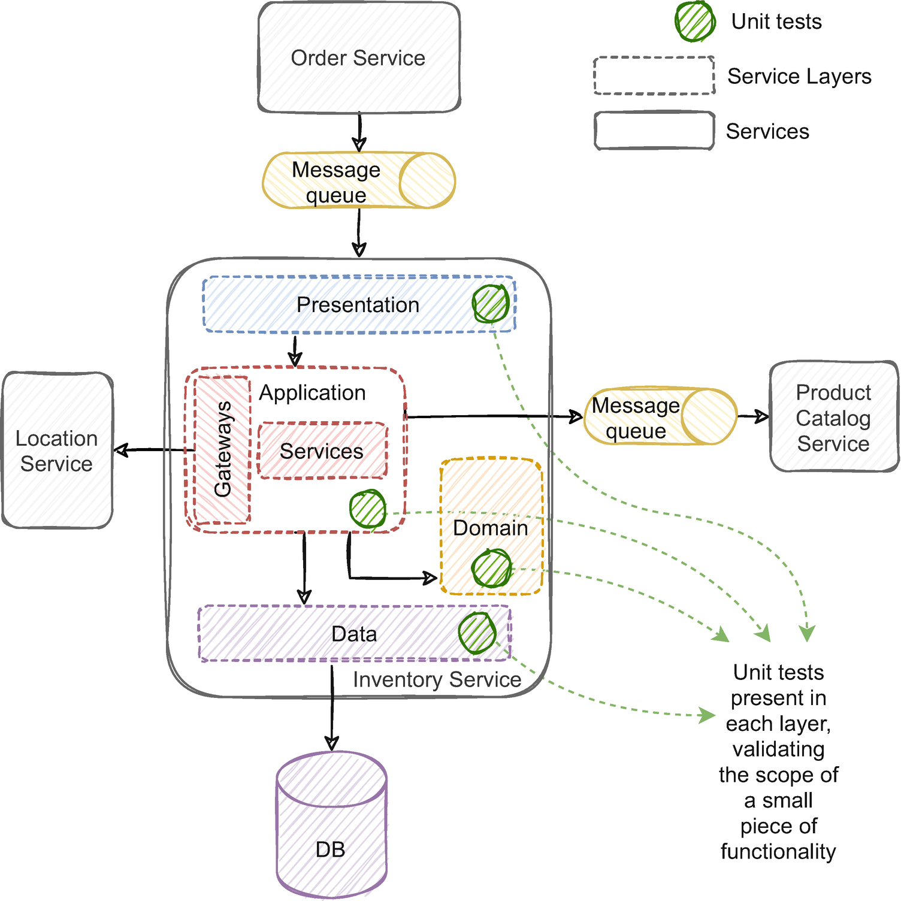

图 10-1 说明了具有多个层的库存服务。它使用来自订单服务的事件并将事件发布到产品目录服务。它还向位置服务发出同步请求。单元测试位于每个服务层上，仅验证该层的功能。如果测试验证的代码段依赖于外部资源，如数据库或外部服务甚至另一层，则测试模拟该请求并仅关注该段代码实现的功能。
尽管单元测试速度很快并且通常性能良好，但这并不意味着它们是免费的。我经常看到具有强大单元测试文化的公司陷入的一个陷阱是为每一行代码创建单元测试，无论它是否有意义。记住单元测试是代码并且有维护成本；我们需要维护它们。几乎没有任何逻辑的代码可能不需要测试。人们通常通过测试代码覆盖率来衡量质量；尽管它可以单独作为一个指标（在众多指标中），但它并没有多大意义，努力获得 100% 的代码覆盖率不会让你受益匪浅。相反，由于维护开销，它可能会阻碍你的速度。务实，衡量成本，并了解测试是否有意义。
话虽如此，单元测试是我们可以访问的最快的反馈循环，它们通常运行速度非常快，我们可以预期应用程序有大量的单元测试。它们对于验证小范围的功能非常有用。它们也可以很好地作为代码组织的指标；如果单元测试相当大或有广泛的责任，它通常是代码可能需要重构和划分的指标。

### 10.1.2 组件测试

单元测试非常适合验证服务层内的本地化和小范围功能，但不能保证多个层如何相互交互以组成整体服务功能。组件测试填补了这一空白；他们验证服务内的完整代码流，遍历每一层，但仅限于该服务的范围，删除外部依赖项。
组件测试不会施加外部依赖，如数据库、外部服务或消息代理；他们只关注服务边界内的功能。你可以将其视为测试服务作为单个进程所做的任何事情，而无需运行任何其他程序。图 10-2 说明了组件测试范围。

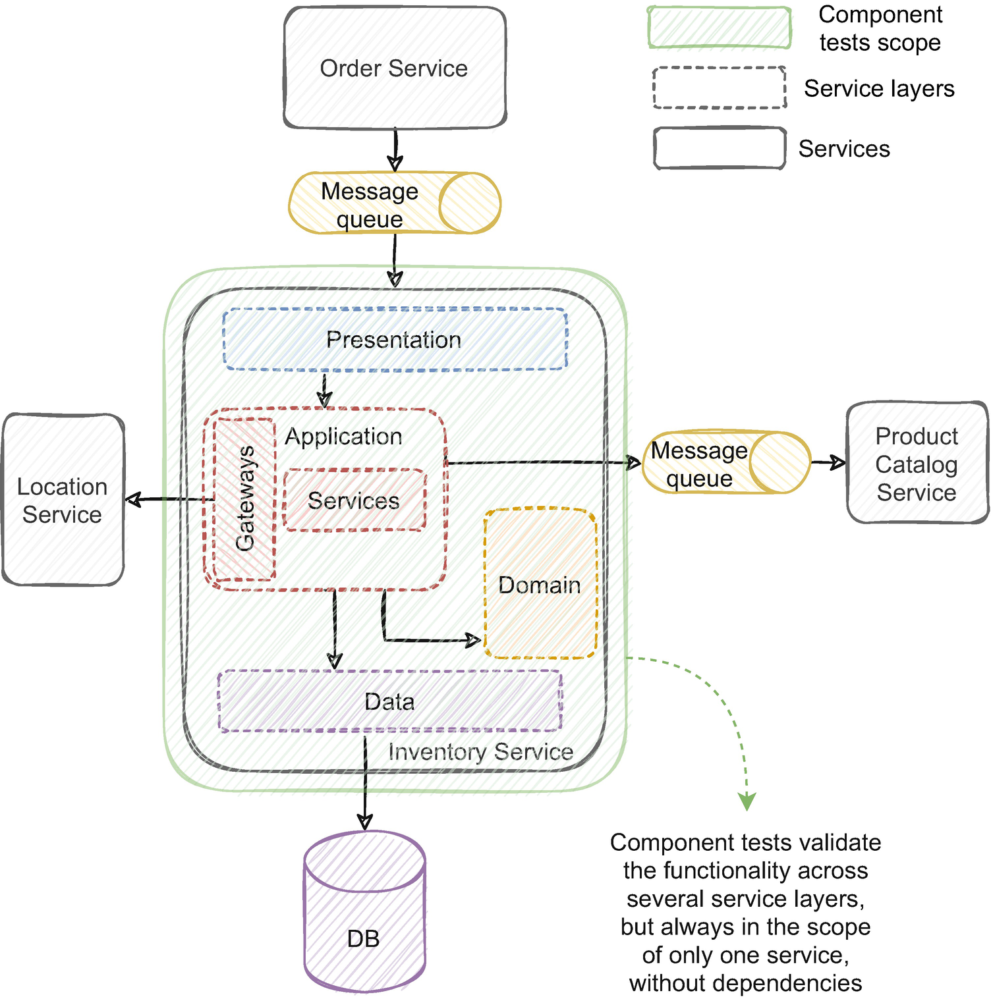

在这种情况下，假设库存服务对订单创建的事件做出反应以处理库存，将状态保存在数据库中，并发布库存更改事件。此流程的组件测试可以是不使用数据库、消息代理或位置服务的订单事件处理的完整流程。
一种轻松抽象外部依赖项的方法是使用依赖项注入。在运行测试时，服务可以注入模拟实现并伪造外部依赖项的正常或异常响应，以验证服务的正确性。
组件测试可用于验证服务的步骤序列或整体工作流程的健全性，而单元测试因其范围有限而不应采用这种方式。实施良好，由于缺乏直接依赖，它们也可以非常快；一切都可以在内存中运行。
但是，由于它们抽象了对外部资源的依赖关系，因此它们无法防止直接实现中的错误。例如，如果库存服务使用 SQL 数据库，我们可以编写一个组件测试来验证订单创建的事件处理逻辑，但是如果我们在 SQL 查询中遇到问题，则测试可能无法检测到它因为存储库会被嘲笑。

### 10.1.3 扩展组件测试

降低外部依赖项实现中出现问题的风险的一种方法（如我们刚刚讨论的 SQL 查询示例）是使用组件测试的扩展版本。我们可以使用这些依赖项的内存版本，而不是完全删除外部依赖项。例如，如果服务有一个数据库，我们可以使用数据库的内存实现。它的行为方式与数据库相同，并且允许验证查询的合理性。图 10-3 说明了相同的用例，但具有外部依赖项的内存组件。

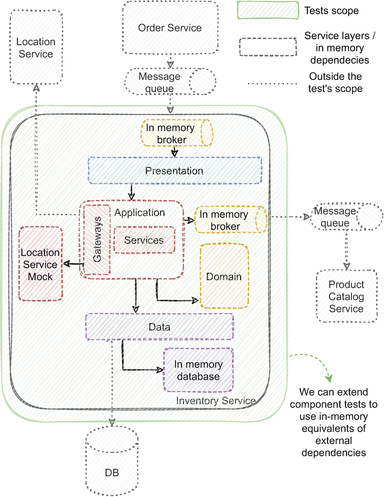

正如你在示例中看到的，外部依赖项被替换为它们在内存中的等效项。位置服务除外；它可能没有可用的内存等效项，因为它是内部构建的服务，但我们可以用模拟或存根替换它。扩展组件测试可以描绘服务的综合场景，并提供非常有价值的验证，同时不会受到管理外部依赖项的缺点的影响。他们能够验证与外部依赖项的交互，同时仍然能够非常快速地运行。没有外部依赖也有利于设置，在本地运行测试，并简化发布过程；因为发布管道不需要管理依赖项，只需要管理服务和测试。
如果它们听起来好得令人难以置信，也许它们经常是。理论上，这是一个很好的设置，但由于外部依赖项的内存替换不存在，在实践中实现它们通常很困难。有一些内存数据库等价物的提供者，例如微软的内存中实体框架提供者，1 可以在不使用外部组件的情况下提供与真实数据库类似的功能。然而，这些提供者往往达不到实际的、现实的实施。通常实现并不完全匹配真实数据库的全部功能。 ACID 保证的事务在内存中运行时不是真实的；一切都立即运行，不受真实数据库的限制。2 H2 数据库引擎 3 也是在内存中模拟数据库的有趣替代方案；但是，它也有类似的限制，并且不能兼容所有功能。人们通常最终会做的是针对真实数据库进行集成测试来验证相同的事情，这就提出了为什么首先要进行扩展组件测试的问题。
如果你使用 Java，Kafka 有一个嵌入式 Kafka 实现，这是一个非常有趣的内存中等价物。由于 Kafka 和 ZooKeeper（对于较旧的 Kafka 版本）都是 Java 应用程序，因此可以从 Java 代码运行它们。然而，它并不能反映真实 Kafka 集群的所有含义。4 ElasticSearch 也有一个可用于测试的嵌入式替代方案；但是，由于难以保持与新功能的兼容性（在这种情况下与安全相关5），它已停止使用。
一个非常有前途的替代方案是使用 Testcontainers。6 它们可以为测试提供一种简单的方法来使用和运行大多数数据库的容器化实例。 RabbitMQ、Kafka 和大多数消息代理都提供了与这种方法兼容的容器。尽管它们实际上不是组件测试，但可能介于集成和组件测试之间（我们将在第 10.1.5 小节中讨论的半品种集成测试），但它们可以提供一种可靠的方法来设置具有现实生活场景的真实依赖项.与 H2 数据库引擎不同，它们提供完整的数据库兼容性7，因为实际数据库在容器中运行。
对于我们见过的大多数用例，团队往往难以为外部依赖找到可靠的替代方案。但这真的取决于依赖；其中一些可能有我们可以使用的有价值的内存替代品。他们可以通过限制集成测试的数量来很好地补充集成测试，并将大多数验证转移到更快、更可靠的组件测试中。但大多数情况下，替代方案是有限的，可以用于一些小众或简单的用例。

### 10.1.4 集成测试

集成测试的含义有很多歧义，不同的参考文献提到了不同的范围，并且通常在组件、集成和端到端测试之间存在一些混淆。我们将用可以说是最一致的定义来定义它们；旨在验证与外部依赖项的通信和关系的测试。测试验证与外部组件（如数据库、消息代理、其他服务、分布式缓存等）的实际交互。我们可以通过两种方式来处理它们，在较小的范围内仅验证与每个外部依赖项的交互而不验证其他任何或通过验证包括外部组件在内的完整业务流程来扩大范围。
在事件驱动服务的上下文中，它们通常包括与消息代理的交互，但不包括与发布消息的服务的交互。但是，它们通常包括具有同步依赖性的服务，例如 HTTP 请求。事件驱动的服务由事件代理解耦，因此将消息流中的其他服务交给更广泛的端到端测试是一个合理的决定。两个服务之间直接同步请求的后果是耦合度更高；因此，请求服务可能会直接受到目标服务问题的影响。因此，集成测试通常在其范围内包含同步依赖项。图 10-4 说明了集成测试的范围。

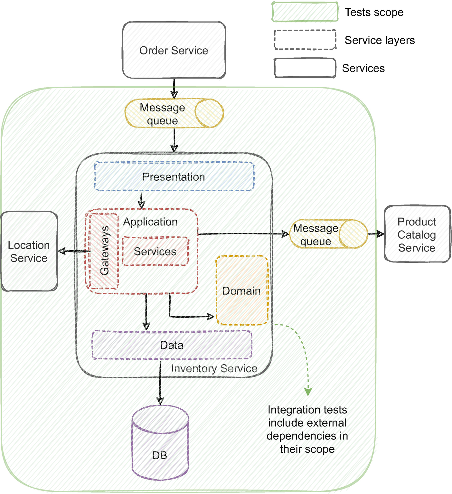

这些测试通常比我们迄今为止讨论的测试更慢、更脆弱。我们需要保证测试的执行有合适的条件，数据库需要有相关数据，缓存需要清除，broker 中现有的消息不能影响测试的结果，等等。每天保证这些类型的条件可能很难管理，并且通常会导致误报。容器可以帮助解决这个问题；如果我们运行容器，然后在每个测试或每个测试会话的基础上删除它们，它可以帮助解决这些问题。
对位置服务的直接依赖可能更难解决。我们需要保证我们有一个有效的实时定位服务版本，其中包含我们测试用例的相关数据。如果位置服务有多个依赖项，则管理起来会更加困难，因为我们必须保证每个依赖项都处于有效状态以便服务响应。保证所有这些条件是不小的壮举，并提出了关于如何发布库存和位置服务的几个问题。我们是否应该在这两个服务的每个版本中运行这些测试？我们将在 10.3 节中进一步讨论这些问题。

### 10.1.5 混血集成测试

服务的主流依赖（例如数据库或消息代理）与对其他服务的同步依赖（例如库存和位置服务之间的依赖）之间存在区别。主流依赖通常更稳定和可预测。我们不会持续更改我们的数据库或消息代理的版本；它在相当长的时间内保持稳定，当我们改变它们时，通常是一个精心安排的操作。
但是，架构上的其他服务正在由组织中的其他团队开发，这些团队可能会经常部署他们的服务。每个在模式、数据、配置和依赖性方面都有自己的特点。设置测试以验证两个或多个服务之间的交互可能非常具有挑战性，因为需要让一切都正确，并且需要保持与新发布版本同步的质量环境。
简化该过程的集成测试的一种变体是将集成生态系统中其他服务的责任委托给端到端测试领域。混血集成测试模拟或存根外部服务依赖项，但维护主流依赖项，如数据库或消息代理。他们可以在更广泛的范围内验证服务的功能，并且更加可靠，因为这些依赖项通常更可预测且更易于使用容器设置。图 10-5 说明了这种情况。

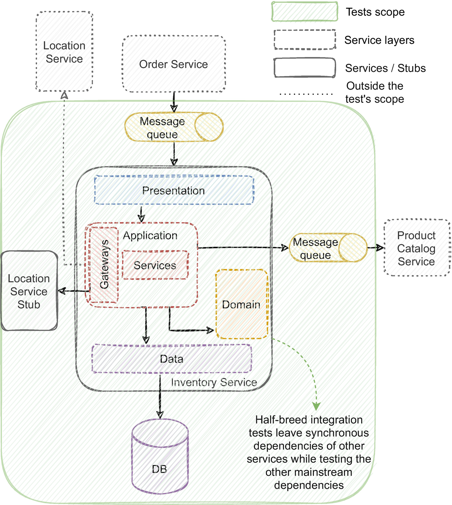

这些测试仍然需要维护有效的外部组件并保证数据和消息队列的一致性。但是，它仅在服务的直接所有权中，这大大简化了管理服务的团队的测试开发。他们无需担心所有权之外的其他服务。
测试仍然验证与位置服务的交互，但通过模拟请求。在这种情况下，使用模拟是一种很好的方法，可以简化整体设置，同时保证两个服务之间某些交互的正确性。我们不再需要担心在定位服务上部署和维护正确的配置和相关数据；我们只是模拟验证库存服务流程所需的调用。然而，mocks 受到确认偏差的严重影响。团队将根据他们认为服务将返回的内容制定模拟的期望，当这些假设错误或变得错误时，这可能会很麻烦。无论哪种方式，它都是在更广泛的范围内补充单元和组件测试并保证服务整体流程正确性的好方法。
我观察到团队实施它们的一种有趣方式是让测试引导所有测试所需的先决条件并验证最终结果。图 10-6 说明了这种方法以及订单创建事件的库存服务处理。

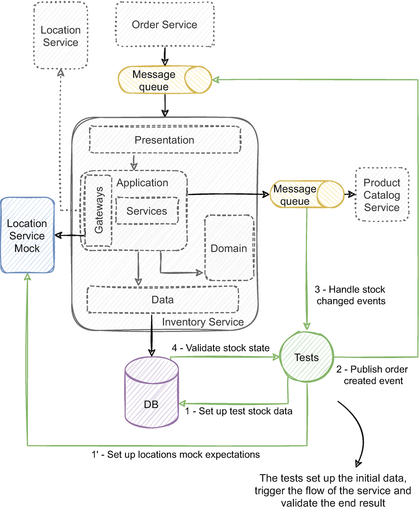

在运行实际测试之前，我们通过设置数据来引导库存数据库。例如，如果测试用例是创建新订单时，我们将库存数量减一；在实际运行测试之前，我们可能需要设置现有库存数量。我们还在位置服务模拟中设置了期望。
为了触发测试的开始，我们将订单创建事件发布到库存消息队列。该服务将处理该事件并产生一组预期结果。例如，服务可能会减少库存并发布库存更改事件。然后我们可以通过使用库存服务事件队列来等待库存更改事件。一旦我们收到表明处理完成的事件，我们就可以验证事件的数据和数据库中的状态。主要的困难是知道什么时候停止等待事件；一些测试用例甚至可能不会发布任何内容，我们可能想要验证没有发布任何事件。例如，如果股票没有变化，服务将不会发送股票变化事件。通常，我们使用超时，但会显着增加测试运行的时间。另一种方法是在处理订单事件结束时发送测试目的事件。当服务完成处理时，它会发布一个事件来表示操作的完成，无论它是否发送了库存更改事件。将代码更改为可测试是单元测试中的常见做法；但是，在这种情况下，它增加了一些复杂性，并添加了仅供测试使用的代码。
一个有趣的替代方法是监控订单创建的事件队列并等待库存服务消费者确认事件处理成功（例如，在 Kafka 中，等待消费者组用完滞后）。通过这种方式，我们可以确保服务结束了处理，而不会在服务中引入额外的开发。
保证测试是自主的与将容器方法应用于依赖关系具有高度的协同作用。我们可以运行数据库和消息代理容器，设置初始模式和数据，运行测试，最后通过处理容器来清理所有内容。这样，我们保证质量环境中不会有垃圾数据，或者来自旧测试运行的数据最终不会影响当前测试。
模拟或存根同步请求，如对位置服务的依赖，提供服务与生态系统其余部分的解耦，并实现自主发布。我们不再需要担心配置超出我们发布的服务范围的服务，整体测试具有更高的稳定性和一致性。然而，mocks 有很大的偏见，尤其是当只由消费团队定义时，并且发布很容易受到两个服务之间接口交互中的缺陷的影响。如果位置服务改变其合同或行为，则不作任何保证。位置服务的新版本可以实时部署，其测试通过并打破所有其他消费者。
为了克服这个限制，我们可以用契约测试、消费者驱动的契约和生产测试来补充这些测试。我们将在本章的其余部分进一步讨论这些主题。另一种选择是使用端到端测试，但它们面临更多限制问题。整体混血集成测试是对组件和单元测试的一个很好的补充，尤其是当我们不能使用扩展组件测试时。它们可以提供服务行为的更广泛范围的验证以及其外部依赖项的正确使用。

### 10.1.6 端到端测试

端到端测试从整体上验证系统，通常根据广泛的业务规则验证其正确性。它们通常远远超出单一服务的范围；它们验证跨多个服务的业务流，并提供高级、技术不可知和面向业务的验证。它们是对系统最有信心的测试类型，因为它们覆盖了大范围。然而，它们与分布式事件驱动的思维方式不匹配，通常成本高昂，并且维护它们通常极具挑战性。
除了集成测试，我们到目前为止讨论的所有测试类别都在服务范围内；如果我们在服务发布管道中包含任何这些测试，则服务将仅依赖于自身。另一方面，端到端测试包括与多个服务的协作；如果我们要发布任何服务，我们需要运行端到端测试。图 10-7 说明了我们迄今为止讨论的示例中的端到端测试范围。

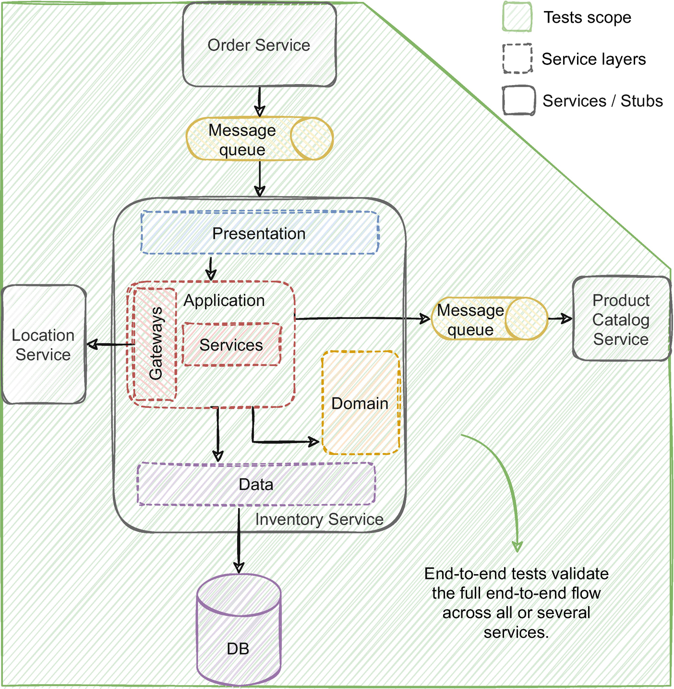

测试不仅包括库存服务、其数据库和消息代理，还包括位置、订单和产品目录服务。它还可能包括其他上游和下游服务，例如，用户提交订单的 UI 以及运输和定价服务。

#### 发布

由于端到端测试针对整个微服务生态系统，因此每次在测试范围内发布任何服务时，我们都必须运行测试。这些类型的测试本质上是缓慢的；它们通常涉及具有多个依赖项的多个服务，从数据库、消息代理、分布式缓存等。当测试遇到问题时，例如，如果我们正在发布位置服务并且测试失败，那么每隔订单、库存和产品目录服务的发布必须等待修复。
还记得我们在第 3 章和第 4 章中讨论服务必须如何独立和自治时，事件驱动的架构如何增强这种特性并促进真正的持续交付思维方式？这很容易升级为这种心态的倒退；服务不再自主发布；这取决于其他几项服务的成功实施。它还导致复杂的锁步发布，并迅速升级为在一个时刻发布所有内容，这是我们采用事件驱动架构需要避免的。

#### 数据和环境

端到端测试的另一个相当繁琐的挑战是状态管理。没有状态的服务在端到端上下文中更容易处理，因为不需要数据引导程序。但是，许多服务都有数据，需要初始化数据才能运行测试用例。这是一个共同的挑战；我们之前在讨论集成测试时讨论过它，但在那种情况下，服务只需要管理它的数据。在端到端测试中，每个服务都必须有相关数据，更糟糕的是，所有数据都需要相互一致。
在集成测试中，测试可以初始化测试数据并针对该数据集运行测试。通过端到端测试，服务不仅需要初始化它们的状态，还需要确保它与所有其他服务一致。例如，在库存服务中设置测试库存数据是不够的，我们还需要保证我们分配库存的产品等外部标识符必须与订单和产品目录服务中的相同。测试不仅仅负责一项服务，而是需要在测试范围内的所有服务之间进行编排，以便为测试运行设置条件。这种必要性通常需要整体流程和业务逻辑以及测试之间的内在耦合。这使得测试异常脆弱并且容易受到不断变化的需求的影响。通常，测试变得比被测功能更复杂。
分布式架构的复杂性通常使团队构建一个集成的质量环境，在其中运行端到端的测试。维护这种环境通常既复杂又耗时。我们需要保证每次发布实时部署时都会更新服务。它可以自动完成，但通常每个服务的复杂性、它们的配置、缺乏管理数据存储和消息代理的纪律最终会经常破坏质量环境。它很快导致个人或整个团队致力于维护环境稳定。
质量环境中数据引导的另一个缺点是之前测试运行的剩余数据。消息代理和数据存储往往是测试数据的倾倒场，这些数据通常是导致测试因误报而失败的原因。它还进一步偏离了生产环境的质量。应对这一挑战的一个好方法是按需构建系统，将服务和依赖项的容器化版本部署到环境中，最后清理所有内容。但是，测试可能需要更长时间才能运行。

#### 治理
由于端到端测试跨越多个服务，因此在测试范围内的每个服务的发布中运行测试是有意义的。但这可能意味着多个团队可能会参与这些测试的开发和所有权。决定谁拥有测试的直接所有权可能很麻烦；我们可以将它分配给一个高度参与整个流程的团队；例如，将订单履行测试分配给拥有订单服务的团队。但是，当这些测试失败时，管理起来会很棘手，因为库存没有反映在产品目录服务中。该团队对该服务的上下文有限；请求各自团队的帮助可能是一种可行的方法，但如果他们在游戏中没有皮肤，则很难有效地做到这一点。
人们有时采取的另一种替代方法是拥有一个专门的团队来开发这些测试。这可能更难以管理；该团队对有效实施服务的背景有限，并且使拥有服务的团队更加脱离整个流程。这个团队经常成为发布的看门人，使团队失去更多的自主权。
更好的方法是让测试共享所有权；每个团队负责贡献和开发测试。如果测试失败，发布该功能的团队是发现问题的驱动程序；如果涉及其他服务，相应的团队必须帮助理解问题；沟通是关键。这种方法的一个可能的缺点是缺乏解决不稳定测试的动力；试图让测试通过的人，即使他们不得不重试几次（“有两个主人的狗会饿死”）。然而，这是处理测试治理的一种更可取的方法。

#### 缓解端到端测试挑战的方法
这些是端到端测试挑战的几个例子。端到端测试的背景通常因公司而异；但是，这里有一些建议可以解决这些问题：

- 你真的需要端到端测试吗？分布式架构需要正确的方法和技术来保证质量，而不是试图将旧的应用到新的环境中。我们将在本章中详细介绍它们的替代方案，并就它们是否值得付出代价做出明智的决定。当然，每家公司都有自己的背景和风险权衡，你的也是如此，但问问自己你需要多少端到端测试，以及是否（或如何）替换它们。通常这不是关于失去质量，而是使质量可持续。
- 也许你不需要在每个版本上运行端到端测试，而是在大型项目或技术改造结束时运行。我在大型项目中看到的一种成功方法是让每个服务实时提供其功能，但禁用。在启用该功能之前，团队进行了端到端测试，以确保高级流程中没有问题；如果发现任何问题，团队将开发一个组件或单元测试，以确保它不会再次发生。通常，大型项目或重大重组会受益于端到端测试；临时使用它们并通过其他方式保证持续质量可能是一种有用的方法。
- 也许你不需要验证整个端到端流程。通常整个流程的一部分比剩余的流程更关键；验证该段比执行完整流程更有价值。衡量测试覆盖范围的稳定性并做出明智的决定。
- 使用可引导、运行测试套件并清理所有内容的容器化环境可能是稍后解决困难状态管理问题的好方法。它也可以成为在开发人员的计算机上本地运行测试而不是使用共享质量环境的垫脚石。在本地运行测试也是避免锁步发布的好方法，因为一个服务中的问题阻止了其他服务的发布。然而，即使采用基础设施即代码实践，这种方法对于复杂的流程也会变得更加棘手。不仅引导整个服务群会非常混乱和耗时，而且维护它也需要大量的努力。对于大量服务，可能很难拥有一台具有能够运行每个服务及其依赖项的资源的机器。专注于端到端流程的关键部分可能是一个合理的选择。
- 保证数据和事件模式、事件流和数据存储的自主管理。你必须努力保证环境的设置是自动的。团队对架构的每次更改都必须有相关的脚本或流程；必须在质量环境中以自动方式处理处理事件的重大变化的过程，避免在质量环境中进行手动更正。
- 如果你确实需要端到端测试，请保证你只有非常有限的数量。大多数验证可以通过组合其他类型的测试（单元、组件和集成）来完成，并且高度包含端到端测试的职责。仅将它们用于关键的高级流程，并专注于清晰的业务流程。

端到端测试可以成功应用于组件数量非常有限且可能只有一个团队管理的小型架构。如果这是你的情况，那么拥有它们可能是有意义的；然而，随着我们添加更多组件和架构的发展，它们往往会变得更糟。当我们失去发布功能的自主权时，情况会变得更糟，当多个团队参与相同的测试时，这种情况通常会严重恶化。

## 10.2 将契约测试和消费者驱动契约应用于事件驱动

正如我们在第 8 章中讨论的那样，契约测试通常与模式验证相关联，例如中断、向前或向后更改。他们根据消费者的期望验证生产服务的正确性。自动模式验证在事件驱动服务中至关重要，可以由模式注册中心提供（如 Kafka8 中的 Avro）。契约测试超越了不可知的模式验证规则；他们根据消费者的需求验证生产服务的投入和产出。本节将讨论它们在事件驱动架构中的范围，以及我们如何将它们与消费者驱动的契约结合起来。
契约测试通常位于具有外部接口的服务的边界。他们的重点是生产服务符合消费者的期望。图 10-8 在我们之前讨论的同一示例中说明了合同测试的范围。

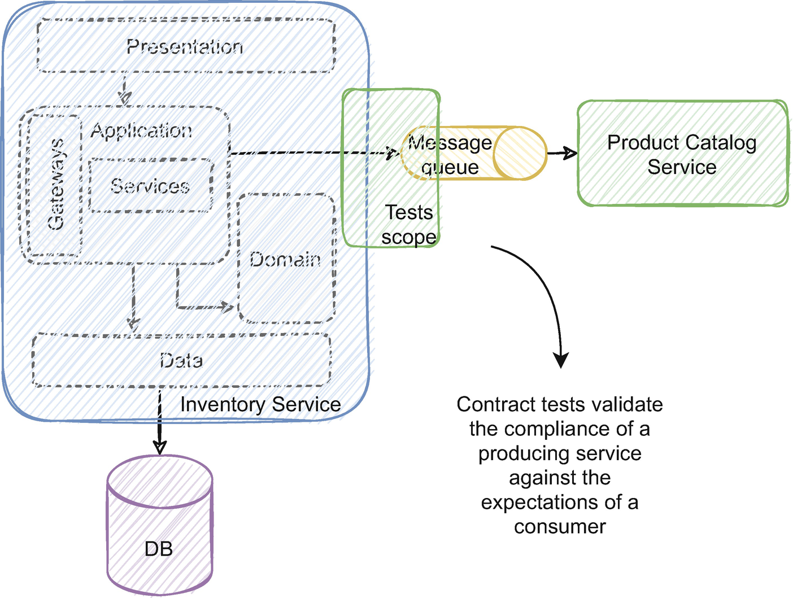

在这种情况下，产品目录服务使用库存服务生成的库存事件。我们可以添加到库存服务中的一个有趣的合同测试是保证产品目录服务所需的每个信息都被发布。我们可以使用消息代理的模拟或内存替换来实现更好的性能和稳定性。然而，由于序列化和兼容性问题，许多用例受益于对消息代理的依赖。测试可以保证消费者能够以相同的方式消费事件，使用相同的模式、序列化协议、标头等来读取消息。 例如，有时不同的消费者对不同的事件流有不同的序列化协议，这是容易搞乱配置。这样，我们可以更广泛地保证消费者能够阅读消息。
它还可以保证消费者所依赖的一些业务逻辑。在某些情况下，某些事件可能在某些字段中具有数据。例如，如果我们在创建一个产品的过程中有多个步骤，那么第一步可能只填写必填数据，其余的信息将在此过程中进行充实；例如，我们可以创建产品并稍后添加库存。但是，库存要求产品中存在尺寸；例如，我们将库存添加到 XS 尺寸。在这种情况下，产品服务可能希望所有库存都与产品尺寸相关联。可能的验证可能是当库存大于零时，也会发布尺寸。这些类型的验证比直接模式验证更进一步；它们保证了生产者的预期行为，如果破坏会导致下游组件出现问题。
到目前为止，我们讨论了管理库存服务的团队如何单方面向服务添加合同测试。契约测试的一个有价值的迭代是使它们与消费者保持一致，通常称为消费者驱动的契约。在第 8 章中，我们讨论了消费者协作在模式定义中的重要性。这种方法使这种合作更进了一步；管理生产服务的团队的使命是与消费者团队直接合作，了解和保证消费者服务的期望。消费者甚至可以在生产服务中实施测试以保证他们的期望。图 10-9 说明了这种情况。

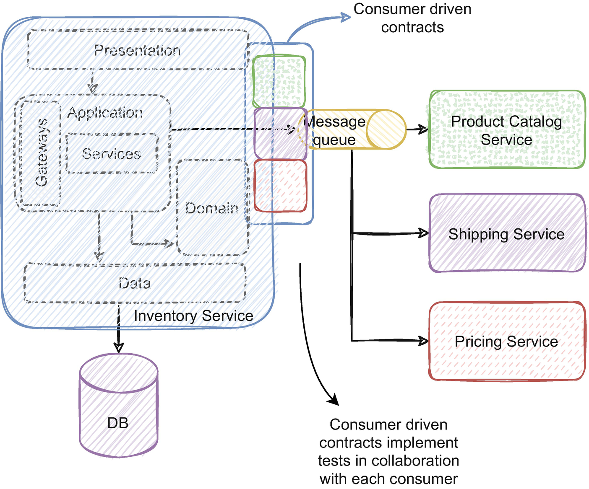

如果我们为库存服务的每个版本运行契约测试，我们就会更有信心我们发布的功能不会破坏现有的消费者。他们还鼓励两个团队之间的交流。沟通是保证质量和了解消费者需求的关键；以测试的形式对它们进行编码是确保满足他们的期望的好方法。每个版本中正确消息流的所有权分配给所涉及的不同团队，这通常有助于确保每个人都在同一页面上。
业务流程通常由事件驱动架构中的一系列事件编排。将合同测试和消费者驱动的合同应用于流程中的每个组件可以是保证端到端流程更具可扩展性的验证的一种方式。

## 10.3 测试分类和目的

到目前为止，我们讨论的测试类型具有不同的目的和范围。对不同类型的测试进行分类有助于了解如何以及何时应用它们。布赖恩·马里克 (Brian Marick) 为测试分类定义了四个象限 9，这有助于在讨论各种类别时消除许多误解。我们可以通过让测试专注于验证预期结果来发现不可预见的极端情况或意外用例来考虑它。在最初的 Marick 的分类中，那些测试类别也可以更面向业务或技术，如图 10-10 所示。

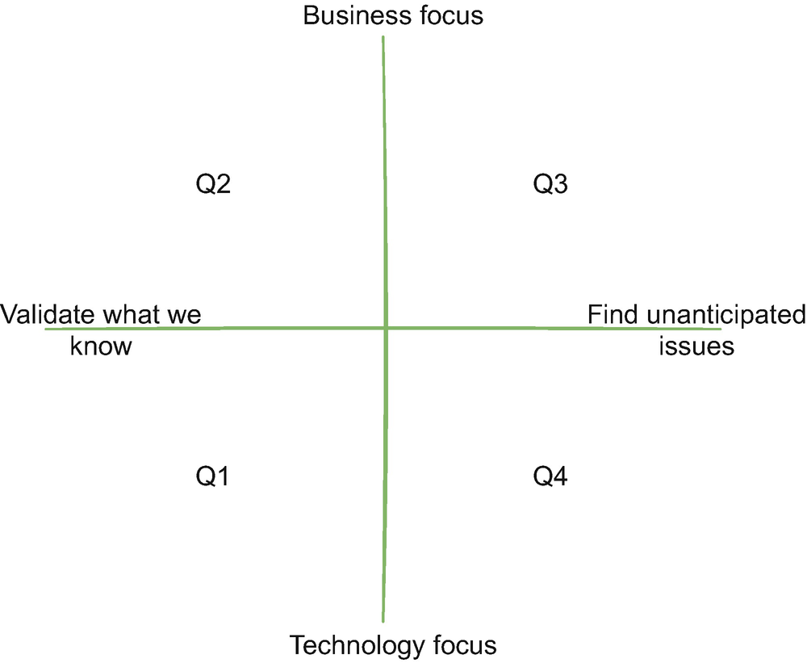

使用这种分类，我们可以为每个象限找到一些示例：

- Q1：完全自动化的测试旨在验证我们开发的内容是否按预期工作。可以是单元、组件或集成测试。
- Q2：自动（或手动）测试以验证我们是否开发了业务定义的正确功能。通常，功能和验收测试，包括应用程序的业务验证。
- Q3：专门用于查找应用程序问题的手动探索性测试。这些测试本质上是创造性的，面向以意想不到的方式与应用程序交互的人们。
- Q4：测试以验证应用程序的非功能要求和技术限制。可以是性能和负载测试、安全验证和其他质量属性，如可用性、正确性或可靠性。它通常依赖于自动化或专用工具。

虽然这种分类很有意义，但有些领域可能是主观的。例如，如果验收测试发现应用程序存在问题，如果可能并且范围足够小，我们可以开发自动化单元测试以确保问题不会再次发生。单元测试可用于保证业务规则的健全性，只要它们的范围足够小（通常在代码的特定部分的上下文中，如函数），尽管该单元测试现在将侧重于技术而不是业务- 专注。
质量保证实践已经从广泛的手动测试计划中取得了长足的进步。不用一个人或一个团队在每次发布时都执行一组重复的操作的优势实际上非常明显（甚至有一个测试工程师在没有公司注意的情况下自动化了他的工作 6 年的故事10)。测试自动化不仅仅是智能，它成为成功扩展分布式架构的必要条件。如果你考虑一下，在像单体应用这样的单个可部署组件中，广泛的手动回归测试可能是一种选择，但是当你必须运行数十个甚至数百个具有多个每日发布版本的自主组件时，扩展数量很快就变得不可行了。手动测试人员来应对越来越多的版本。
然而，这并不意味着没有地方进行手动测试。重复的任务应该并且需要自动化，但有一个合适的地方可以用好奇和创造性的方法来破坏应用程序。自动化重复性任务使质量工程师可以通过探索性测试等方式以不可预见和意想不到的方式与应用程序交互，从而做更有意义和创造性的工作。手动测试也适用于由于所涉及的工作或成本而根本无法自动化的用例；我主要看到这种情况发生在广泛的大型遗留应用程序中。在事件驱动的架构中，由于组件的高解耦和大量的独立组件，强烈的测试自动化文化是可取的。
本节和前几节讨论的所有类别都在预生产测试的背景下。正如我们将在本章末尾讨论的那样，我们将在本章中讨论的生产测试方法可以分为图 10-10 的不同象限。生产测试是一种越来越被采用的实践，它有助于克服复杂分布式系统中的质量保证挑战，并且作为传统预生产方法的补充非常有价值。

## 10.4 没有端到端测试的端到端质量
多年来，端到端测试是质量的典型堡垒，也是新功能狂暴发布中的信任灯塔。事实上，它们可以成为单体应用程序中有价值的质量保证策略。然而，正如我们在 10.1 节中讨论的那样，当它们应用于完全分布式的微服务架构时，它们有严重的缺点。事件驱动架构培育了几个完全解耦、独立和可扩展的组件，正如我们将在本节中看到的，端到端测试与事件驱动方法有很大的不协调。质量保证方法需要不同的策略和传统思维方式的转变。
尽管采用了微服务架构，但许多公司继续采用与往常一样的质量方法，即在环境中部署所有功能并针对整个系统运行测试套件。我总是发现我们如何通过转向高度分布式架构来面对具有 ACID 属性的单体数据库的限制，这种架构具有大量组件彼此异步通信，通常使用具有较弱一致性保证的不同数据库技术，并且仍然设法维护业务运行需要一致性。但是我们的质量方法仍然是在一个地方针对每一个功能部署和运行测试。我们能够开发模式来处理诸如跨分布式组件的一致性和状态管理之类的复杂问题，但为什么我们无法采用类似的方法来保证质量？为什么我们需要将旧的质量保证方法应用于全新的环境？
同理，我们不锁定每一个微服务数据库来实现原子性；我们不应该部署每个组件并阻止每个服务的发布以保证质量。事件驱动架构的分布式特性需要一种保持边界和独立发布的质量和质量保证策略方法。事件驱动架构最有价值的特征之一是其组件的解耦性质。这使架构能够真正进化；功能可以彼此分开实现；服务是自治的，独立发布的。它允许团队真正拥有他们的服务并在没有依赖、批准或把关流程的束缚的情况下完成他们的工作。端到端测试是朝着相反方向迈出的深思熟虑和自信的一步。我们面临着我们在本书中讨论的所有挑战，以实现这种清晰的隔离、单一的职责重点、明确定义的领域、自治和解耦，并且很多时候，在质量保证过程中将其丢弃。
采用真正解耦的分布式架构需要正确的质量保证方法，而不是将传统技术强制用于完全不同的环境。一种方法是结合我们在 10.1 节中讨论的一些策略。我们可以将端到端质量视为每个组件质量的总和，如图 10-11 所示。

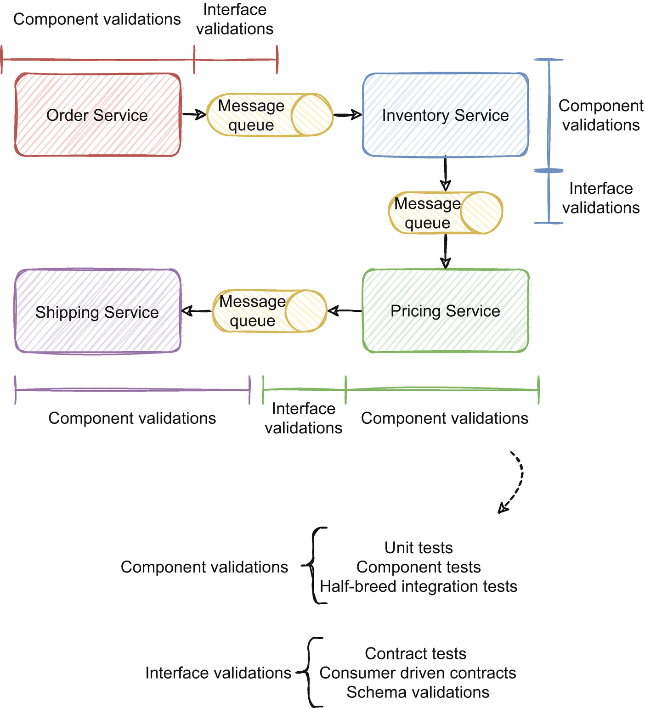

每个组件都需要通过单元、组件和混血集成测试来独立保证其质量。跨多个服务的集成测试被有意排除，因为它们与端到端测试存在许多相同的缺点，但规模较小。每个服务都必须通过自己的测试来保证其正确性，包括它在端到端流程中的部分。为了理解和实施他们的组件的验证（这建立在我们在第 4 章中讨论的概念之上），每个团队对更大的流程有更高层次的愿景是至关重要的。通过模式验证、契约测试和消费者驱动的契约来保证与其他服务的兼容性。它们不仅保证事件的模式没有意外变化，而且保证下游服务的期望和行为得到维护。这是部分之和大于整体的情况。
通常，端到端流中的故障映射到一个或一组组件，这可以仅在相应组件的范围内验证该条件。然而，这种方法需要与每个团队密切沟通和协调，消费者驱动的合同打算至少部分解决这些问题。
我不会说这种方法是万无一失的，它不是；然而，端到端测试也不是。维护实时环境的副本极其昂贵且耗时，结果充其量只是对实时环境的再现不佳。生产往往是高度动态的，具有不同的用途、吞吐量和随时间变化的条件。仅运行测试的环境并不能真正接近实时条件。这些环境通常使用少量机器，其资源远小于生产（以控制成本），但在复制实时环境的性能和并发条件方面却相当失败。它们通常还处于同一网络主机中或处于可最小化或消除多个网络故障（如网络分区）的网络条件中。他们通常只有生产数据的一个子集（如果有的话），不能真正重现生产中存在的数据的所有可能性，例如，涵盖每个当前或过去用例的事件流。配置、网络拓扑和连接条件经常被复制，但不能保证它们与实际环境保持一致。毕竟，我们运行了多少次端到端测试才发现功能发布后仍然存在问题？
端到端质量作为其各部分的总和也不能保证不会出现问题。你是否能够为服务可能失败的每种情况编写测试？可能不是。测试套件擅长验证系统的已知故障。端到端测试只是一种方法，可能在单体应用程序中很有价值，但在分布式系统中却极其不足。
那么，我是说唯一的方法就是忍受这个问题吗？一点也不。生产前质量保证技术可以与生产方法中的测试相辅相成，以缓解其中的许多问题，我们将在下一节中讨论这些问题。

## 10.5 生产测试
我知道你在想什么，“我并不总是测试我的代码，但当我这样做时，我会在生产中进行。”好吧，我很确定你可能和我一样有自己的生产测试故事，但事实并非如此。在微服务分布式架构的背景下，生产中的测试变得越来越重要，作为补充预生产测试的一种方式，甚至作为提供全面的端到端质量保证的唯一可行方式。本节将讨论这些方法以及我们如何在事件驱动架构中使用它们。
正如我们在上一节中所讨论的，预生产测试对复杂分布式系统可能的故障模式的覆盖范围有限。当使用模式随时间变化时，它会变得更具挑战性。试图覆盖所有可能的故障模式通常需要如此复杂的测试逻辑和基础设施，甚至可以匹配被测系统。除了受到限制之外，将端到端质量保证的负担留给专门的预生产策略将不可避免地大大延迟发布和反馈周期。通过正确的工具和实践，我们可以使用生产环境以可持续和全面的方式增加我们对质量和发布过程的信心，而不是试图使用对现场环境的拙劣模仿。
实施这种做法最具挑战性的方面通常是让人们接受这些方法。人们习惯了传统的测试实践，而忽略了分布式架构的挑战，往往对在生产中进行测试的建议不屑一顾。有时，我们对自动化测试充满信心，这可能就像我们在专门的质量团队中所做的那样，在自动化测试之前的时代进行手动回归测试，而没有诚实地面对替代方案的可行性。现场环境通常被视为不应该被触碰的原始禁止人工制品（有时是有充分理由的），但我们也应该考虑到正确的方法可以在不危及现场条件的情况下极大地有益于质量保证过程（Cindy Sridharan 有一个很棒的系列文章，可以进一步推动我推荐的这些主题11）。公平地说，对部署在实时环境中的服务进行健康检查是在生产中进行测试的一种方式。通常功能是在功能切换之后，或者我们只向一部分用户发布功能；所有这些都可以看作是生产中的测试。测试或沙盒用户背后发生的业务验证并非闻所未闻。生产中的测试可能看起来很激进，但通常它们已经是我们流程的一部分，将它们视为真实的样子；一个全面实现端到端质量的强大工具可以为质量保证提供更可持续和透明的方法。

### 10.5.1 阴影
生产前测试的一个常见挑战是数据的多样性、数量和准确性。阴影（也称为镜像）是一种在不影响用户的情况下向生产数据公开新版本的策略。保证新版本能够与实时请求成功交互非常有用。
我们经常使用模拟数据或为我们的测试生成数据。有一系列工具可以根据给定的合约（例如 AutoFixture）生成随机数据，从而简化了数据生成过程。尽管它很有用，但生成的数据是随机的或手动设置的，这总是难以代表真实生产数据的综合样本。随机数据很容易产生没有意义的场景，甚至会导致测试套件不稳定。例如，如果我们正在生成库存更改事件，该工具可以轻松地为具有意外大小的产品标识符生成随机值。尽管测试这些场景可能很有用，但这样的测试可能会在一次运行中失败并在下一次运行中通过。测试故意场景比通过随机数据生成生成脆弱测试更好，因此需要仔细设置随机数据。随机数据也往往与实际生产流量有很大差异，即使它们是准确的，也很难反映我们在生产中发现的各种场景。
模拟或存根数据也面临类似的挑战。他们也特别容易受到偏见的影响；我们经常使用我们期望收到的数据来设置模拟数据。我们收到的东西和生产中实际存在的东西可能非常不同。在生产中，也存在我们不期望的数据边缘情况，因此我们不会为这些用例创建测试用例。这通常是具有高度测试自动化文化的团队出现问题的根源。不幸的是，当这种情况发生时，我们只能在生产中检测到它，尽管我们认为我们的测试覆盖率很高。作为替代方法，我们还可以从生产中复制数据。但通常我们只复制一个数据样本，它的数量差异很大，可能不是每个用例都有样本。
借助阴影，我们可以通过将当前生产流量重播到新版本来帮助防止这些问题。让我们来看看一个用例；假设我们正在部署新版本的库存服务及其消费订单创建的事件。图 10-12 说明了这种情况。

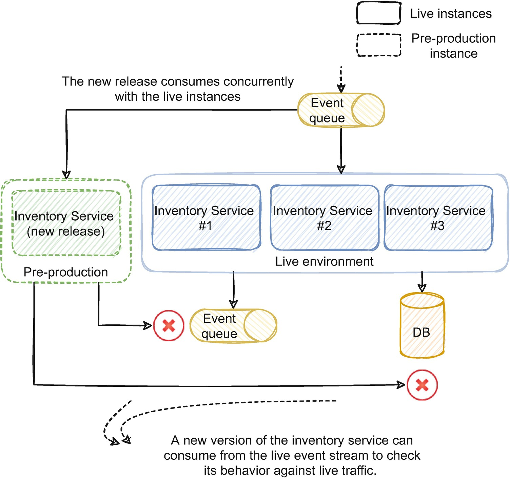

在此示例中，我们在实时环境中拥有包含三个实例的清单服务和我们要部署的服务的新版本。在实际安装实时实例并用新版本替换现有实例之前，新版本会同时消耗实时实例正在消耗的相同事件。例如，如果我们使用 Kafka，我们可以简单地对预生产环境进行单独的配置，并为新版本使用不同的消费者组配置。由于新版本将有一个消费者组并且三个实例将共享不同的一个，因此新版本将消费三个实例正在消费的相同事件。
重要的是要注意新版本部署在与实时实例相同的实时环境中，并且可以访问其所有资源，但具有不同的配置。主要目标是保证服务能够使用新功能正确处理实时流量。因此服务将处理实时事件流，我们可以自动检测错误率的变化并对服务行为进行自动验证。我们还需要保证预生产实例不会有效地改变实时状态。新实例将使用消息，应用其业务逻辑，但不应将状态保存在数据库中或将事件发布到事件流。我们可以通过注入假消息代理和数据库实现的不同配置来实现。
一个有趣的监控指标可能是服务的吞吐量。但是由于我们使用了外部依赖的虚假实现，所以它不准确。我们也无法根据真实的数据库或消息代理验证实现。我们可以通过使用单独的数据结构或带有预生产数据的事件队列来进一步详细说明这种模式。图 10-13 说明了这种情况。

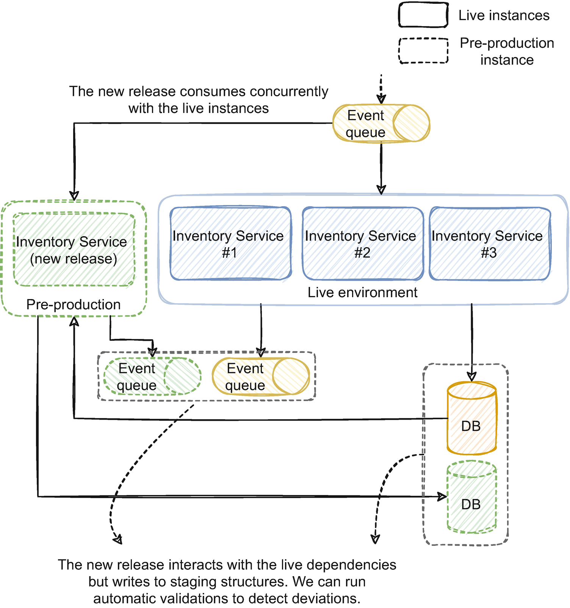

在此示例中，新版本从实时事件流和实时数据库读取，但写入与实时实例不同的结构。例如，新版本可以发布到同一代理内的登台队列并写入同一数据库内的登台表。这保证了新版本能够成功写入外部依赖项。我们还可以监控新版本吞吐量的相关偏差，因为它应该与实时实例大致相同（延迟会有所不同，并且在预生产中可能会增加，因为只有一个实例正在处理三个实例）。我们还可以运行自动验证来比较两个事件流并检测偏差。如果我们生成意外事件或数据不正确的事件，与真实的实时事件流相比，这将表明发布无效并自动使部署失败。我们可以对数据库的状态做同样的事情。
阴影也可以应用于同步请求，尽管需要像代理这样的外部工具的支持。代理可以将请求复制到预生产实例，类似于我们在库存服务中讨论的内容。图 10-14 说明了这种情况。

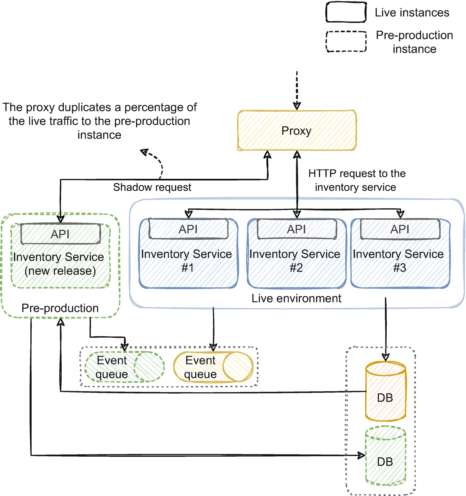

在此示例中，库存服务向写入和读取公开了一个 API。在代理的帮助下，我们可以将一部分实时流量复制到预生产实例。一些工具开箱即用地支持此功能；例如，HAProxy 无缝支持这种功能。12 读取没有任何影响；我们可以简单地将读取的一部分重定向到新版本，并根据实时实例验证其结果。如果我们想验证写入，我们可以采用类似于我们在纯事件驱动服务中讨论的方法，通过写入暂存结构并验证两者。
阴影非常有用，它允许我们针对实时、实时流量测试新功能，而不会影响用户。缺点是我们有一个使用实时资源的新实例；尽管它们通常可以（并且应该）处理附加实例的负载，但我们需要保证为其准备好依赖项（如代理和数据库）。无论哪种方式，它都是一种特别有价值和简单的技术，可以保证新版本在暴露于实时流量时不会遇到问题，而且不受从生产环境到质量环境采样数据的限制。

### 10.5.2 金丝雀

一种流行的生产验证方法是金丝雀。 Canary 涉及仅向一部分最终用户公开新功能，而不是立即将其提供给所有人。与阴影不同，这种方法只会将风险降至最低；最终用户仍会接触到新功能，但规模较小。本节将详细介绍我们在实现金丝雀时可以采用的几种方法。
一种可能的方法是使用新版本部署一个实例并将其添加到生产实例池中。由于流量分布在所有实例中，新版本将接收一部分实时流量，而现有实例将接收剩余流量，如图 10-15 所示。

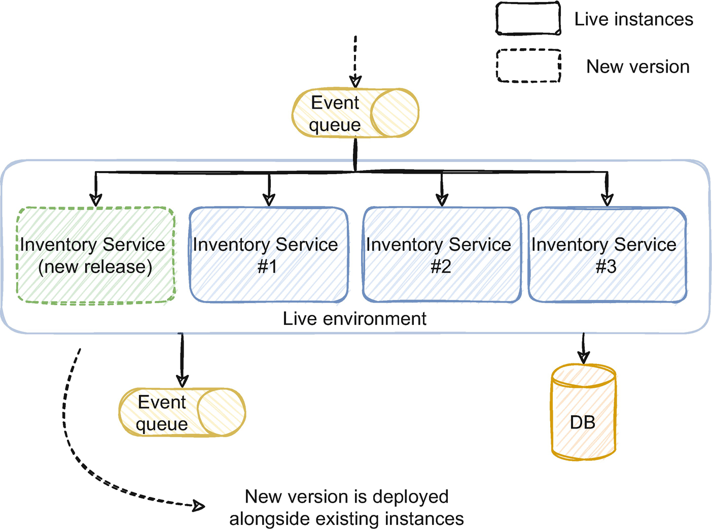

通常，所有实例的流量大致相等。在此示例中，由于有 3 个实例处于活动状态，并且我们将新实例添加到实例池中，因此新实例将仅接收四分之一的实时流量。如果出现问题，只有四分之一的流量会受到影响，我们可以回滚版本。
替代方法只能将选定的流量段转发到新版本。我们可以首先只将内部流量定向到新实例；例如，内部团队可以先与新版本互动，然后再向全体公众推出。这种方法对于同步请求和代理更容易，代理可以使用位置或标头有选择地将请求传送到特定实例。对于事件驱动的服务，可能会更难，因为服务必须有选择地处理或忽略不指向它们的事件或实现自定义路由算法。这种方法的进一步迭代是按相关业务信息（如国家或用户细分）划分流量。这种方法与较少数量的实例更相关（在这种情况下，25% 的流量将被处理并出现错误）。
金丝雀的主要问题是当出现问题时，最终用户将面临错误。在事件驱动的服务中，这也意味着针对实时数据临时运行了无效的构建。回滚不再完全解决问题，因为下游事件流或数据库可能已损坏。我们在第 7 章中讨论的一种缓解这种情况的方法是将队列倒回到部署之前的状态。另一个挑战是处理需要更谨慎方法的数据库或事件模式更改。一个可能的解决方案是避免破坏性更改并进行向前和向后模式更改，而不是像我们在第 8 章中讨论的那样在单个部署中部署破坏性更改。但是，它增加了有利于安全性和稳定性的复杂性。

### 10.5.3 特征标记
在生产中实施测试的一种常见方法是通过功能标记，其中部署了新功能但被功能标记禁用。我们可以测试功能的正确性以及对吞吐量和响应时间等非业务要求的合规性，并在我们确信该功能按预期工作时将其激活。停用该功能也很简单，因为它只涉及切换配置。
功能标记的范围各不相同；在我们激活或停用功能的地方，它可以是全部或全无。或者它可以是更复杂的过程，我们在给定的时间段内推出新功能以增加最终用户的数量，类似于金丝雀。还有几种类型的切换；它们的范围可以从切换业务功能和非功能需求到安全和实验功能。
这个概念很简单；我们有一组配置，可以根据它们是否处于活动状态来激活功能。当我们只想激活一部分实时流量时，它们可以是更精细的配置，例如，包含我们当时想要激活该功能的所有国家/地区的配置。在处理事件时，我们根据事件的数据或标题决定要遵循的路径；如果是来自已配置国家/地区的事件，我们会激活新功能。
一个常见的陷阱是一些切换的复杂性以及它们有时如何与核心业务逻辑交织在一起。特别密切地遵循单一职责原则和依赖倒置可以帮助将切换逻辑与提醒服务的功能分离。当不再需要旧标志时，制定严格的规则来清理旧标志也很重要。随着时间的推移，多个功能切换的建立可能会使服务变得不必要地复杂。增加的复杂性也将反映在测试套件中，因为它应该在切换存在时测试两条路径。因此，重构和清理旧切换的严格纪律很重要。尽管特征标记通常是一种简单直接的策略，但一些切换会持续很长时间，使得这种方法的广泛使用比它需要的更复杂。然而，考虑到正确的代码重构问题，将功能暴露给实时数据是一种简单且增量的方法。
10.5.4 生产自动化测试
生产测试实践的进一步发展是直接针对生产实例运行自动化测试。这种方法可以说是最激进的，需要强大的警报、监控、指标收集和对发布过程的控制。通过正确的方法，结合传统的预生产策略，它可以提供最全面的测试用例覆盖，而在预生产环境中我们无法或成本太高而无法设置。
公平地说，这种方法可能是公司可以实施的最成熟的阶段之一。常见的演进路径通常是从传统的端到端测试和自动化组件测试开始，然后实施强大的日志收集、指标和跟踪。然后转向更直接的方法，如特征标记和金丝雀。阴影可以说是下一个合乎逻辑的步骤，而生产自动化测试是最后一步。
该方法涉及拥有一个直接在生产实例上的新版本上运行的测试套件。这样，我们就可以有测试用例来测试与服务依赖项的完全集成。如果测试通过，我们确信没有未在预生产测试中发现的不可预见的情况。让我们来看看我们之前讨论过的库存服务的用例。该服务接收事件，处理它们，并将库存更改事件发布到下游服务，在本例中为运输服务，如图 10-16 所示。

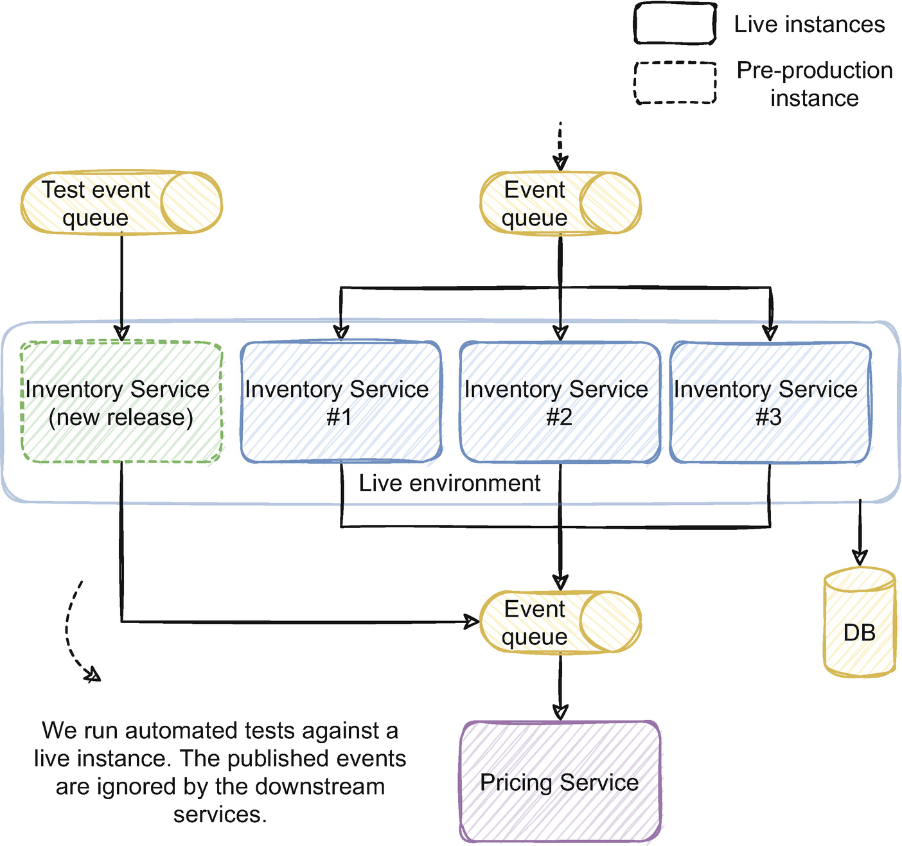

新版本与剩余的库存服务实时实例一起部署。测试套件将事件发布到由新版本处理的测试事件队列。如果服务发布事件，它将发布到真实的事件流，在这种情况下，应该包含一个标头，表明它们是测试事件。运输服务将使用该标头来忽略这些事件。与数据库的交互变得更加棘手，读取很好，但是在处理写入时，担心测试数据会污染数据库。我们可以使用我们在阴影策略中讨论的暂存结构，或者通过向这些记录发送信号来忽略测试数据。另一种选择可能是让特定用户或数据段专用于测试，例如，我们知道仅用于测试的沙盒客户端。许多公司已经对这些类型的客户直接进行了某种业务验证；对它们运行自动化测试而不是手动验证听起来可能没有那么深远。
通过这种方法，我们可以验证与其他服务的接口是否按照库存服务的期望工作。所有验证也与整个生态系统同时进行，而不是只运行测试。我们还可以实际验证响应时间或吞吐量等非功能性需求。正如我们所讨论的，除了传统质量保证方法可能出现的所有问题之外，分布式系统还有无数在质量环境中无法重现的故障模式。这些类型的方法可以成为确保新功能按预期工作的宝贵补充。

## 10.6 总结

我们可以在事件驱动的服务中实施多种质量保证策略。它们的范围和数量可以不同；将它们结合起来可能是保证全面测试覆盖率的一种有价值的方法。
单元和组件测试仅依赖于服务，通常快速且稳定，但范围有限。扩展组件测试可能是验证与外部依赖项交互的一种有价值的方式，但可能很难找到正确的内存替换。
混血集成测试可以是包含标准依赖项和其他服务之间的一个很好的折衷方案。消息代理或数据库等标准依赖项通常比架构中的其他服务更容易设置并且更稳定。
集成和端到端测试的一致性实施极具挑战性。他们还迅速限制了发布过程和团队的自主权。我们可以采取一些方法来最大限度地减少这些挑战，但维护它们的成本总是很高的。更可持续的方法是将预生产与生产方法中的测试结合起来。
合同测试和消费者驱动的合同是验证与其他服务的接口并鼓励与生产团队和消费者团队进行协作和沟通的好方法。
在事件驱动的服务中进行完整的端到端测试的另一种方法是将预生产方法（如单元、组件和半品种集成测试）与接口验证（如模式验证、合同测试和消费者驱动的合同）相结合。
阴影是一种很好的方法，可以在不影响最终用户的情况下通过实时流量验证新功能。
金丝雀和功能标记对于逐渐向越来越多的用户展示新功能非常有价值。他们可以将新版本的风险降到最低，并限制可能出现的问题。
事件驱动架构中最成熟的质量保证方法之一是生产中的自动化测试。它有助于保证生产前方法无法或成本太高而无法检测的故障模式的覆盖范围。

## 脚注

1. More information in “EF Core In-Memory Database Provider,” October 27, 2016, https://docs.microsoft.com/en-us/ef/core/providers/in-memory/?tabs=dotnet-core-cli
2. Full article by Jimmy Bogard, “Avoid In-Memory Databases for Tests,” March 18, 2020, https://jimmybogard.com/avoid-in-memory-databases-for-tests/
3. Home page at www.h2database.com/html/main.html
4. Full article by Ivan Ponomarev and John Roesler, “Testing Kafka Streams – A Deep Dive,” August 18, 2020, www.confluent.io/blog/testing-kafka-streams/
5. More details by Clinton Gormley, “Elasticsearch, the server,” August 30, 2016, www.elastic.co/pt/blog/elasticsearch-the-server
6. Home page at www.testcontainers.org/
7. Further details at www.testcontainers.org/modules/databases/
8. More details in “Schema Validation on Confluent Server,” https://docs.confluent.io/platform/current/schema-registry/schema-validation.html
9. See article “Agile testing directions: tests and examples,” August 22, 2003, www.exampler.com/old-blog/2003/08/22/#agile-testing-project-2
10. News in www.payscale.com/career-news/2016/05/programmer-fired-after-6-years-realizes-he-doesnt-know-how-to-code
11. Full articles by Cindy Sridharan, “Testing Microservices, the sane way,” December 31, 2017, https://copyconstruct.medium.com/testing-microservices-the-sane-way-9bb31d158c16
12. More details by Nick Ramirez, “HAProxy Traffic Mirroring for Real-world Testing,” July 23, 2019, www.haproxy.com/blog/haproxy-traffic-mirroring-for-real-world-testing/
