本章涵盖：

- 如何逐步采用事件驱动的架构
- 如何决定先移动哪些功能
- 如何以事件驱动的心态将数据从单体应用迁移到微服务架构
- 使用CDC（更改数据捕获）移动数据
- 使用事件作为新旧架构的真实来源
- 如何处理需要单体数据的事件驱动微服务，反之亦然
- 如何逐步将流量从单体转移到新服务
- 实现双向同步并了解与之相关的影响

拆分一个整体就像一个洋葱。根据我们提供的菜肴，有合法的食谱可以将其全部食用。但是为了释放它们的风味化合物并发挥它们的真正潜力，我们必须削减它。洋葱，就像单体一样，可以作为一个整体进行管理。当我们开始削减它们时，它们变得难以处理。当我们切割它们时，我们永远不确定它有多小足够小，洋葱内部的层开始散开并从我们的手上跑开，根据我们切割它们的方式，它可以迅速让我们的眼睛流泪。
在上一章中，我们讨论了单体架构和事件驱动架构的优点和局限性。本章将讨论我们如何开始将功能迁移到事件驱动架构，并讨论使用事件驱动方法迁移数据的几种模式。我们将通过使用电子商务平台的示例来说明如何实现这一点。
从单体开始迁移可能会令人生畏。单体应用通常非常复杂，逻辑复杂且混乱，通常是多年不受控制的增长、不确定的业务需求和紧迫的紧迫性的结果。模块化单体是例外，但也很少见。即使知道从哪里开始迁移以及首先迁移什么也很难决定。另一方面，事件驱动的架构并不总是最好的选择。第 2.1 和 2.2 节将帮助你确定事件驱动架构是否是最佳选择，以及我们如何开始迁移功能。
移动数据是人们在迁移到新架构时最困难的部分之一。无状态功能，例如在不依赖状态的情况下对每个订单应用固定税款的服务，迁移起来相对简单。由于不需要数据迁移并使数据与新旧架构保持同步，因此大大简化了它。事件驱动的方法通过可持续和无缝地公开数据提供了传统方法的替代方案。它们提供了一种有机的方式来（可能）实时更新数据。
将功能从单体应用转移到新架构通常不会（也不应该）通过大爆炸发布（过渡到新架构并立即分解旧架构）。大多数时候，我们需要处理需要来自单体应用的数据的新服务，而单体应用仍然使用新的服务数据。事件驱动的架构也不仅仅由事件驱动的服务组成。它们通常由同步和异步服务组成。 2.6 节将讨论在这两种情况下我们如何处理单体应用和新服务之间的依赖关系。
即使在将功能转移到新架构之后，用户和客户也不会同时更改为新架构。我们需要逐渐将流量从单体转移到新服务的方法。此外，还有一些功能取决于几个不同的边界。我们可能会迁移其中一个，但我们需要保持其他之间的交互。从新服务请求数据是一种选择，如第 2.6 节所述，但根据用例，这可能很难做到（例如，如果存储过程中有相当多的逻辑）。 2.8 节说明了我们如何逐步迁移功能并维护两个事实来源。

## 2.1 迁移到事件驱动架构是你的最佳选择吗？
第 1 章讨论了模块化单体如何成为一个很好的架构选择，以及它如何在没有分布式组件的挑战的情况下享受我们在微服务架构中经常寻找的几个属性。本节将教你挑战事件驱动的微服务架构是否是最佳选择，并质疑是否有可能在不增加分布式架构复杂性的情况下解决我们面临的问题。
Kong 的一项调查 1 表明，大多数技术领导者认为不采用微服务架构会损害他们公司的竞争能力。许多公司已采用微服务架构作为解决可扩展性和生产力限制以及第 1 章提到的大多数问题的一种手段。毫无疑问，它们具有其他架构难以提供的优势。
然而，我们经常急于盲目采用适用于其他公司的技术。通过关注当前架构强加给我们的所有限制，我们常常看不到它们总是提供的简单性和安全性。不经过深思熟虑就采用一种方法通常会导致可怕的结果。正如第 1 章所讨论的，增加的复杂性、分布式挑战和异步性质通常是恶作剧的挑战，并且很难用我们在单体应用程序中经常使用的策略来解决。
以 Istio 为例；社区决定逐渐从微服务架构转变为单体方法。 Istio 是一种用于微服务通信的服务网格，显然会受益于帮助其他人构建的相同架构。然而，他们很快发现 2 几个活动部件的部署开销和配置复杂性、调试难度以及网络请求和缓存的开销从未完全得到回报。因此，他们回到了 Istio 控制平面的单体部署，这对那个项目来说是有意义的。
Segment 也是另一个有趣的例子；他们从单体架构迁移到微服务架构，只是为了在几年后又回到单体架构。他们分享了一篇文章3，解释了一个小团队如何努力应对复杂性的显着增加。对具有旧架构的共享库进行一次更新需要一次部署，现在需要几十次，每个服务一个。由于大量服务不断增长，开发人员的生产力大大下降。每个新服务的运营开销都在稳步增加。最终，他们需要做一些事情并重新回到整体架构中，并从中受益匪浅。

“好吧，显然你不应该做那样的事情”当架构失败时，这通常是一个常见（且幼稚）的论点。相反，我们应该问：“微服务架构是否适合该用例？”有时不是；整体方法可能更合适。正如我们在第 1 章中提到的，它是关于为客户提供价值以及实现价值的最佳方式。
我们应该问的问题是：“我想解决什么问题？我会从中得到什么？”前沿、酷炫、全新、闪亮的架构并不是答案。业务目标应支持答案并与交付给客户的实际价值保持一致。使用相同的架构或以结构化的方式重构它可能会产生比过早采用微服务更好的结果。
让我们用一些例子来说明这个问题的答案，这些答案可能不是推进事件驱动微服务架构的充分理由：

- “我们将能够更有效地横向扩展。”：虽然这是真的，但事件驱动的微服务允许可选择的可扩展性；正如我们在第 1 章中看到的，我们可以扩展一个整体；这不是一个选择吗？
- “我们将能够自主开发。”：在模块化单体中工作的团队也可以享有高度的自主权。公司组织团队的方式以及他们如何自主工作通常是思维方式的转变，而不是技术上的转变。
- “我们将更快地交付功能。”：根据团队的规模，随着细分市场的经验，迁移到分布式架构实际上会损害生产力。了解功能缓慢的根本原因通常很有价值。一个庞大的团队确实会从微服务架构中受益，而较小的团队可能无法获得那么多，并且经常受到与应用程序架构无关的其他类型的限制。
- “为隔离域添加特性会更简单。”：尽管在大多数情况下这可能是真的，但隔离域系统仍然是服务生态系统的一部分，向实体添加特性或新数据通常会导致另一个系统来适应新的数据或特征。例如，有时由于团队路线图优先级和引入破坏性更改，服务之间的依赖关系很难管理。
- “我们希望采用持续交付的思维方式。”：虽然这是一个很好的理由，但我们应该始终思考，如果我们不能用现有的架构做到这一点。尽管随着团队和应用程序的增长，它会变得更具挑战性，但可以采用单体应用的持续交付思维方式。

以下是一些通常是强有力的理由的例子：

- 数据库只能垂直扩展并达到不符合成本效益的程度。单体数据库往往不能横向扩展。扩展通常会达到一个更好的方法更有效（尤其是成本方面）的程度。
- 团队的规模。尽管在模块化单体中可以管理团队的数量，但团队的数量通常会超过应用程序。
- 使用不同的语言和技术或需要更改已弃用的语言和技术。尽管总是可以更新现有的单体应用，但它通常很困难且容易出错。此外，可能无法在同一应用程序中支持不同的技术。

我们应该始终质疑是否没有其他选择，以及微服务架构是否是最佳方法。我们还应该有充分的理由或具体的限制来解决。大规模放大了我们在第 1 章中提到的大部分优势，无论是在使用方面还是在开发人员方面。如果一家公司没有达到那个阶段，它可能会比享受好处更多地与复杂性作斗争。
正如我们在第 1 章中提到的，没有明确的领域和边界也是推迟迁移的一个重要原因。在公司的早期，域很容易发生变化。在事件驱动的微服务架构中更改域和边界既昂贵又费力。拥有一个整体（即使是一个糟糕的）至少可以保证有一个物理位置来验证现有域并以更少的努力重构它们。
但是，团队往往会超出单个应用程序的容量。随着团队和应用程序的增长，管理变更和发布变得更加困难。保证模块化单体的隔离特性变得越来越困难。事件驱动的微服务提供了一个很好的替代方案来解决这些问题，前提是我们有一个明确的目标。

## 2.2 转向事件驱动架构，如何决定从哪里开始

本节将讨论我们如何选择最合适的功能来从单体架构迁移到事件驱动架构。我们将举例说明电子商务平台单体的示例，并解释我们如何选择其中一个模块来创建新服务。
大多数复杂的应用程序都有多个域，它们相互交互以实现更高级别的过程。有界上下文专注于整体功能的一部分，并包含给定的领域模型。例如，电子商务平台可能有多个有界上下文，其中之一是订单管理。订单管理有界上下文可以有一个核心域模型，从概念上说明订单（有界上下文是一个领域驱动的设计术语，我们在第 3 章中详细介绍；现在，将其视为领域边界）。
在一个完美的世界中，我们会在重新构建整个系统的同时停止产品开发几个月。这种情况很少发生，因为随着新架构的构建，业务仍然必须运行和发展。一个重要的考虑是逐步迁移功能；请记住，我们通常需要同时运行新旧系统。必须建立一种可持续的方式来逐步将功能迁移到新架构，以避免大爆炸发布。逐步迁移还提供了一种在较小规模上应对事件驱动架构挑战的方法。如果需要，保证以安全的方式回滚更改也更容易。我们会弄错一些部分；保证业务的可靠性并为我们提供从错误中吸取教训的空间至关重要。事件驱动和我们在本章中描述的模式都建立在这种思维模式中，以允许增量交付功能。
开始将功能转移到事件驱动架构的第一步是了解现有域和有界上下文。通常单体应用就像图 2-1 所示的例子。

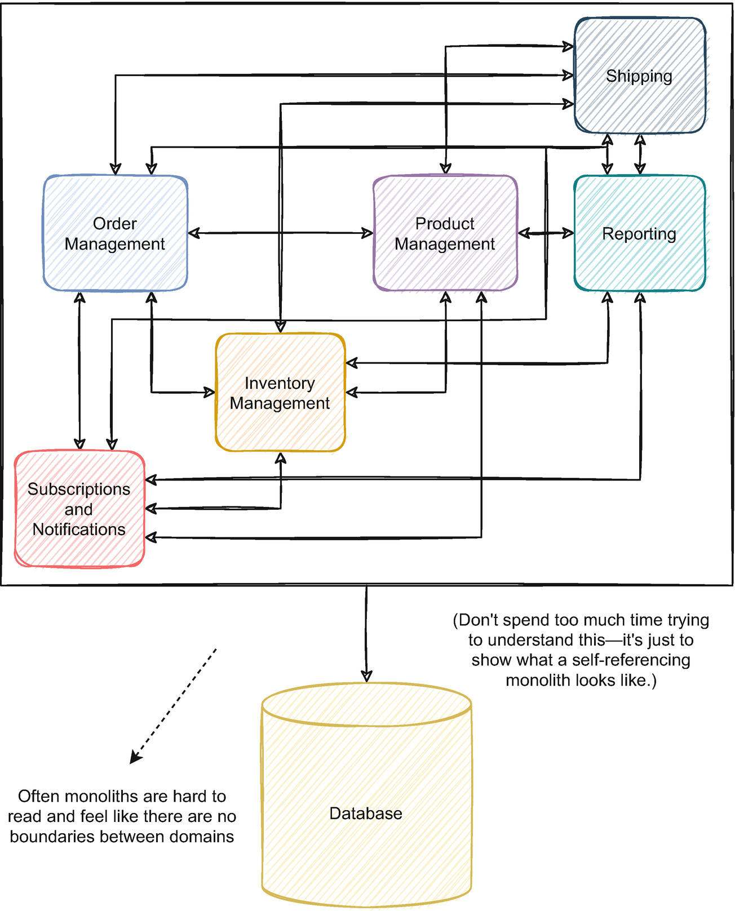

分析大量拼凑而成的单体中的所有有界上下文可能会让人不知所措。最初的几次尝试可能会感觉一切都在引用一切，并且没有明显的区别。 DDD（领域驱动设计）有一些技术可以帮助解决这个问题，在第 3 章中进一步详细说明。 然而，拥有一个已经描述这些关系的现有应用程序可以帮助理解业务如何运作，因此有时从单体开始的重要性然后逐步转向事件驱动的微服务架构。
如果你正在处理拼凑的单体应用，将其重构为模块化单体可能会很有用。通过这样做，我们甚至可以解决促使我们考虑转向事件驱动架构的最初原因。它还将强调现有的有界上下文并使它们的依赖项可见。如果我们不能构建一个结构良好的单体，为什么我们认为我们可以创建一个结构良好的事件驱动架构？有了这些信息，我们就可以就首先迁移哪个模块做出明智的选择。不要低估这项工作，因为领域知识对于构建新架构至关重要。
即使我们不选择更改现有的单体应用，尝试了解如何将其更改为模块化单体应用以及理解边界和有界上下文的基本练习对于了解首先移动哪个域至关重要。最终，我们将达到类似于图 2-2 所示的设计。

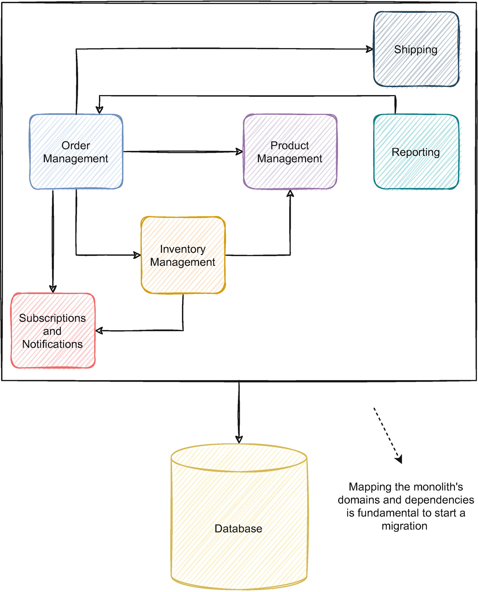

一旦业务特征以及它们如何映射到每个有界上下文中，我们就可以设计领域模型。这些步骤是开始迁移的基础。这些有界上下文最终将映射到负责管理每个域范围内的操作的不同服务。
我们已经映射了有界上下文和依赖关系（如第 3 章所述）；怎么办？我们需要决定先迁移哪个模块。通常，移动模块的难度、该模块如何从移动中受益以及一致性保证的宽松程度之间的权重。正如我们在第 1 章中讨论的，事件驱动架构具有最终一致性；根据弱一致性模型的影响，功能可能允许更小或更大的不一致窗口。明智的做法是开始迁移允许较低一致性约束的特性，为我们提供调整系统的空间，以保证不一致性足够小，不会影响系统的用户（如何处理最终一致性将在第 5 章中讨论）。
在图 2-2 的示例中，订单管理模块可能会从事件驱动的架构中受益匪浅，以简化面对负载高峰时的扩展过程。但是，移除模块可能并不容易，因为它依赖于其他四个模块。运输或报告模块可能是一个不错的选择，因为每个模块都只有一个依赖项。与报告相比，运输可能需要更强的一致性保证，后者通常是异步的；通常报告不需要精确到最后一秒。按照这一推理思路，报告可能是首先迁移的一个不错的选择。
我们应该尝试找到易于迁移的功能，主要从迁移中受益，并且具有强一致性保证并不重要。所有模块都可能被重新定位，但首先做一个简单的部分可能是一个很好的方式来获得关于迁移进展的反馈并为系统更具挑战性的部分铺平道路。它还保证你逐渐面对分布式架构的挑战并可持续地应对这些挑战。
了解迁移到新架构的进展情况也很重要。我们这样做是因为我们试图为客户提供价值或解决当前架构中的问题。我们的直觉很重要，但作为工程师，我们试图用数据来推动我们的决策。我们应该衡量什么？它通常与我们对第 2.1 节中关于迁移原因的问题的回答有关。
如果我们试图提高团队的自主性和生产力，衡量团队之间的依赖关系、功能分支的寿命或合并请求可能会很有趣。由于其他团队在主分支中发生冲突的变化，长期存在的分支很容易变得陈旧。它通常是复杂合并和大量冲突的根源；这是团队在超出一个应用程序时面临的典型挑战之一。
测量部署过程也很有用。如果我们试图转变为持续交付的思维方式，部署数量、周期时间和交付周期可能是有趣的指标。它们还与团队之间的依赖关系数量有关，因为通常在单体应用中发现高耦合代码，特性在准备好合并状态的时间更长。这种转变应该会缩短部署功能所需的总时间。
如果我们试图提高我们的可扩展性能力，由于负载峰值或测量响应时间引起的事件数量可能会很有用。应用程序和数据库的当前机器层也可以让我们深入了解应用程序支持不断增长的业务所需的容量。正如我们所讨论的，单体应用通常会在负载方面挣扎，当唯一的扩展方式是垂直扩展（通过增加机器的资源）时，它会限制业务增长。随着我们迁移到事件驱动架构，负载将逐渐在新服务之间分配，因此不再需要高层机器。
我们也可以无意识地过度使用指标，只要有足够的创造力，它们就可以揭示任何东西。在某种程度上，我们应该根据指标做出决定，但了解系统工作人员的感受也同样重要。了解他们对迁移状态的问题、关注点和意见，可以全面了解迁移的进展情况。请务必定期与团队核对以了解他们的经验；他们的反馈是你能找到的最有价值的指标。

## 2.3 使用事件驱动的方法从单体移动数据
最后几节讨论了迁移到事件驱动架构的决定以及我们如何决定首先迁移哪个模块。本节将介绍我们如何将数据从单体应用程序公开和传输到新架构。
使用图 2-3 中的示例，假设我们决定将报告模块迁移到新服务。还记得我们是如何讨论为什么必须进行增量迁移的吗？我们可以从在单体应用之外构建报告服务开始。

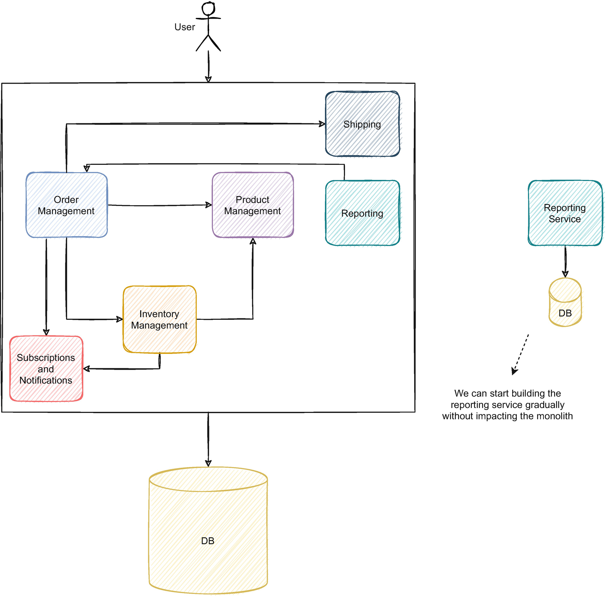

通过构建报告服务而不与单体进行任何交互，我们可以避免对其他团队的工作产生任何影响。我们还可以逐步向报告服务添加功能。我们可以先在没有任何功能的实时环境中部署服务，然后逐渐添加一个功能，直到服务具有单体应用的所有报告功能。
一个常见的问题是是复制单体中的代码还是重构它。这取决于整体；在结构良好且组织良好的整体上，按原样复制代码可能是有意义的；它会节省我们的时间。但是，大多数情况下，单体应用的模型可能无法满足传入的需求。迁移是重构它并在需要时更干净地构建它的好机会。我们很快将在报告服务和单体应用之间添加一个事件队列，这样只要单体应用遵守事件契约，它们就可以有不同的模型和行为。
请记住，当我们正在迁移时，这两种服务都具有该功能。由于错误修复或新功能而导致单体应用的报告模块发生变化意味着我们必须相应地更改报告服务，直到我们分解单体应用中的功能。
假设报告服务为每个已履行的订单生成并保存报告。我们已经迁移了创建报告的功能。但是我们需要订单信息来触发报告的创建和填充报告的数据。正如我们在图 2-3 中看到的，由于从该模块获取信息，单体应用的报告模块依赖于订单管理模块。我们需要以某种方式公开报告服务要使用的订单信息。下一步是在服务和单体之间建立一个队列；报告服务将使用该队列对事件做出反应并生成报告，如图 2-4 所示。

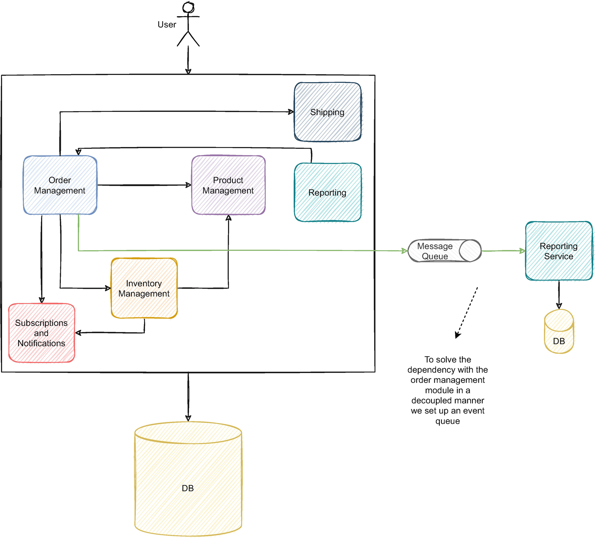

构建报告服务的一个重要步骤是定义服务将侦听的合同。事件模式通常会引发热烈的争论，是影响下游服务的核心设计。正确设计它们至关重要；否则，它们可能会引发对使用该事件的服务的困难挑战。如何设计事件模式将在第 8 章进一步讨论。此时，让我们担心创建满足报告服务需求的契约。
一旦我们设置了订单管理事件发布和报告服务事件处理，我们就已经能够在报告服务中公开功能。对于近期订单，用户已经可以使用报表服务获取报表。但是到目前为止创建的所有报告呢？我们只是迁移了功能，而不是数据。
有多种策略可以从现有数据库迁移数据。你可能不得不这样做一次或多次，并且可能会知道这有多难。第 2.9 节介绍了其中一些替代方案。在没有事件的情况下，我们可以不时运行批处理以将单体数据库同步到新服务，从而引入更高的复杂性和更高的延迟。我们可以临时访问两个数据库，并解决可能导致的所有问题。
事件驱动服务的美妙之处在于它们提供了一种无需这些复杂的临时流程即可无缝公开该信息的方法。事件是事实的来源，我们可以使用它们将数据传输到任何需要它的服务。我们可以利用我们已经处理事件的事实，并使用相同的策略来迁移我们需要的所有现有数据以及正在发生的数据。
在图 2-4 的示例中，我们可以触发订单管理服务中的一个作业，将所有订单信息发布到事件队列。当报表服务开始消费时，它会消费所有订单并生成它需要的所有报表。这也是验证服务正确性的好方法；生成的报告必须与单体应用中存在的报告相同。
使用事件代理来保留事件并且在消费时不会删除它们也为令人兴奋的可能性开辟了道路。想象一下，我们在报告服务中引入了一个错误，我们需要再次生成报告。我们可以简单地从引入错误的点开始读取队列。如果有一个功能可以将报告更改为具有不同的信息，我们可以简单地从队列的开头开始读取并生成新报告。否则会很麻烦的操作，容易出错的手动干预，突然内置并且可以有机地发生。
但我们还没有完成；我们迁移了功能和数据，但用户仍在使用单体获取报告。现在我们可以通知消费应用程序更改为消费报告服务。我们还可以在单体之上的层上有一个代理，将调用重定向到新服务。第 2.8 节进一步讨论了这些选项。

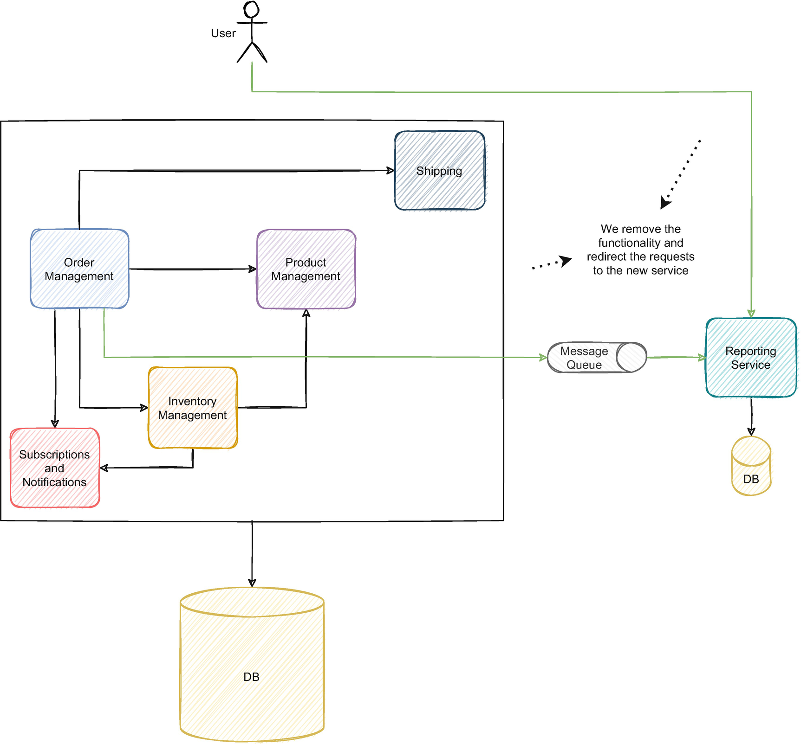

一旦没有对单体应用的报告模块的调用，我们应该将其从单体应用中移除，如图 2-5 所示。如果我们对每个模块逐步执行此操作，我们就会逐渐将整体分解为更小的服务。
我们还为其他服务奠定了基础。如果另一个模块需要订单管理信息，它已经暴露了。我们可以开始构建服务并将其插入现有的消息队列。即使是订单管理模块本身，当我们创建新服务时，也可以通过从头开始读取队列中的事件流来迁移数据。一旦我们迁移了订单管理模块，报告服务将使用来自新服务而不是单体的事件。事件驱动服务的解耦特性允许在不更改报告服务的情况下迁移订单管理服务。在具有同步请求的传统微服务架构中，这种变化需要协调以至少将端点从单体转移到新服务。
通过这种方式，事件驱动的方法可以实现从单体到新服务的数据流。它避免了在没有自定义批处理过程或其他手动选项的情况下拆分或共享数据库的其他复杂替代方案。流式传输数据既可以作为向新服务共享实时信息的一种方式，也可以作为数据的历史记录，从而简化迁移过程。它也是在整个架构中分布数据的一种非常直观、可扩展和有机的方式。
采用事件驱动的服务有其缺点；正如我们在第 1 章中提到的，报告信息现在是异步的，并且可能无法享受它在单体内部时所享有的强一致性保证。在这种特殊情况下，报告通常是异步的，因此它似乎很合适。但是，其他功能可能具有更强的一致性保证，例如，通过使用事务来保证与多个表的一致性。仍然可以通过流程管理器和 Sagas 实现一致性，如第 7 章所述。如何处理最终一致性将在第 5 章中讨论。

## 2.4 使用变更数据捕获 (CDC) 从单体中移动数据
上一节讨论了如何通过在内部模块中发布事件来共享单体应用的数据。但是，捕获可能会更改信息的每个功能可能具有挑战性。 Monoliths 在数据库的存储过程中也往往有大量的逻辑，这使得将更改发布到事件代理变得更加困难。本节将讨论我们如何使用类似的事件驱动方法，但使用 CDC（变更数据捕获）来提取数据。
我亲身体验到提取单体数据的困难的一种情况是，当团队试图从电子商务平台的后台应用程序（大型拼凑单体）迁移库存管理模块时。我们尝试的第一种方法是每次任何功能更改库存数据时调用新服务。通过发出两个请求，一个是新服务并维护单体调用，我们能够验证两个数据库是否拥有相同的数据。更改了一些缺失的流程后，看起来很棒；我们对每个功能所做的回归都运行良好；这两个数据库在每个质量环境中都是相同的。
然而，当我们进入生产阶段时，情况就完全不同了。新的服务数据不知何故正在慢慢地从整体（当前的事实来源）转移。尽管绝大多数流都在调用新服务，但我们发现仍有一些存储过程（每个存储过程有数百行）更改了数据。支持团队有时也会直接在数据库上修复一些数据。在单体应用之外还有一些蘑菇应用程序改变了数据。蘑菇应用程序是临时应用程序，经常在整个公司中弹出，在标准架构之外创建以实现一个小目标。它甚至可以是访问数据库的 Excel 表。许多公司都拥有由运营团队创建的其中几个，以帮助进行临时操作，例如数据分析或常见任务的自动化。由于这些原因和其他原因，我们很快发现完全覆盖访问该数据的所有流需要付出大量努力。有时更改现有的单体应用会过于复杂，例如，第 2.3 节中的方法。有时在使用第三方供应商单体时甚至是不可能的。
CDC 是一种识别和捕获对数据库或应用程序所做的单个更改的模式。在这些情况下，使用 CDC 可能是一个有效的替代方案，因为我们可以直接在数据库上捕获每个更改。许多支持 CDC 并提供易于访问的数据提取方法的数据库上也有内置功能。
除了本地提取和发布数据之外，还有几个框架可以扩展此功能；例如，Kafka Connect 使用 CDC 和连接到数据库的连接器来提取数据并将其加载到 Kafka。 Apache NiFi 也是提供相同功能的可靠选项。这些框架易于引导，并提供了一种从数据库中提取数据的简单方法，主要是通过配置。也可以创建我们的自定义转换。
但是，这些框架有一些缺点：

- 如果我们试图追踪实时事件，则很难在本地调试连接器。由于对所有内部 Kafka 类的引用，构建单元和集成测试可能具有挑战性。
- 定制级别可能不是最适合我们的要求，并且可能有限制。如果我们需要使用连接器上的外部源来丰富数据，则很难扩展（尽管我们应该将该逻辑保留在连接器之外，但这并不总是那么容易）。
- 这些框架倾向于暴露底层数据库数据模型，增加额外的耦合。我们可能更喜欢负责提取、创建和管理其事件的自定义应用程序。通常最好赋予事件领域意义。几个字段的更新可能比更新的几个列的技术定义具有更多的业务价值。也许更新库存栏意味着在业务方面进行预订。事件本身应反映该业务意图。使用这些框架可能会变得难以翻译。

根据你的要求，构建自定义解决方案来分析数据库 CDC 可能是一个更好的选择，并为你提供更高的灵活性。另一方面，使用框架可以显着减少实现开销，并且可以轻松设置解决方案。
在图 2-2 中的同一个示例中，我们如何使用 CDC 迁移模块？第一步是设置一个服务或连接到数据库的连接器，如图 2-6 所示。

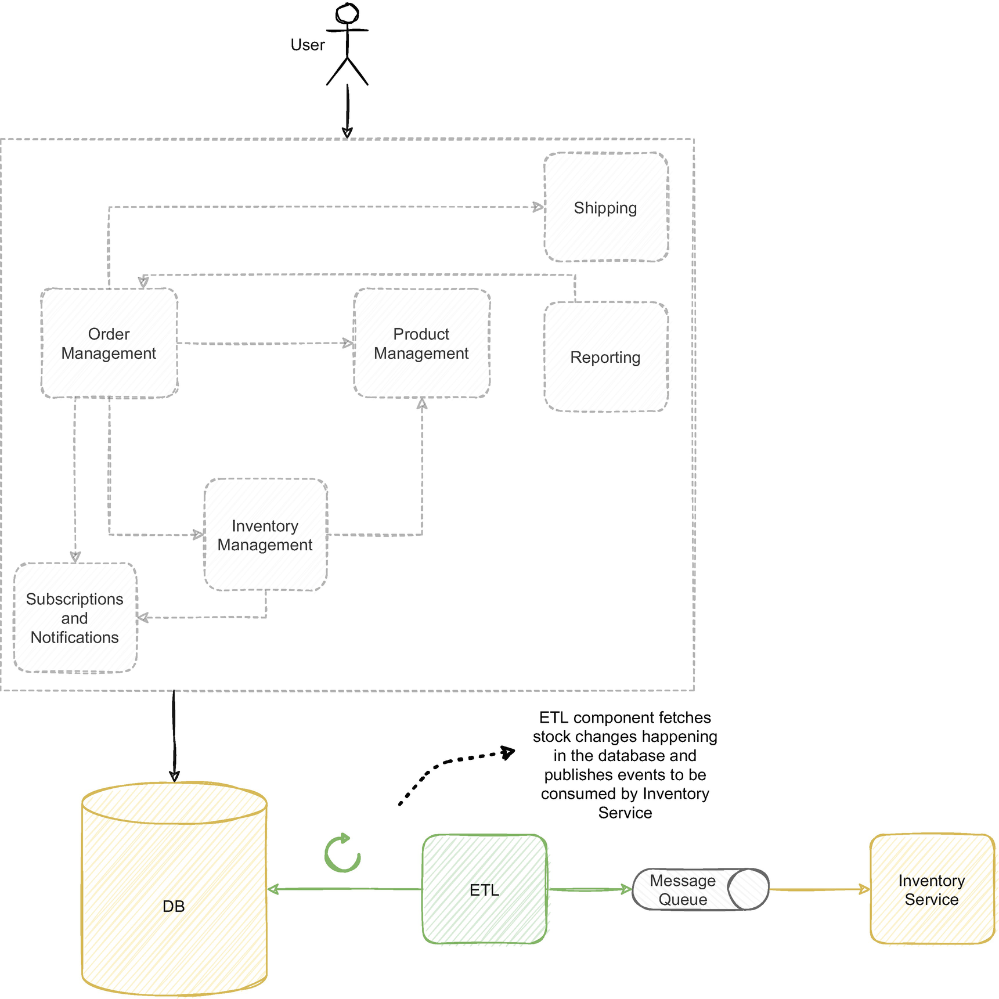

ETL（提取、转换和加载，虽然加载到消息队列）组件处理更改，将它们转换为事件，并将它们发布到消息队列。在与报告服务相同的示例中，该组件将轮询订单表中数据库 CDC 机制中的更改，并将其发布到消息队列。它还提供了解耦和隐藏 CDC 提供给外部事件的不需要的数据的作用。如果我们使用前面提到的框架，它们可能会暴露比需要更多的信息并泄漏有关底层数据模型的信息。自定义组件将抽象这些关注点并发布对新服务有意义的事件。
ETL 可能需要通过获取当前状态并将其发布到消息队列来引导当前信息以引导新服务。为了剖析单体应用上的报告模块，我们可以构建报告服务并监听队列中的事件。之后，我们会将消费者更改为新服务并取消当前功能的范围。我们的最终任务是分解 ETL 组件，并让新服务成为数据源。
一个重要的考虑是随着新架构的发展，我们应该不断地向同一个 ETL 组件添加功能或添加不同的单独组件。嗯，这取决于用例，但这里有一些指导方针可以帮助你做出决定。如果只有一个小团队使用 ETL 组件，那么一个组件可能更可取；使用 Kafka Connect 等框架也可能是一个不错的选择。当有多个团队具有不同的有界上下文时，建议为每个有界上下文构建 ETL。实现开销会更大，但它会让每个团队独立地为其上下文创建事件，而无需其他团队和模型之间的依赖关系。它还将鼓励他们了解数据在整体上的组织方式、哪些事件有意义以及它们如何与新服务交互。

### 2.4.1 事件驱动和变更数据捕获 (CDC)，一个真实示例
自定义查询是实现 CDC 的一种方式。我们可以通过查询数据库来提取数据，无论有没有过滤器。我们还可以将所有数据批量加载到消息队列，将所有现有信息下沉到事件流中。在引导所有现有数据之后，该过程将在给定水印之后加载更改，该水印可以是时间戳或增量 ID 或版本。我们会将水印后发生的所有更改发布到消息队列。
也可以自定义查询以仅过滤一组记录。例如，如果表有一个类型，它可能只发布给定类型的记录或将类型隔离到不同的队列中。
任何数据库都支持查询，因此即使数据库技术没有内置的 CDC 流程，它也始终是一个选项。它也非常灵活，因为我们可以根据我们想要数据的方式调整查询。另一方面，查询越复杂，对数据库资源的影响就越大。
它还依赖于最后更新的列，这可能会跳过对同一记录的多次更新。大多数情况下，这不是问题，但如果我们想捕捉用户的意图以及数据如何随时间演变，它就不会那么准确，因为它可能会合并多个更新。根据新旧架构的设计方式，压缩多个更新可能是一个问题。例如，如果我们有一个包含通用属性的表，每个属性都有一个类型，我们可能已经决定在新架构的独立模型中分离每个属性。如果是这样，对类型的更新将意味着删除旧资源并创建不同的资源。仅拥有有关最新状态的信息可能不足以将相同的状态应用于新架构。
出于同样的原因，删除也很难检测，除非我们实现软删除（通过具有状态列）。由于未删除记录，软删除会消耗更多资源。除此之外，如果有人硬删除软删除表（通过实际删除而不是更新列），这肯定不是前所未有的。
许多数据库技术都有一个内部操作日志，用于记录数据库中发生的每个更改操作。如果发生灾难性故障，该日志还用于将数据库恢复到正确状态或将信息复制到其他实例。这是一种与事件溯源和事件驱动原则非常相似的迷人机制。其中许多还通过使用操作日志来公开数据库中发生的更改来提供 CDC 功能。
使用 CDC 功能，我们可以获取相关表中发生的每个更改操作。与自定义查询不同，即使一条记录被多次更新，它也会为每次更新提供信息。它还记录删除，允许在没有软删除的情况下更真实地了解数据演变。性能和资源方面的日志扫描器的影响比查询小，因为它依赖于操作日志而不是查询特定的表。
但是，它们高度依赖于数据库技术如何公开这些信息。他们可能没有所需的所有信息，或者依赖于难以追踪的内部标识符。大多数公开此功能的技术都有关于每个更改的详细信息，这通常意味着它们公开了底层数据模型，从而需要仅对相关信息进行调整和封装。

#### 使用 SQL Server 和 Kafka 的 CDC 示例
让我们举例说明使用 CDC 和 SQL Server 移动数据的示例。使用与图 2-6 相同的示例单体，并假设我们要将库存数据从单体数据库移动到新服务，我们可以构建类似于图 2-7 的拓扑。

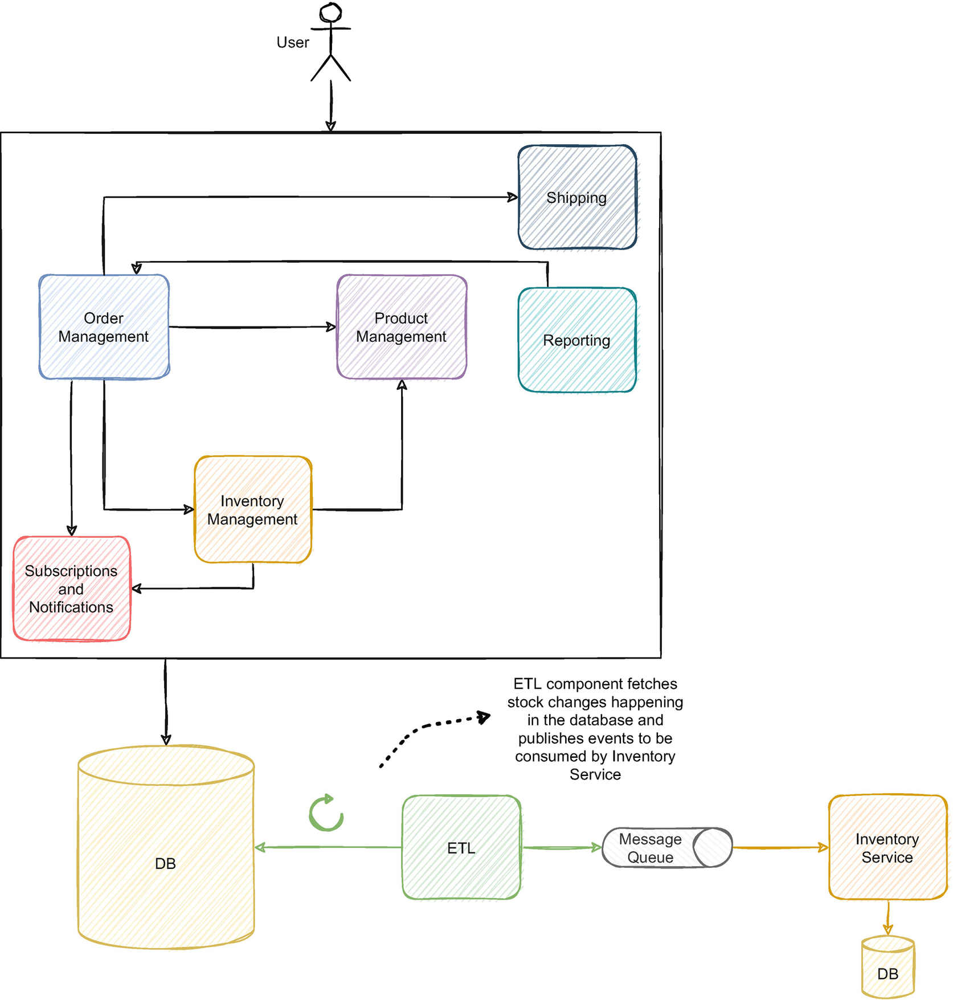

我们可以通过数据库在启用时创建的 CDC 特定表访问 SQL Server CDC 信息。 SQL Server 有一个事务日志，其中包含数据库上发生的每个更改。此日志对于保证数据库处于一致状态至关重要。 CDC 使用此日志来了解数据库中正在发生的操作，并使用此信息和一些元数据填充 CDC 表。我们可以使用这些表中填充的数据来了解数据库中发生的更改。
假设我们有一个 Stock 表，其中包含每种产品的每种尺寸的库存。清单 2-1 显示了该表以及如何为数据库和该表启用 CDC。

```sql
-- Create table stock
CREATE TABLE Stock #A
(
    ProductId int,
    Size varchar(10),
    StoreId int,
    Quantity int,
    primary key (ProductId, Size, StoreId)
)

-- Enable CDC at the database level
EXEC sys.sp_cdc_enable_db #B

-- Enable CDC at the table level
EXEC sys.sp_cdc_enable_table @source_schema = 'dbo', @source_name = 'Stock', @role_name = NULL, @supports_net_changes = 1 #B
#A Create stock table definition
#B Enabling CDC at the database and table level
```

每次 Stock 表发生更改时，代理都会在 SQL Server 事务日志中记录更改（即使没有启用 CDC）。 事务日志读取器代理将从事务日志中读取更改日志并将这些更改插入到 CDC 表中。 一旦我们在清单 2-1 中的第 12 行运行命令，就会创建 CDC 表，我们可以通过查询该表来获取数据库中发生的更改。

1    -- Some changes to stock records
2    insert into Stock values(153854, 'XS', 914, 1) #A
3    update Stock set Quantity = 2 where ProductId = 153854 and Size = 'XS' #A
4    insert into Stock values(153854, 'S', 914, 1) #A
5    delete from Stock where ProductId = 153854 and Size = 'S' #A
6
7    -- Fetch changes
8    SELECT * FROM [cdc].[dbo_Stock_CT] where __$start_lsn > 0x00001058000007110003 #B
#A Some changes done in the Stock table
#B Retrieving the CDC logs in the table dbo_Stock_CT (the value will change from your use case)

清单 2-2 显示了对 Stock 表所做的一些更改。我们插入了两行，然后更新了一行并删除了另一行。查询 CDC 表会检索到图 2-8 所示的结果。

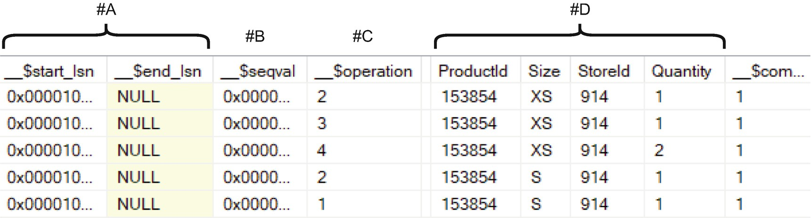

CDC 表有一些与 SQL Server 直接相关的列，但可能与某些用例相关：

- __$start_lsn 和 __\$end_lsn (#A) 是 SQL 服务分配的日志序列号 (LSN)。
- \_\_\$seqval (#B) 提供有关与同一事务中其他操作相关的操作顺序的信息。
- \_\_\$operation (#C) 表示对该行执行的操作（1 是删除，2 是插入，3 是更新前的行信息，4 是更新后的行信息）。
- 包含更改发生时数据的所有库存表列 (#D)。

清单 2-2 第 8 行中的查询将在 ETL 组件中。该组件轮询数据库以获取在它处理的最后一个 LSN 之后发生的记录（SQL Server 函数 fn_cdc_get_all_changes_dbo_stock 也可用于获取特定时间间隔的更改）。查询将返回上次轮询迭代和当前时间之间对表的更改。由于性能原因和资源优化，一个重要的考虑因素是仅获取最大数量的更改（例如每次 1000 行）。
加载更改后，我们将从数据库中获取的数据映射到库存事件。例如，操作 2（插入操作）可以生成 StockCreated 事件，操作 4（更新操作）可以生成 StockChanged 事件。一旦我们将数据从数据库映射到事件，我们就可以将它们发布到 Kafka。库存服务将处理这些事件并用这些事件更新其内部状态。
CDC 表提供了许多关于每次更改以及更改前数据如何的信息。更新命令提供有关数据在更改之前和之后如何的详细信息。如果我们不仅需要最新状态而且还需要更改前的状态，则某些用例可能需要这种细节。例如，如果我们更新 Stock 表中的产品 ID，我们可以在两个产品之间移动库存。根据我们设计系统的方式，可能有必要从一种产品中去除库存并将库存添加到另一种产品中。在两个产品上反映更改可能需要两个不同的事件以及更新前后的信息。
CDC 的缺点是会记录有关每次更改的大量信息。这会导致高使用率表和数据库中的资源消耗过多。在这些情况下，我们可能需要实施积极的保留政策。在 SQL Server 的情况下，还有另一个使用 Change Track 的选项，它与 CDC 相对类似，但比较两个版本之间的更改。它没有提供 CDC 所做的详细数据演变，但是当我们只需要最新状态时，它比使用 CDC 轻得多。

## 2.5 从单体迁移数据：事件驱动作为两个系统的真实来源
最后几节详细介绍了我们如何通过事件从单体中提取数据。本节将讨论我们如何使用事件作为单体和新服务的单一事实来源。
在采用事件驱动架构时要体现的一个关键心态是将事件作为真相的来源。到目前为止，我们讨论了如何将事实来源从单体应用转移到新服务。但是，只要信息依赖于单体，它就会是事实的来源。将消费者转移到新应用程序可能不是我们可以自主完成的活动；其中一些可能是可能需要适应新服务的外部消费者。如果是这样，转换动作可能需要相当长的时间，在此期间我们会被困在单体是事实的来源或同时拥有两个来源，正如我们将在本章末尾讨论的那样。
一个有趣的方法是让单体应用对队列做出反应。根据单体的不同，添加队列可能更难或更容易。一些单体已经对消息队列做出反应，因此将新服务插入同一个队列并根据新旧架构相应地路由消息将是一个好方法。如果单体没有队列，我们可以将请求转换为消息。转换可以由外部消费者、中间组件或单体本身完成。
虽然相似，但它与第 2.3 节中描述的方法有很大不同；事件发布不再是初始流程中的新辅助操作，而是成为现有流程的触发器。这样，消息就成为新旧流程的真相之源。
图 2-9 使用与之前相同的示例说明了这种替代方案；消息队列是单体应用和报告服务的输入。拥有触发流程的队列促进了思维方式的转变，以优先考虑事件设计，因为消息对于两个系统的运行都至关重要。

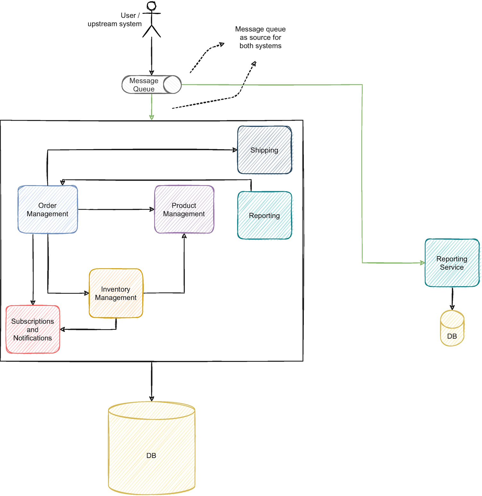

一旦我们建立了队列，我们就可以逐渐将消息消耗从一个系统更改为另一个系统。我们可以根据消息的内容推出；如果我们要发布订单信息，那么我们可以按国家/地区推出，例如，从“CA”的所有订单开始，而不是从所有国家/地区开始。一旦报告服务消耗了所有国家/地区，我们就可以删除单体应用的报告模块。
如果无法将上游系统更改为发布到队列或添加中间组件，我们可以拆分单体流。第一步是接收请求，发送消息，然后通过处理消息继续流程的其余部分。单体应用本身对排队的好处有限，但会设定新系统的步伐。看看该功能是否可以处理队列引入的较弱的一致性保证，这也是一个很好的尝试。

## 2.6 从单体到事件驱动架构的增量迁移：管理依赖

在最后几节中，我们详细介绍了如何使用事件驱动的方法将数据迁移到新服务。本节将讨论当新服务可能仍然需要来自旧架构的数据以及当单体对新服务有相同需求时的方法。
由于不需要很多依赖项，我们可能会发现单体应用中的一些用例与其他功能相对分离。报告模块的示例虽然需要订单管理信息，但并不是处处引用的中心功能。正如 2.2 节中提到的，我们应该使用这些模块来启动迁移；与尝试迁移在所有模块中引用的中心功能相比，从一个小而简单的部分开始并在此基础上构建我们的方式通常更好。但是，我们将达到可能迁移功能但仍然需要来自单体内部不相关模块的数据的地步。不仅仅是对其变化做出反应，它还需要模块的数据来处理其逻辑。由于数据在整体中，我们需要策略来访问服务中的数据。也可以应用倒数；单体中的其他模块可能仍需要我们迁移到新服务的数据。
2.6.1 管理从新的事件驱动服务到遗留单体的依赖
使用图 2-2 中的相同示例，现在让我们看看库存模块。库存模块可能需要产品信息来处理库存变化；每次有人更改库存时，库存模块都会获取产品信息并将该库存更改与产品相关联。这个用例不同于报告模块，因为它不会对系统的变化做出反应；库存模块获取其域流中的信息。
订单管理调用库存模块去除用户购买的库存数量。订单管理模块不会直接调用库存模块，而是发布一个事件，表明用户创建了订单。新的库存服务将对该事件做出反应，但仍需要产品管理模块信息。第一种最直接的方法是从单体应用请求该信息，如图 2-10 所示。

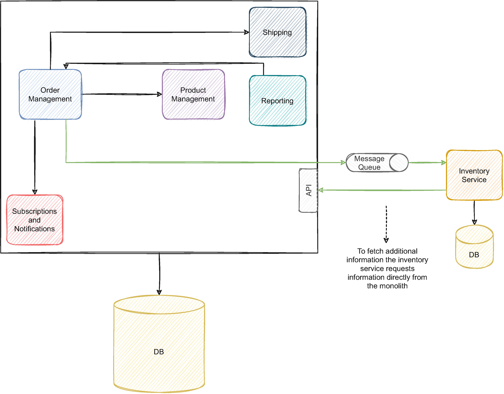

这个替代方案非常直观：我们对待库存服务中的依赖项，就像我们调用单体内部的任何其他模块一样，但它现在不是在同一个应用程序中，而是发出远程请求。我们经常不愿意向单体添加功能，我们应该这样做；然而，为单体添加功能可能是构建新架构的垫脚石。
但是，库存服务现在直接依赖于整体。如果单体应用遇到性能问题或出现灾难性故障（如内存泄漏），它将级联到库存服务。扩展库存服务也会影响整体；如果我们向服务添加更多资源，它将触发对单体应用的更多请求。这些问题正是我们试图通过事件驱动架构的解耦性质来避免的。这是一个可行的选择，我们可能会谨慎地使用它来促进需要这种方法的功能的迁移。但是，它必须是暂时的，我们应该谨慎使用。
此选项的替代方法是发布产品数据并在库存服务中使用该数据的内部视图。这样，库存服务保持解耦，我们避免了对单体的远程请求，如图 2-11 所示。

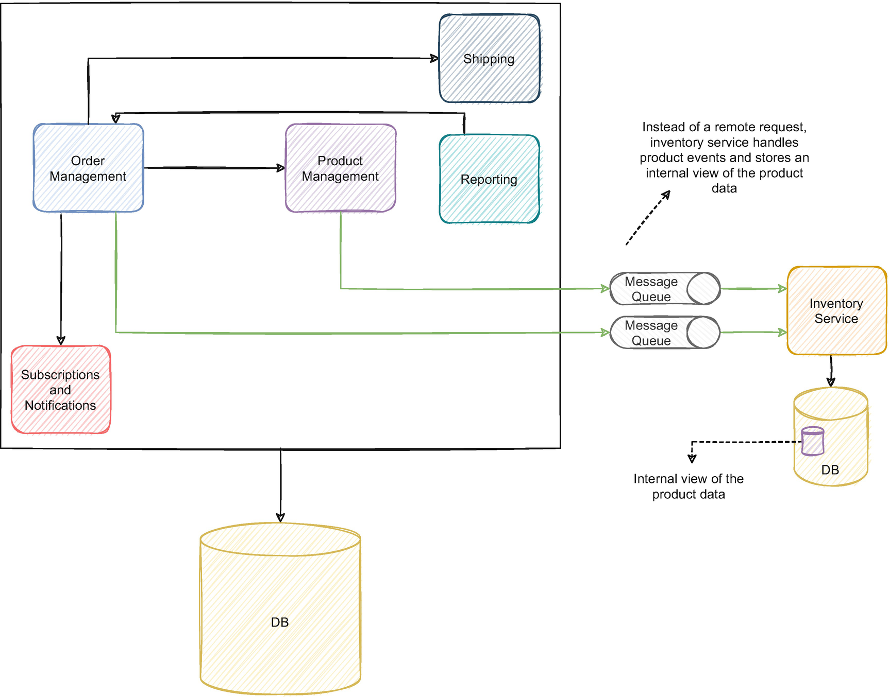

通过拥有产品数据的内部视图，库存服务将能够使用该内部状态而不是向单体请求数据来处理其域逻辑。状态不一定需要保存在数据库中；例如，Kafka（我们将在第 3 章和第 6 章中更详细地讨论 Kafka），如果我们使用 Kafka Streams，则提供了一种将这些信息保存在 KTables 中的方法。也可以选择其他解决方案来保存数据，如第 8 章所述。
我们更喜欢对服务中的数据进行非规范化，而不是有一个集中的地方来保存它。除了更高的解耦之外，该解决方案还提供了性能提升，因为访问本地数据通常比发出远程外部请求更快。但它也有保存和维护数据的基础设施和维护开销。

### 2.6.2 管理从遗留应用程序到新事件驱动服务的依赖关系

正如我们所讨论的，通过从单体迁移模块，我们还移动了与这些模块相关的数据。在某些用例中，单体内部的其他模块可能需要该数据。一个常见的例子是显示不同信息并经常聚合来自多个域的数据的 UI。
使用我们之前使用的相同示例，假设订单管理模块需要在收到新订单时验证所订购的产品是否有足够的库存来完成订单。要进行验证，模块必须获取当前的库存信息。如果我们将库存服务移至独立服务，数据将不再存在于单体应用中。
我们可以遵循我们之前讨论过的相同方法。最直观的方法是从新服务请求信息，如图 2-12 所示。当订单管理模块需要库存信息时，它会从库存服务请求数据，就像模块仍在单体内部时所做的那样，但它不是在内存中运行请求，而是发出远程请求。

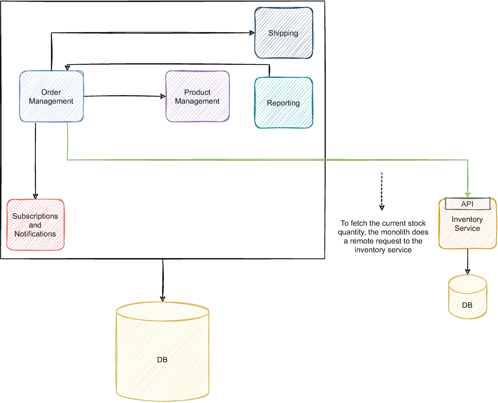

尽管这种方法存在我们之前提到的相同问题，但它们并没有那么麻烦。如果库存服务失败，我们可能仍然会遇到级联失败，但由于服务的范围很小，因此不太可能发生。另一方面，单体应用的任何有界上下文的任何变化都有可能导致整个应用程序瘫痪。如果我们需要给单体添加负载，它会触发更多的请求，但库存服务很容易扩展；扩展单体应用更难。由于这种方法简单易行，我们可以将其用作构建块，当我们移动订单管理模块时，选择不同的策略。
我们还可以采用一种策略，用库存服务的事件来满足单体应用的现有状态。这种方式的优点是可以保持两种架构解耦，如图 2-13 所示。

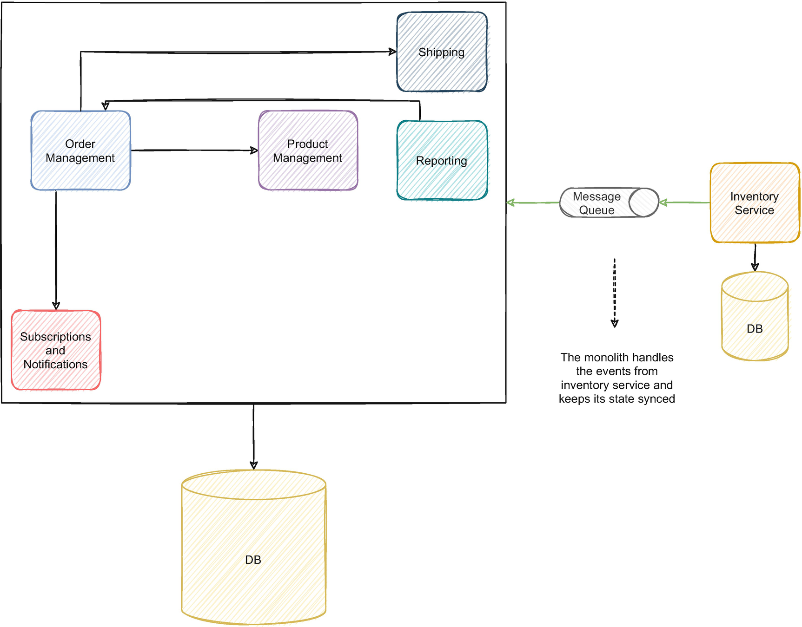

单体应用通常具有将大量不同信息连接在一起的内部视图。由于所有数据都存储在同一个数据库中，因此可以连接信息；在解构数据库时，维护这种功能是具有挑战性的。一种可持续的方法是将信息同步回整体并通过新服务的事件提供其内部状态。新服务是事实的来源，使单体数据库成为不同域的非规范化视图。这种方法通常是必需的，因为在不请求大量信息并将其加入内存的情况下，通过 HTTP 请求加入不同的信息是不可能的，这在性能和资源方面都是一个繁琐的过程。

## 2.7 逐渐将流量转移到新的微服务上
在最后几节中，我们讨论了如何将功能从单体转移到单个服务。但是，我们没有详细说明如何将流量从单体应用转移到新服务上。本节将详细介绍我们如何在没有大爆炸的情况下逐步移动流量。
之前，我们讨论过，一旦新服务功能齐全，我们就可以将流量转移到新服务并取消旧功能的范围。但是，我们应该保证过渡有必要的质量保证。只要有可能，我们应该避免大爆炸发布；在功能上逐步交付比一次性全部发布要安全得多。
我们在前几节中讨论的事件驱动方法允许我们在不影响当前应用程序的情况下逐渐构建新服务。公开事件队列上的数据还使服务能够异步引导其数据库。由于消息队列将服务解耦并使其能够异步处理信息，因此随着该进程的推进，它提供了一种比较两个数据库中的信息以确保数据一致的方法。即使在消费之后，事件驱动的队列也会保留消息；如果我们检测到损坏数据的问题，我们可以简单地从头开始读取队列并重新生成状态。一旦我们确信数据是一致的，我们就可以开始将请求转移到新服务，如图 2-14 所示。

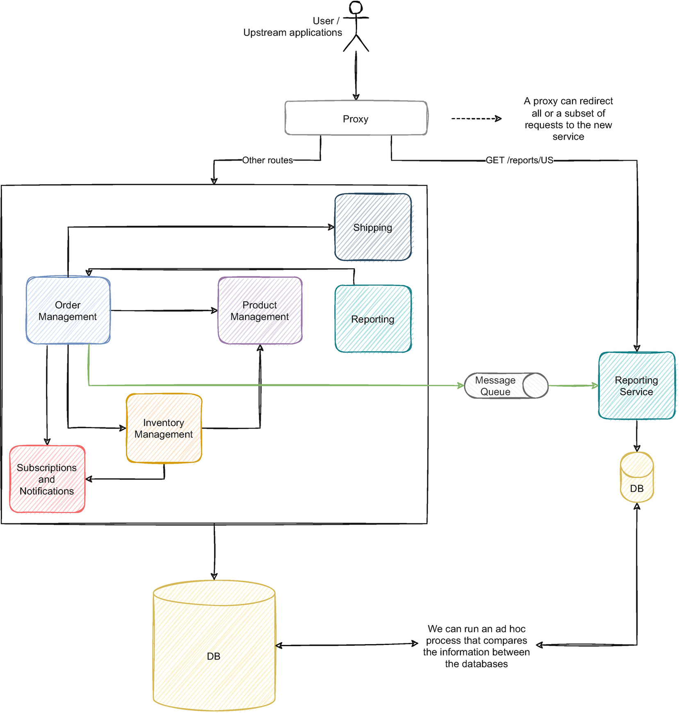

我们也不需要一次路由所有请求；我们可以根据内容进行路由；代理可以过滤对新服务的请求子集和对现有应用程序的剩余请求，保证逐步推出。例如，如图 2-14 所示，代理可以根据路由转发部分请求。如果我们按国家/地区查询报告，我们可以将针对某个国家/地区的请求转发到新服务，并将其余请求保留在现有应用程序中。
如果无法在上游系统之间设置代理，我们可以使用单体作为代理，将请求转发给新的服务。我们可以将其更改为接收请求并在内部调用或向新服务发送消息。这并不理想，因为我们仍将使用我们想要停止使用的应用程序，但作为临时解决方案可能会有所帮助。同时，单体应用的消费者可以适应新的服务。
我们还可以将内容路由应用于消息。如果单体已经在接收消息，就像第 2.5 节中的方法，我们可以将消息的子集转发给新服务，其余的转发给现有应用程序。例如，带有国家代码“US”的消息将被新服务消费并忽略其他消息，而单体应用则相反。我们也可以使用不同的队列，一个用于新服务，另一个用于整体，尽管我们必须为两个队列复制消息。这种方式也可以逐步转移两个应用程序之间的消息流量。
如果出现问题，保持回滚策略也很重要。事件驱动的队列保留队列中的消息。如果我们构建依赖于这些队列来处理其域逻辑的系统，通常很容易回滚系统并在问题出现后重新处理消息。第 7 章进一步详细介绍了这种回滚策略。

## 2.8 从单体迁移：双向同步和与两个真实来源共存
在第 2.6 节中，我们讨论了在将真实数据源迁移到新服务后如何提供单体应用的状态。在前面的部分中，我们讨论了如何将单体应用的功能和数据迁移到新架构。但是，我们讨论了立即转换或在短时间内跨越的用例。在某些情况下，这种转变并不那么直接，我们可能需要在相当长的一段时间内同时维护新旧架构。我们应该始终避免两个真相来源；复杂且难以维护；然而，在现实世界中，通常迁移功能比简单地立即分解旧功能更麻烦。
在向事件驱动的微服务迁移时，我们的主要目标是将新服务转变为事实来源；该域信息的入口点是新服务。单一的事实来源是我们在任何情况下始终必须追求的基本目标。但是，有时我们必须维护旧应用程序中无法或难以在短时间内迁移到的功能。跨越多个域的功能很难停止，因为每个域通常属于不同的团队。一些团队可能需要在与其他团队不同的时间推进迁移。正如第 2.7 节中提到的，我们应该始终逐步进行这种迁移，因此即使时机正确，在多个团队之间同步发布往往会导致灾难。 2.6 节提到了保持单体状态同步的策略，但是当我们混合像 2.3 和 2.6 节中提到的那些策略时，它会如何发挥作用？我们可以分解单体应用的功能，并在短时间内将状态反馈给单体应用，但这是有风险的，而且如此短的时间迁移很少见。
当我们在第 2.4 节讨论 CDC 时，我们将其描述为一种有趣的方法，因为整个应用程序中可能存在纠缠不清的功能。当我们尝试拆分的单体应用域的逻辑分布在整个应用程序和存储过程中时，将其与应用程序的其余部分解耦可能会异常困难。多个入口点通常依赖于其他域逻辑或无法快速更改为新服务的消费者。在我们尝试迁移我在第 2.4 节中提到的库存管理逻辑的公司中，我们使用了 CDC，并且进展顺利；使用 CDC，我们能够捕获每个更改并将其同步到新服务。然而，这也意味着入口点仍然是遗留的。尽管我们能够更改许多客户端以直接访问服务或代理单体对新服务的调用，但由于相关的耦合和复杂性，其中一些是不可行的。有一些存储过程可以更改库存，这些过程加入了来自不同领域（如订单和产品）的大量信息。这些也是关键业务功能；对它们进行分解或使其在一段时间内不可用是不可接受的。我们后来能够对它们进行分解并将它们移到新的应用程序中，但前提是大多数其他域都离开了单体应用，这需要数年时间；与此同时，我们不得不面对两个切入点和两个真相来源。
这样做允许库存信息在新架构中可用，从而能够在该信息之上构建新的服务和应用程序，而不是遗留应用程序。这同时仍然保留了一些我们无法移动的单体功能。
使用图 2-2 中的相同示例，假设用户可以编辑报告服务生成的报告。用户可以在新服务中编辑报告，但由于我们无法移动的功能，也可以在整体中进行编辑。结合我们之前讨论的方法，我们可以将来自单体应用和报告服务的更改发布到消息队列，并且两者都将从这些队列中进行侦听，但只会消耗不是来自该系统的更改。

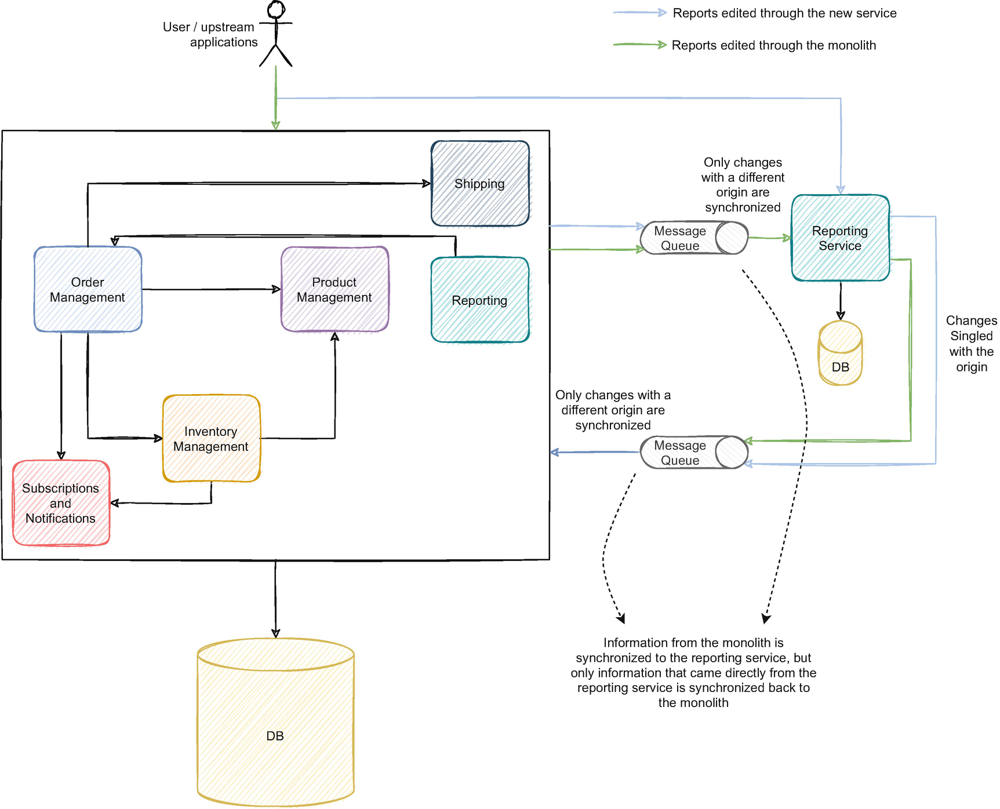

该解决方案的一个问题是打破循环；我们可以做到这一点，例如，使用一个标头来指示原始系统。在图 2-15 中，如果用户在单体应用中编辑报表，单体应用会将相应的事件发布到消息队列中。该事件还需要将该更改通知原始系统。报告服务将使用该更改并向其队列发布一个类似的事件，以表示相同的更改。单体正在消耗该队列，但忽略了更改，因为它起源于单体。报告服务中的更改具有相同的流程，并发布到服务的队列中，由单体使用，由单体再次发布，并在服务中被忽略。
我们的目标是剖析单体应用的消息队列；所有新服务都应插入报告服务的队列中。当我们剖析单体应用的功能时，单体应用的队列中应该流过更少的消息。一旦队列中没有消息流动，意味着单体应用不再具有影响报告服务的任何功能，我们最终完成了迁移。然后我们还应该对单体应用的队列进行分解。
我们还需要考虑其他细节；例如，如果用户在两个系统中同时更改相同的报告，我们将如何管理冲突？我们应该用版本或时间戳来标识事件，并且以最新的为准。因此，在使用消息时，系统需要验证消息日期，并且只更新比系统内部状态更近的更改。然而，这些挑战并不仅限于两个真相来源；由于实例之间的并发性或事件排序的丢失，任何水平可扩展的事件驱动系统都可能遇到并行更改。我们将在第 5、6 和 7 章中讨论应对这些挑战的方法。
从长远来看，保持双向同步极其困难，并且是持续问题的根源。事件不仅难以追踪，因为它们可能来自完全不同的系统，而且新功能也仅限于单体的设计选择。域逻辑还需要在两个系统之间保持一致。由于消息队列的解耦性质，可以在不影响整体的情况下演进新系统，只要消息的契约保持不变，但只是直到某一点。大多数时候，我们可以避免有两个真相来源，我们应该尽最大可能去阻止它。这是我们可能会保留在工具箱中的解决方案，但在接近底部的地方，其他解决方案通常更可取。

## 2.9 总结

事件驱动的架构会增加与之相关的复杂性，我们应该质疑它是否是我们用例的最佳选择。我们应该始终问自己，我们要解决什么问题，并有明确的理由推进迁移。
我们应该始终努力进行增量迁移。这样做将使我们能够以可持续的方式面对与之相关的挑战。
通常首先迁移的好的候选模块是依赖较少的模块，并且在很大程度上受益于迁移。
事件驱动提供了一种高度解耦的解决方案，可以从单体应用中释放数据。它还提供了异步构建新服务的工具，而不会影响整体和使用它的团队。
当功能过于耦合、过于复杂或根本无法无缝迁移时，CDC 是访问数据更改并将其转换为事件的有效选项。
我们可以使用事件来触发单体应用和新服务的变化。这样做将真相的来源置于事件中，进一步促进了将事件作为单一真相来源的思维方式转变。
当其他模块依赖于我们正在迁移的功能的数据时，我们可以使用事件在这些应用程序中提供该状态。状态视图可以在单体和新服务中维护，并用于解决这些依赖关系。
有些迁移不需要在一瞬间完成；我们可以逐渐改变流量到新的应用程序。
可能存在无法在短时间内完成完整迁移的用例，可能需要几个月的时间。可以使用双向同步来维护单体中较难的功能，同时继续迁移其余功能。然而，这是一个具有多种影响的复杂选项；我们应该始终争取单一的事实来源。

## 脚注

1. See this article by Kong, December 11, 2019, https://konghq.com/press-release/2020-digital-innovation-benchmark/
2. See this article by Christian Posta, “Istio as an Example of When Not to Do Microservices,” January 8, 2020, https://blog.christianposta.com/microservices/istio-as-an-example-of-when-not-to-do-microservices/
3. See Alexandra Noonan, “Goodbye Microservices: From 100s of problem children to 1 superstar,” July 10, 2018, https://segment.com/blog/goodbye-microservices/
4. See “Why We Replaced Our Kafka Connector with a Kafka Consumer,” December 16, 2017, https://hackernoon.com/why-we-replaced-our-kafka-connector-with-a-kafka-consumer-972e56bebb23