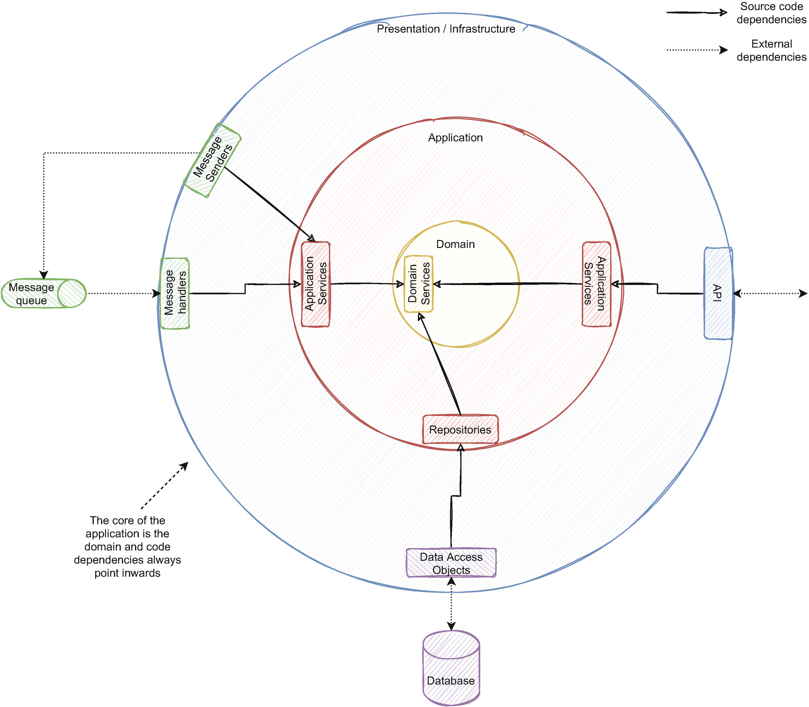

本章涵盖：

- 了解事件驱动微服务的结构、关联的消息模式和常见的拓扑结构
- 理解 DDD（领域驱动设计），如何应用它，以及它的概念
- 使用 DDD 提取域的有界上下文并利用服务的边界
- 在设计聚合规模和了解其对下游服务的影响时如何避免常见陷阱
- 组织服务边界时要考虑哪些不同的特征
- 了解请求驱动和事件驱动服务的区别和影响
- 如何在向现有服务添加功能或创建新服务之间做出决定

有趣的是，有时计算机科学比科学更像是艺术。也许不会更多，但它往往夹杂着柔和的艺术灵感。我们常常看不到在课堂上学习所有计算机科学基础知识或在书籍或文章中学习新模式的实用价值。通常，我们将它们用作构建块或提取它们的基本思想，将它们组合起来并加以调整，作为解决独特问题的方法。它们通常可以作为不同环境中其他解决方案的灵感来源。有时创造力会发挥作用，您的个人风格会与之相关联。我们是否经常查看某人的代码并在定义同事风格的无形痕迹下划线？如果我们阅读一位独特作者的几首诗，我们可以感受到这种风格——他可能坐在你旁边，试图退出 Vim。
在定义领域和边界时，它也会变得模糊，并且通常感觉更像是艺术而不是科学。没有我们可以应用并获得结果的神奇公式，但有一些方法可以帮助我们提取业务领域并决定什么是最佳方法。本章介绍了这些策略，并帮助我们理解应用程序的领域并将其转换为逻辑模型。
在第 2 章中，我们讨论了如何从单体应用中提取功能到新服务中。我们可以在事件驱动架构中构建的不同类型的服务和拓扑是我们可以用来发展该架构的构建块。了解它们对于维护和构建这些架构至关重要。
随着我们改进架构并依赖于几个不同的组件，需要定义服务的边界、它们如何相互交互以及它们管理的域。不同的组织有不同的优先事项；通常决定适当的边界是不同方法之间的权衡。我们将在 3.2 节中讨论定义边界时的各种考虑。 DDD 是一种我们可以用来理解和提取领域概念的方法。在对复杂域建模时，实体的大小（DDD 术语中的聚合）通常难以衡量。在事件驱动的架构中，我们如何设计它会对下游消费者产生影响；第 3.4 节详细介绍了这种影响。
添加新功能通常属于以下两种选择之一：创建新服务或向现有服务添加功能。有时选择并不明确；事件驱动架构的高度解耦特性促进了组件的诞生和退役。但是，不断添加服务会进一步增加系统的复杂性。第 3.6 节进一步详细说明了这些权衡。

## 3.1 构建事件驱动的微服务
本节将讨论事件驱动微服务的典型架构及其标准模块。我们将讨论典型的消息传递实体和消息传递模式，我们将在本书的其余部分将它们用作架构中的构建块。在本节的末尾，我们将讨论常见的陷阱、它们的影响以及如何避免它们。
在第 2 章中，我们将功能从单体转移到了事件驱动的服务。我们用一个正方形来表示它，但是那个正方形里面是什么？每个服务都是一个单进程应用程序，在其中，代码通常根据架构进行组织。通常，我们将此架构划分为层。我们的使命之一是将业务概念和流程建模为代码。随着业务的增长，应用程序的复杂性也在增加。使用逻辑分层组织应用程序是管理这种复杂性的一种方法。
根据职责将应用程序划分为多个层符合关注点分离原则。这也是一种帮助开发人员了解应用程序并轻松找到功能的方法。通过多个微服务维护相同的架构可以最大限度地减少理解应用程序和实现新功能的开销。如果有人从未在一项服务中工作过，现在必须更改它，尽管域可能不同，但应用程序的组织是相同的，因此更容易理解。
我们可以使用分层架构将功能封装在每一层内部，促进代码更改而不影响其他层。该功能还可以在整个应用程序中重复使用，在单个实现中标准化通用功能。我们还可以使用分层架构来限制耦合并限制层之间的通信方式。它们对于开发单元测试也很有用，因为关注点分离促进了简单的单一目的测试。
有几种类型的分层架构。由于事件驱动服务的自然解耦，我们不需要在每个服务中使用相同的技术，因为我们也不需要在每个服务中使用相同的技术。但是，建议选择一个并保持服务之间的一致性。正如我们将在第 10 章中讨论的，如果其他团队需要更改其他团队所有权的服务，如果每个服务都有相似的架构，那么开发会更直接。如果应用程序的结构熟悉，讨论的重点就会从技术细节转移到领域实现，这往往更有价值。

### 3.1.1 N 层架构

最常见的体系结构将应用程序代码分成几个层。有几种变化；层数取决于应用程序的需求（因此称为 N 层）。图 3-1 展示了一个典型的三层架构。


在这个架构中，presentation 接收所有外部请求；如果微服务有UI，我们也放在这一层。没有 UI 的微服务公开了其他应用程序和服务用来访问数据的 API。典型的事件驱动微服务通过事件进行通信。事件处理程序接收事件并调用其他层来处理它们的业务逻辑。表示层仅与具有所有业务逻辑的应用程序和域层交互。应用层和领域层通过数据层管理状态，数据层拥有所有的数据访问对象和数据库技术实现。
最重要的部分是驻留在应用程序和域层中的业务逻辑。这种架构的缺点之一是应用程序和领域层对数据层的直接依赖。这通常意味着业务逻辑依赖于数据访问，这不应该与域逻辑本身相关。数据库实现细节通常会影响实现的业务逻辑。数据库的存在也常常成为业务逻辑的必要先决条件。由于数据库耦合，测试甚至可能成为一个问题。通常为了测试业务逻辑，我们需要一个临时数据库；我们可以通过依赖注入来避免这种情况，这通常会导致我们在下面详细介绍的不同类型的架构。

### 3.1.2 整洁架构

N 层架构的替代方案是 Bob Martin 的简洁架构 .1 正如我们在下面提到的，如果我们采用依赖倒置原则（SOLID2 中的 I）并依赖抽象而不是实现，我们经常会达到这种架构。它还旨在在应用程序的核心中构建域逻辑。域逻辑不应该依赖或引用其他任何东西；例如，订单管理业务逻辑不需要知道我们使用 SQL。
其他架构通常是根据干净架构所转化的相同实用概念来设计的。六边形架构 3（也称为端口和适配器）或洋葱架构 4 提供了基于相同原理的类似方法。他们努力通过将软件分离成层来提供清晰的关注点分离。他们还强调将业务逻辑作为应用程序的重点。业务逻辑也没有依赖或引用，外层引用域模型，但域模型不引用任何东西。图 3-2 展示了一个具有简洁架构的典型微服务。



我们只在外层引用外部依赖。每个层中的代码可以单独依赖于对内层的引用。核心层包含领域逻辑和领域实体，不能引用外层中的任何内容。这样，外层的任何东西都不会影响内层。外层通常有具体的实现，而内层随着我们进入核心而变得更加抽象。图 3-2 只显示了三层，但这只是一个例子；一个应用程序可以根据需要有多个层。保存应用程序业务逻辑的应用程序层可以有一个带有接口适配器的附加层，负责在表示层和应用程序逻辑之间适配数据。
对外层的外部依赖意味着我们引用该层中的每个工具、驱动程序或框架。仅在外层引用外部依赖项促进了应用程序和域逻辑与外部工具的分离。通常，这些框架或技术的局限性与应用程序的逻辑有关。将它们移到外层可以促进逻辑的建模和演化，而不受外部工具的影响。我们经常听到“如果我们需要交换数据库，我们可以在不影响内部逻辑的情况下进行”。关注点分离是一个基本的编码原则，但是我们多久交换一次数据库呢？数据库约束倾向于泄漏到应用程序逻辑（例如，管理多个模型之间的事务）或跨越所有应用程序的框架更新。外层有助于防止这些常见问题。
此外，领域逻辑不应该知道我们在外层实现了什么。独立于外部引用（如 N 层架构中的数据引用）有助于业务规则根据需要发展并反映业务意图。我们验证用户的方式、发布事件的方式或记录更改方式的更改不应影响业务规则。有这种分离和隔离，他们不会。图 3-3 说明了使用此架构的两个服务，它们通过消息队列进行交互。


图 3-3 两个具有干净架构的事件驱动服务通过消息队列进行交互。域与应用程序发送事件和访问数据的方式隔离
例如，如果我们在两个服务中使用的消息传递框架被弃用，升级它只会影响外层。它简化了外部依赖项的替换，并且还促进了每一层中的单一用途单元测试。
我们可以将干净的架构应用于每个微服务。尽管如此，随着我们添加更多功能和新服务，我们可能会创建更小的服务，这些服务在域或应用程序逻辑方面并不那么丰富。首先，正如我们在第 2 章中提到的，建议开发封装系统子集但更广泛和自治域的服务。创建更大的粗粒度服务，在一开始，自然会遏制服务数量以可持续的速度扩张。他们还将减少对在构建架构时更易于管理的外部服务的依赖。它将减少每个服务必须执行的远程调用次数，并减轻弱一致性的影响，因为每个服务都将在本地管理其域。正如我们在第 2 章中提到的，我们应该逐步构建系统，首先添加粗粒度的服务，然后在需要时推进到责任较小的细粒度服务。
随着我们改进架构并创建更细粒度的服务，我们可能会有更小的服务来承担整个架构的部分职责。图 3-4 说明了一个示例，其中有一个服务来管理域逻辑。


读取模型和进程管理器等其他服务操作应用程序逻辑，反腐败层充当外部和内部信息之间的适配器。 API 服务公开边界的信息。
我们需要避免与拥有细粒度服务相关的陷阱。如此小的范围通常会增加锁步发布的风险，其中一个功能跨越多个服务，需要协调才能在实时环境中部署它们。微服务应该是自治的，一项服务的发布不应影响其他服务。此外，小范围的服务会迅速增加服务的数量，增加系统的复杂性，并加剧第 1 章中讨论的分布式系统的挑战。我们可以通过将服务组织成边界来控制这些挑战，如图 3 所示 - 4.但是，先创建粗粒度服务，然后再使用细粒度服务是增量分解系统的更好方法。

### 3.1.3 事件驱动的微服务：持久与临时消息代理和 GDPR

消费后消息的可用性和底层消息语义是数据流的基础，并提供了一种新的数据共享方式。消息代理可以拥有持久或短暂的消息，具体取决于我们选择的代理。典型的消息传递具有短暂的消息；然而，拥有持久的消息增强了我们在第 1 章中提到的有用用例，我们将在整本书中详细介绍。在本节中，我们将讨论使用持久或临时消息代理的两种方法。
传统的消息代理被构建为具有短暂的消息传递；发布的消息通常会在消费后被删除。一个著名的例子是 RabbitMQ，它是为破坏性消费语义而设计的；一旦消费者确认该消息，代理就会从队列中删除该消息。 RabbitMQ 还具有 5 仅附加日志数据结构，除了当前的破坏性语义外，还将提供非破坏性消息。
随着互联网的兴起和数据的持续增长，事件流与持久的消息代理一起变得越来越重要。即使在消费者处理之后，持久消息仍然随时可用。流式传输是关于启用分布式和有序的事件流。持久消息传递允许根据需要多次处理流。一个著名的例子是 Kafka，它是一个分布式事件流平台，提供持久化的事件日志。与 Kafka 中的事件流一样，持久事件即使在应用程序消耗掉它们之后也始终可用。其他消费者可以访问事件流，或者现有消费者可以根据需要重新处理相同的消息。
与我们使用的许多技术一样，决定是关于权衡的。在每个用例中使用持久或短暂的消息代理可能并不总是正确的决定；这取决于我们需要它们的用途及其用例。像 RabbitMQ 这样的临时消息代理高度关注点对点通信和将消息路由到特定通道。短期消息传递通常最适合可以快速处理消息且不会长时间保留代理消息的消费者。当大量消息堆积在队列中时，这些代理通常会遇到困难，最适合用于即时的小规模通信。根据我们在高吞吐量平台上多年来在生产中使用 RabbitMQ 的经验，我们在影响整个集群的消息负载峰值上谨慎地挣扎。当整个集群陷入困境时，很可能会影响到不相关的服务，并产生令人生畏的影响，甚至危及整个平台。回顾过去，RabbitMQ 的用例在那种情况下可能不是最好的，因为我们不需要短命的消息传递。
对于事件驱动架构，持久消息代理与事件驱动思维方式具有高度协同作用。以事件的形式为任何消费者公开应用程序状态并维护它可以增强强大的可能性，并提供一种可持续的方式在整个公司共享数据。像 Kafka 这样的 Broker 还可以横向扩展和管理大量消息，通常比典型的短命消息 Broker 实现更好的吞吐量和性能。然而，由于需要在节点之间复制数据，非破坏性消息语义通常具有添加新代理的相关成本和开销。总的来说，事件驱动的架构极大地受益于持久的消息代理，许多用例通过拥有一个变得非常简单。正如我们将看到的，我们在本书中讨论的许多模式都受益于持久消息代理。

#### 被遗忘权和其他安全问题
持久的消息代理意味着对保护数据的一个具有挑战性的关注。即使在消费之后，对于任何消费者而言，代理中的每个事件都有很多价值，并且需要专门的安全策略。通常，不再经常需要的数据存在安全风险。持久事件经纪人还提出了一些挑战，以确保遵守 GDPR（一般数据保护法规）等法规。在事件驱动的心态中，遵守擦除权或被遗忘权尤其具有挑战性。正如我们所讨论的，持久事件代理持久化事件流并提供对任何消费者的访问。当用户想要从系统中删除时，我们还将与用户关联的数据存储在消息代理中，我们需要一种方法来销毁该数据。临时消息代理自然地符合这些要求，因为它们在消费后删除消息。
在事件驱动的思维模式中删除实体通常是通过一个事件来完成，该事件指示实体的删除（例如，如果实体是订单，则删除订单的服务将发布订单删除事件）。这个概念通常被称为墓碑；例如，流行的 NoSQL 数据库 Cassandra 在删除记录时不会立即将其从磁盘中清除；相反，它写入一个值，表明记录已被删除。
从理论上讲，事件流反映了发生的事情、实体的历史及其所有演变；每一个事件都是一个独特操作的反映，不应该被删除，就像我们不能删除历史和过去发生的事情一样。许多持久事件代理没有直接的内置方法来删除特定事件，并且通常需要临时解决方案。
例如，被遗忘权带来了独特的挑战；如果我们不应该删除事件，我们如何遵守该要求？临时消息代理很自然地处理这个问题，因为代理会在消费后有效地删除消息。由于broker删除了它们，自然就符合了要求，我们不需要处理数据删除的策略。
解决这一挑战的一种方法是使用加密粉碎。加密粉碎是一种通过丢失理解数据所需的加密密钥来破坏数据的策略。加密的数据只能通过用相应的密钥解密才能理解。通过删除或覆盖密钥，数据将无法使用。加密也是一项常见要求，需要实现 GDPR 合规性，在加密事件和使用加密粉碎来销毁数据之间具有协同作用。图 3-5 说明了我们如何将加密粉碎应用于事件驱动的服务。


订单服务使用密钥管理系统中的密钥对数据进行加密。每个用户都有一个不同的密钥，我们用各自的密钥加密每个用户的事件。使用数据的库存服务必须使用用于加密的相同密钥来解密事件。如果用户想从系统中删除，我们可以销毁与该用户关联的密钥，数据将无法使用。
将此策略应用于具有多个微服务的复杂架构可能会变得具有挑战性，因为每个微服务都必须实施此策略。通常，并非所有服务都需要加密并处理敏感数据。将敏感数据识别并隔离到需要它们的服务中，并将此策略仅应用于这些服务，这也是一种很好的方法。还可以选择在基础架构级别使用此策略，从而避免在所有服务中进行实施工作。我们可以将请求代理到一个公共模块，该模块负责在将数据发布到代理之前对其进行加密。 David Jacot 在一个有趣的演示文稿 7 中详细介绍了这种方法，他使用 Kafka 运送带有附加模块（称为 sidecar 模式）的容器。

### 3.1.4 事件驱动的消息类型

传统的消息传递对消息的使用有点冷漠；它们只是传播数据的一种手段。然而，在事件驱动的架构中，有不同类型的消息，它们具有不同的目的和不同的含义。在本小节中，我们将讨论不同的类型以及它们应该在哪些情况下使用。
消息通常由标题和正文组成。我们可以使用标头来传递所有消息通用的附加信息，就像 HTTP 标头一样。一个典型的例子是相关性 id，我们经常使用它来链接与同一实体相关的多条消息。例如，如果我们创建一个产品，然后编辑它的品牌和类别，每个更改都会发布一个不同的事件（例如，生成的事件对应：ProductCreated、ProductBrandChanged、ProductCategoryChanged）；所有三个事件都可以有一个带有产品 ID 的标头，表明它们都与同一产品相关。虽然没有正式定义消息应该具有哪些标头，但我们受益于为整个系统预定义的集合。我们之前讨论过的相关性 id 是一个很好的例子，但是拥有其他消息头（如唯一标识每条消息的消息 id）对于调试目的非常有用。必须仔细选择标头的信息，以避免流动的信息在消费者端具有关联的逻辑，例如特定进程的特定标志。通常这种信息可能会被遗忘，从而导致消费过程中出现错误，甚至假设标题的默认值；第 8 章将进一步详细介绍这个主题。事件版本或时间戳也有助于管理幂等性，我们将在第 5 章和第 6 章中讨论。
消息正文包含我们要发布的完整信息。消息可以是命令、事件或文档。查询也是一个常见的概念，通常，它们不是消息，而是事件驱动架构中的常见概念。

- 命令是执行给定操作的命令。我们应该用命令式的动词命名它们，例如 CreateOrderCommand 。命令是对给定服务执行操作的请求，因此可能会被拒绝或无法通过验证。我们可以通过发送命令来更改聚合，以在该聚合中执行给定的操作，并且通常反映用户的操作。通常，命令会影响一项服务和特定域；它们通常不会发布给多个订阅者，只会发布给一个订阅者。尽管命令通常是消息，但如果服务通过 API 而不是消息代理接收更改，则命令也可以是 HTTP 请求。
- 事件通知给定域或聚合中已更改的某些内容。它们以过去分词动词命名并通知发生了某些事情，例如 OrderCreatedEvent。它们是事实，与命令不同，不会被拒绝；它们是已经发生的事情。事件是事件驱动架构中最常见的块，用于在整个架构的组件中传递信息和发出相关变化的信号。与与单个系统相关的命令不同，它们通常发布给多个消费者，并且可以在未来容纳新的消费者。
- 文档很像事件；当给定的聚合或实体发生变化时，服务会发布它们，但它们包含实体的所有信息，这与事件不同，事件通常只包含与引发事件的更改相关的信息。尽管它们通常由聚合中的更改触发，但它们通常不会提供有关触发文档的更改的信息，除非我们专门将其添加到文档中。如果有人更改了订单地址，则生成的事件可能是 OrderAddressChanged 并包含有关新订单地址的信息。相同的更改可能会触发一个文档，例如 OrderDocument，它将包含所有订单信息；每个接收者都必须以对该服务有意义的方式来解释它。
- 查询是向给定系统发出的信息请求，以获取服务数据。通常，它们不是消息，通常是同步请求，如 HTTP 请求。它们也不会改变状态；他们只是索取信息。

图 3-6 说明了这些实体之间的交互示例。


下订单的用户将向库存服务查询产品的库存，然后通过提交将由订单服务消费的订单来触发 CreateOrderCommand。一旦服务创建了实体，它就会发布一个 CreateOrderEvent 和一个 OrderDocument，它们分别被库存服务和通知服务使用。命令、事件、文档和查询是我们在本章进一步讨论的模式和拓扑的基础。

### 3.1.5 事件驱动的微服务：何时使用文档而不是事件

在 3.1.2 小节中，我们讨论了我们可以使用事件或文档来通知实体的变化。选择发布事件或文档可能存在争议，它们通常会实现相同的目标。但是，它们是根本不同的，我们应该在特定用例中使用它们。在本小节中，我们将讨论几个有助于我们决定在何处使用文档或事件的主题。
事件代表一个特定的变化，并且它们本身具有领域价值，因为它们代表用户所做的事情或领域中的变化。文档只是通知实体的最新状态，因此它们失去了事件含义所承载的域值。例如，在清单 3-1 中，有一个部分事件的示例和一个表示订单地址更改的文档。

```json
OrderAddressChanged
{
	OrderId: 15251212,
    Address: "9980 Rock Maple Street",
    UserId: 12162
}

OrderDocument
{
    OrderId: 15251212,
    Address: "9980 Rock Maple Street",
    OrderLines: [
        {
            ProductId: 1147421,
            Quantity: 1,
        }
    ],
    OrderedAt: "2021-01-23T18:25:43.511Z",
    UserId: 12168
}
```

如果接收系统只需要对地址的变化做出反应，使用事件更有利。例如，如果计费服务必须更新发票中的地址，则每当用户更改订单地址时，处理 OrderAddressChange 会更容易。使用 OrderDocument 需要在每个事件之后在内部保存订单，或者从订单服务请求订单以了解地址已更改。
但是，文档通常会简化需要来自实体的信息而不是事件提供的信息的消费者。例如，如果我们需要在每次订单更改时通知用户所有订单信息，我们将受益于使用清单 3-1 中的文档，因为所有信息都在消息中可用。它会阻止服务请求或存储在发送通知时不可用的附加信息；这将大大简化消费者。对于部分事件，维护实体的所有数据也变得复杂。例如，如果订单实体会增长并拥有越来越多的属性，则可能意味着我们需要创建越来越多的部分事件。如果消费者需要维护所有的订单数据，处理多个不同的事件比处理一个拥有所有信息的事件要复杂得多。使用文档的另一个优点是，如果用户同时更改地址和数量，则意味着两个不同的部分事件。相比之下，如果我们使用文档，我们只需要发布一个。
Kafka 的一个令人兴奋的方法是使用压缩主题。 Kafka 中的压缩主题有一个定期机制来删除给定 id 的旧版本消息，只保留最新的消息。因此，如果我们将压缩的主题与文档结合起来，我们就有了一个包含所有订单信息的消息队列，很像数据库表，但以面向媒体的事件形式与其他消费者共享。在示例 3-1 的示例中，我们可以使用订单 ID 并为每个订单发布 OrderDocument；这样，主题将包含所有订单的信息，很像 SQL 表上的行，但以消息的形式准备好共享。消费者可以插入主题并将数据直接流式传输到他们的应用程序。这样，我们为应用程序提供了一种在不影响源服务及其数据库的情况下接收数据的方法。由于broker是持久的，如果我们需要重放数据或者新的consumer需要初始化，我们可以从头开始读取topic。
总的来说，当我们需要实体的大部分数据时，使用文档变得更简单。然而，我们失去了事件背后的意义和内在变化；如果消费者需要该含义来处理其逻辑，则必须在内部推断其含义。在这些情况下，我们最好使用部分事件。使用反映用户意图的事件通常更有用，这应该是我们的首选方法。但是我们始终需要牢记事件消费者的需求并相应地进行调整。在我们之前提到的某些用例中，文档很有用；我们将在第 8 章进一步详述这个概念。

### 3.1.6 常见的事件驱动消息传递模式

在 3.1.2 小节中，我们讨论了消息的类型以及它们之间的区别。本小节将讨论它们通常如何使用以及它们被组织成的不同模式。
正如我们在第 1 章中提到的，事件驱动架构由向事件代理发布事件的服务组成。其他服务对这些事件做出反应以完成其业务规则。这些服务被构建为可水平扩展的，并且同一服务的多个实例可以从同一个队列中消费，并在所有这些实例之间分配负载。


图 3-7 展示了一个典型的架构，与我们之前讨论的示例非常相似，使用订单、库存和通知服务。更改由用户界面触发，用户在其中更改，例如，其订单信息。为了更改订单，UI 向订单服务发送一个命令，该服务发布一个由任何需要订单事件的应用程序处理的事件。但是请注意，几个方块代表服务，这意味着每个服务可以有多个实例。

#### 发送/接收模式

UI 和订单服务之间的交互是发送/接收模式。通常，命令是请求更改给定实体或聚合信息并具有非常特定的接收器。更改数据的请求仅与订单服务相关；没有其他服务需要或应该接收该命令。发送/接收通常是具有特定目的的两个服务之间的点对点通信，通常是请求对该服务执行给定操作。
区分发布模式和事件类型至关重要。命令通常是发送/接收；事件通常是发布/订阅。命令通常有一个非常具体的目的，并且与它们正在改变的领域有着密切的关系；保证只有所需的服务对命令做出反应很重要。

#### 发布/订阅模式

订单服务与库存和通知服务之间的交互是发布/订阅模式。订单服务发布其域中发生的更改，感兴趣的服务订阅这些更改并处理它们。与前面的模式一样，通常它们是即发即忘；始发服务仅保证消息已发布到代理。
多个服务可以处理事件并以不同的速率处理它们。每个服务可能有多个实例，如图 3-7 所示，每个实例将接收各种事件并以不同的速率并行处理它们。这是水平可扩展性的基础，它也引入了如何处理多个实例之间的并发、乱序事件以及与之相关的最终一致性的复杂挑战，我们将在本书中进一步讨论。

#### 请求/响应模式

由于通过消息队列发生，UI 和订单服务之间的交互本质上是异步的。 UI 也不知道更改何时发生。 UI 可以通过处理相应的事件来通知用户发生的更改。一旦服务处理了命令并应用了更改，它就会发布一个事件来通知这些更改。命令和事件可以通过 id 相关联，UI 可以使用该 id 来了解已应用请求的更改。这样，UI 可以是命令的发布者和事件的接收者，实现请求/响应模式。这些更改可以通过将在命令中发布并在事件中传输的相关 ID 链接在一起。图 3-8 说明了如何在概念上应用我们之前讨论的模式。


UI 实现了发送/接收和请求/响应模式。它发送一个命令，该命令由订单服务接收并处理该命令生成的事件。发布/订阅模式由库存和通知服务通过处理订单服务发布的事件来实现。

### 3.1.7 事件驱动服务拓扑

正如我们之前讨论的，事件驱动的服务通常对事件做出反应；这个名字有点泄露，不是吗？然而，完全由通过事件交互的微服务组成的架构很少见。在现实世界中，同步请求和异步请求通常混合使用。正如我们所讨论的，事件驱动确实不是灵丹妙药，即使在事件驱动架构中，也有一些简单的用例无法从异步交互增加的复杂性中受益。本节将详细介绍我们经常发现和实现的服务之间的普通交互。
典型的 CRUD（创建、读取、更新和删除）微服务具有同步交互。用户和其他应用程序通过 API 与他们交互以访问他们的数据。例如，如果一个服务公开了一个 REST API，我们可以执行一个 HTTP POST 来创建一个给定的资源，并执行一个 HTTP GET 来获取它，如图 3-9 所示。


 这种拓扑结构的一个基本特性是我们以同步的方式获得对我们请求的响应。例如，如果我们创建一个资源，一个订单，我们会立即收到创建请求的响应。如果服务需要验证创建订单的请求，发出请求的服务会立即获得反馈。我们接下来讨论的其他异步拓扑可能需要更复杂的方式来向发出请求的服务提供反馈。这种拓扑结构很简单，但缺乏事件驱动服务的优势；它应该应用于简单的小规模用例。具有少量数据和较少依赖其他服务的简单域通常会从使用这种方法中受益。
CRUD 服务还可以发布事件，如图 3-10 所示。我们仍然可以进化典型的同步服务来发布事件，以允许其他服务对它们做出反应。在现有 CRUD 服务中添加发布功能可以是将现有服务包含在新的事件驱动架构中的一种方式。


通过将信息发布到事件队列，我们可以从事件流的优势中受益，并以事件的形式将数据共享给需要它的所有其他服务。 但是，这种拓扑和之前的拓扑存在我们在第 1 章中提到的缺点。例如，假设有许多具有相互调用的同步 API 的服务。 在这种情况下，我们会缓慢但肯定地成长为分布式单体，其中一个服务的故障可能会级联到其他服务并影响整个架构。
正如我们在 3.1.2 小节中提到的，命令是一种请求对服务进行给定更改的消息。 我们可以通过命令接收，而不是像我们之前讨论的示例那样通过同步 API 接收更改实体的请求，如图 3-11 所示。


我们将命令发送到消息队列，就像我们之前讨论的有关订单服务的示例一样，它们请求对给定实体进行更改。应用更改后，该服务会发布一个事件，通知这些更改。这使得服务完全异步，并且对于其他服务完全解耦。然而，服务的完全异步性质会增加不同用例的复杂性，使用同步方法会很简单。例如，由于我们以命令的形式将每个更改发送到消息队列，因此不会向触发请求的用户或系统提供同步反馈。如果命令验证失败，则提供有关验证失败原因的反馈可能会很棘手。
服务还可以处理事件并向其他服务发布命令，如图 3-12 所示。这些服务通常称为流程管理器或协调器。它们对不同域上的信息做出反应，并通过发送命令指示其域中的服务对这些变化做出反应。例如，在订单服务中，每个订单都是一个聚合，每个命令应该只影响一个聚合或实体。如果用户在用户服务上更改了其地址，则订单域可能需要在所有现有用户的订单上反映更改。要更改每个订单，流程管理器可以对事件做出反应并向每个订单发布命令。


除了发送命令之外，此拓扑还可以向目标服务发出同步请求，具体取决于服务如何公开更改其资源的功能。
在处理与异步服务相关的最终一致性时，这些拓扑之间的混合以及多个服务之间的同步和异步交互通常会带来困难的挑战。由于某些服务可能会对事件做出反应并促进 API 公开其信息，因此获取信息的请求是同步的，但数据是异步更改的。处理固有的最终一致性可能很麻烦，不仅从用户的角度来看，而且对于使用该信息的其他服务也是如此。如何处理最终一致性将在第 5 章中进一步详细说明。

### 3.1.8 常见的事件驱动陷阱和反模式

结合我们刚刚讨论的模式和拓扑有时会产生一些常见的陷阱。它们中的大多数都非常不起眼，我们可能不会立即注意到它们的存在，但从长远来看，它们会危及架构的演变。在本小节中，我们将讨论我们经常看到人们陷入的一些陷阱。

#### 伪造同步响应

正如第 1 章所讨论的，事件驱动架构的一个重要后果是它们在系统中的异步特性。对应用程序请求的更改通常不会立即反映出来，并且有关请求的反馈通常不会在同一请求流中返回。通常，REST API 可以返回 202（已接受），而不是返回 200（正常）或 201（已创建）的 HTTP 状态代码。这个状态码表示系统接受了请求；它已发出以供内部处理，但尚未处理。 API 通常将请求转换为命令并将它们发送到队列；当服务处理该命令时，将处理对该命令的响应。由于它是一个队列，响应时间可能会因系统负载而异；如果负载达到峰值，服务可能会滞后于生成的消息数量，并且可能需要一段时间来处理它。
由于对原始请求的响应已被接受，检索对发布系统或用户的反馈可能会出现问题。例如，假设您在电子商务平台上编辑您的账单地址，并且在编辑后，更改不会立即反映出来。在这种情况下，它可能有点烦人，但它可能并不重要。但是，在其他用例中，它可能是；如果其他服务依赖于该信息，它们可能会根据陈旧信息推断状态。在这些情况下，我们可能会通过阻塞请求和轮询直到更改被反映来伪造同步响应。
伪造同步请求是我们经常看到的一种方法，虽然它给人一种更加一致的感觉，但当系统负载较高时，它很容易出现问题。消息生产的最小增加可能会触发等待响应的阻塞请求超时。总的来说，它使系统更脆弱，更容易出现故障。如果我们使用事件驱动的方法，我们应该接受它们所暗示的异步性质和最终一致性，并避免伪造不再存在的保证。第 5 章详细介绍了处理这些问题的策略。

#### 命令发布
正如我们在 3.1.2 小节中提到的，命令针对特定的服务和特定的域。有时我们可能会觉得需要向多个不同的服务发布命令。这通常意味着要么命令有太多责任，要么服务之间没有明确的域分离。服务应该对事件做出反应，对域中已经发生的事情做出反应，并且他们需要对此做一些事情。多个不同的服务不应处理更改给定实体的请求。他们应该相互反应而不是接受相同的命令。
例如，如果我们在电子商务平台上购买了产品，它会触发创建订单的命令。尽管如此，只有订单服务会处理该命令；库存和通知服务不知道该命令。他们也不应该，因为订单创建请求可能会被拒绝。负责管理订单域的唯一服务是订单服务。其他服务应该只对那个域中已经发生的事情做出反应，比如订单创建事件。

#### 被动攻击事件

事件通知某些服务发生了变化。一个常见的陷阱是让事件具有在另一个服务中做某事的隐藏责任（Martin Fowler 在这篇文章中提到了这个陷阱）。就像我的妻子说水槽里有脏盘子时，她是在说明厨房里有脏盘子的事实，就像一个事件，但它背后隐藏着一个信息——我真的应该洗盘子.
当来自服务的事件需要给定的操作在另一个不相关的服务中发生时，通常会发生这种陷阱。更改通常建模为命令，但接收它的系统需要其他服务来执行操作并发布请求更改的事件。一个事件不应该要求任何东西；这是一个事实的陈述。为了协调多个服务之间的变化，我们应该使用不同的策略。虽然在设计事件和保证我们不实施被动攻击事件时存在灰色区域，但是当我们需要协调多个服务之间的变化时，我们应该关注确保消息流的可见性和可靠性以及完成整体流程。为此，我们通常需要实现 Saga 或流程管理器，我们将在第 4 章中进一步讨论。

## 3.2 组织事件驱动的微服务边界
事件驱动的微服务之间高度解耦，可以在不影响其他服务的情况下更改服务。独立更改和部署更改的能力是支持快速增长和发展的业务的关键特征。随着系统的增长，复杂性可能会阻碍我们实现高度进化和解耦架构的努力。组织和定义越来越多的服务之间的边界成为一个主要问题。本节将讨论定义微服务边界的不同方法。
第 1 章讨论了事件驱动架构如何由于使用事件作为通信形式和事实来源而具有高度解耦的性质。然而，随着系统的增长和变得更加复杂，我们不应该认为这个特性是理所当然的。即使通过消息队列解耦，如果我们需要重复添加扩展多个服务的功能，它们通常会依赖于彼此的变化。这很容易导致发布僵局，其中多个服务需要从其他服务中更改才能发布。它们通常需要严格的发布顺序，并突出复杂服务网络之间的复杂依赖关系。如果服务之间有明确的边界，我们就可以包含这些依赖项，就像我们在应用程序内部创建的用于分离应用程序逻辑和数据库逻辑的边界一样。
有多种方法可以定义微服务边界。一个好的经验法则是一起更改的代码保持在一起。在第 2 章中，我们使用领域驱动的方法解构了单体应用。我们相信这是接近边界定义的明智方法。域往往比其他类型的方法更稳定，并且通过考虑公司的域来定义边界倾向于适应变化，而不会在整个架构中传播它们。通过围绕一个领域划定边界，它为该领域的发展提供了空间，同时限制了对其他领域的影响。它们也往往与公司的组织结构密切相关；团队通常围绕领域概念进行安排，这很好地转化为围绕这些领域具有边界的架构。领域驱动设计与这种组织关系很好，我们将在 3.3 节深入探讨它。
还有其他组织边界的方法；您经常会发现，定义这些边界并了解在何处安装新功能通常是这些方法的组合。请记住，定义某事的方法不止一种；领域方法是一个相当合理的选择，但重要的是要理解它不是唯一的方法，而且通常我们会从组合多个方法中受益。在第 2 章中，我们讨论了我们应该有充分的理由采用事件驱动架构，它也可以在这个定义中发挥作用。不同的原因可以推动不同的方法和优先事项。

### 3.2.1 组织构成
康威定律指出：“任何设计系统的组织都不可避免地会产生一种设计，其结构是组织通信结构的副本。”如果您回顾一下这些架构的架构和组织构成，即使在尴尬和有趣的例子中，您也可能会发现康威定律的证据。我曾合作过的一家公司有一个边界，从领域的角度来看，与另一个现有边界在一起是有意义的。除了一些小细节之外，没有人可以为它找到一个好名字，也没有人能够准确定义为什么它与现有的不同。但为什么它是一个明显的边界？好吧，碰巧经常改变它的团队与现有边界的团队处于完全不同的组织结构。公司的组织结构实际上影响了技术边界。
这不一定是错误的；在这种情况下，在同一组织结构中拥有同一边界内的服务的团队更加自主，并促进了功能的实现。但是，了解其含义并将其用于我们的优势至关重要。这可能意味着将团队转移到不同的结构以实现所需的架构。反过来会在不经意间发生；团队的组成方式将不可避免地影响系统的边界。
如果我们将这个概念与电子商务平台的领域方法结合起来，我们可能会有一个团队组成，负责订单管理，另一个负责产品管理等。这个组织也将允许这些团队专注于领域概念他们使用的服务，这有利于概念和技术领域之间的整体建模。

### 3.2.2 变化的可能性

设计边界的一种方法是将服务分为两组：更改且可能经常更改的服务和不更改的服务。这种分离允许一个边界，其中大部分业务创新发生，另一个边界用于不需要也不会需要频繁更改的服务。
从概念上讲，将可能会一起更改的服务分组是有意义的。如果我们采用事件驱动的微服务架构的目标是优化上市时间，那么将这些服务分组并针对每个边界采用不同的方法是有意义的。然而，在实践中，很难预见哪些服务将属于每个组。从历史上看，我们可以感知哪些服务经常更改，哪些当前没有更改。但了解它们未来将如何演变通常具有高度的不确定性。此外，将一项突然需要频繁更改的服务从一个边界更改为另一个边界通常很费力。到目前为止，我们所做的所有假设都是服务几乎不会改变；改变这些假设可能会有问题。通常，新功能最终会影响本应不会经常更改的服务，从而导致更高的时间开销。
在将此方法与域方法相结合时，我们确实经历了一些成功的用例。通常在域边界内，某些服务比其他服务更频繁地更改，我们可以从这些确定的特定方法来处理它们中受益。

### 3.2.3 数据类型

某些服务必须处理敏感数据，例如 PII（个人身份信息）、PCI DSS（支付卡行业数据安全标准）或 PHI（受保护的健康信息）。这类数据通常有额外的规定，需要外部方进行审计。实施这些要求（如 GDPR）可以增加大量工作（如我们在第 3.1.1 小节中讨论的那样），并且我们可能会受益于将这些更改限制在实际处理此类数据的服务中。图 3-13 说明了不同类型数据的几个边界。


通过设置处理敏感数据的边界并确保数据仅在该边界内流动，我们可以将法规的执行重点放在系统的一个子集中。 某些要求，例如被遗忘权和对系统的外部审核，可能难以实施和管理。 这种类型的组织能够将这些要求仅应用于需要它们的服务。 例如，在 PII 边界内，所有服务都必须应用要求，但非敏感数据边界内的服务不需要。 这样，管理和实现需求比在整个架构中解决它们更容易。

## 3.3 领域驱动设计和有界上下文的简要实用介绍
Eric Evans 在他关于这个主题的书 9 中首次介绍了 DDD（领域驱动设计）。它是一种设计复杂系统的方法，它提供了一组技术来帮助我们理解应用程序的领域并将其构建到概念模型中。这些技术和思想的完整细节超出了本书的范围，但我们将探讨它们的重要性以及如何使用它们来设计事件驱动的微服务之间的边界。
开发人员始终面临的一项挑战是捕捉现实并将其建模为代码。 DDD 可以帮助我们设计业务在我们的应用程序中理解的领域。围绕领域设计的模型和边界可能更稳定，并更准确地转化业务现实。它还有助于公司的组成，使其能够围绕这些业务概念组织团队。
DDD 的一个关键方面是关注领域。公司的商业价值在其领域内；通过专注于它，我们保证我们正在对真正重要的或使业务与众不同的事物进行建模。任何系统都必须将某种业务价值建模为代码。通常，从概念域到代码的翻译会在翻译中丢失。通过在概念世界和编码世界之间进行密切沟通并共享相同的语言，我们大大减少了失败的面积。 DDD 正是专注于这一点，与领域专家密切沟通，共同开发领域的概念模型。 DDD 还引入了业务专家和开发人员都使用的通用语言（称为泛在语言）的概念，以减少误解的风险。使用业务在代码中使用的相同名称，我们降低了需求和业务规则不明确的风险。
DDD 使我们能够用一个复杂、错综复杂的领域进行推理，在概念上划分它，从而允许多个团队可持续地工作。话虽如此，简单直接的系统不太可能从一些通常与 DDD 一起使用的模式中受益，就像我们在第 1 章中提到的关于事件驱动的微服务架构一样。 DDD 提供了建模和维护复杂、持久系统的工具。如果我们的项目很小或寿命很短，我们可能不会从中受益。但它可能会受益于它的心态。
尽管与 DDD 相关的模式，如事件溯源或 CQRS（我们将在第 4 章详细介绍）并不是一个万能的解决方案，但我们从 DDD 中提取的价值及其激发的心态转变非常重要。我们最终可能会得到一个小而简单的系统，但无论我们正在做什么系统，对领域的清晰理解对其成功至关重要。与领域专家密切沟通，清楚了解领域以及它如何映射到我们的实现，使我们能够专注于真正价值所在的领域。以这种方式进行的设计强调了理解和建模公司商业价值的重要性。

### 3.3.1 如何在实践中应用
领域模型是设计的核心。 这些模型具有详细的业务知识，并从领域专家那里获取领域知识。 这些模型被转换为代码，可以确定知识的范围并验证其完整性。 设计模型的团队与领域专家密切沟通，共同开发这些模型。 随着业务的发展，领域模型也在发展。
通过开发领域模型，我们可以了解现有领域及其相互作用。 当我们在第 2 章讨论如何从单体架构迁移到事件驱动架构时，我们稍微触及了这个主题。 理解单体现有域的练习与设计域模型的练习相同，我们最终可能会得到类似于第 2 章中讨论的内容，如图 3-14 所示。


在分析我们现有的电子商务平台时，我们定义了几个不同的域，如图 3-14 所示。它们中的每一个都是 DDD 定义的有界上下文，它们通常代表更广泛的业务领域概念。这个领域概念通常转化为一个边界，并将这些领域细节从其他有界上下文中抽象出来。例如，运输有界上下文可能需要知道不同的运输提供商，但订单管理有界上下文不需要或不应该知道。
有界上下文有一个或多个聚合。聚合有很多定义，但它们通常在概念上代表边界内的域单元。例如，在订单管理有界上下文中，我们可以定义订单聚合、产品聚合等。聚合对领域概念建模，而实体是该概念的实例化。我们可以定义订单聚合，具体订单231是一个实体。
通常，服务通过命令请求对实体的更改，而更改通过事件传播。聚合可以拒绝更改请求，并用于维护一致性并强制执行与该聚合相关的业务规则。聚合也可以暴露给其他有界上下文，或者可以根据域隐藏。例如，订单管理有界上下文可能有订单和产品聚合。在订单有界上下文中公开订单聚合可能是有意义的，因为它是该有界上下文中的核心概念。然而，可能需要产品聚合作为对另一个域（产品有界上下文)的引用，并且由于它只是该边界的内部视图，因此可能不会公开。图 3-15 说明了订单服务中聚合组合的示例。


我们可以定义一个与另外两个聚合（产品和发票聚合）相关的订单聚合。要更改订单，我们可以向影响单个实体（或特定现有订单）的订单聚合发出命令。根据订单服务强制执行的业务规则，可以拒绝更改订单地址的命令。我们可以通过事件将聚合的更改传达给其他边界。更改订单地址会触发订单地址更改事件，其他边界可以使用该事件来应用自己的域逻辑。
每个有界上下文都有其域模型。由于有界上下文必须相互通信，因此必须保证来自一个有界上下文的领域概念不会泄漏到另一个有界上下文中。反腐败层强制所有特定于域的逻辑和信息保留在边界内。
边界可以用单个服务实现，也可以由多个不同的微服务组成。如图3-15所示，订单服务和反腐败层可以是两个不同的独立服务，也可以是一个单一的服务。一个合理的建议是采用我们在第 2 章中讨论的相同方法；首先创建可以说是代表完整边界的广泛服务。稍后，如有必要，我们可以将该服务分解为更小的部分。在更复杂的架构中，边界由多个服务组成，这些服务协同工作以实现该域的目的，然后将对该域的更改传达给也由多个服务组成的其他边界。一个合理的方法是循序渐进地进行；首先我们可以理解现有的领域模型，然后创建一个单一的服务来实现那个有界上下文，然后如果需要的话，将这个单一的更广泛的服务分解成更小的部分。
聚合通常与并发性和原子性密切相关。通常，对实体的更改是在没有并发的情况下或在单线程中执行的。但这并不意味着该服务是单线程的。只要更改的是不同的订单，服务就可以同时更改多个订单。如果我们同时更改三个不同的顺序，这些更改可以同时发生，但如果我们将同一顺序更改三次，这三个更改通常会依次发生。这种并发管理在允许并行处理的同时保证了每个聚合的一致性（如何处理并发将在第 6 章中讨论）。
有界上下文的聚合分解可能是非常主观的。在图 3-14 中，我们设计了三个聚合，但我们可以很快想出不同的设计。正如我们将在 3.4 节中讨论的那样，聚合设计会对系统及其性能产生相当大的影响。一个可以说是好的方法是首先从概念上理解领域，并与领域专家密切合作来设计一个你们都同意的心智模型。然后将该模型映射到技术实现并了解技术和性能影响如何影响模型。

## 3.4 事件驱动的微服务：聚合规模的影响和常见陷阱
在 3.3 节中，我们讨论了如何使用 DDD 来理解和设计应用程序的领域和边界。我们讨论了聚合定义如何成为该设计中的关键步骤，以及它如何对整个系统产生重大影响。本节将详细介绍它如何影响整个架构的性能以及如何避免一些常见的陷阱。
我们讨论过实体是聚合的实例化；例如，对于订单聚合，可能的实体可能是用户 John 提交的 id 为 231 的订单。我们还讨论了聚合与并发性有很强的关系，因为每个实体都是事务性地更改的（当有人更改一个实体时，不会同时发生其他更改）。因此，确定聚合的正确粒度变得至关重要，并且与保证系统一致性和性能的能力密切相关。
让我们用一个例子来说明这一点；想象一下，我们与一个销售美容产品的电子商务平台合作。每个产品可以有多个变体；例如，香水可以有不同的瓶子尺寸，口红可以有不同的颜色等。库存在变体级别进行管理；我们可以有一个小瓶的特定香水和两个大瓶的库存。产品有精确的分类，企业经常对产品的类别进行更改。例如，有时，他们可能希望每支口红都有给定的折扣，或者由于这些国家/地区的运输法律，他们可能希望阻止将香水类别运送到某些国家/地区等。
通常，更改应用于单个实体；影响多个实体或多个聚合的更改通常需要 Saga 模式或流程管理器的协调（我们将在第 4 章讨论这些模式）。一旦给定实体中的某些内容发生更改，就会发布一个事件来通知该更改；因此，域事件通常具有与聚合定义相同的粒度。
我们可以定义三种不同的聚合：类别、产品和变体。使用变体作为聚合将促进库存变化并使高并发系统能够保证性能（因为可以同时对多个变体进行更改）。但它也会发布几个较小的事件；根据产品和变体的数量，这可能意味着消息代理和消费服务的压力很大。将类别定义为聚合将保证更大折扣和可见性变化的一致性，并会发布更大的单个事件。但它很容易破坏系统的性能，因为每个类别中的每个产品都会按顺序更改。
一个可以说是好的第一步是从概念上定义聚合，理解领域并在设计它时考虑到真正的领域概念。但是我们不应该陷入仅使用我们的服务或边界的上下文进行创建的陷阱。例如，如果我们负责开发库存管理服务，一个好的聚合就是变体聚合。如果我们负责设计系统来管理产品的分类，也可以这样说；将类别定义为总和对我们来说当然是有意义的。
然而，第二个好的步骤是了解这些事件的消费者是谁以及这些服务和边界的现实情况。它们的总和是什么样的？和我们的差不多吗？它是一个更大的域概念还是一个更小的域概念？例如，假设管理库存的服务有一个变体聚合并为每个变体发布了一个事件。应用折扣的服务需要知道哪些变体有库存，但必须将折扣应用于产品类别。这可能包括数百种产品，每种产品都有多种变体。汇总之间的不匹配意味着折扣系统将有更多的工作来了解每个小的更改如何应用于其更大的概念。定义与库存边界中的类别一样大的聚合也可能没有意义。尽管如此，也许如果两个边界都采用产品聚合，它们将受益于彼此之间更简单的通信。总体而言，了解消费者的需求并找到折衷方案通常最适合整体架构。
定义聚合的大小总是主观的。稍后更改它也可能是一项艰巨的任务。但是，如有疑问，请依靠您的领域专家的支持和您对该领域的理解。提出这些问题通常有助于做出以下决定：

- 聚合是否转化为真正的领域概念？
- 我们将发布多少事件，它们的粒度如何？消息代理和消费服务能否处理负载？我们是否发布了不必要的大量事件？
- 系统的性能和可扩展性如何？如果我们增长到数百万个聚合体，系统是否仍能保持高性能？我们可以同时更改多个聚合并无缝扩展吗？

有时您会发现聚合尺寸错误。通常很难准确预测系统的负载和使用情况。不要害怕前进和以后改变。尽管这些更改可能很费力，但正如我们在第 1 章中讨论的那样，事件驱动服务的解耦性质使我们可以相当容易地替换服务。我们将在第 8 章进一步讨论事件模式大小的影响。

## 3.5 请求驱动与事件驱动服务
在 3.1.5 小节中，我们讨论了几种服务拓扑。在事件驱动架构中构建服务时，两种主要方法是使用请求驱动或事件驱动服务。显然，事件驱动架构是由事件驱动服务组成的。然而，大多数架构不仅仅由事件驱动的服务组成。可以说它们不应该是，因为这两种方法具有不同的含义并且不适用于所有用例。在本节中，我们将讨论两种方法和指南，选择哪一种。
事件驱动架构的特点是使用事件作为事实来源。正如我们在第 1 章中所讨论的，这支持了几个强大的用例，我们应该在整个架构中遵循这个准则。传统的微服务通常公开同步 API 并使用它们来提供对其数据的访问。这些类型的服务更易于使用和推理，并且通常在某些用例中，微服务的事件驱动方法根本不是最好的方法。图 3-16 说明了请求驱动和事件驱动服务的典型方法。


请求驱动的服务通常会公开一个同步 API，例如 REST，以向其他应用程序公开功能。我们可以通过向同一个 API 发出请求来访问数据。请求驱动服务公开的功能很容易理解；它类似于我们将在代码中执行的对本地函数的调用，但它不是在内存中运行，而是执行远程网络请求。
请求驱动的服务在事件驱动的架构中占有一席之地；并非所有用例都适用于事件驱动的服务。大多数情况下，您会在微服务生态系统中找到并使用这两种类型的服务。事件驱动的服务为应用程序之间的交互引入了异步特性。一些用例无法从额外的复杂性中受益，或者无法承受事件驱动服务引入的最终一致性。在分布式事件驱动微服务中很难（或不可能）维护更强的一致性保证。如果有强一致性的用例，在请求驱动的服务中选择同步交互通常比使用事件驱动的更好。
有几种策略可以处理最终一致性，最终一致性不需要很慢（我们在第 5 章中进一步详细介绍了这两点）。尽管如此，在某些用例中，我们根本无法承受任何不一致的情况。不要误解我；我们总是需要一致性，但我们是否可以大规模地保持分布式强一致性（因此 NoSQL 数据库的兴起）相对值得商榷。
我们确实遇到过一些用例，在这些用例中，小规模服务需要强大、一致和同步的响应。在这些用例中，由于完成用例的简单性，同步请求驱动的方法通常是更好的选择。例如，如果我们有一个前端应用程序每天向服务发出数百个请求并需要同步响应，我们可能不会从两个应用程序之间增加的异步事件复杂性中受益。我们还可以在请求驱动的服务中发布事件，以提供一种事件驱动的方法来共享其数据。
但是，我们应该避免在整个架构中使用大量请求驱动服务的陷阱。一个重要的结果是将我们的微服务架构转变为分布式单体。服务之间的频繁请求往往会导致服务之间的高耦合，从而影响新功能并导致复杂的依赖关系。我们还在第 1 章讨论了请求驱动的服务如何容易受到级联故障的影响。通过复杂的同步请求网络级联故障，一个明显不重要的服务中的故障通常会导致整个架构崩溃。当架构开始增长时，通常很难理解由请求驱动的服务和单体构成的复杂网络的优势。
当服务需要大量数据或频繁查找时，通过同步 API 共享数据可能会很麻烦。这些类型的请求通常会影响服务并限制其资源。请求服务的大量数据会显着影响数据库，而通过常规分页这样做通常会导致性能不佳。当通过事件流传输数据时，这些用例真的很出色。正如我们在第 2 章中所讨论的，将事件流与事件驱动服务一起使用提供了一种非常有机的方式来共享数据，而不会影响拥有数据的服务。
一定要关注作为事实来源的事件流和媒体服务共享数据。在特定用例中使用请求驱动的服务是有道理的，我们不应该教条地选择是否只选择一种方法。

## 3.6 决定何时创建新微服务或向现有微服务添加功能
一旦我们建立并运行了一个事件驱动的微服务架构，在哪里合并新功能就变得可疑了。通常有两种选择：向现有服务添加新功能或创建新服务。决定通常取决于添加的功能和现有架构。没有一劳永逸的规则，但一些提示可以帮助我们决定选择哪一个。
我们可以使用 DDD 来映射现有系统中不同的有界上下文，但是通过创建新服务或将其添加到现有服务来将现有功能迁移到新服务可能是主观的。例如，假设我们系统的一部分管理订单并处理订单和订单行。在这种情况下，由于两个实体之间的密切关系，一个可以说是明确的决定是将它们都保留在同一个服务中。但是，如果我们也管理商店，并且每个商店都有库存，我们应该为每个概念创建单独的服务还是将两者都维护在同一个服务中？添加新功能怎么样？如果我们收到了向我们的系统添加多个复杂定价规则的要求，我们应该将这些规则添加到现有产品系统中还是创建一个单独的系统来管理这些规则？答案是主观的，通常没有正确或错误的答案，只是两种解决方案之间的权衡。
正如第 2 章所讨论的，一种明智的方法是先创建粗粒度服务，然后根据需要创建细粒度服务。与早期从几十个服务开始相比，逐步发展并增加架构的复杂性更好。然而，假设我们的服务开始变得太大并且受到我们讨论过的单体应用的一些限制。在这种情况下，建议检查服务并了解它是否承担了过多的责任。无论哪种方式，都不要害怕以后尝试和适应；虽然这可能会导致大量返工，但事件驱动架构的高度解耦允许我们交换服务，只要我们不违反事件契约。
以下是一些我们可以记住的注意事项，以帮助我们做出决定。这些要点可以帮助您在一种或另一种解决方案中产生影响，考虑到两者都可以帮助您根据要优先考虑的系统特征做出最佳决策。
一些表明我们应该将功能添加到现有服务的要点：

- 新功能的概念域与现有服务之间存在非常密切的关系。在我们讨论的订单和订单行的示例中，它们是非常相关的领域概念，在许多系统中，将它们放在一起可能是有意义的。通常，我们希望一起更改的代码在一起。因此，密切相关且可能会一起更改的域，将它们保留在同一位置可能是一个明智的决定。
- 新功能需要共享另一个现有服务的数据库。我们在第 1 章讨论了共享数据库的缺点。处理多个服务之间的模式更改会使新功能难以添加并产生复杂的锁步发布。此外，使用相同数据库的不同服务热衷于相互影响，例如，长时间运行的事务，这将扩展每个服务变成了一个挑战。如果我们需要添加一个需要与另一个共享相同数据库的新服务，这是一个巨大的危险信号，我们应该不惜一切代价避免它。如果新服务需要来自现有服务的大量数据，我们仍然可以创建新服务，但需要使用事件流并创建数据的内部视图。向现有服务添加功能或使用事件流几乎总是比共享数据库更好的选择。
- 贫血域模型 10 是一种常见的面向对象的反模式，也是许多服务中的常见陷阱。在构建微服务架构时，您可能会发现领域服务乏善可陈。这些服务的特点是数据库周围有一个简单的外壳，仅写入或获取信息，在服务内部缺乏域逻辑。基本上，它看起来像一个带有相关硬件的存储库模式。如果服务缺乏域逻辑，则它很可能分布在系统的其他地方。此特性可能是向该服务添加功能并通过域价值丰富它的好兆头。但这不是规则；一些服务对域逻辑并不重要；他们可以执行更平凡的任务，或者被赋予更多的基础设施。

表明该功能可能属于新服务的一些要点：

- 如果我们向依赖于多个服务的服务添加功能，则可能表明该服务有很多责任。在这种情况下，我们可能会从创建新服务甚至从现有服务迁移某些功能中受益。该服务可以使用来自无数不同来源的事件或从多个服务请求信息；无论哪种方式，它都可能表明我们在该服务中集中了大量逻辑。增加其复杂性可能是不可取的，并且可能表明我们应该将其中的一些逻辑分开。
- 几个不同的团队管理现有的服务，并没有明确的所有权。微服务架构的一个优势是拥有自治团队，他们可以在其他团队最少干预的情况下快速交付。如果我们向已由多个团队管理的服务添加功能，则最好了解我们如何划分服务及其职责。仅此论据本身可能不足以成为创建新服务的充分理由，因为我们可以通过其他方式进行管理，但结合其他方式，它可能会形成强有力的论据。
- 新功能需要不同的技术堆栈。如果我们要添加一项新功能，希望使用不同的技术堆栈或需要特定技术，则将其添加到现有服务中可能具有挑战性。在两个不同的服务中管理两个不同的技术栈，使得维护、发布和部署变得更加容易。
- 当一个新功能具有非常不同的使用模式并且需要独立于任何其他服务进行扩展时，将它分离到一个新服务中可能是一个好兆头。假设我们添加了使用量比当前使用量多几倍的功能。在这种情况下，这可能意味着我们需要比现有功能更多的资源来实现该功能。另一个用例是使用是否具有与之相关的季节性；例如，每周五都有一个大的使用高峰。独立于系统的其余部分仅扩展系统的那部分可能是有效的。如果功能位于单独的服务中，我们可以轻松实现这一点。

我们应该在何处添加大多数新功能是很明显的。但是，有时会出现创建新服务或使用现有服务的问题。了解其含义并能够建立强有力的论据很重要。这些论点中的每一个都可能没有多大意义。这里的目标是为我们提供工具，为这两个决定建立一个强有力的、令人信服的案例。

## 3.7 总结
服务可以而且应该在分层架构中组织代码。干净的架构是我们可以使用的架构的一个很好的例子，它可以促进解耦并易于维护。
随着架构发展为更细粒度的服务，每个服务都可以转换为不同的干净架构层。
虽然我们可以使用持久或短暂的消息代理，但它们实现不同的目的。事件驱动架构通常与持久消息代理具有高度协同作用。
在事件驱动架构中，遵守某些数据安全标准可能具有挑战性。加密粉碎是我们可以用来满足这些要求的一个选项。
事件驱动架构中通常有四种类型的实体：命令、事件、文档和查询。
使用文档或事件可能存在争议。当系统需要实体的大部分数据时，文档通常是一个合理的选择。如果系统需要事件背后的含义和内在变化，部分事件通常是更好的选择。
我们通常可以使用三种类型的消息模式：发送/接收、发布/订阅和请求/响应。
伪造同步响应、命令发布和被动攻击事件是我们在设计事件驱动系统时应该避免的三个常见陷阱。
为了设计系统的边界，我们可以使用四种方法：组织结构、变化的可能性、数据类型和领域驱动设计。虽然域方法是一个明智的选择，但我们经常从组合多个方法中受益。
我们可以使用领域驱动设计来理解应用程序的领域并将其构建到概念模型中。围绕领域设计的模型和边界可能更稳定，并更准确地转化业务现实。
聚合大小对系统的一致性管理和性能有很大的影响。我们可以提出一些问题来帮助我们设计这些聚合。
我们可以使用请求驱动或事件驱动的服务。尽管事件驱动是我们的首选方法，但我们可以在特定用例中从请求驱动服务中受益。我们不应该教条地只选择一种方法。
我们可以通过几个特征来帮助我们决定是在现有服务中添加新功能还是添加新功能。

## 脚注

1. See Robert C. Martin, “The Clean Architecture,” August 13, 2012, https://blog.cleancoder.com/uncle-bob/2012/08/13/the-clean-architecture.html
2. See “SOLID,” https://en.wikipedia.org/wiki/SOLID
3. Further details in “Hexagonal architecture (software),” https://en.wikipedia.org/wiki/Hexagonal_architecture_(software)
4. Further details in Jeffrey Palermo, “The Onion Architecture: part 1,” July 29, 2008, https://jeffreypalermo.com/2008/07/the-onion-architecture-part-1/
5. See Brian McClain, “Understanding the Differences Between RabbitMQ vs Kafka,” November 16, 2020, https://tanzu.vmware.com/developer/blog/understanding-the-differences-between-rabbitmq-vs-kafka/
6. See “Benchmarking Apache Kafka, Apache Pulsar, and RabbitMQ: Which is the Fastest?”, August 21, 2020, www.confluent.io/blog/kafka-fastest-messaging-system/See David Jacot, “Handling GDPR with Apache Kafka: How to Comply Without Freaking Out?”, May 13/14, 2019, www.confluent.io/kafka-summit-lon19/handling-gdpr-apache-kafka-comply-freaking-out/

8
See Martin Fowler, “What do you mean by “Event-Driven”?”, February 7, 2017, https://martinfowler.com/articles/201701-event-driven.html

9
See Eric Evans, “Domain-Driven Design: Tackling Complexity in the Heart of Software,” August 20, 2003, www.amazon.com/Domain-Driven-Design-Tackling-Complexity-Software/dp/0321125215

10
More details in Martin Fowler, “AnemicDomainModel,” November 25, 2003, www.martinfowler.com/bliki/AnemicDomainModel.html