本章涵盖：

- 理解为什么在分布式事件驱动系统中不应该选择强一致性和事务
- 为什么我们应该避免分布式系统中的两阶段提交和分布式事务
- 使用编排模式实现更高级别的业务流程
- 使用编排模式作为编排的替代方案
- 了解 CQRS（命令查询职责分离）和事件溯源并将其应用于事件驱动系统
- 通过构建多个读取模型来优化读取查询
- 如何忍受不可见的域流并避免意大利面条式架构的陷阱

当我们开始学习计算机科学和软件工程时，数据一致性是软件开发的基石。强一致性和 ACID 保证是大多数应用程序的基础。我们习惯于将数据视为单个副本；当我们写一些东西时，每个客户都可以立即看到它。如果写入失败，则数据始终保持有效状态并回滚更改。我们使用事务来保证多个表之间的一致性，它们通常是完成复杂业务流程的基础。
事实上，这种处理数据的方式经常会进入我们的脑海。第三范式下的数据库模式具有令人敬畏的纯度。1 结构良好的第三范式模式的参照完整性和不重复是对理想柏拉图式世界的脆弱一瞥。数据和一致性是宝贵的，不会有将不一致或陈旧的数据返回给客户的想法。了解应用程序将始终获取最新状态，并且每次写入都将立即可用，这很容易理解、易于推理并促进开发。我们已经习惯了 ACID 提供的这种安全和舒适的泡沫。它没有任何问题；实际上，在简单的、中小型的数据应用程序中（中型，我指的是适合一台机器的数据，而不会产生巨大的基础设施成本），正如我们在第 1 章和第 2 章中讨论的那样，采用分布式架构几乎没有什么好处。
但是，对于分布式或大数据应用程序，情况就不同了。这些强一致性属性、加入信息的容易性以及不同域之间交易的保证通常是垂死秩序的堡垒。当我们走向分布式架构时，我们发现我们不再生活在具有 ACID 保证的单个数据库提供的安全泡沫中。我们面临着如何管理跨越不同数据库的多个服务的流程的挑战。
在前面的章节中，我们提到了在分布式架构中如何保证强一致性是一个挑战，但我们从未详细说明原因。第 4.1 节将讨论为什么保证跨多个域的一致业务流程可能具有挑战性，以及为什么它与典型的单流程应用程序不同。
我们将在第 4.2 节和第 4.3 节中介绍如何管理需要多个不同域干预的业务流程。这类业务流程被称为 Sagas，在事件驱动架构中，我们可以应用两种解决方案来处理这些复杂的业务流程，要么通过编排(orchestration)，要么通过编舞(choreography)。我们将在这两节中讨论如何应用这两种解决方案。第 4.4 节将讨论我们如何将编排和编排结合起来，以及它们如何相互补充。
事件驱动架构的分布式特性意味着数据分布在多个独立的服务中。获取跨多个不同服务的数据聚合视图可能是一项挑战。第 4.5 和 4.6 节将介绍在事件驱动架构中构建非规范化视图的模式。

## 4.1 分布式系统中事务一致性的挑战

第 1 章讨论了分布式事件驱动架构的挑战以及逐步采用事件驱动服务以可持续地应对这些挑战的重要性。将单个单体数据库解构为几个较小的数据库的一个重要后果是失去了在多个域之间无缝保证一致性的能力。
让我们用一个例子来说明这一点。如果我们有一个单一的电子商务平台，有一个单一的单一数据库处理用户的订单，每个订单的创建都会改变相关的表。图 4-1 用库存和订单表说明了这种情况。

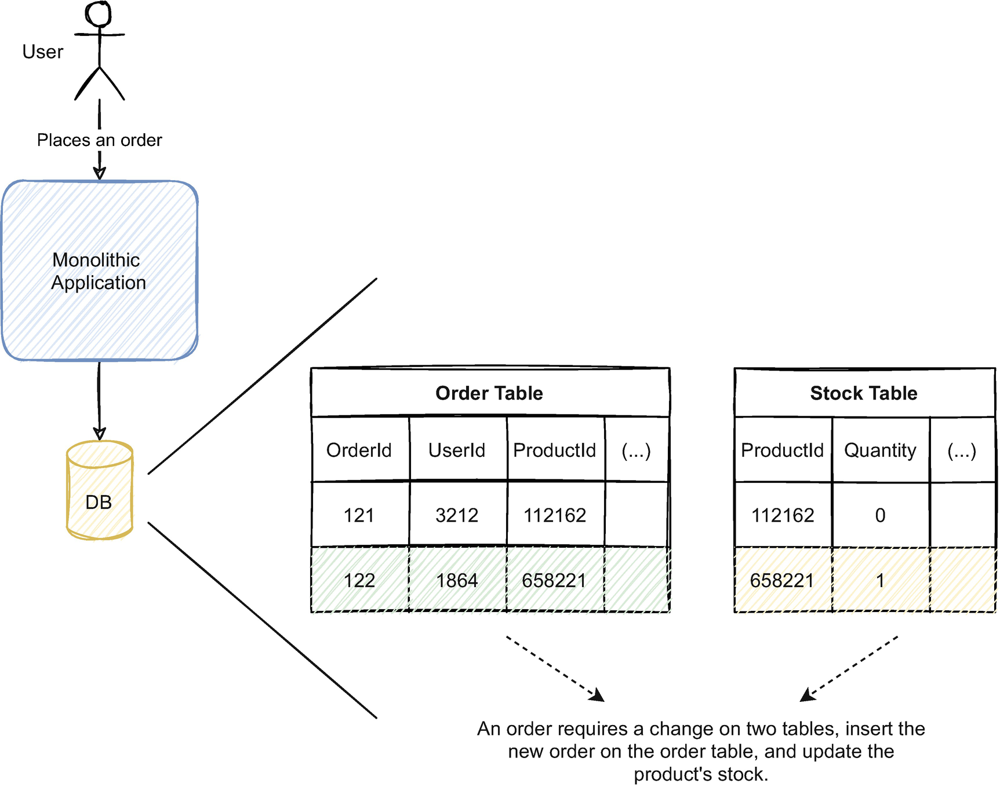

当用户请求新订单时，服务会在订单表中插入新行，并更新库存数量以反映该用户的订单。由于两个表都在同一个数据库中，我们可以使用它的 ACID 属性来保证两个更改同时发生或根本不发生，从而拒绝订单。更改完成后，每个请求它们的客户也可以立即使用它们。
通过转向分布式事件驱动架构，我们将单体应用程序解构为多个服务。我们还将划分单体数据库并在它们之间分配数据。图 4-2 说明了同一示例在事件驱动架构中的样子。

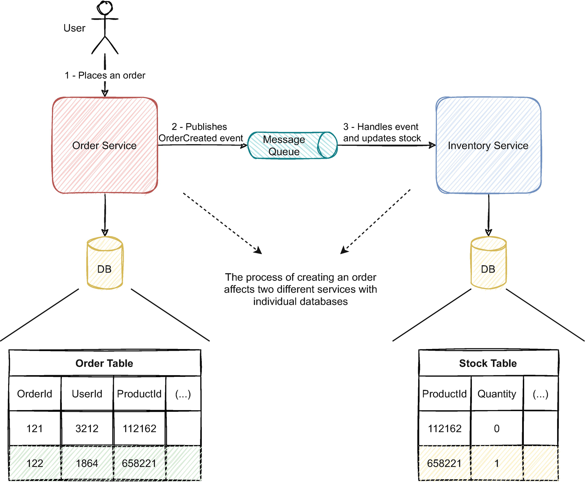


由于我们将订单和库存域分成两个不同的服务，订单和库存数据不再位于同一个数据库中。隔离带来了我们如何保证履行订单的强一致性的挑战。该示例仅说明了两个服务，但可能存在需要多个不同域交互的进程；例如，如果我们需要应用折扣、更改用户信息等，可能会影响多个不同的服务。当使用单个数据库创建订单时，我们可以简单地在每个需要更改的表周围包装一个事务，并且我们将确保所有更改都会自动发生。但是，对于分布式架构，我们不能有相同的保证。管理这些类型问题的替代方法是以增加复杂性为代价的，我们将在以下部分讨论。

### 4.1.1 首先为什么要从单体数据库迁移？

除了单体的局限性，我们在第 1 章中讨论过，为什么要放弃 ACID 提供的一致性保证？在需要强一致性的用例中，即使在分布式微服务架构中，我们也可能最好将这些数据保存在一起。 ACID 提供的强一致性只能通过将数据放在同一个地方来实现。在采用分布式解决方案时不要教条化；如果存在强一致性的关键用例，请考虑将数据维护在一起并从与之相关的属性中受益是否可行。然而，这是个例外；大多数用例可以忍受分布式系统所需的较弱的一致性保证；大多数情况下，只要系统性能良好，它们就足够了（我们将在第 5 章进一步讨论）。
在处理大量数据的用例中，我们可能无论如何都需要放弃 ACID 属性。我们在本章开头讨论的第三范式的纯度在现实世界中通常没有一席之地。中小型数据无疑从中受益，在这些情况下，我们通常会从根据这些原则设计数据库模式中受益。但是当面对海量数据时，我们很快就会面临其局限性。通常，对在第三范式下设计的数据库模式的查询需要不同表之间的多个连接。我敢肯定，我们都与过去使用大量连接调试给定的非性能查询有关。具有数百万条记录的表之间的大量连接需要硬件付出过多的努力。随着使用量的增加，我们很快发现我们需要更好的硬件。通常扩展关系 ACID 数据库的唯一方法通常是垂直扩展，这会很快变得非常昂贵。
处理这个问题的传统方法是什么？我们经常将分片和副本添加到我们的数据库中——副本与事件驱动架构一样受到复制滞后的影响，但在系统中并非如此。通常我们需要重写或做一些可疑的解决方法来承受复制延迟。为了解决慢查询问题，我们对数据进行了非规范化处理并优化了数据的持久化方式，以实现高读取性能。当我们将参照完整性和无重复性抛到窗外时，常常违背我们的内在价值观，这些价值观被刻在第三范式的属性中，我们说，“就这一次，这就是现实世界，有时我们必须放弃这些理论概念。”
由于对理论概念采取顽固的教条方法，我在过去看到了糟糕的实现，我猜你也曾见过它。有时在现实世界中，我们需要一种务实的方法来实施我们的解决方案。但是，由于缺乏深思熟虑的长期战略，这种“边做边做”的解决方案往往会失败。与其试图将性能和可扩展性融入并非旨在适合它们的解决方案中，并且只有当它们成为问题时，我们才应该将其作为我们创建的解决方案的一个属性来处理。
解构单体数据库是朝这个方向迈出的一步。在事件驱动的架构中，除了与将庞大的数据库划分为较小的数据库具有协同作用外，数据的焦点在事件流中，从而可以在不完全依赖数据库基础架构的情况下传播数据。我们确实获得了复杂性，我们可能会失去 ACID 提供的更强的一致性属性，但我们不会限制业务增长停止。如果你没有看到也从未预见到数据库是一个限制，那么你最好不要将其拆分。

### 4.1.2 分布式事务的局限性

当面临保证两个不同数据库之间原子性的挑战时，有些人可能会倾向于使用分布式事务。它们提供了一种对具有多个数据库的分布式系统进行推理的方法，就像我们使用单个 ACID 数据库一样。分布式事务通常使用 X/Open XA 标准 2 实现，该标准使用两阶段提交来确保所有事务更改的原子性。然而，两阶段提交协议并没有提供所有的 ACID 保证。它还具有多种故障模式，可能需要手动补偿并使数据处于意外状态。本小节将详细介绍两阶段提交协议的工作原理及其在分布式系统上的局限性。
两阶段提交协议通常使用两种类型的组件：事务管理器和参与者。事务管理器与参与者协调每个事务的协议实现。不出所料，该协议有两个阶段：投票阶段和完成阶段。在投票阶段，事务管理器与参与者进行通信以确认可以进行给定的更改。让我们使用我们在本节前面讨论的相同示例来说明这一点。图 4-3 描述了库存和订单表的情况。

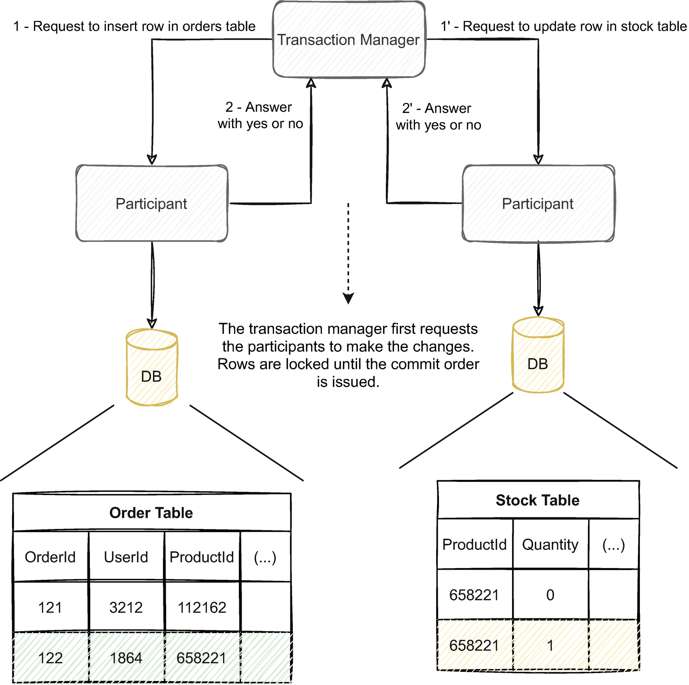

事务管理器请求订单和库存数据库参与者分别插入新订单行和更新现有库存行。如果其中之一做出否定响应，则事务中止。如果双方都积极响应，则事务管理器将进入完成阶段。
在完成阶段，事务管理器将要求双方参与者提交他们的更改，如图 4-4 所示。如果参与者由于某种原因无法提交他们的更改，事务管理器将不得不请求所有参与者回滚。回滚将撤消所做的任何更改或释放任何锁定的资源。事务以所有参与者通过成功提交或回滚更改来确认事务管理器的更改而结束。

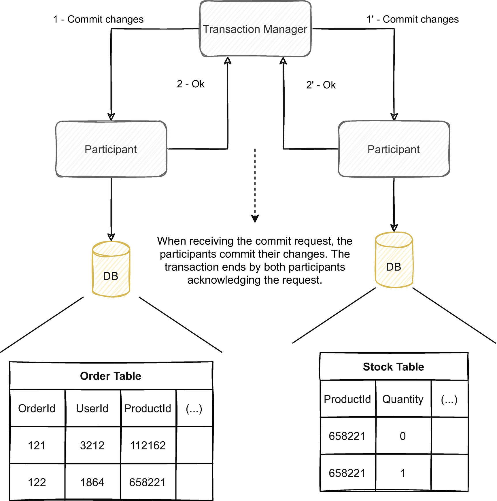

该协议提出了几个复杂的问题，并可能使数据处于意外状态。由于两个不同的进程处理两个提交请求，因此它们可能发生在不同的时间。所以我们不再有之前讨论过的 ACID 属性。例如，客户可以在不更新库存的情况下请求订单信息。
此外，由于这两个操作是单独发生的，因此在投票和完成阶段之间可以经过任意时间。并发请求可能会在事务运行时尝试更改相同的数据。例如，如果有人同时提交了同一产品的订单，则另一个进程可能会在事务仍在运行时尝试更改库存行。为了避免并发更改，参与者通常会锁定资源，直到事务结束。这意味着在事务发生时，所有其他访问相同数据的请求都必须等待。我们都知道与传统事务相关的性能问题，但是将它们带到分布式环境中，在那里它们容易受到网络条件和延迟的影响，可能会严重影响系统。两阶段提交协议适用于快速操作；他们花费的时间越长，数据被锁定的时间就越长。我们讨论的例子有两个参与者，但参与的参与者越多，交易所需的时间就越长。
易受网络条件的影响也开启了广泛的新故障模式。 Jepsen 是对许多流行数据库上的分布式一致性进行的一组测试和分析，在 Postgres 上做了一个分析 3，它使用了两阶段提交的特殊情况，并突出了其中的一些问题（YugaByte DB4 上还有另一个有趣的分析，它使用了基于两阶段提交的本土提交协议突出了类似的问题）。例如，在图 4-4 中，参与者必须向事务管理器确认提交。如果确认丢失，例如，参与者遭受网络分区（第 5 章中有关网络分区的更多信息），则事务失败。但是参与者可能已经提交了数据并且无法接收回滚请求，这可能导致意外结果并产生必须手动解决的无效状态。
两阶段提交协议的另一个问题是事务管理器。当多个不同的服务涉及多个事务时，事务管理器充当这些不同服务之间的协调器。事件驱动架构自然解耦，让我们能够构建独立的服务；让单个组件负责协调服务之间的同步操作是这种思维方式的倒退。分布式事务通常会引发比它们解决的问题更多的问题。正如我们在 4.1.1 小节中所讨论的，如果我们真的需要给定用例的 ACID 属性，我们通常最好将这些数据一起保存在一个提供 ACID 保证的数据库中。但是不要试图看到情况总是如此；大多数情况下，我们可以忍受较弱的一致性保证，我们将在第 5 章中讨论。

### 4.1.3 使用 Sagas 管理多步骤流程

我们讨论了限制以及为什么我们不应该使用分布式事务，但是有什么替代方案呢？业务流程通常跨越几个不同的服务。当涉及多个服务时，我们如何保持这些流程的一致性？本小节将讨论 Sagas 如何成为分布式事务和协调同步锁的替代方法。
Hector Garcaa-Molrna 和 Kenneth Salem 在一篇论文中首次引入了 Sagas，他们建议使用 Sagas 来管理长期交易。该论文主张使用较小的短期交易作为长期交易的替代方案。我们可以为更广泛的操作的每个步骤使用较小的事务，而不是持续相当长的时间的单个事务，从而最大限度地减少受锁定影响的数据量。
Sagas 是一系列单独的操作，用于管理长期运行的业务流程。在分布式架构中，Sagas 的每个操作都由不同的服务执行。在事件驱动的架构中，服务通常通过事件进行编排或编排，以实现更大的业务流程。业务逻辑本身位于服务内部；每个服务都将管理和验证自己的域。我们为业务流程的每个步骤定义了一个补偿措施。假设给定的服务由于技术或业务原因未能执行该操作。在这种情况下，Saga 当前完成的步骤将执行补偿动作，使系统处于稳定状态。
当与 DDD 一起使用时，Sagas 管理跨不同有界上下文之间的多个聚合的操作。当聚合受到不同域的事件影响，我们需要将其转换为命令时，通常将其视为 Saga。影响多个聚合的操作也通常被视为 Saga。尽管 Sagas 可用于反映对多个聚合的更改，但最常见的用例是管理多个有界上下文之间的长期业务流程。
Saga 的每个操作都单独且独立地发生。这意味着整个 Saga 不是 ACID 交易，也不享有其保证。随着 Saga 完成其步骤，即使在整个过程完成之前，每个步骤应用的更改也立即可用。如果所讨论的数据库支持 ACID 保证，则每个步骤都可以具有强一致性保证并且在事务的上下文中。
Sagas 整体上并不是高度一致的，但它们提供了一种理解和建模业务流程的方法，我们可以在出现问题时采取行动。如果以下步骤之一失败，我们可以触发 Sagas 的每个步骤的补偿动作。这样，当给定的步骤失败时，我们可以保持整个过程的一致性。让我们用一个例子来说明。图 4-5 描述了一个订单提交流程的示例。

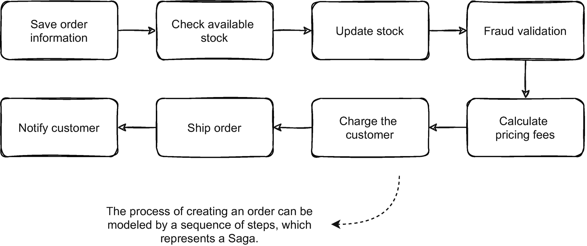

Saga 中的每一步都可能映射到特定服务或不同边界中的操作。 例如，订单服务可能负责保存订单信息，但检查可用库存并更新它可能是库存服务的职责。
在单体方法中，图 4-5 中的示例可以使用单个事务来实现。 如果一个步骤失败，整个事务将回滚并保持一致性。 使用 Saga，我们必须为每个相关步骤实施补偿操作。 回滚过程有自己的工作流程，具体取决于失败的阶段。
图 4-6 说明了此工作流中的回滚示例。 假设系统正在处理的订单在欺诈验证步骤中失败。 前面的步骤已经完成； 例如，库存已经发生变化。

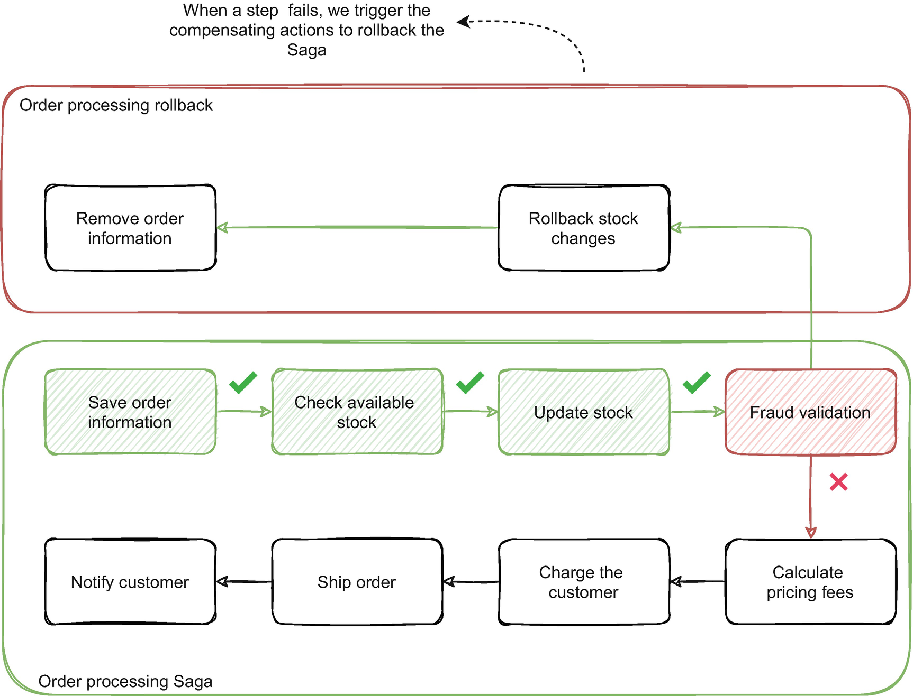

我们怎样才能回滚这个过程？为了保持系统的一致性，我们将触发回滚过程，该过程将对每个需要执行的步骤进行补偿。在这种情况下，欺诈验证步骤的失败将触发两个补偿操作，以撤消第三步发生的库存变化并删除第一步发生的订单信息。
无状态和幂等操作，例如验证可用库存和计算定价费用的步骤，处理起来更直接，因为不需要状态回滚。我们设计 Saga 步骤的顺序也很重要。根据我们对工作流建模的方式，回滚过程可能或多或少复杂。例如，如果欺诈验证是第一步，我们就不需要采取任何补偿措施，也不需要回滚过程。在对 Saga 建模时，一个重要的考虑因素是考虑流程以及我们如何最大限度地减少回滚的机会以及我们需要执行的补偿操作的数量。
一个重要的考虑因素是什么样的原因会导致一个步骤失败。如果由于域验证或业务规则而失败，则补偿操作将足以使系统恢复到可靠状态。但是，如果步骤可能由于技术原因而失败，例如，如果给定的服务离线或无法访问，则可以询问当回滚过程失败时我们应该做什么。例如，在图 4-6 中，欺诈验证失败后，如果库存服务无法访问或由于网络问题，或者无法访问其数据库，或者由于错误而无法执行操作怎么办？我们无法撤消 Saga 初始步骤所做的库存更改。
使用事件驱动的服务以及它们在系统中的自然解耦和异步特性提供了一种对瞬时故障更具弹性的方法，并使我们能够构建更多的防故障流程。重试操作更容易，即使重试失败，事件也会持久化在事件流中。如果我们需要重新处理给定的动作，只要事件处理是幂等的，我们就可以重试相同的事件。在同步进程中，Saga 可能会挂起，直到重试工作或可能需要临时进程来重试 Saga。事件流的异步性质自然地为系统提供了一种在处理工作流或将故障级联到其他组件时继续响应而不会阻塞的方法。我们将在第 7 章进一步讨论弹性消息处理。

## 4.2 事件驱动的编排模式

在 4.1 节中，我们讨论了如何使用 Sagas 对需要多个独立服务干预的业务流程进行建模。 传奇通常有两种变体：精心编排或编排。 在本节中，我们将讨论如何使用编排来实现业务流程。
编排使用主要组件来管理流程的步骤。 该组件指示其他服务启动流程中的新步骤，并在需要时触发补偿操作的启动。 它的工作方式很像监督整个过程并将操作委托给下属服务的主管。
让我们使用我们在第 4.1 节中讨论的有关订单处理的相同示例。 图 4-7 说明了我们如何使用编排模式对该过程进行建模。

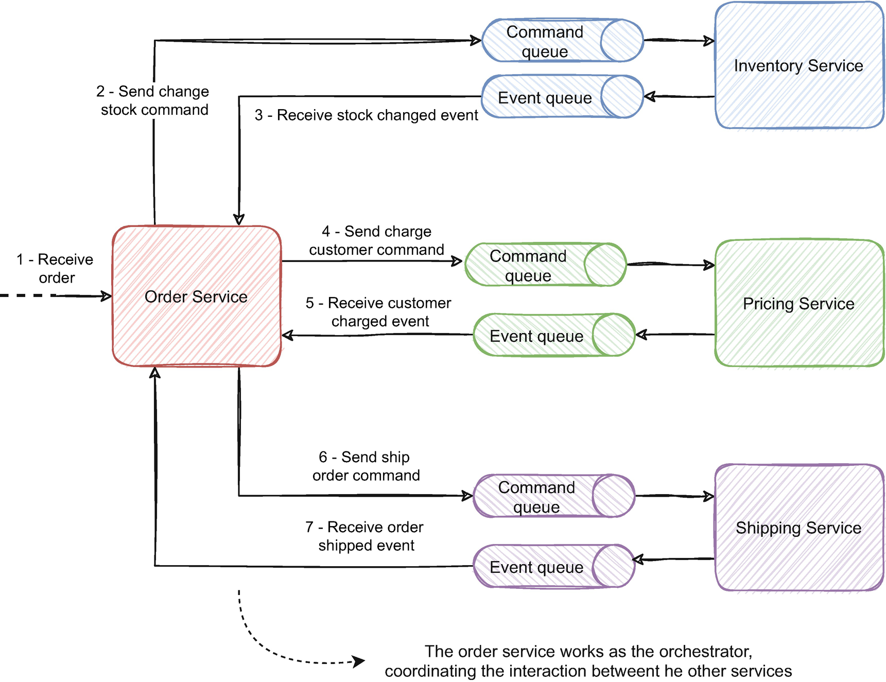

在此示例中，订单服务承担协调者角色并协调其他三个服务之间的更改：库存、定价和运输服务。在 4.1 节中，我们对图 4-5 中描绘的订单处理 Saga 进行了建模。工作流的第一步是接收订单提交请求。订单服务将处理请求并与其他服务协调以完成流程步骤。
这种模式可以通过向每个服务发送订单创建事件来实现，而不是发送命令。但是事件不会被发送，它们会被发布，并且服务会对它们做出反应。如果我们想改变另一个服务或域，我们应该用命令而不是事件来反映（正如我们在第 3 章中详述的）。如果我们使用一个事件，我们很可能会陷入被动攻击事件的反模式。
请注意，我们还将几个步骤合并为一个操作（这不仅仅是因为绘制图表更简单，尽管这是一个问题）。尽管我们可能会在概念上对每个步骤的订单流程进行建模，但我们可能希望在实现它时合并其中的一些。例如，如果检查和更新库存是两个不同的操作，则同一产品的两个订单可能同时通过验证。由于这两个操作都属于库存有界上下文，我们可以用一个命令来实现它们。
库存业务相互关联，但如果我们有其他业务面临同样的挑战，我们无法合并怎么办？如果订单服务必须验证库存，然后请求更改库存，则可能会导致订单没有库存的产品。我们可以通过触发补偿动作来触发错误并回滚过程，如第 4.1 节所述，但这是针对技术问题的设计解决方案。这是一种选择，但补偿操作通常更适合撤消域问题；例如，客户没有足够的钱进行购买。我们将在第 5 章和第 6 章探讨最终的一致性和并发问题。
服务之间的交互是完全异步的，并且该过程随着来自每个参与者服务的事件的异步处理而推进。订单服务请求库存变更；一旦它们被处理，库存服务就会发布一个事件来表示这些变化，订单服务使用它来推进下一步，请求定价服务以相同的方式向客户收费。与其他服务发生相同的交互，直到完全处理订单。
这种模式的一个强大优势是能够轻松监控进程的状态，因为只有一个服务负责管理它。仅通过查看订单服务就可以直接了解每个订单的当前步骤和结果。用订单业务流程的逻辑也很容易推理；只需分析订单服务，我们就可以快速对流程有一个高层次的了解。
这种模式中的陷阱是将编排器构建为所有流程逻辑的聚合器。代码往往有引力；它将更多的代码拉向它。你添加的越多，它拉的越多。坚持下去，你可能最终会得到一个整体。这些类型的编排器服务通常成为包含新功能的快速解决方案，有时属于其他地方的功能。
每个服务负责维护其业务规则和域的一致性。队列提供的解耦促进了这一点，但重要的是在适当的领域中包含新的发展。订单服务仅请求将更改反映在该域中，并没有明确说明该域应该做什么。例如，它指示定价服务向客户收费，但只有定价域知道国家的税收、适用于客户的折扣以及有效的付款方式。拥有一个管理工作流的核心部分提供了一个诱人的组件来添加否则属于其他域的逻辑。
管理这种情况的一种方法是使用类似于 Cassandra 用于管理写入的方法。 Cassandra 是一种流行的 NoSQL 数据库，它使用协调器节点概念，而不是像 SQL Server 或 MongoDB 那样具有典型的主从拓扑。主从拓扑要求所有写入都通过主。在 Cassandra 中，任何节点都可以通过协调对保存数据的节点的写入来处理写入。
我们可以通过让不同的服务管理不同的业务流程来使用相同的概念。在订单服务中包含订单履行流程是可以理解的，因为订单的工作流程通常与订单域密切相关。例如，通过遵循相同的推理，我们可以将定价费用业务流程的更新包含在定价服务中。拥有一个处理每个工作流或大量工作流的中央不可知协调器是一种反模式，我们需要避免这种情况。陷入这种反模式将很快把我们带到分布式单体应用，在那里我们对单体应用和分布式系统的缺点感到绝望。
如果任何服务未能处理，该服务将发送一个事件来表示该失败。在这种情况下，订单服务将处理该事件并触发任何相应的补偿操作。
同步进程会等待每个服务的响应来完成进程。即使我们实现了作业风格的处理（有一个不时检查进程状态的作业），协调器也必须轮询服务以了解它们何时完成操作。此过程的完全异步性质使通过将负载分配给相关服务来管理负载变得更容易，从而更容易扩展需要扩展的系统部分。队列也将吸收增加的规模；负载峰值只会通过滞后的增加反映在系统中。流程也更加有机，因为不涉及池化，并且协调器通过对服务发布的事件做出反应来管理进度。
对于需要中央主管的复杂流程，这种模式是一个有趣的解决方案；但是，我们需要注意不要陷入无法衡量的协调器的陷阱。小而琐碎的业务流程几乎不会从编排中受益。通常，没有编排逻辑的核心部分有助于鼓励领域逻辑的分布和事件驱动架构的有机演进。

## 4.3 事件驱动的编排模式

在上一节中，我们讨论了如何使用编排对复杂的业务流程进行建模。在本节中，我们将讨论作为编排的替代方案的编排。我们将详细说明我们之前讨论的订单处理示例如何使用编排。
使用编排时，所涉及的服务相互反应以完成步骤序列。业务流程是自主协调的，而不是像编排一样告诉他们要做什么的核心部分；一旦服务完成其操作，每个服务都知道该做什么。与主管将任务委派给下属服务不同，服务本身通过对前一服务的事件做出反应来知道何时执行它们的任务。这种模式的基础比前一种更接近事件驱动的思维方式，因为事件的有机流动没有指挥中心部分。
图 4-8 说明了使用编排方法的相同订单履行流程。没有管理事件工作流程和监督流程进度的中央组件。相反，每项服务都会对生态系统中发生的变化做出反应，以实现其目的。

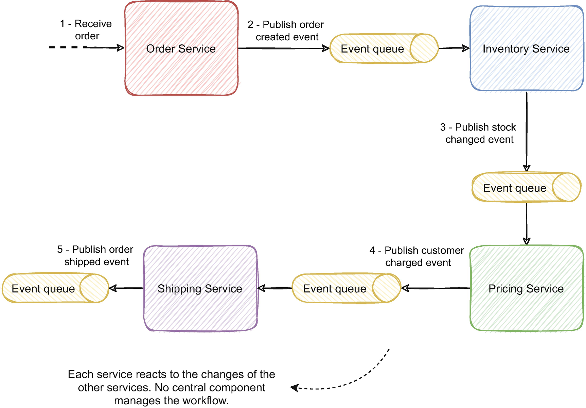

保存信息后的订单服务发布一个事件，宣布订单已创建。库存服务对此事件做出反应并更改库存。一旦库存发生变化，定价服务就会对库存变化事件做出反应，以计算定价费用并向客户收取费用。最后，一旦向客户收费，定价服务就会发布一个事件，运输服务将使用该事件来运送订单并完成流程。
如果出现问题并且我们需要回滚进程，则来自未能处理的服务的事件将触发其他服务的补偿操作。例如，如果定价服务确定这是一个欺诈订单，它会发布一个事件，表明流程失败，库存和订单服务会对此做出反应，触发他们自己的补偿行动。
这种方法解决了我们提到的将逻辑集中在一个地方的问题。由于没有中央编排器，逻辑自然分布在整个服务中。使用编排，当我们以一种或另一种方式实现新功能时，管理编排器服务的团队最终会影响其他域的行为，通常严重偏向于自己。编排通常会根据每个领域的重要性促进领域的发展，而不受中央流程经理的影响。
这种方法的一个警告是我们不再有一种直接的方法来理解工作流程。通过编排，我们可以通过仅分析编排器来跟踪工作流的每一步。通过编排，工作流嵌入到每个服务的行为中。事件队列提供的解耦也使这个过程变得困难。这是事件驱动架构的主要关注点之一；高度解耦的性质阻碍了对事件流高级流程的理解。我们将在本章后面详细介绍解决这个问题的策略。
补偿操作可能更难实施，因为每个服务都必须实施或应对工作流中的每个新步骤或更改。例如，如果我们添加一个新的最后一步来管理新服务中的订单退货，其他服务也需要对新域的故障做出反应（如果适用)。另一方面，它促进了对每个领域独立推理的思维方式；在订单退货时，库存域应该如何反应？它促进了关于这种变化如何影响每个域的讨论，而不是将该责任委托给协调器。
编舞的另一个主要问题是了解每个 Saga 的当前状态的能力。通过编排，如果我们需要知道订单流程处于哪个步骤，我们可能会在编排器中实现该功能。由于它监控每个步骤和整个工作流程，因此了解每个订单流程步骤将很简单。有了编舞，就没有突出的地方来获得每个状态。一种解决方案是侦听每个服务发布的每个事件，并将它们具体化到聚合视图中，如图 4-9 所示。

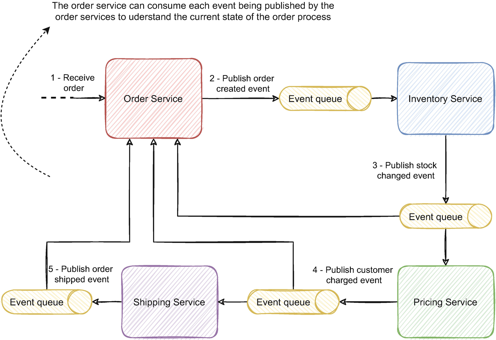

该示例显示了侦听每个事件的订单服务，但可以是一个不同的单独服务来使用事件并将它们具体化为一个视图。处理事件和实现状态的组件可能必须了解更高级别的工作流，但不会像协调器那样管理它。使用这个解决方案仍然是编排，但绝对有两种方法之间的中间感觉。
更简单的流程不会因为此解决方案的警告而受到太大影响。随着工作流程变得越来越复杂，处理这些缺点的难度就越大。整体编排往往是事件驱动架构中的一种常见模式，并且与它的思维方式很好地协同作用。这些警告可以通过我们在本书中进一步讨论的方法来解决。但是，如果我们的需求需要一个中央组件来管理流程并保持其状态，那么编排方法可能更适合。

## 4.4 事件驱动的微服务：编排、编排，还是两者兼而有之？

在 4.2 和 4.3 节中，我们详细介绍了编排和编排的工作原理以及我们如何应用它们。但是我们应该只坚持一种方法吗？本节将讨论它们在事件驱动架构中的典型实现方式以及它们如何共存。
在事件驱动架构中，我们通常使用编排，因为它自然适合事件驱动的思维方式。我们将事件发布到事件流，应用程序插入这些流以访问数据。采用事件驱动架构的一个主要好处是它们提供的高度发展的性质和解耦属性。通常，业务流程没有中央协调器。缺乏中心部分避免了集中在一个地方的逻辑，并且不会危及这些好处。
当我们不断向架构添加功能和新服务时，协调器通常会变得更加复杂。随着我们增加更多的人和更多的团队，我们慢慢开始在协调器中应对单体应用的挑战。没有中心部分可以缓解这些问题并使域自然增长。它让团队可以自主决定什么最适合他们的领域并自主交付功能，而无需处理中央共享部分。
边界外的协调器，协调它们之间的变化，可能会增长并可能使边界服务的域贫血。在每个边界中使用不同的组件作为不同业务流程的协调器可以帮助解决这个问题。尽管如此，这也意味着不同的来源会对实体进行更改，这可能难以管理。编排器通常会遇到与 ESB 相同的传统 SOA 通常会遇到的困难。你可能还记得，我们在第 1 章中讨论了 SOA 和 ESB。通常，ESB 是集中业务逻辑的地方，并且随着我们添加越来越多的功能而增长。 Orchestrator 是集中逻辑并提供贫乏的卫星服务的好地方。
根据用例，编排通常往往是事件驱动架构的标准。 随着边界的增长，管理中心部分可能会出现问题。 然而，这并不意味着编排在其中没有一席之地。 将其应用于更本地化的上下文通常很有用，例如，在边界内。 图 4-10 举例说明了这种情况。

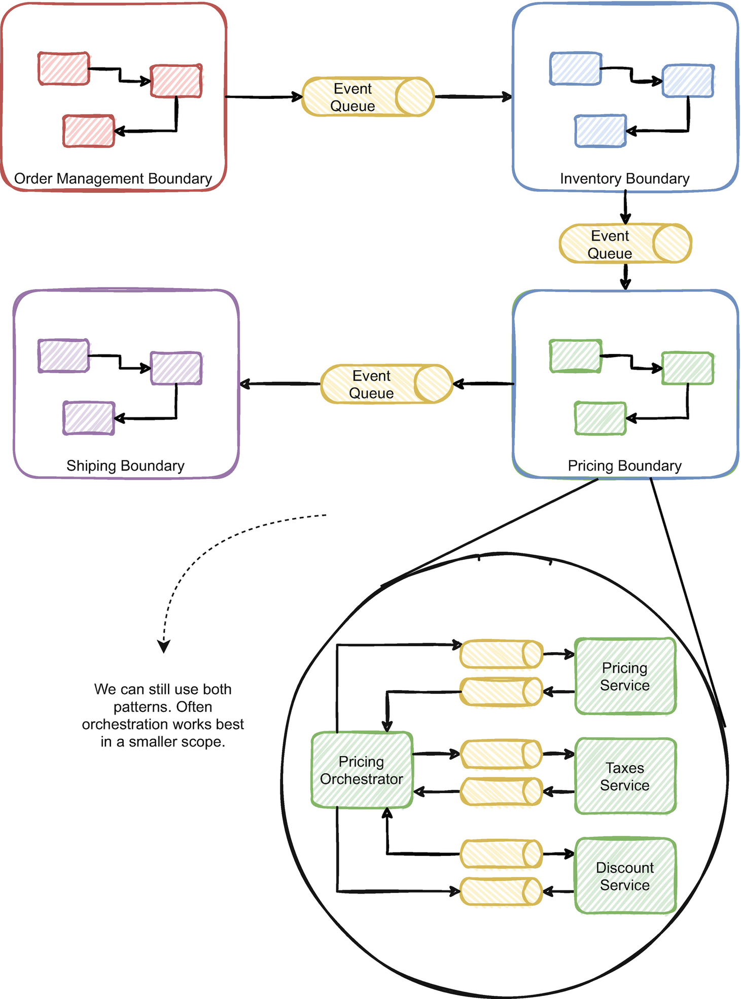

图 4-10 展示了我们之前讨论过的相同示例，但不是单个服务，而是每个有界上下文由多个服务组成。我们在每个边界之间使用编排，但在边界内，我们可以应用编排，如定价边界所示。更广泛的高级流程使用编排，但为了管理更小范围和更本地化的流程，我们可以使用编排，如定价计算。
这个用例只是一个例子，但推理的主线是默认使用编排并在更高级别的流程中使用编排，并在有限的范围内应用编排。这种方法允许服务之间的高度解耦，并在涉及多个团队的更高级别上实现团队的自治。并且它在较小的范围内使用编排，其中涉及少数人并拥有发布功能的自主权，而不会影响多个领域。

## 4.5 事件驱动架构和相关模式中的数据检索

到目前为止，我们描述了事件驱动架构的工作原理，并在第 3 章中简要提到了查询作为这些架构的常见工件。但是，我们没有详细说明如何提供由事件驱动的查询功能。查询是大多数应用程序中向用户或其他服务提供数据的常见要求。基于 CRUD 的服务简单地查询数据库并同步返回请求的数据。事件驱动架构为传统方法增加了一层复杂性，因为数据分布在多个服务中并且可能最终保持一致。在本节中，我们将描述与事件驱动方法很好地协同作用的常见模式。
第 2 章讨论了如何从单体架构转变为分布式事件驱动的微服务架构。我们讨论了如何将单体拆分为多个服务以及如何解构数据库；与每个域相关的数据已移至相应的服务。当在单体和单体数据库中时，所有数据都集中在同一个地方，从实现的角度来看，获取和连接数据很简单。典型的单体平台只是通过 REST 或 SOAP 等同步 API 公开信息。这种方法可以说是最常见和最直接的方法。然而，它受到我们在第 1 章中讨论的所有缩放限制的影响。
通过解构单体应用及其数据库，我们现在面临着一个挑战；我们如何获得数据的聚合视图？我们有一套独立的服务，每个服务都拥有自己域的数据；每个服务将只能返回有关其域的信息。例如，图 4-11 说明了四种不同的服务； UI 需要列出一个页面，其中包含所有可用产品及其当前库存和价格。

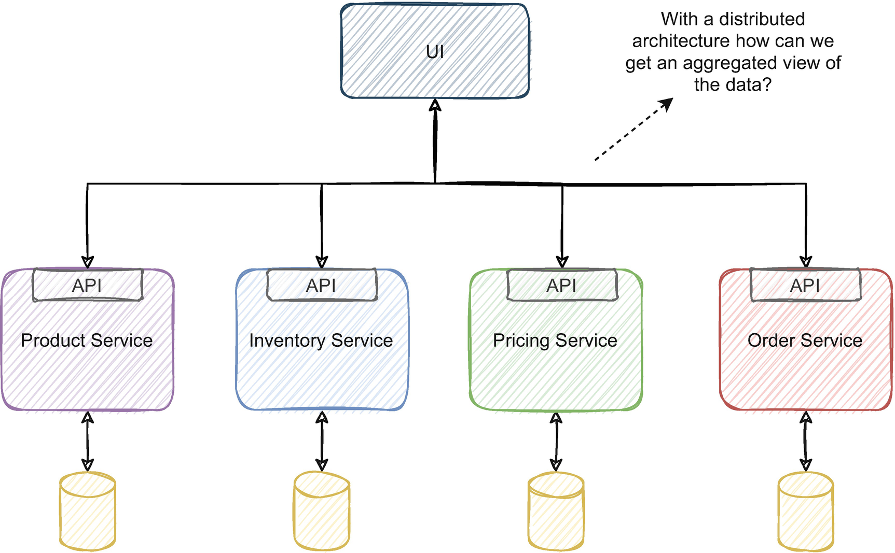

解决这一挑战的一种可能方法是使用与图 4-11 中所示相同的策略。 UI 应用程序可以从每个服务中获取信息并将其合并并显示在 UI 中。这种方法通常称为 API 组合模式，它可能是我们首先想到的解决方案。
这种方法有严重的局限性；正如你可以想象的那样，当我们处理大量数据时，这种方法很快就会出现问题。如果我们需要显示包含所有产品的列表页面，假设有数百万个产品（尽管少很多可能足以使应用程序陷入困境），UI 可能需要将数千个这些项目加载到内存中。想象一下，如果用户需要过滤所有有库存的产品并从最低价格到最高价格订购，这是大多数电子商务网站的标准功能。支持此类查询的 UI 应用程序可能必须从每个服务中获取数千条记录并在内存中对其进行过滤，以通过过滤、排序和分页来显示准确的记录。如果多个用户同时执行此操作，应用程序可能会面临性能开销和内存限制的问题。
API 组合可能与小数据集相关，并且对于某些用例可能是一种廉价的解决方案（尽管人们可能会问我们是否使用小数据集，为什么我们仍然使用分布式架构？）。即使对于一种产品，也意味着对不同服务的三个请求。额外的请求可能会在 UI 中产生性能开销，并可能导致糟糕的用户体验。大规模数据和复​​杂搜索需要不同的方法。
在本章的开头，我们讨论了如何在性能祭坛中牺牲第三范式的值，以及如何为特定查询需求创建非规范化模型。具有持久事件流的事件驱动架构提供了一种可持续的方式来实现这一点。由于每个事件即使在消费后也很容易获得，我们可以使用这些事件来丰富服务的信息。
我们先来看一个典型的同步查询实现。图 4-12 展示了一个服务，即产品服务，它公开了一个 API 供消费者使用。其他应用程序可以使用该 API 来更改服务的数据或从服务中检索信息。

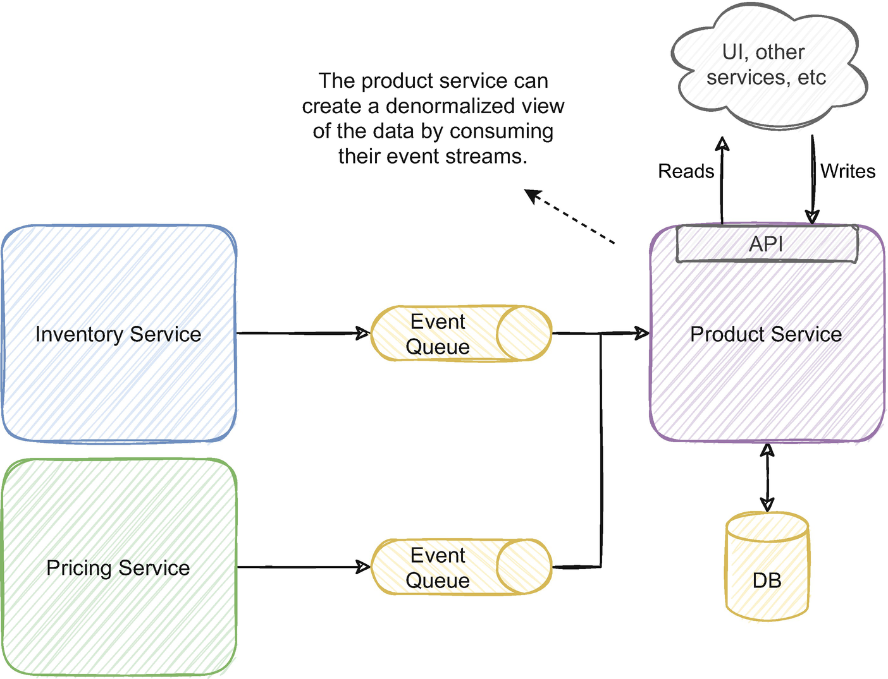

在分布式事件驱动架构中，它并不那么简单，因为不同的服务拥有不同的数据。图 4-12 中的示例处理来自事件队列的事件，以使用服务不持有的附加数据来丰富其读取模型。例如，产品服务可能拥有与产品相关的所有数据，但库存信息可能在不同的服务中进行管理。就像 UI 上的产品列表页面一样，对产品服务的查询可能需要每个产品的库存信息。产品服务可以通过处理库存服务发布的事件的库存信息来丰富其信息，因此事件队列。
继续我们在图 4-11 中讨论的示例，产品服务可以通过处理库存和定价事件来创建数据的非规范化视图，其中包含 UI 要求所需的所有信息。过滤和排序实际上是可行的，因为有一个持久的非规范化模型。

### 4.5.1 CQS、CQRS 以及何时使用它们

一个有趣的模式通常与这种方法具有高度的协同作用，并且通常与 DDD 一起被提及，是 CQRS（命令查询职责分离）。 CQRS起源于CQS（命令查询分离），人们在区分这两种模式时通常会混淆；阅读完本节后，希望你不是其中之一。本小节将详细介绍这两种模式，我们可以从它们中受益，以及如何在我们之前讨论的同一产品列表示例中应用它们。
Bertrand Meyer 在他的书 6 面向对象的软件构造中阐述了 CQS。这个原则表明方法可以是查询或命令，但不能同时是两者。查询返回一个值但不改变状态，命令改变状态但不返回任何值。基本上，问并没有什么坏处，如果你不问，就不要说。
CQRS起源于CQS并引入了细微的变化； CQRS 实体分为两个主要概念，命令和查询。在代码中明确区分对象很方便，因为我们可以随意使用查询；我们确信他们不会改变状态。使用命令时，我们可以更加小心地使用它们。找到更改状态的代码路径和检索状态的代码路径也更容易。 CQS 可以是在特定服务中本地应用的一种有价值的方法，整个组织有助于更好地推理服务，尤其是在使用 REST 等协议的 API 中，其中有明确的检索（GET、HEAD 等）和更改（POST）操作、PUT、PATCH 等）状态。我们可以实现独立的读写路径，这有助于服务的组织。
然而，CQRS 通常与体系结构的观点相关联，而不仅仅是在代码中。我们可以更进一步，将命令和查询分离到不同的组件中。我们可以有两种不同的服务，一种只处理命令或状态变化，另一种只处理只检索数据而不更改数据的查询。图 4-13 说明了我们之前讨论的产品服务示例在应用 CQRS 时的样子。

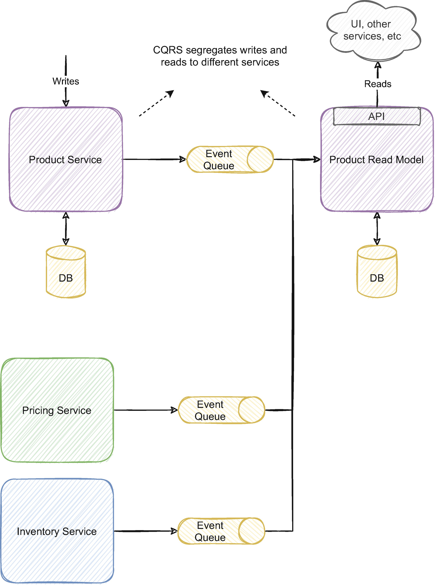

在架构级别应用 CQRS 时，我们将写入隔离到一个独立服务，将读取隔离到另一个独立服务。产品服务处理可以从 API 或命令队列完成的写入。产品读取模型通过 API 处理读取和公开数据。读取模型还处理来自定价和库存服务的事件，以丰富其模型并能够执行我们之前提到的复杂搜索。但是我们从中得到什么好处呢？
拥有单独的读取和写入模型使我们能够针对每个目的专门化每个模型。我们在读取时返回的对象，传统上称为 DTO（数据传输对象），通常被建模为需要它的用例，例如 UI。该模型可能与概念域模型有很大不同，概念域模型通常由域概念（DDD 中的聚合）建模，并考虑到性能和事务问题。通常，查询需求最终会对领域模型设计产生负面影响。通常，还需要在两者之间进行映射，根据它们之间的差异，映射可以或多或少复杂。通常，两个模型都使用相同的模型，结果两者都做不好。每个都有一个单独的模型，我们消除了相当一部分的麻烦。
在本章前面，我们讨论了由于数据的非规范化而需要放弃第三范式。第三范式最大限度地减少了数据重复，这实际上有利于写入。由于我们有两个独立的模型，我们可以将第三范式应用于写入端并在读取端对数据进行非规范化。
拥有两个不同数据库的两个独立模型还允许我们针对每个目的优化模型和技术。写入端可以有针对写入优化的数据建模，例如，事件溯源（我们将在接下来详细介绍事件溯源），它基本上是一个附加日志，使用针对写入优化的技术实现最小锁定。我们可以在读取端对模型进行非规范化，并使用一种为快速复杂搜索而构建的技术（例如 ElasticSearch）。
新功能和新查询要求也可以更容易实现。例如，如果我们需要启动具有不同模型和查询需求的新 UI，我们将只更改读取模型服务。该更改不会影响处理写入并具有域逻辑的服务。
一致性也可能是这种方法的一个因素。通常，由于域验证以及需要将一致的数据写入数据库，写入端具有更强的一致性要求。读取端通常对较弱的一致性保证（如最终一致性）更为宽容。除此之外，大多数应用程序往往表现出读取密集型行为；读取次数远远超过写入次数。为每一方提供单独的服务使我们能够独立地优化和扩展每一方。
何时使用 CQRS？
CQRS 不是灵丹妙药，也不应该应用于每个用例。它意味着更多的移动部分并增加了解决方案的复杂性。将写入与读取分开，中间有一个事件队列，这意味着读取端也最终是一致的，如果它不是的话。那么我们什么时候应该使用 CQRS 呢？
不出所料，使用 CQRS 与采用事件驱动架构具有相似的动机。通常，简单直接的域通常不会从中受益。将一些小而简单的东西分开并没有什么好处。通常，不接近业务核心且没有足够复杂性或变化过于频繁的领域不会从中受益。
一个通常不会改变并且需要强一致性保证的小规模的简单域是不应用 CQRS 的一个很好的候选者。我体验过包含少量数据的简单服务，其中团队应用了 CQRS，这只会增加架构和业务的混乱。简单的服务通常更适合使用传统的 CRUD 方法。
在决定采用 CQRS 时，有充分的理由这样做很重要。我们之前列出的一些好处可以说是强有力的理由，例如，如果我们有一项服务，其中读取远远超过写入，并且我们需要进行差异化扩展。拥有与复杂读取模型完全不同的概念写入模型也可能是一个很好的理由。
使用事件驱动架构，你可能会拥有某种 CQRS 或至少一个非规范化模型，用于聚合来自不同地方的信息。例如，我们在与产品服务讨论的示例中的查询需要，我们需要合并来自各种来源的数据，以便为业务提供有意义的搜索。当我们需要构建一个类似的读取模型时，一个好的方法是应用我们在 CQRS 中学到的知识，了解在单独的服务中构建它是否有意义，以及 CQRS 的好处是否与我们的用例相关。图 4-12 和 4-13 显示了两种不同的方法；我们可以问一些问题来帮助我们了解 CQRS 是否有意义。例如，通过合并同一服务中的所有内容，我们是否污染了产品域模型？来自其他来源的事件数量是否足以证明独立缩放的合理性？搜索是否会受益于我们目前在产品服务中使用的不同技术？
这些只是我们在应用 CQRS 时应该问自己的一些问题。总体而言，它与事件驱动架构具有很高的协同性，在某些用例中很有价值。但是我们应该始终质疑收益是否大于复杂性开销。

### 4.5.2 CQRS 的不同风味

在上一节中，我们讨论了 CQRS 是什么以及如何应用它。我们讨论了它的优点以及何时应该使用它。在我们讨论的示例中，我们使用两个不同的数据库创建了两个不同的服务。此解决方案不是应用 CQRS 的唯一方法，我们将在本节中讨论一些中间替代方案。
CQRS 从根本上讲是将读取与写入分离。在图 4-13 的示例中，我们创建了一个独立的写入服务和另一个读取服务。这种方法是最灵活和最复杂的。它在事件驱动的架构中很有意义，因为该方法的大多数缺点已经包含在架构中。例如，最终一致性通常是大多数事件驱动服务的副产品，需要一致地解决（没有双关语）。事件的并发性和排序挑战在不面向事件的架构中可能难以解决，但已经成为现实，我们可能已经制定了解决这些问题的策略。
然而，这不是唯一的方法。例如，CQRS 并不要求我们为每个服务都拥有一个单独的数据库。图 4-14 在我们之前讨论的产品服务的同一示例中说明了 CQRS 的替代实现。

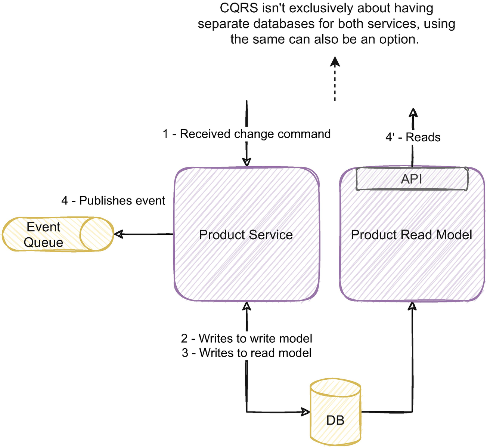

每次我看到两个独立服务共享同一个数据库时，我都会遇到创伤后压力闪回。但是以这种方式应用该模式是有好处的。拥有两个独立数据库的一个麻烦问题是相关联的最终一致性。我们将在第 5 章讨论处理最终一致性的策略，正如我们之前讨论的，大多数查询需求往往是宽松的、较弱的一致性保证。较弱的一致性保证通常适用于 UI。最终一致性并不新鲜，也不是由事件引入的。缓存是最终一致性的一种形式，我们彻底应用它。但是，当另一个服务需要查询最终一致性模型并获取陈旧数据时，它将根据该陈旧数据执行其业务逻辑，从而导致错误结果。
例如，在图 4-13 中，有一个定价服务也在侦听产品服务发布的事件，并且需要在每次收到事件时从读取模型 API 请求附加信息。如果产品读取模型尚未处理定价服务正在处理的相同事件，它将返回陈旧数据。返回到定价服务的数据与定价服务收到的事件不匹配。
使用图 4-14 中描述的方法，我们可以在发布事件之前更新写入和读取模型；这将解决事件和 API 响应之间的不一致。使用这种方法，我们仍然可以独立扩展读写端（尽管不是数据库）。我们必须在两个服务中使用相同的数据库，这对于管理架构更改可能是一个挑战。当写入和读取模型之间存在密切关系时，这种方法可能是一个不错的选择。如果存在读取模型侦听来自不同来源的事件的情况（如图 4-13），我们可能会从更灵活的选项和更实质性的隔离中受益更多。
还有其他选择；我们不能有两种不同的服务，只有一种服务，并且只能在代码中严格隔离读写。在频谱的另一端，我们可以有第三个服务来处理对读取模型的写入（一个服务写入写入模型，一个写入读取模型，一个从读取模型读取）。在最后一个选项中，我很少看到利大于弊。
与大多数解决方案一样，这完全取决于权衡。主要目标是让你在你的工具箱中拥有这些工具，并能够做出相应的决定——拥有高度灵活的高度复杂的解决方案更合适，还是不太灵活的不太复杂的解决方案更合适，或者根本不使用 CQRS。

### 4.5.3 何时以及如何使用事件溯源

通常与 CQRS 和 DDD 一起提到的典型模式是事件溯源。 事件溯源也是应用于事件驱动架构的一种有趣模式，因为它与事件驱动的思维方式具有高度的协同作用。 本小节将详细介绍事件溯源、它的好处以及如何以及何时应用它。
让我们看一下我们之前讨论过的产品服务的同一个例子。 当存储在关系数据库中时，产品信息可能类似于图 4-15 中所示的内容。

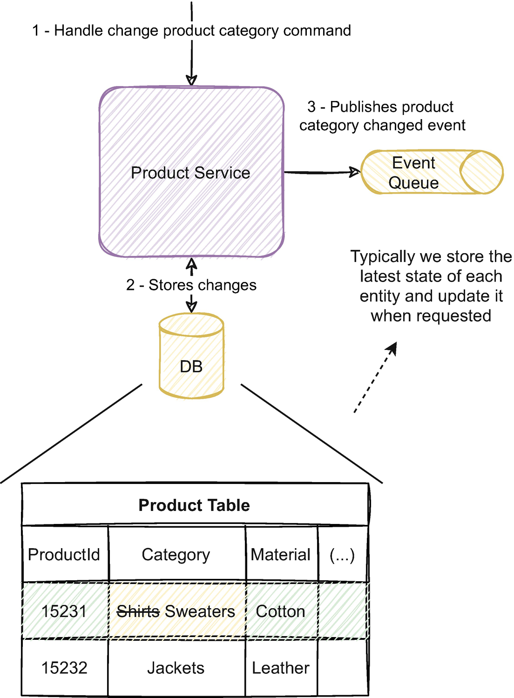

产品服务处理更改实体（在此示例中为产品 15231）的命令，更改数据库中的信息，并发布一个事件，表明产品更改了其类别。产品表存储有关每个产品的最新信息。这是一种常见的数据存储方式；我们存储最新状态并在有人请求更改时对其进行操作。
事件溯源提出了一种存储实体数据的替代方法。实体不是保存最新状态，而是生成该状态的更改历史记录。从概念上讲，实体不再具有每个属性的最新值；相反，一个实体是一个不可变事件流。如果我们应用流的所有事件，我们可以获得最新的状态。
例如，为了存储产品实体，我们将持久化每个更改信号的事件，而不是持久化每个属性的最新值。如图 4-16 所示。

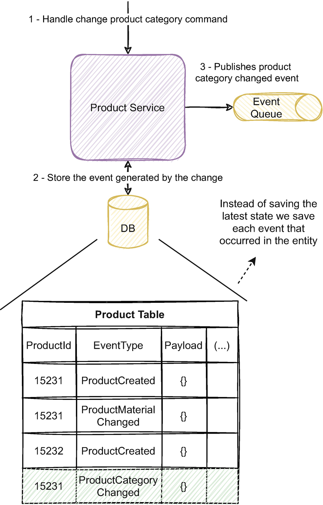

产品服务不会将产品的类别更改为新的类别，而是存储由更改生成的类别更改事件。数据库存储事件类型和事件的有效负载。产品不是 id、材料、类别等的表示，而是迄今为止发生的事件流。可以通过应用流中的所有事件来生成产品的最新状态。
乍一看，这听起来很糟糕，对吧？我们应该如何查询数据？例如，我们如何获取所有带有类别夹克的产品？我们在数据库中保存的只是事件的历史记录。要过滤它们，我们需要应用每个产品的所有事件以确定最新状态，然后进行查询。
这是事件溯源与 CQRS 具有高度协同作用的原因之一。正如我们在 4.5.1 小节中讨论的那样，如果我们将写模型与读模型分开，我们可以为每个模型提供截然不同的模型。我们可以在写入端使用事件源，并使用事件在读取端持久化最新状态。通过这样做，我们可以有一个优化的模型来查询数据和一个优化的模型来写入数据。
正如我们所讨论的，事件代表过去发生的事情并且是不可变的。事件流基本上用作附加日志。写操作通常比更新或删除操作快；因此，在写入模型中使用事件溯源通常可以从更好的性能中受益。
构建事件驱动架构时的一个重要考虑因素是让事件成为事实的来源。事件溯源充分体现了这一概念，因为事件就是实体。事件流还可以提供实体状态的全面历史记录，或用于调试和审计目的。但最高价值是能够保留原始数据并为当前和未来用例重建不同的数据视图。我们有今天需要的查询需求，但我们可以通过拥有事件流的完整历史记录来重建数据的不同视图以供未来用例使用。
如果你使用的是关系数据库，那么使用事件溯源也会带来性能和概念上的收益。 OO（面向对象）模型和关系世界之间存在阻抗不匹配（Scott Ambler 的文章 7 进一步详细说明了这一点，Greg Young 在他的 CQRS 文档 8 中彻底探讨了这个概念）。实体的建模方式在两者之间有很大不同。这种差异通常会影响性能并增加模型推理的复杂性；复杂性 ORM（对象关系映射器）倾向于抽象。使用事件溯源可以简化这些问题，因为两者中的事件是相同的。
图 4-16 说明了存储在数据库中并在事件队列中发布的事件。使用持久消息代理，我们可以通过没有数据库来进一步改进这种拓扑。图 4-17 使用我们之前使用的相同示例说明了这种情况。

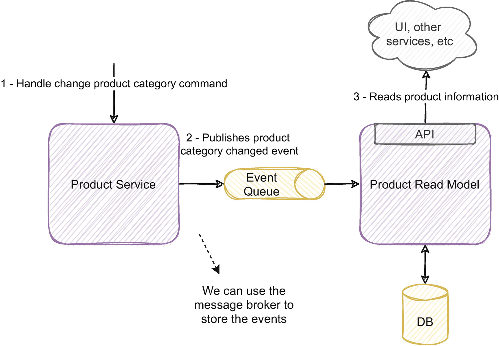

在图 4-16 示例中，我们将事件存储在数据库和事件队列中。请注意，在图 4-17 中，负责处理命令和应用业务逻辑的产品服务不再将事件存储在内部数据库中。相反，它将事件发布到消息代理，并将事件存储在那里。这样，事件不再发生在两个不同的地方，受益于基础设施收益和保证两个地方完全相同的相关问题。此外，存储和发布事件意味着我们需要确保两个操作一起发生或一起失败；否则，系统将变得不一致。通过仅进行一次操作，大大简化了这一问题。我们还完全接受单个事件流作为事实来源。
仅在消息队列中存储事件引出了我们是否可以完全信任消息代理来存储核心业务信息的问题。几年前，这种选择会让我脊背发凉。但是，事件流的兴起以及大规模进行的需求无疑凸显了人们的担忧，并为可靠地做到这一点铺平了道路。持久消息代理是数据库吗？它们当然不具备我们习惯于使用传统数据库的查询能力，但它们至少可以提供与分布式数据库一样强的一致性保证。 Martin Kleppmann 与 Kafka 有一个关于这个主题的非常有趣的主题演讲，我们建议进一步讨论这个主题。
在图 4-17 中，我们还结合了 CQRS 和事件溯源。通过这种方式，产品读取模型构建了针对查询优化的产品数据的非规范化投影。在写模型中使用持久化事件流，我们还可以在需要时在读模型上重建相同或新的模型。

### 4.5.4 关注点和何时使用事件溯源

事件溯源的主要关注点是查询数据的能力。通过使用读取模型和构建投影来回答这些查询需求，这种担忧在很大程度上得到了缓解。但是，读取模型最终是一致的。当业务逻辑需要查询数据时，在最终一致的读取模型中这样做可能很难处理。例如，如果产品服务有一个业务规则，即只有 25% 的产品的价格可以超过 400 美元，则每次创建产品或更改价格时都必须验证该规则。在写入模型上执行该查询将很困难或不可行。我们可以查询读取模型，但固有的最终一致性可能会产生错误的结果。我们在第 5 章中进一步详细说明了如何处理最终一致性，但它总是会增加复杂性。
保存每个实体的每个事件也可以在成本和性能方面产生影响。此解决方案通常需要保留策略和快照的使用。尽管可行和保留策略可能已经是非事件源系统的一个问题，但快照需要专门的实现并增加系统的整体复杂性。
我们不需要也不应该在架构中的每一个服务中都采用事件溯源。通常，具有复杂查询需求的服务可能会受益于事件溯源和 CQRS。处理核心领域概念以及业务将来可能需要从该信息中提取不同预测的服务也可能是一个很好的指标。具有强大的审计要求也很合适，因为事件流是事实的来源，它可以提供详细的审计。简单的隔离服务可能不太适合，因为它们不太可能从相关的复杂性中受益。
在具有持久消息代理的事件驱动架构中，我们已经面临许多这些问题，因为我们已经持久化了事件流。使用事件溯源正在加紧使用事件流对我们的实体进行建模，并完全接受它们作为事实来源。

### 4.5.5 命令源的使用及其适用性

与事件溯源相关的一个非常相似的模式是命令溯源。毫无疑问，命令源使用与事件源相同的方法，但我们不是持久化事件，而是持久化命令。本小节将讨论命令源并将其应用到我们之前讨论的同一示例中。
在 4.5.3 小节中，我们讨论了如何在产品服务的示例中应用事件溯源。使用相同的示例，我们可以通过保存到达服务的命令来应用命令源。图 4-18 说明了我们如何应用它。

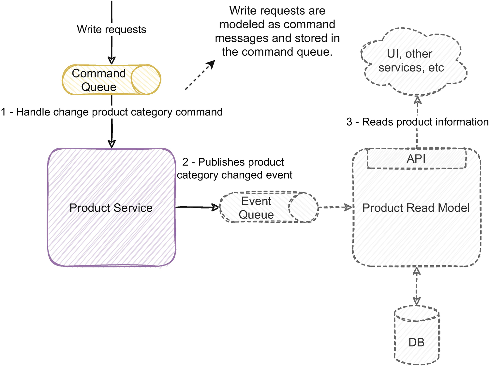

写请求被建模为命令并发送到命令队列。这些命令可以存储在队列中，如前面讨论的持久消息代理，或存储在数据库中。产品服务使用队列中的命令并生成事件。事件被发布到一个事件队列并被读取模型使用，在那里可以像我们之前讨论的一样查询数据。
命令源为流程增加了额外的复杂性和异步性。如果对服务的写入请求未通过域验证，则它们可能会被拒绝。如果请求是同步的，很容易将反馈返回给应用发出请求。但是，如果它位于队列中，则稍后会对其进行处理。返回有关验证错误的反馈可能很麻烦。问题不是因为它是异步的，而是应用程序必须处理有关接受命令失败的异步反馈，并处理常规事件以了解何时应用请求。虽然可行，但通过处理事件并区分它们，我们可能会非常接近将好的解决方案与过度工程分开的界限。
命令源在应用程序操作之前保存用户的原始请求，应用其逻辑并将其转换为事件。当接收命令的服务具有复杂的逻辑或复杂的算法时，它通常很有用。如果我们在服务中引入错误，保存原始请求允许我们重新生成状态。如果我们想尝试不同版本的算法并理解结果，它也可能很有用。
如果有必要在用户提交时准确保存请求，那么命令源可能是一个不错的选择。然而，根据应用程序的需求，事件溯源就足够了，复杂性开销并没有得到回报。在事件驱动的架构中，尤其是使用编排的部分，事件是连接整个流程中不同服务的粘合剂。在我们使用命令的地方，命令的使用频率较低；命令源可能是一种有用的模式；但是，请注意复杂性开销并权衡是否值得。

## 4.6 在事件驱动的微服务架构中构建多读模型

在 4.5 节中，我们讨论了满足对分散在多个分布式微服务中的数据的查询要求的困难。 我们讨论过我们可以通过处理来自不同来源的事件来构建非规范化读取模型。 本节将详细介绍如何执行此操作以及如何应用我们之前讨论过的一些概念。
让我们使用我们在第 4.5 节中使用的实际示例。 我们要求列出所有有库存的产品并按降价排序。 相关信息位于三个不同的服务中，即产品、库存和定价服务。 正如我们所讨论的，为了能够可持续地执行该查询，我们可以使用一个独立的服务来处理来自每个服务的事件，并构建一个为其优化的非规范化读取模型。 这种情况如图 4-19 所示。

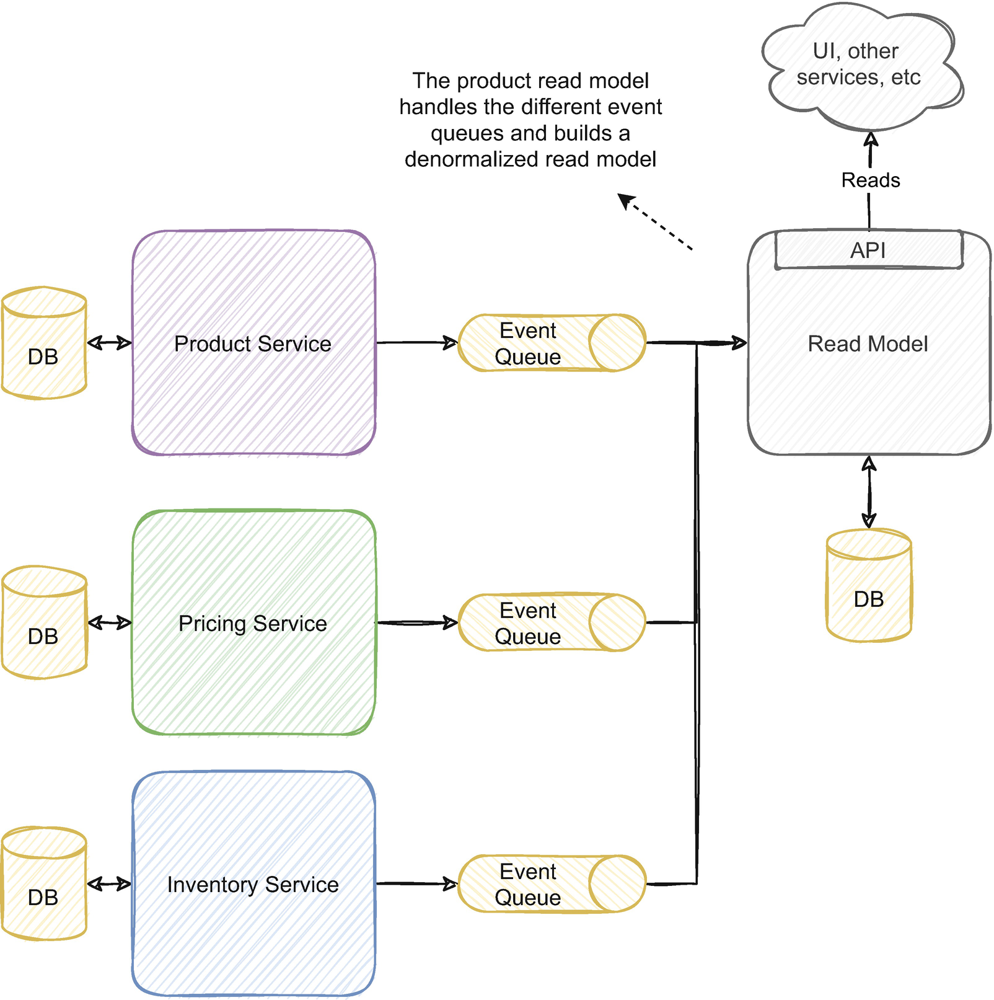

在事件驱动架构中，通常也在微服务架构中，这些类型的查询通常是一个常见的挑战（其中许多类似于我们在讨论 API 组合模式时提出的问题）。它们通常通过选择构建这种非规范化读取模型来解决。事件驱动架构提供了一种通过事件共享信息的方法，并提供了一种使数据随时可用的实用方法。事件流提供了一种分离的方式来处理数据并将其转换为其他内容，专用于不同的目的。它们还以连续的方式实时进行（只要订阅者能够跟上吞吐量，这应该不是问题，因为它们是水平可扩展的）。服务的相关解耦还保证它们不会通过这样做而相互影响。
但是哪种事件最适合构建非规范化视图？你可能还记得，在第 3.1 节中，我们讨论了事件和文档之间的区别。让我们通过这个实际示例并讨论权衡。
正如我们在第 3 章中讨论的那样，当服务需要对特定更改做出反应时，部分事件是相关的。读取模型通常很少或没有业务逻辑，因为业务规则应该在拥有域的服务中，并且是事实的来源。我们还讨论了当消费者使用实体的大部分数据并且只对最近的数据感兴趣时，文档通常是相关的。从这个角度来看，使用文档来提供阅读模型是有意义的。例如，清单 4-1 说明了产品服务可以发布的一个可能的文档。

```json
ProductDocument
{
    Id: 152397,
    Brand: "Nike",
    Category: "Shirt",
    Material: "Cotton",
    Season: "Spring/Summer",
    Sizes: ["XS", "S", "M", "L", "XL"],
    Colors: ["Black", "Gray"],
    CreatedAt: "2021-01-30T11:41:21.442Z"
}
```

如果我们对每个属性都有一个部分事件，则读取模型将不得不处理可能具有不同逻辑的六个不同事件。包含所有信息的单个文档极大地简化了更新读取模型的工作。它还减少了我们必须发布和使用的事件数量。例如，如果用户在一个操作中编辑多个字段，则只需要发布一个产品文档，而如果我们有多个部分事件，我们需要为每个更改的属性发布一个。
一个有趣的解决方案是将这种方法与 Kafka 的压缩主题相结合。正如我们在第 3 章中讨论的那样，当使用压缩主题时，Kafka 会删除共享相同分区键的旧消息。图 4-20 说明了该机制的工作原理。

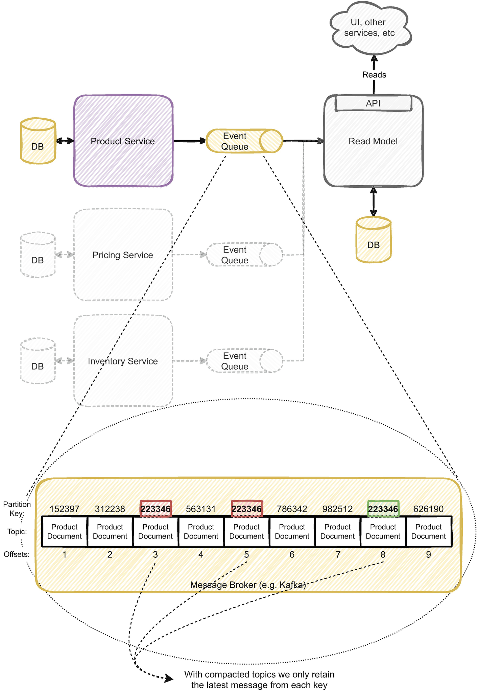

请注意，这与我们之前在图 4-19 中讨论的图表相同，但突出显示了事件队列的内部工作原理。我们有一个只有产品文档的队列，因为我们决定只发布文档而不使用部分事件。文档上方的数字是分区键，在这种情况下转换为产品 ID，下方的数字是偏移量。当产品服务产生消息时，它使用产品 ID 作为分区键。 Kafka 内部使用这个密钥在不同的分区之间分发消息（一个类似于分片的概念，我们将在第 6 章中进一步详细说明它是如何工作的）。
使用压缩主题时，Kafka 会删除具有相同分区键的旧消息。在图 4-20 的示例中，我们有三个具有相同分区键 (223346) 的文档。由于用户对同一产品进行了三次更改，产品服务生成了三个文档，因此产品服务发布了三个文档来通知每次更改。偏移量为 3 和 5 的两个文档由于较旧而被删除，我们只在队列中保留偏移量为 8 的最新文档。
压缩主题仅从重复的分区键中删除旧消息，并始终保留每个分区键的最新消息。我们设计的产品文档提供了产品及其信息的全面视图。通过将两者结合，压缩的主题充当产品数据库，但以准备与其他应用程序共享的方式构建，并且以流方式，新的更新将在主题末尾发布为新文档。
我们如何使用同步请求在传统微服务应用程序中构建类似的非规范化模型？也许读取模型必须轮询产品、定价和库存服务并获取有关每个产品的信息。这种替代方法会在读取模型和其他服务之间创建直接依赖关系，这将使其容易受到级联故障的影响。它的性能也会降低，因为即使没有进行更新，读取模型也必须请求信息。编辑信息和在读取模型中可用之间的时间（不一致窗口）会更长，因为它基于特定的时间间隔而不是对实时更改做出反应。扩展也是一个挑战。我们对服务的请求越多，数据库的压力就越大；频繁使用此解决方案可能最终会影响响应请求的服务，这就引出了该解决方案是否真正可横向扩展的问题。
使用事件队列和流媒体解决方案，我们有机地解决了这些问题；更改被发布并且服务对它们做出反应。它们是完全解耦的，不需要直接相互影响。例如，向读取模型服务添加更多实例永远不会影响产品服务。
在出现问题时重建模型也很简单。想象一下，如果我们在读取模型服务中引入了一个错误并且数据已损坏。如果我们需要重建整个模型，我们可以简单地从头开始消费主题。压缩主题保留每个产品的最新文档；通过从头读取，我们将使用每个产品的数据。无需临时流程或特定构建的应用程序来迁移数据；也不需要停机。重建模型的代码与常规例行事件相同。如果我们需要更快地完成，我们可以添加更多服务实例以在重建期间更快地使用事件。
如果我们从业务中收到一个不同的搜索需求，而我们当前的模型没有优化来满足，我们可以使用相同的策略来生成新模型。假设我们需要对产品数据的不同投影进行反规范化；我们在队列中有产品信息。在这种情况下，我们可以使用相同的策略从头开始读取并构建新的投影。
总的来说，这个解决方案遵循我们在本章中一直讨论的相同原则；当数据达到给定的规模时，通常需要非规范化的预测。以事件驱动的思维方式接近解决方案为我们提供了根据搜索需求以可扩展且更可靠的方式灵活构建它的能力。

## 4.7 微服务意大利面条式架构的陷阱以及如何避免它

在本章和之前的章节中，我们讨论了如何过渡到微服务事件驱动架构，我们讨论了如何构建事件驱动服务和应用结构模式。随着我们通过添加新功能或创建更细粒度的服务来发展微服务生态系统，整个系统的复杂性不断增加。除了分布式架构面临的所有挑战之外，不断向系统添加更多活动部件会变得难以阅读和理解整体情况。在本节中，我们将讨论这一挑战、其影响以及如何应对。
在复杂的微服务网络中，你经常无法找到正确的流程。就像我们经常难以理解单个应用程序的意大利面条式代码的流程和逻辑一样，复杂的架构可能更具挑战性。当业务流程跨越多个服务时，分析多个不同服务的代码以了解高级流程可能是一项真正的侦探工作。
来自 Uber 的 Yuri Shkuro 有一个关于跟踪 2000 多个服务的非常有趣的演示10。 Jaeger 生成的服务网络显示了这种困难以及大量不同组件的相关复杂性。尽管难以理解分布式组件的复杂网络是分布式架构的一个缺点，也是我们不得不接受的东西，但我们可以采取一些措施来帮助我们更可持续地推理该架构。
正如第 1 章所讨论的，单体应用的一个缺点是它们通常有合适的条件来创建意大利面条式代码，而没有适当的思维方式和纪律。微服务解决了这个问题，因为每个服务在物理上彼此分离。事实上，他们可以说是将挑战委托给了更高级别的微服务组织和更高级别的架构。它当然有很多优点；例如，使用服务的团队可以更轻松地组织代码和构建新功能。然而，每个人也更容易忘记整体流程以及服务如何相互影响，通常会产生复杂的极端情况。有许多资源和文档化的策略可以解决意大利面条式代码。然而，解决意大利面条式架构通常属于更可疑和更复杂的范围。

### 4.7.1 领域隔离和清晰边界

在第 3 章中，我们讨论了 DDD 作为组织服务边界的一种方式。这种组织也可以成为管理微服务复杂性的绝佳方式。正如我们在第 3 章中讨论的那样，根据域组织的服务可能比其他类型的组织更稳定，或者根本没有。它们通常可以防止新开发的影响波及整个架构的多个组件。
通常在事件驱动架构中，域的流和业务流程被转换成几个组件之间的消息流。这些架构的高度进化性质也为它们的无缝变化铺平了道路。失去对域流的跟踪很容易，理解它通常很棘手，因为它需要分析多个组件之间的消息流。
当服务根据其域进行集群时，通常有助于理解整体流程。例如，在我们在4.1.3小节详述Sagas时讨论的实际例子中，为了履行订单，我们知道我们必须做一系列步骤，例如，保存订单信息，验证和更新库存，计算定价费用等。如果服务是使用域隔离来组织的，那么将业务流程映射到实现它的服务会更容易。每个服务或服务集都属于与业务概念相关的有界上下文。尽管可能有许多服务，但每个有界上下文都以与业务流程概念上相同的方式相互通信，并且消息流以相同的方式推进。通过这种方式，可以更轻松地对架构和服务之间的交互进行推理。
另一个基本原则是在域之间建立明确的界限。软件工程中一种典型的好做法是使用依赖倒置（SOLID11 中的 D）。它指出代码应该依赖于抽象而不是具体的实现。将此应用于高级体系结构，一个边界应该通过公共接口访问另一个边界，而不是通过内部服务的实现或端点。
你可能还记得我们在第 1 章中讨论模块化单体的时候。模块化单体通常是通过定义这些边界并在它们之间保持严格隔离来构建的。 Shopify 甚至通过验证不访问公共接口的代码构建了一种以编程方式强制执行这些边界的方法。由于代码集中在单个解决方案中，因此在单体应用中绕过这些边界更容易。
然而，在复杂的微服务架构中，我们可以通过在服务之间建立一个混乱的依赖关系网络来解决同样的问题。域组织和严格的边界缓解了这个问题。边界应该明确显示在它们公开的端点上，并阐明哪些功能是公共的，哪些不是（类似于它们在单个代码解决方案中的情况）。这种封装有助于包含依赖关系并降低破坏合同的可能性。一个好的方法通常是保证边界对其域数据拥有独占所有权，并具有公开边界功能的干净专用端点。
总体而言，具有域隔离并在有界上下文之间强制分离关注点对于包含架构的复杂性和可持续发展架构而不会失去对高级流程的跟踪的方法非常有用。

### 4.7.2 上下文映射

我们讨论的模式，如 CQRS 和事件溯源，并非适用于所有用例，但 DDD 及其技术具有我们可以经常使用的基本好处。 DDD 强调需要了解系统的域和有界上下文及其关系。它的实践通常可以帮助我们理解它们，即使我们不应用更复杂的模式，如 CQRS。
上下文映射通常在 DDD 中被提及，它们以图表或简单的文本的形式描述现有的有界上下文、它们的关系和交互。它们可以描述不同有界上下文之间的更高级别的关系、依赖性和消息流。它们通常与我们在整本书中使用的图表相似；图 4-21 中描绘了一个示例。

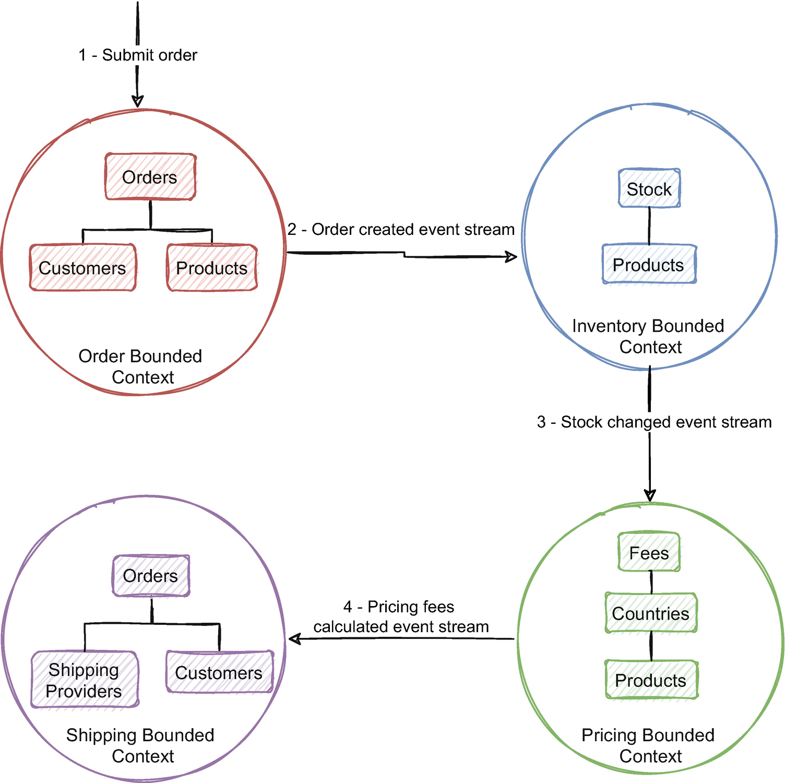

此示例还详细说明了每个有界上下文中的实体。此外，一个有趣的注意事项是产品实体，它存在于多个有界上下文中，但可能具有不同的信息，具体取决于相关内容。我们可以从仅绘制有界上下文之间的关系开始，然后添加更多信息，如域和实体。有关关系及其依赖关系的详细信息通常在文本或图表后面的表格中进行描述。
上下文地图有助于对系统进行推理、了解每个边界并突出显示边界共享数据的位置。它们还有助于描绘系统中最重要的部分如何相互关联。在事件驱动的架构中，我们可以使用由不同有界上下文公开和处理的外部事件流来丰富上下文映射。这种方法可以帮助提供推理和组织架构的参考，而不会丢失对服务之间关系的跟踪。

### 4.7.3 分布式追踪

在事件驱动的架构中，服务之间通常没有直接的通信；这和组件之间的高度解耦会使数据流难以理解。尤其是在使用编排时，很容易丢失事件的高层流程。分布式跟踪可用于应对这些挑战并有助于映射和理解这些流程。
分布式跟踪收集和记录事件范围内的服务和操作。然后可以使用该数据进行搜索和可视化。它可以是一种对分布式系统进行推理的有价值的方法，尤其是由事件驱动的高度解耦的系统。它还可以帮助理解服务之间的关系。
有几种工具可以帮助我们实施和记录跟踪。例如，我们可以使用 Zipkin 和 Kafka 的拦截器 API13 来记录产生和消费的每个事件的跟踪。另一个有趣的例子是将 OpenTracing 与 Jaeger 一起使用。14 OpenTracing 可用于将相关数据添加到事件的标题中，并在 Jaeger 中使用它们以实现高级可视化。
分布式跟踪可以成为可视化服务如何交互、数据流以及架构如何随时间演变的高级感知的宝贵工具。我们可以使用分布式跟踪提供的高级视图以更可持续的方式组织和推理架构。我们无法改进我们无法衡量的东西；如果我们有这些信息，并且如果架构有一个混乱的依赖关系网络，我们可以使用这些信息来设计一个策略来组织和理解架构的功能。

## 4.8 总结

事务一致性是分布式系统中的一个复杂挑战。分布式事务和两阶段提交协议是一种替代方案，但非常有限的一种方案通常会引起比解决的问题更多的问题。
Sagas 是一系列单独的操作，用于管理一个长期运行的流程。我们可以使用它们将长时间运行或传统的单个数据库事务拆分为更小的事务，更适合分布式环境。实现 Sagas 的两种常见模式是编排和编排。
编排使用主要组件来管理流程的步骤。在需要中央主管的复杂流程中，它通常很有价值。
使用编排的服务相互反应以完成 Saga 的步骤序列。每个服务都会对生态系统中发生的变化做出反应，以完成其任务。编排往往是事件驱动架构中的典型模式，它与它的思维方式很好地协同作用。
我们可以在我们认为合适的情况下结合编排和编舞。编排可以更普遍地应用在更高级别的流程中。我们可以在更有限的范围和特定用例上使用编排。
在事件驱动的架构中，拥有一组独立的服务，每个服务都拥有其域的数据，这可能会给获取数据的聚合视图带来挑战。 API 组合可能是一种可能的解决方案，尽管非常有限。
我们可以应用 CQRS 来隔离写入和读取。这种分离允许为每个优化模型和方法。 CQRS 不仅限于隔离数据库以进行读取和写入；我们还可以使用其他中间模式。
事件溯源是一种很有价值的模式，可以与事件驱动架构很好地协同工作。了解事件溯源的关注点和优势很重要，因为它们可能在某些用例中很有用，但也会产生一些复杂的限制。
命令源与事件源相关，并且在必须完全按照用户提交的请求保存请求时，它也是一种有用的模式。与事件溯源一样，重要的是权衡它的好处并仅在它超过其关注点时才应用它。
文档和 Kafka 的压缩主题是构建多个读取模型的好方法。
不断向系统添加更多活动部件可能会变得难以阅读和理解整体情况。域隔离、清晰的边界、上下文映射和分布式跟踪可以成为解决这一挑战的宝贵工具。

## 脚注

1. Further details in “Third normal form,” https://en.wikipedia.org/wiki/Third_normal_form
2. Further details in “X/Open XA,” https://en.wikipedia.org/wiki/X/Open_XA
3. Full analysis in Jepsen, “Jepsen: Postgres,” May 18, 2013, https://aphyr.com/posts/282-jepsen-postgres
4. Full analysis in Kyle Kingsbury, “YugaByte DB 1.1.9,” March 26, 2019, https://jepsen.io/analyses/yugabyte-db-1.1.9
5. Full article in Hector Garcaa-Molrna and Kenneth Salem, “Sagas,” December 1987, www.cs.cornell.edu/andru/cs711/2002fa/reading/sagas.pdf
6. Book by Bertrand Meyer, “Object-Oriented Software Construction,” March 21, 2000, www.amazon.com/gp/product/0136291554
7. Full article in Scott Ambler, “The Object-Relational Impedance Mismatch,” www.agiledata.org/essays/impedanceMismatch.html
8. Full article in Greg Young, “CQRS Documents,” https://cqrs.files.wordpress.com/2010/11/cqrs_documents.pdf
9. Footnote available in Martin Kleppmann, “Is Kafka a Database?”, October 17, 2018, www.confluent.io/kafka-summit-SF18/is-kafka-a-database/
10. Presentation available in Yuri Shkuro, “Conquering Microservices Complexity @Uber with Distributed Tracing,” September 4, 2019, www.infoq.com/presentations/uber-microservices-distributed-tracing/
11. See “SOLID,” https://en.wikipedia.org/wiki/SOLID
12. Full article in Kirsten Westeinde, “Deconstructing the Monolith: Designing Software that Maximizes Developer Productivity,” February 21, 2019, https://shopify.engineering/deconstructing-monolith-designing-software-maximizes-developer-productivity
13. Interesting article on how to implement it in Jorge Quilcate, “The Importance of Distributed Tracing for Apache Kafka Based Applications,” March 26, 2019, www.confluent.io/blog/importance-of-distributed-tracing-for-apache-kafka-based-applications/
14. Interesting article on how to implement it in Aaron Burk, “Fault Tolerance in Distributed Systems: Tracing with Apache Kafka and Jaeger,” July 24, 2019, www.confluent.io/blog/fault-tolerance-distributed-systems-tracing-with-apache-kafka-jaeger/