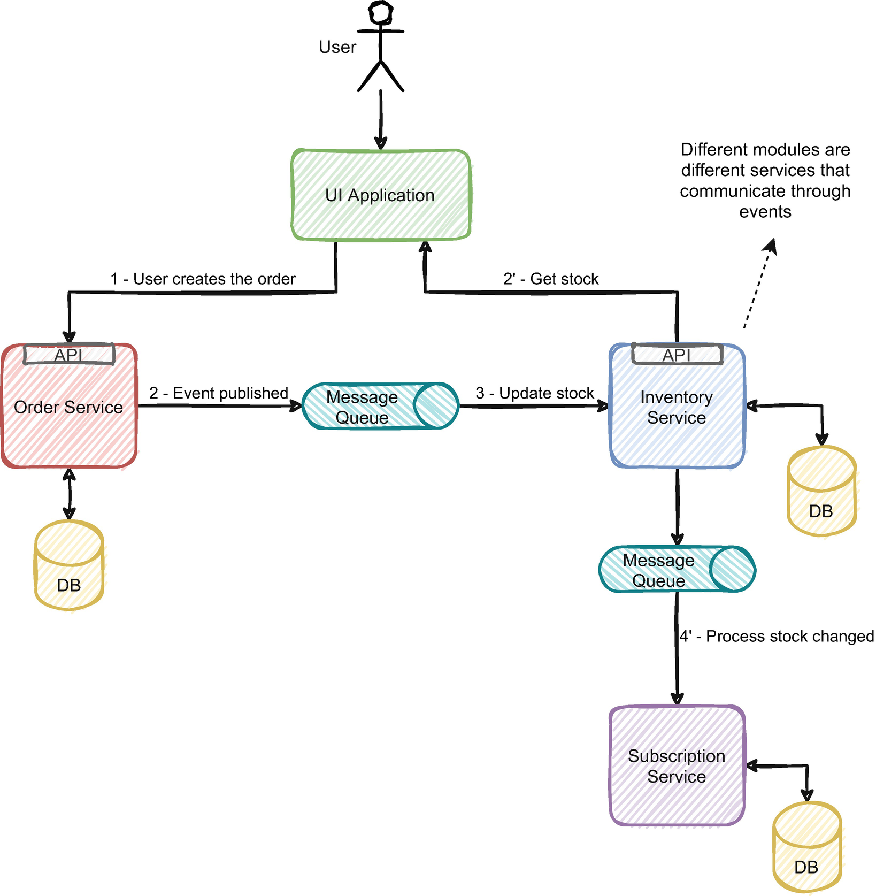
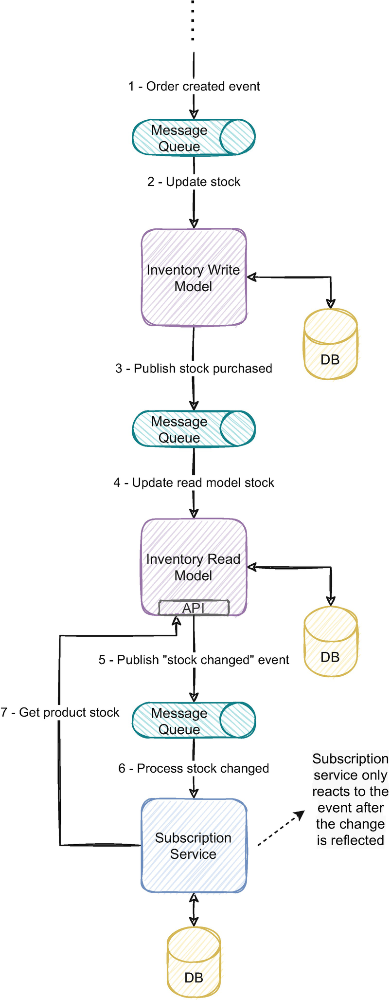

本章涵盖：

- 为什么最终一致性是事件驱动系统的结果及其对业务和消费者的影响
- 使用事件模式避免最终一致性
- 应用域边界来管理最终一致性
- 使用事件版本控制作为对不一致信息做出反应的手段
- 应用端到端原则，保证流量一致
- 通过保持一个小的不一致窗口来显示一致

软件工程中一致性的有趣之处在于其含义不是很一致。撇开双关语不谈，一致性的定义因上下文而异，并且有几个级别的强一致性和弱一致性。强一致性是我们通常习惯的，由传统的ACID（原子性、一致性、隔离性和持久性）属性提供的一致性。有多种不同程度的弱一致性 1 可提供不同级别的安全性。与我们在事务隔离级别中配置的类似，强一致性将是可序列化级别，而弱一致性的一个例子可以是未提交读或已提交读。
在处理分布式系统时，有几种程度的一致性，每一种都有其特点。因为不在本书的内容范围内，所以我就不一一详述了。尽管如此，可用性和强一致性之间的二元性通常会引发一场激烈的辩论，如第 5.1 节中详述的 CAP 定理所示。
典型的单体应用享受 ACID 特性的舒适性和一致性的传统含义。事务型和关系型数据库通常将数据视为单一副本；变化是原子的和瞬时的。如果你更改一条记录，你不必担心任何并发写入，因为该操作是原子的。没有其他人可以同时修改它，任何人都可以立即阅读它。当你读取该记录时，你肯定会读取最后一个可能的值。
这些类型的保证通常可用于单体应用程序。它们简化了大多数开发，并为其他复杂的问题提供了简单的解决方案。这种一致性的含义是许多应用程序的基础，并在使用软件时深入我们的思想和客户的思想。回首往事，这种程度的一致性是黑暗寒冷夜晚的温暖毛毯。当转向事件驱动的架构时，你很可能需要将毯子抛在脑后，迎接寒冷。别担心，冷总是比 100% 运行的 SQL 数据库 CPU 的热要好。
事件驱动架构中组件之间的交互通常采用异步通信。传统上，微服务之间的通信是点对点同步通信。微服务通常会公开 API，以便其他服务可以使用它们的功能并访问它们的数据。如图 5-1 所示，这些 API 通常使用 REST 等同步通信，服务 1 发送请求并立即获得响应。当使用事件驱动的微服务时，服务 1 发布一个由服务 2 处理的事件，但两个服务之间没有直接通信，并且始终通过事件代理进行中介；这些服务彼此不认识。


经常宣扬通过消息队列解耦组件的好处；虽然这无疑是有用的，但它也会导致系统中更改的传播异步化。异步解耦产生通常称为最终一致性的东西；对系统不同部分的读取可能会返回陈旧数据，但如果有足够的时间，所有读取最终都会返回相同的值。在事件驱动的架构中，为给定实体处理事件的所有服务一旦处理这些事件，最终都会收敛到相同的状态。例如，最终一致性是弱一致性的一种特定形式，因为它不保证 ACID 属性的更强保证。 NoSQL 数据库已广泛采用最终一致性作为实现高可扩展性和提供可用性保证的一种手段，这些保证在分布式环境中使用强一致性模型很难（或不可能）实现。第 5.1 节将进一步详细说明该主题及其与 CAP 定理的关系。
拥有可能返回陈旧值的组件会影响系统的用户，并对依赖该信息的其他服务产生更大的影响。当服务的域逻辑依赖于来自最终一致性读取模型的信息时，它可能会由于陈旧的信息而产生错误的结果。了解如何处理最终一致性以利用这些影响至关重要。
本章提供了几种技术来处理和利用事件驱动架构中的最终一致性。在 5.2 节中，你将了解事件模式设计如何避免最终一致性。事件模式设计的影响在第 8 章中进一步详述。
在第 5.3 节中，你将学习使用域边界来包含最终一致性的影响。这与第 4 章中描述的编排模式有关。第 5.4 节将详细说明如何使用事件版本控制来检测陈旧信息并使用补偿策略来处理最终一致性。
端到端原则可以保证端到端流程的一致性，同时允许系统较小组件的最终一致性。这将在第 5.5 节中详细说明，并包括其使用的真实示例。第 5.6 节将权衡最终一致性与小的不一致窗口，并展示 NoSQL 数据库的实际使用如何将其应用于生产。你将学习如何将相同的策略应用于事件驱动架构。

## 5.1 最终一致性的影响和与业务保持一致的需要

在本节中，你将了解最终一致性的影响，并了解并非每个组件都需要或应该最终保持一致。最终一致性没有神奇的解决方案，只有利用它的方法。采用它应该是一个有意识的决定，并且需要与系统的业务所有者保持一致。还需要一个深思熟虑的策略来处理系统未来的消费者，并且应该让他们清楚服务可能会返回陈旧的数据。本节还将详细说明最终一致性的影响，并教你权衡利弊。
让我们用一个例子来说明最终的一致性。图 5-2 描绘了用户在基于单个应用程序的电子商务平台上购买产品。在购买时，系统需要验证可用库存并创建订单。订阅服务还需要验证剩余库存，并在产品只剩下一个库存单位时通知相关方。


由于只有一个应用程序，因此每个操作都是同步的。订单的逻辑和域流在该应用程序内是顺序的。数据库更改可以自动发生，并且在用户订购产品时会更新平台上产品的库存等信息。新库存将立即对平台上的每个用户可见。
现在让我们看看与之前相同的示例，但每个模块都有一个独立的事件驱动微服务，如图 5-3 所示。订单服务将创建订单，然后发布一个通知操作的事件。然后，库存服务将处理该事件并更新该产品的库存。由于这两个操作在用户创建订单的时刻和服务更新库存的时刻之间是异步的，因此同一产品可能会有另一个订单。由于库存模型尚未更新，用户可以查看和订购该产品的库存。过时的数据和订单的并发性会为可能不可用的库存产生重复的订单。



像事件驱动架构这样的分布式系统有两个核心属性2：安全性和活跃性。这两个属性为理解为什么最终一致性是一个挑战奠定了基础。

### 5.1.1 安全

安全属性保证系统中不会发生“坏事”。坏事是可能使数据无效或具有从未出现在系统上的状态的情况（例如，系统内部的并发问题、死锁的可能性、无序操作等）。典型的最终一致性没有安全特性；然而，在事件驱动的系统中，我们可以避免大多数这些问题。第 6、7 和 8 章探讨了如何解决它们。一个重要的考虑是当系统处于不一致窗口内时（发生更新和更改传播到整个系统之间的时间），返回的状态可能是无效的，这可能是一个问题，具体取决于用例。本章讨论这些问题的可能解决方案。如果我们对事件进行建模，那么我们通过它们构建的实体的部分状态可能会暂时无效。例如，如果你更改个人资料的完整地址，并且系统处理它发送街道名称和城市的部分事件，则构建的模型可能会暂时具有新街道名称和旧城市。第 8 章更详细地探讨了这个主题。

### 5.1.2 活力

活力属性保证“好事”在系统中发生。在这种情况下，最重要的结果是更高的可用性。可用性是事件驱动微服务最有用的优势之一，因为它们赋予系统更高的弹性，从而实现更高百分比的服务可用性。
第一个最明显的后果是对系统用户而言。系统用户的更改可能需要时间才能传播到生态系统中的每项服务，从而影响工具。我猜你可能使用了一个应用程序，它在更新后刷新了页面以查看这些更改的反映。尽管这是一种可疑的用户体验并且有点令人生气，但根据业务的不同，它可能是可以接受的。也可能存在这样的情况：不可用比显示陈旧信息更好。这种情况下最关键的属性是不一致窗口的长度；如果它足够小，它就不会被注意到，并且就用户而言，快速最终一致性是第 5.6 节中探讨的强一致性。还有一些方法可以将 UI 设计为与异步系统更兼容，这将在第 9 章中讨论。
当存在建立在最终一致性之上的关键业务功能时，你需要权衡业务是否可以接受放弃一致性以支持可用性。可能存在不访问数据比基于陈旧信息做出决策更可取的用例。我们在管理电子商务平台产品可见性的系统上亲眼目睹了这一点。该企业与品牌达成了多项协议，不允许在特定地区提供某些类别的产品。由于负载高峰而导致 UI 的准时延迟使企业完全停止使用该功能以更容易出错的手动替代方法来管理它，因为他们根本无法信任系统。此示例强调需要了解功能的重要性并权衡其他解决方案是否更可取。
该问题在服务之间的同步 HTTP 调用中也有不同程度的影响。图 5-3 中的示例说明了这个问题； UI 应用程序在创建订单后对库存服务 API 执行 HTTP 调用以获取库存，以验证是否只剩下一个库存单位要通知客户。库存服务返回的库存可能不是最新的，因为订阅服务和库存服务都在处理它。如果订阅服务比库存服务更快地处理订单创建事件，陈旧数据可能会导致两种可能的故障：

- 库存数量为 2，因此不会发送通知，因为它不是最后一个库存单位。
- 库存数量为 1，导致服务针对不再可用的库存数量发送重复通知。

当一个服务的域逻辑依赖于来自不同服务的同步数据时，即使不一致窗口很小，这个问题也总是有发生的机会。服务负载的峰值可能会导致它滞后，为每个相关服务产生过时的响应。
在这种情况下，最终保持一致性是不够的，我们需要更多深思熟虑的策略，这些策略将在下一章中进一步讨论。

### 5.1.3 现实世界中的CAP定理

本小节将进一步详细说明最终一致性的影响以及它们与 CAP 定理的关系。在 CAP 定理的背景下，最终一致性作为证明其在事件驱动架构中存在的一种手段，一直备受争议。通过了解其含义以及对处理相同挑战的实际生产数据库的实际影响，你将能够理解可用性和一致性之间的权衡，如图 5-4 所示。


具有高可用性要求的分布式数据库通常会在地理位置不同的不同节点中提供原始数据的多个副本。此功能允许系统即使在节点丢失时也能保持数据的完整性，并为靠近这些地理位置的客户端享受更低的网络延迟。但是，系统必须将数据复制到不同的节点；复制不会立即发生，并且可能会在其他节点之间产生不一致的结果；一个节点中发生的更新可能尚不可用于另一个节点上的读取。保持来自多个节点的一致响应更受网络故障（通常称为网络分区）的阻碍。当发生网络分区时（例如，由于硬件组件故障），它可以将集群节点拆分为无法相互通信的较小组；一组数据的变化对另一组是不可见的，反之亦然。问题在于选择什么策略，要么等待网络中的故障消失，从而不可用，要么返回一个可能不太一致的数据版本，允许系统响应请求。
CAP 定理说明了这种困境，该定理出现在 2000 年由 Eric Brewer 博士发表的主题演讲 3 中，从那时起极大地影响了工程师设计分布式存储系统的方式。它为从那时起出现和发展的许多 NoSQL 数据库奠定了基础，并为弱一致性模型的普遍接受做出了贡献。采用 AP（可用且可容忍网络分区）数据存储背后的原因与采用异步事件驱动解决方案的逻辑非常相似，并阐述了为什么需要最终一致性的基本原理。此外，CAP 定理提出的属性在任何分布式系统中都是不可避免的。
CAP 定理基于三个属性：一致性、可用性和网络分区的容忍度。它指出分布式系统可以在存在网络分区的情况下可用或一致。不可能从三个属性中选择两个属性，因为在分布式系统上网络分区是不可避免的；相反，你必须决定是可用性还是一致性占优势。让我们深入研究这三个属性：

- 一致性：一致性这个词的含义很广，通常是误解的根源；在CAP定理的范围内，它意味着线性化（不同于ACID4中的一致性）。它保证任何单个操作（如对实体的读取或写入）都是实时发生的，类似于如果只有一个数据副本会发生的情况。例如，如果在一个节点返回最新更新后对一个对象进行了两次更新，则所有节点也必须返回该更新。这看起来很简单，但在分布式计算的上下文中是一个需要解决的具有挑战性的问题。
- 可用性：系统在网络分区范围内 100% 的时间可用。该定义的一个重要细节是延迟没有限制。5 即使需要几天才能返回响应也被认为是可用的，理论上是合适的，但对于现实世界的现实观点是违反直觉的。
- 容错性：当两个节点之间的连接中断并且无法通信时，就会发生网络分区。网络分区可能由于各种原因而发生，例如网络硬件故障。

该定义通过选择可用性或一致性将分布式系统分为 AP 或 CP 两组。由于 Internet 应用程序对可用性的苛刻要求，我们经常将 AP 分布式系统视为当前应用程序数据量大的必然结果。 AP 系统通常使用最终一致性作为网络分区可用和容忍的手段。最终一致性也是事件驱动系统异步性质的自然结果，如今是大多数事件驱动解决方案的公认特征。但它应该被轻易接受吗？
CAP 定理的可用性不是我们习惯的操作可用性，而是限于网络相关问题的范围。通常，我们将可用性定义为系统成功响应请求的能力。在 CAP 定理中，定义比这更模糊。它指的是与网络中的故障密切相关的定理算法 6 的可用性。这意味着 CAP 上下文中的 100% 可用性并不能保证 100% 的整体可用性。除了与网络相关的问题（如配置错误、应用程序代码错误、资源有限等）之外，还有一些故障会危及系统的可用性。但这在实际用例中意味着什么？谷歌透露，其谷歌 Spanner 数据库中发生的所有事件中只有 7.6% 是由网络引起的，超过一半是由于与人为相关的 7 问题，如配置错误。
在实践中，CP 和 AP 系统之间的可用性差异并不像我们认为的那么重要；两个系统都可以保证99.999%的可用性水平；例如，Facebook 的 HBase8 CP 系统也达到了类似的可用性水平。 CAP 定理可用性的有限意义引发了一个问题，即它是否支持以牺牲一致性为代价采用 AP 系统的足够令人信服的案例。由于解决方案设计中失去一致性的影响，这个问题越来越多地被提出9。
不可否认，网络分区是一个不可避免的问题10，并且在任何分布式系统中都会产生相当大的影响；然而，我们应该质疑盲目接受较弱的一致性模型（如最终一致性）是否有足够的理由。
传统的单体应用程序通常享有我们认为理所当然的 ACID 保证。一致性是软件的基础，并渗透到我们思考和与系统或数据库交互的方式中。可以说，一致性应该在数据库级别处理；不这样做是将责任推到每个使用该系统的客户身上，并显着增加复杂性。是否采用 CP 或 AP 系统的问题以及 CAP 定理范围内可用性的影响说明了我们是否应该将事件驱动架构应用于给定系统的相同后果。事件驱动系统固有的异步特性可以并且很可能会产生最终一致的模型。这种性质将把处理不一致结果的复杂性推给使用该系统的每个客户端，就像 AP 系统所做的那样。它会影响与系统交互的用户和其他应用程序，因为他们必须管理不一致的响应的可能性，从而导致对可疑用户体验或错综复杂的业务流程的复杂和复杂的解决方案。在最终使业务功能保持一致之前，我们应该质疑业务是否可以有效地接受它。无论哪种方式，我们都可以采取一些方法来最大限度地减少其影响，我们将在本章中讨论。

## 5.2 在事件驱动的微服务中使用事件模式来利用最终一致性
在本节中，你将了解事件模式如何避免事件下游消费者的最终一致性。 根据消费者的需求和实际用例调整事件模式通常比遵循有关如何设计事件模式的严格指南更有用。 本节将举例说明并讨论两种不同的模式设计方法。
在 5.1 节中，我们使用了一个用户在电子商务平台上购买产品的示例。 让我们深入研究库存和订阅服务。 由于大多数库存管理系统需要对库存变动进行审计，因此它们通常是应用事件溯源的典型用例。 正如第 4 章所讨论的，事件溯源可以与 CQRS 配对使用，以实现更灵活的读取。 图 5-5 描述了使用 CQRS 的库存服务及其与订阅服务的关系。


通过消息队列将读写模型解耦使读取模型最终保持一致。系统将首先将库存中的更改应用于写入模型，该模型也是库存域逻辑的所有者。如果更改符合域规则，服务将应用更改，并发布一个事件，表示库存发生变化。所有感兴趣的各方都可以使用该事件并根据该信息执行他们的域所需的操作。
一个常见的最佳实践是将事件设计为小而细粒度的。细粒度事件有很多优点；在性能方面，处理小事件比处理大事件更快，序列化和反序列化更快更轻量级，并且对消息代理的影响更小。在使用 DDD 方法（领域驱动设计；有关详细信息，请参阅第 3 章）时，设计事件以反映用户的意图也是一种常见的最佳实践。这样，事件和命令将具有领域价值并突出整个架构的业务流。
将这些概念应用到图 5-3 的示例中，我们将库存变化事件建模为小而细粒度的，并反映用户的意图。通常，库存变化发生在产品的库存单位级别；例如，如果用户要购买一件衬衫，它的尺码会像 XS 一样。这种情况下可能发生的事件类似于清单 5-1。

```json
StockPurchased   #A
{
    ProductId: 15251212,
    Size: "XS",
    Quantity: 1
}
```

该事件反映了用户的意图；用户购买了一件 XS 码的产品。它也是细粒度的，只需要最少的信息。通常，这些类型的事件最容易发布，因为在更改时发布服务中提供了所有必需的信息；该服务没有额外的努力来创建事件。
现在让我们讨论订阅服务将如何使用此事件。订阅服务需要提醒每个订阅了产品最后可用库存单位的用户。如前所述，该事件仅提供用户购买的该尺寸的数量。这就是订阅服务领域逻辑的挑战；从那个事件中，服务无法知道产品的总量。一个产品有多种尺寸，例如，它们的范围可以从 XXS 到 XXL；事件的数量仅指该特定大小。该事件还仅提供用户购买的数量，而不提供尺码的当前数量。
需要在订阅服务中实现此功能的开发人员可能会通过库存服务 API 获取该产品的当前库存数量。但是由于库存服务读取模型最终是一致的，它可能会返回陈旧的数据。由于库存读取模型和订阅服务并行消耗同一个事件，它们会以不同的速率消耗它。订阅服务正在使用的事件可能不会在请求时反映在读取模型中。当库存读取模型返回陈旧数据时，订阅服务将发生第 5.1 节中描述的两个故障之一。
这一逻辑符合 NoSQL 数据库采用最终一致性并将实现强一致性的复杂性委托给使用它们的应用程序的推理，如第 5.1 小节所述。在这种情况下，在库存服务上选择细粒度模式将处理陈旧信息的复杂性委托给消费者。如果我们仅在订阅服务上处理这个问题，将显着增加服务的复杂性，以解决纯技术而非业务相关的问题。
大多数资源建议创建小型精细课程，主要是出于性能和其他考虑。然而，在现实世界中，大多数团队发现的是随着微服务生态系统的发展，这种担忧变得更加紧迫。一种非常有益的方法是通过设计事件模式来考虑消费者的需求。
回到图 5-3 中的库存和订阅服务示例，由于库存服务具有所有尺寸的库存信息，因此可以很容易地发送带有附加详细信息的事件，如清单 5-2 所示。

```json
StockPurchased  #A
{
    ProductId: 15251212,
    Size: "XS",
    Quantity: 1,
    ProductCurrentQuantity: 5,
    ProductSizes:[
        {
            Size: "S",
            Quantity: 3
        },
        {
            Size: "M",
            Quantity: 2
        },
    ]
}
```

指示每个尺寸的产品当前库存信息的属性将大大简化订阅服务的实现，因为它能够知道产品的总库存而不是单个尺寸。该服务不会从最终一致的模型中请求当前库存信息，而是仅依靠事件数据来处理其域逻辑。除了消除订阅服务的大量复杂性外，这种方法还可以提高性能，因为它避免了对网络请求的需求。
当信息可用但取决于库存服务设计时，向事件添加附加信息是一个很好的策略。在这种情况下，聚合大小成为一个关键的决定：
如果我们将库存服务中的聚合设计为产品，那么获得产品的总库存将是微不足道的。
如果我们将库存服务中的聚合设计为产品的尺寸，则需要更复杂的解决方案。由于产品库存包含每个尺寸的库存信息，我们需要多个聚合之间的交互。要获得此信息，我们需要应用更复杂的解决方案，例如流程管理器。我们将在第 8 章进一步详细介绍这个主题。
使事件模式适应消费者应用程序的需求可能是你可以用来避免最终一致性的最强大的模式之一。它很容易包含架构和应用程序的复杂性，同时保留了事件驱动系统的优点。
第 8 章还将进一步讨论事件模式的完整含义和其他替代方案。

## 5.3 应用微服务领域边界来利用最终一致性

在本节中，你将学习通过将服务划分为域边界来控制最终一致性的影响。有界上下文是 DDD 中的核心概念，你可以使用与事件驱动架构相同的基本原理，尤其是当系统开始具有大量组件时。使用边界组织可以增强在这些组件中工作的团队的自主权，并且可以包含最终一致模型的影响。本节将详细说明域隔离如何控制这种影响，并通过示例进行说明。
在上一节中，你学习了如何通过调整事件模式来解决从最终一致的读取模型中获取陈旧数据的挑战。我们可以使用附加选项来解决获取附加数据的需要；使用我们之前使用的用户在电子商务平台上购买产品的相同示例，我们可以简单地让订阅服务在读取模型更新后消费一个事件。通过更改服务之间的消费者顺序，我们保证模型与事件信息保持同步，如图 5-6 所示。



如果订阅服务会通过产品链接通知用户，这种方法还可以通过过早地通知用户来解决可能的不一致问题。如果用户在不一致窗口内访问它，用户将看到错误的库存。改变组件的顺序，订阅服务只会在数据更新时通知用户。
然而，这个解决方案有一些缺陷：

- 读取模型是否应该发送事件是相当有争议的。如果我们纯粹从 DDD 的角度来看，只有聚合的变化才会触发事件；在这种情况下，应该发布的唯一事件将来自作为域所有者的写入模型。如果它不是事件只是读取模型是最新的通知，则可以说是合理的。然而，这通常是一些不合适的迹象（在这种情况下，我们应该避免同步调用）。
- 你应该在特定上下文中谨慎使用此方法。经常使用它会迅速增加整体架构的复杂性和信息流。架构应该有明确的边界，并在每个边界内管理这些问题。数据应该在边界之间流动，并且在读取模型和域所有者之间没有纠缠不清的流动。
- 反映整个系统变化的总时间将会增加。

在 DDD 中，有界上下文是特定领域模型的上下文关系。它通常代表整个系统域的一个子集及其单独的域模型。它也与其他有界上下文隔离，它们之间有明确的界限。尽管有界上下文仅指域模型，但在微服务事件驱动架构中，一个有界上下文可以跨越各种单独的组件。例如，在应用 CQRS 时，我们可以让一个组件负责写入模型，另一个组件负责读取模型。它们都使用并表示相同的域，因此这两个组件是同一个有界上下文的一部分。
在不断发展的微服务架构中，了解系统的有界上下文以及每个服务属于哪些服务非常重要。在系统切片之间拥有清晰的域边界将促进业务的发展。边界之间的脱钩是无缝业务演进的垫脚石，并限制了这种演进的技术影响。我们在第 3 章详细介绍了事件驱动架构的 DDD 和域边界。

此问题的另一种解决方案是定义两个单独的边界，一个用于库存域，另一个用于订阅域。这种分离与 DDD 方法具有很高的协同作用，迫使你了解业务并思考什么样的边界是有意义的以及在哪里划定边界。业务流程是所有需要的域边界之间的流动。这类似于第 4 章中详述的事件编排模式。反腐败层保证来自给定域的概念不会泄漏到另一个域。第 3 章详细介绍了这个概念。我们在图 5-7 中说明了这个解决方案。


此解决方案是一种更结构化的方法，可以在不丢失对整体流程的跟踪的情况下发展域。订单创建事件由反腐败层在边界内转发，该层调整事件以仅保留该边界所需的信息。在边界内，库存服务将按照其逻辑相应地处理事件。写入模型将更改聚合的库存并发布内部事件。读模型会使用内部事件来更新其信息，只有当数据反映在读模型中时才会发布外部事件。库存边界内的复杂性是从外部边界（如订阅边界）中抽象出来的，可以根据需要发展而不影响其他边界。
每个域都可以改变；我们可以添加或删除更多组件，但业务流程的整体流程将保持不变。我们还处理边界内的最终一致性；只有当边界内的所有服务都处理了它时，才会将发生的更改通知给外部消费者。此功能包含外部消费者的最终一致性；这样，我们可以保证消费者正在响应的更改已经在域内传播。

## 5.4 使用事件版本处理最终的一致性延迟
在本节中，你将学习如何使用事件版本控制来了解延迟响应和可能采取的措施来减轻其影响。实现最终一致性的最直接方法是稍后再尝试操作，当它不再是最终的时。此解决方案非常简单，可能是处理临时陈旧数据的最明显替代方案。但是，它有两个不太明显的警告：知道数据不是最新的，以及何时应该使用它。我们将用一个例子来说明这个解决方案，并讨论避免这些警告的可能方法。
杰弗里·迪恩 (Jeffrey Dean) 和路易斯·安德烈·巴罗佐 (Luiz André Barroso) 发表了一篇名为“规模的尾巴”的引人入胜的文章 11，详细介绍了 Google 如何通过优化第 95 个百分位上最慢的请求，设法在其某些服务上获得 99.9% 的延迟 SLA。分布式系统通常具有超出服务范围的延迟波动。在完美的世界中，我们会完全避免这些波动，但这些波动在复杂的分布式系统中是不可避免的，就像我们经常使用的容错技术一样。这篇文章详细介绍了几种尾部容忍方法，以最大限度地减少或掩盖这些临时延迟峰值的影响。当原始请求花费的时间超过指定时间时，其中一些依赖于重试对副本的请求。由于额外的请求，重试策略具有更高的资源消耗，文章解释说，使用正确的方法可以低至 2%。
我们可以从本文中将其类比为在事件驱动架构中重试策略。事件驱动的服务应该跟上消息负载，而不是滞后于系统中发生的变化（如第 5.7 节所述）。然而，由于无法预见的负载高峰，服务最终可能会滞后一次或另一次，但这应该是例外而不是规则；它应该是曲线的尾部。如果情况确实如此，我们可以争辩说我们可以选择一种乐观的方法；我们可以假设没有最终的一致性。当请求获取陈旧数据时，它可以通过重试对其做出反应。
使用库存和订阅服务的相同示例，如果数据陈旧，则在向库存服务请求信息时，该服务应在预定义的时间后发出额外请求。但是，这假设库存服务更快并且通常是最新的；重试将是例外。
第一个警告是如何知道数据是陈旧的。为了解决这个问题，我们可以使用事件版本控制；每个事件都应该有一个版本（管理第 7 章中详述的幂等性也很重要）来标识实体的版本。在 DDD 术语中，它可能是聚合版本；对于聚合上发生的每个更改，服务都会增加版本。也可以是时间戳，比较实用，虽然不是顺序的。这个版本也应该在 API 上可用；订阅服务在发出请求时会比较两个版本；如果事件的版本高于 API 的版本，服务将需要重试请求。这意味着该服务尚未在读取模型上反映事件的变化。
重试请求是你可以执行的最直接的策略，但风险也更大。我们经常听到重试策略如何提高弹性，但是，它往往会导致系统失败。我们只能将其应用于不太重要的组件或用作快速绷带。结果是该服务更容易受到其依赖项的负载峰值的影响。实现应该有一个断路器和一个退避策略。在整个过程中，该架构将使系统变得脆弱且容易受到级联故障的影响。重试是缺乏更可持续的方法的症状；我们应该明智而谨慎地使用它。
还有一个问题是当所有重试都失败时该怎么办。我看到一些服务只是使消息处理失败或将失败委托给业务流程，例如手动操作。尽管在某些情况下它们可能是可以接受的（例如，一些不太重要的用例，如日志记录），但我发现这些方法令人沮丧和三心二意。有一些补偿替代方案，例如将故障处理安排到以后的日期；最终，一致性是好的，最终，所以在某个时间点，滞后会消失。
订购也是一个重要的考虑因素；当消息消费是关联的、可交换的和幂等的时，重试是有意义的。否则，服务可能无法重试并获得一致的结果。有关更多详细信息，请参阅第 6 章。
事件版本控制本身并不是一个明确的解决方案，只是一个我们可以用来管理延迟的工具。我们应该把它作为紧急情况的战术解决方案；通常情况下，我们需要像本章中提到的其他解决方案一样更可持续、更可靠。
## 5.5 在事件驱动的微服务中保存状态以避免最终的一致性

在本节中，你将学习如何通过在服务外部存储状态来防止最终一致性。通常，由于大多数现实世界架构的混合性质，微服务面临最终一致性。一些服务对事件做出反应，而另一些服务根据用例进行同步调用。通过存储状态，我们可以省去同步调用，避免处理最终一致的模型。
对库存和订阅服务使用相同的示例。如图 5-5 所示，由于订阅服务和库存读取模型之间的同步调用，最终一致性问题出现了。为了避免进行同步调用，我们可以在订阅服务内部存储产品的库存。当订阅服务需要所有产品尺寸的库存信息时，它可以在本地获取，如图 5-8 所示。


这种方法最符合事件驱动的思维方式。通过移除同步请求，服务完全与依赖解耦。它变得更有弹性，因为如果库存读取模型不可用，它不会受到影响。性能方面也更好，因为获取数据库的数据通常比远程网络调用更快。与适应事件模式的解决方案类似，订阅服务仅依赖于上游库存事件。
但是，订阅服务必须维护并在内部存储所有库存信息。当有大量数据时，存储它会影响基础设施及其成本。订阅服务还需要将这些数据保持最新，这比仅请求库存读取模型数据具有相当大的开发开销。
这种方法优先考虑服务的自主性和性能。这是解决此类挑战的有用替代方法；但是，我们必须避免在每个用例中盲目应用它的陷阱。否则，服务数据的多个副本将遍布整个架构，变得难以管理和维护。我们将在第 8 章中进一步讨论使用事件提供状态转移的权衡。

### 5.5.1 缓冲状态作为持久化的替代方案

我们讨论了存储状态如何避免同步请求对最终一致模型的依赖。我们还讨论了存储该数据的缺点。保持状态的另一种方法是将其缓冲到内存中。将服务需要的每个外部状态存储为该状态的内部视图可能难以管理、初始化和保持最新。保持状态的另一种方法是将其加载到内存中。有两种策略可以实现这一目标：

- 预定义的缓冲窗口：该服务将所有到达该窗口时间跨度内的事件保存在内存中。当用例在短时间内将一批操作应用于相同或相关实体时，此策略是相关的，例如批量操作或信息上传。如果服务需要来自它正在处理的实体或相关实体的数据，它可以直接从该缓冲区加载。该策略的成功与时间跨度的大小以及实体在该时间跨度内发生变化的可能性直接相关。服务总是有可能在内存中找不到所需的实体，并且可能不得不回退到请求，因此仅限于特定用例。此策略在写入数据存储的数据密集型应用程序中也很有用。通常，批量更改比多次更改要快；缓冲区可以帮助集群更改并在单个操作中更新它们。
- 加载完整状态：服务可以将所有依赖状态加载到内存中。此解决方案意味着所有事件流都可在事件代理上使用。该服务可以读取主题开头的所有信息并将其保存在内存中。其他事件将使内存中的视图保持最新。此策略仅与预计未来不会增长的小数据集相关。例如，如果订阅服务仅针对“鞋子”类别中的产品提醒用户，则它可能需要产品的类别信息。假设平台中的类别不会超过几百个，服务可以将它们加载到内存中并在需要时使用该视图。该服务需要在启动时加载所有信息，这在大型数据集中可能过于繁琐。

图 5-9 说明了将此解决方案应用于使用订阅和库存服务的同一示例。 订阅服务在内存中加载事件，而不是向库存读取模型发出同步请求，而是使用该信息。 这样，服务就可以决定它是否是最后一个库存单位，以及是否应该提醒用户。


但是，这种替代方案取决于订阅服务是否在内存中具有所有大小的所有信息。在这种情况下，仅当系统同时更改所有大小时，缓冲窗口才是合适的选择；否则，该服务很可能没有所需的所有信息。如果我们读取事件流并将所有库存信息加载到内存中，我们就会解决这个问题。但是，只有在库存信息不过量的情况下才有意义；否则，我们可能会占用服务内存的很大一部分。
通过将信息保存在内存中，服务无需请求信息或将其保存在数据存储中，从而更易于管理和控制成本。但是，这仅适用于小数据集；通过将信息保存在数据库中或使用其他替代方法，具有或超过数十万个实体的用例会更好。由于所有信息都在内存中，因此该替代方案也是性能最高的。它比从数据库中获取它或进行远程请求要快。

## 5.6 使用端到端参数解决最终一致性问题：一个真实世界的用例

在本节中，你将学习如何通过保证端到端流程的正确性来减少系统中较小的、最终一致的部分的影响。你将了解端到端参数是什么以及我们如何在事件驱动架构中使用它。我们将通过一个电子商务平台的例子来说明它的应用。
到目前为止，我们讨论了一个向一般受众销售产品的零售电子商务平台。在该平台上购买产品时，用户会创建一个订单，该订单由订单管理边界处理。为了完成完整的订单工作流程，其他几个边界必须根据自己的领域处理事件和流程；例如，订单边界将发布一个事件，表明订单已创建，定价边界将使用该订单对订单应用相关税费，然后库存将更新库存信息，依此类推。产品边界将聚合所有产品信息并提供读取模型以搜索多个产品属性。通过访问 UI 应用程序，用户将能够从这些读取模型中请求信息。图 5-10 说明了这个例子。


通过获得事件驱动提供的所有好处，产品读取模型最终是一致的。当用户浏览平台的产品目录时，由于数据的最终一致性，它可能会看到不准确的信息。用户甚至可能会尝试购买不再有库存的产品，因为上游服务仍在处理它们。我们可以采取几种方法；在这种情况下，一个有趣的方法是端到端论证。
在计算机网络设计的背景下，Saltzer、Reed 和 Clark 在一篇激动人心的论文 12 中首次阐明了端到端的论点。在其中，他们描述了系统低级别的强大保证可能难以实施，并且通过在该低级别提供它们而产生的影响可以忽略不计。可靠性保证可以在端到端流程中实现，而不是在较小的低级组件中实现。这样做通过放弃那些更强大的保证，为那些较小的组件提供了拥有更直接、更高效的方法的机会。
在论文中，作者描述了文件传输的用例。发送和接收计算机之间有几个中间组件，用于在两台计算机之间传输一个文件。这些组件中的每一个都可能成为多种类型故障的受害者，例如系统崩溃或网络故障。有人可能会争辩说，要实现谨慎的文件传输，我们需要保证每个组件的弹性，并为每个组件赋予重试策略和复制副本以确保其防错。但是，为每个组件提供这些类型的保证会严重损害这些组件的性能和复杂性。此外，保证一个组件的容错并不能保证端到端的文件传输成功。因此，在单个组件中异常可靠的实现开销并没有减少端到端功能负担以保证可靠性。
为了解决图 5-10 中用例的问题，我们可以尝试强制产品边界强一致并提供一致的结果。每次系统中发生任何变化时，都必须立即反映在产品边界上。该策略还意味着复杂的交互和放弃所有其他边界与产品边界之间的脱钩。这可能意味着工作流的每个其他组件都必须保证跨边界的一致性，因此每个组件都提供一致的结果。在分布式系统中，这种情况意味着牺牲性能、可用性和无缝扩展的能力。它还会显着增加每个组件的复杂性。
端到端的论点提出了一个引人注目的命题，它适用于分布式微服务事件驱动架构。只要我们保证端到端流程的一致性，我们就可以放松对流程中间组件的约束，而不是大幅增加每个组件的复杂性。在这个具体的例子中，如图 5-11 所示，我们可以保持边界之间的解耦并使产品边界最终保持一致，只要在购买的那一刻，系统就有办法保证信息的一致性，例如, 产品有库存。


订单管理系统将在处理流程之前验证订单的条件。此示例是你在网站上浏览商品的典型情况，尽管 UI 显示该商品有库存，但结帐可能会失败，因为 UI 不再是最新的。这样，负责从 UI 需要的多个不同来源（产品信息、库存、价格、描述等）聚合信息的组件可以享受解耦和性能提升，因为不保证强一致性，只要有一个结束 -确保满足业务规则的端到端流程。

## 5.7 对于大多数用例，如果没有人注意到这不是最终的

在本节中，我们将考虑最终一致性，并了解业务如何与它共存而不会产生重大影响。我们将讨论 NoSQL 数据库中的最终一致性，并详细说明我们如何将相同的推理应用于事件驱动系统。
正如我们在 5.1 小节中讨论的，最终一致性不提供安全保证。最终的含义是令人生畏的；它指出系统将在未来某个时候返回一致的结果，但没有说明何时。企业很难接受像一致性这样至关重要的东西的模糊概念。也很难管理用户的期望；普通用户希望更改是即时的。它不期望它们花费无限的时间在整个系统中反映出来，并且向它们解释 CAP 定理肯定不是解决方案。考虑到这一点，NoSQL 数据库如何采用最终一致性以及为什么将其广泛部署到生产中可能听起来很奇怪。
在 NoSQL 数据库中，观察到在实践中，在实际用例中，最终一致性看起来像强一致性。一些研究表明，最终一致数据库中的不一致窗口很小，通常可以忽略不计。例如，一项研究 13 发现，在 Cassandra 的单个可用区中，大约 98% 的请求具有介于 0 到 1 毫秒之间的不一致窗口。对于 MongoDB，同一项研究显示，96% 的请求中的不一致窗口为 5 毫秒或更短。另一项研究 14 表明，在曲线请求之外，Cassandra 的不一致窗口几乎总是小于 200 毫秒。
正如我们在 5.1 小节中讨论的那样，我们是否应该满足于数据库的最终一致性是相当有争议的。但事实上它们被广泛采用，我们可以看到最终的一致性对于许多用例来说已经足够好了，这就提出了为什么会这样的问题。这是因为在实践中，这些用例中的不一致窗口很小。如此之小，通常被认为是微不足道的。
最终一致性是事件驱动系统的结果。处理它的最好方法是将系统设计得很快，并保证不一致窗口很小。正如最终一致性数据库所证明的那样，如果最终一致性足够快，则它看起来是强一致性的，其影响可以忽略不计。最终的一致性不需要很慢；如果它足够快以显示强一致性，就用户和开发人员而言，它最终不是一致的。
在事件驱动的微服务上快速意味着什么？我们需要从头开始构建两个基本特征：扩展能力和有意义的指标。如第 1 章所述，我们将微服务设计为自主开发和单独部署。此外，它们应该是水平可扩展的。通过在事件驱动的微服务上提供这些特性，我们可以按需扩展它以应对不可预见的负载高峰。我们需要有意义的指标来对系统延迟做出反应并使用它们来部署新实例。一个重要的指标是等待处理的消息数量；如果它很大，则可能不一致窗口也是。确保这种无缝发生的最佳方法是拥有一个自动缩放系统，并使用它来应对不可预见的负载峰值。当某个指标（例如消费者滞后）高于给定阈值时，将部署新实例。我们将通过第 5.7.1 小节中的一个实际示例进行工作。
如果我们保证不一致窗口的大小不是问题；我们可以通过采用最佳方法来减少最终一致性的影响。

### 5.7.1 Prometheus 和 Kafka 的事件驱动自动缩放用例
在上一节中，我们讨论了使用小的不一致窗口来减少最终一致性的影响的重要性。我们还讨论了自动缩放系统如何帮助实现这一目标。在本节中，我们将解释如何使用 Prometheus、Kubernetes 和 Kafka 实现自动缩放系统。
在图 5-5 的示例中，订阅服务使用库存事件来了解产品是否只剩下一个库存单位以提醒用户。如果管理产品库存的团队进行了大量库存导入，则订阅服务很可能会滞后于意外的消息负载。如果我们有一个系统来监控订阅服务消费者的延迟（例如 Prometheus 和 Kafka Exporter），我们可以通过部署新的服务实例来应对延迟。我们可以自动检测和部署新实例（例如 Kubernetes 和 HPA）。在图 5-12 中，我们说明了这个例子。
图5-12中提到的相关技术：


- Kubernetes：管理容器化服务的平台。本示例将使用它来读取相关的扩展指标，并使用新实例水平扩展应用程序。
- HPA（horizontal pod autoscaler）：Kubernetes 使用；自动扩展应用程序实例的数量。
- Prometheus：系统监控和警报工具包。本示例将使用它来导入 Kafka 的指标并使它们可用于 HPA。
- Kafka：一个事件流平台；可用于发布和订阅事件流。我们将使用它作为服务读取和发布消息的事件代理。
- Kafka Exporter：从 Kafka 中提取指标（例如，主题和消费者滞后）并公开它们的应用程序。

在示例中，Kafka Exporter 从 Kafka 读取指标并将它们公开给 Prometheus。本例中最相关的指标是消费者滞后；我们希望在延迟超过给定阈值时部署订阅服务的其他实例。 Prometheus 为 Kubernetes 创建自定义指标；我们在这种情况下使用 Prometheus，因为它是一个强大的监控工具，可以与其他几个指标功能结合使用，并提供简单的功能来配置自定义指标。 HPA 将使用 Prometheus 公开的自定义指标在需要时添加订阅服务的其他实例。
当库存服务发布不可预见的消息负载时，订阅服务延迟会增加。当滞后达到指定阈值时，HPA 将部署额外的订阅服务实例以更快地消耗滞后。当低于阈值时，它将删除额外的实例。由于没有高于预期的吞吐量并且我们处理了负载高峰，因此没有必要扩大服务规模。因此HPA会自动释放资源，保证其他资源的额外成本只发生在高峰期。这个用例是我们如何使用自动缩放来快速维护系统并保证服务不会落后于用户在系统上所做的更改的一个示例。

## 5.8 讨论典型的最终一致性处理策略的权衡
在本节中，我们将讨论迄今为止所讨论的每种解决方案的权衡，并快速总结它们的优点和局限性。 这个快速总结将使你在应用于给定用例时更容易权衡利弊。
在本章中，我们讨论了在几个不同用例中处理最终一致性的几种模式。 它们中的每一个都有优点和局限性，总结在表 5-1 中。 你在现实生活中会发现的用例有时很容易理解哪个最适合这种情况； 有些用例不会那么容易。 大多数情况下，可以将几种解决方案应用于一个用例，因此很难知道要应用哪一个。 大多数时候，没有完美的契合； 它是关于权衡利弊并根据我们拥有的信息做出最佳决策。
表5-1 不同形态的权衡

| 模式             | 好处                                                         | 限制                                                         |
| ---------------- | ------------------------------------------------------------ | ------------------------------------------------------------ |
| 非规范化事件模式 | 直接执行<br/>更高的解耦<br/>由于移除了外部请求，性能更好<br/>由于删除了依赖项，缩放更加线性 | 较大的事件会对代理和生产和消费消息的性能造成影响（尽管远小于外部请求）<br/>信息必须在上游服务上可用； 否则会显着增加复杂度<br/>如果事件变得过于笼统，它们可能会失去意义 |
| 保存状态         | 未来的用例可能会从本地数据中受益<br/>更高的解耦<br/>由于外部请求删除，性能更好<br/>由于去除了依赖关系，缩放更加线性<br/>由于删除了依赖项而具有更高的弹性 | 存储成本增加<br/>开发和维护开销<br/>在整个架构中应用，数据将被多次复制； 对源系统架构的重大更改可能会影响多项服务 |
| 应用域边界       | 不需要或几乎不需要开发，只需一个明确的策略<br/>如果从一开始就考虑边界问题，通常会免费提供 | 处理流程的总时间将增加<br/>没有边界和明确的管理流程的策略，它将很快变得复杂且难以跟踪 |
| 事件版本控制     | 直接执行<br/>当需要一个简单快速的解决方案来解决事件或紧急需求时很有用 | 不解决最终一致性； 这只是创可贴<br/>如果没有补偿操作可能会因负载峰值而失败<br/>补偿动作大大增加了应用程序的复杂性<br/>影响性能 |
| 端到端论证       | 易于实施<br/>使流程的中间组件的工具在其一致性保证方面具有灵活性<br/>更好的整体流程性能 | 通常需要一种同步方式来验证业务规则                           |

## 5.9 总结
- 最终的一致性会影响业务，我们需要权衡使用事件驱动或同步方法之间的权衡。
- 在设计事件驱动的解决方案时，CAP 定理说明的可用性和一致性之间的权衡很重要，尽管 CAP 定理本身有局限性。
- 我们可以调整事件模式以避免同步调用最终一致的读取模型，从而避免处理陈旧数据。
- 我们可以组织和构建我们的服务，以便下游服务不需要处理最终的一致性，并记住业务流程的流程。
- 事件版本和实体版本控制对于了解服务是否正在处理陈旧数据至关重要。重试可以是处理延迟的替代方法，尽管我们通常需要一种更可持续的方法。
- 保存外部信息的视图可以避免从最终一致的读取模型请求同步信息的需要。我们可以通过将信息保存在小数据集的内存中来进一步优化这一点。
- 对于端到端的争论，我们可以放松对流中间组件的约束，而不是大幅增加每个组件的复杂性，只要我们保证端到端流的一致性。
- 最终的一致性不需要很慢；如果它足够快以显示强一致性，就用户和开发人员而言，它最终不是一致的。

## 脚注

1. Check this article by Jepsen which details the different degrees, “Consistency Models,” https://jepsen.io/consistency
2. These two properties were first described in this article by Bowen Alpern and Fred B. Schneider, “Defining Liveness,” October 7, 1985
3. See Dr. Eric A. Brewer, “Towards Robust Distributed Systems,” July 19, 2000, https://people.eecs.berkeley.edu/~brewer/cs262b-2004/PODC-keynote.pdf
4. Further details in “CAP Twelve Years Later: How the “Rules” Have Changed,” May 30, 2012, www.infoq.com/articles/cap-twelve-years-later-how-the-rules-have-changed/
5. See Martin Kleppmann, “A Critique of the CAP Theorem,” September 18, 2015, https://arxiv.org/pdf/1509.05393.pdf
6. See Martin Kleppmann, “A Critique of the CAP Theorem,” September 18, 2015, https://arxiv.org/pdf/1509.05393.pdf
7. Full article in Eric Brewer, “Spanner, TrueTime & The CAP Theorem,” February 14, 2017, https://static.googleusercontent.com/media/research.google.com/en//pubs/archive/45855.pdf
8. Full article in Rishit Shroff and Zelaine Fong, “HydraBase – The evolution of HBase@Facebook,” June 5, 2014, https://engineering.fb.com/2014/06/05/core-data/hydrabase-the-evolution-of-hbase-facebook/
9. See Robert Yokota, “Don’t settle for eventual consistency,” February 17, 2017, https://yokota.blog/2017/02/17/dont-settle-for-eventual-consistency/#fn-517-10, and Ben Darnell, “The Limits of the CAP Theorem,” June 27, 2017, www.cockroachlabs.com/blog/limits-of-the-cap-theorem/
10. Further details in “The network is reliable,” June 2, 2013, https://aphyr.com/posts/288-the-network-is-reliable&ved=2ahUKEwjY7sjEvKfsAhVOcBQKHf78AxIQFjAEegQIAxAB&usg=AOvVaw3159NbJwFhJotfpzh8iCBR&cshid=1602245361376
11. Full article in Jeffrey Dean and Luiz André Barroso, “The Tail at Scale,” February 2013, https://cacm.acm.org/magazines/2013/2/160173-the-tail-at-scale/fulltext
12. Full paper in J.H. Saltzer, D.P. Reed, and D.D. Clark, “End-to-end arguments in system design,” May/June 1998, https://web.mit.edu/Saltzer/www/publications/endtoend/endtoend.pdfFull paper in David Bermbach, Liang Zhao, and Sherif Sakr, “Towards Comprehensive Measurement of Consistency Guarantees for Cloud-Hosted Data Storage Services,” August 2013, www.researchgate.net/figure/Distribution-of-Inconsistency-Windows-in-MongoDB_fig5_259540354
13. Full paper in “Toward a Principled Framework for Benchmarking Consistency,” October 2012, www.usenix.org/system/files/conference/hotdep12/hotdep12-final17.pdf