本章涵盖：

- 为什么在单体应用程序中处理并发性与在分布式微服务架构中处理并发性不同
- 并发在分布式事件驱动服务中的影响
- 悲观和乐观并发之间的差异以及何时使用它们
- 如何应用悲观和乐观并发策略
- 使用事件版本控制处理乱序消息
- 应用端到端分区以避免并发和乱序消息
- 如何避免路由事件导致的热点

在希腊神话中，宙斯派潘多拉到地球结婚的时候，是为了惩罚人类接受普罗米修斯的火。潘多拉不知道他的真正意图，感激地接受了他的结婚礼物，一个宙斯警告永远不要打开的神秘罐子。天生好奇的潘多拉忍不住想要打开罐子。当她终于打开它时，世界上所有最大的邪恶和生活中最狡猾的烦恼都从那个罐子里飞了出来，诅咒着这个世界：嫉妒、痛苦、仇恨、战争、事件消耗并发和无序的消息。然而，潘多拉能够在最后一个东西飞出之前关闭罐子，这个东西杀死了消息分区。
除了神话之外，并发通常是一个可怕的话题，一个模糊的关注点被排除在少数用例和那些不幸需要面对它的人身上。对并行运行的代码进行推理具有挑战性，并且通常需要训练有素的头脑。当两个线程或服务使用相同的资源或同时更改相同的状态（通常称为竞争条件）时，可能会出现并发问题。竞争条件通常难以理解、复制和一致地解决。
通常，由于很少发生，竞争条件很难确定。我敢肯定，你曾多次遇到过“好吧，这可能永远不会发生”的论点。由于从未被检测到或用户只是忽略它并重新启动应用程序或刷新页面，今天使用的软件可能存在竞争条件。但是，当你迁移到每分钟有数百次更改的高吞吐量、高可用性生态系统时，“可能永远不会”变得“几乎可以肯定”。例如，我有一个团队正在努力解决每百万次调用发生一次的错误；该服务每秒消耗大约 100 条消息，这意味着它平均每天发生 9 次。现在我什至无法告诉你在本地复制有多难。如果我必须设计一个经验来证明墨菲定律，事件驱动系统可能是一个可行的候选者。在这些情况下，“一切可能出错的事情都会出错”起着至关重要的作用。事件驱动的服务通常处理巨大的负载，将几乎不可能的机会变成非常有可能，其中许多问题都与并行消息处理有关。这些问题必须预先处理，并且必须在解决方案设计中通过深思熟虑的策略加以解决。本章介绍了这些策略，并解释了如何将它们应用于事件驱动的服务。
我们经常使用和使用顺序程序和应用程序，而无需担心并发性。事实上，如果没有性能要求和相关规模，并发大多是不必要的。并发就是性能；我们使用并发执行来增加吞吐量或减少执行时间，通常是为了使用所有可用的物理资源并尽可能快地转动系统。性能通常只会成为相关规模的关注点。一些应用程序可能会避免并发问题；然而，在事件驱动的架构中，它们是一个无所不在的问题。
除了性能之外，并发性也可能成为对同一资源的并行请求的关注点，例如，两个用户同时购买同一产品。单体应用程序传统上使用传统的并发处理方式来解决这个问题，比如锁定资源。我们也经常在数据库级别处理这个问题，例如，处理事务。
消息被并行使用，并且很可能由同一服务的多个实例使用。每个服务都需要在处理同时访问相同资源的多个事件时保持有效状态。处理跨不同实例访问相同实体的多个消息会引发与我们在单体应用程序中通常面临的问题不同的问题。
由于规模和性能要求，并发性通常是事件驱动服务的主要关注点。我们处理并发的方式需要尽可能降低性能影响。事件驱动的服务也是水平可扩展的；能够广泛使用可用物理资源并提供令人满意的性能的服务具有更好的扩展特性。具有可接受的性能和线性扩展对于管理最终一致性和增加需求至关重要。
正如我们在本章开头所讨论的那样，潘多拉在最后一件事出来之前就关上了盒子。在原始神话中，它是扼杀希望的东西。我们歪曲了这个故事，并说最后一个从盒子里飞出来的东西是杀死消息分区的东西，正如你将在第 6.6 节中看到的，这相当于事件驱动架构中的希望。
## 6.1 为什么单体架构中的并发与事件驱动架构不同？

在传统的单进程应用中，处理并发的方法有很多种。然而，在分布式架构中处理并发是一个截然不同的挑战。在处理事件驱动的服务时，了解这种差异至关重要；不知道并行事件处理的后果可能会触发一些困难的极端情况和复杂的错误。本节将详细介绍在单进程应用程序（如单体应用）中管理并发性与在事件驱动服务中管理并发性之间的区别。
如第 1 章所述，单体应用是单进程应用程序，其中所有应用程序的功能都部署在一起。通常，所有应用程序请求都通过同一个应用程序。在这类应用中，我们可以使用标准的策略来处理并发。让我们用一个例子来说明这一点。
假设我们正在电子商务平台上购买产品。当我们提交新订单时，应用程序必须保存订单信息并检查我们刚刚请求的商品的可用库存。产品可以在多个不同的仓库中存货。例如，如果我们要购买一件 M 号衬衫，我们可以在美国的仓库里有一个库存单位，另一个在英国有一个库存单位，另一个在日本有五个库存单位。为了最小化订单的运输成本，应用程序必须从每个仓库中检索可用库存并应用路由算法来了解哪个仓库检索库存。一旦确定使用哪个仓库，它就会减少库存并发货。图 6-1 说明了这个例子。

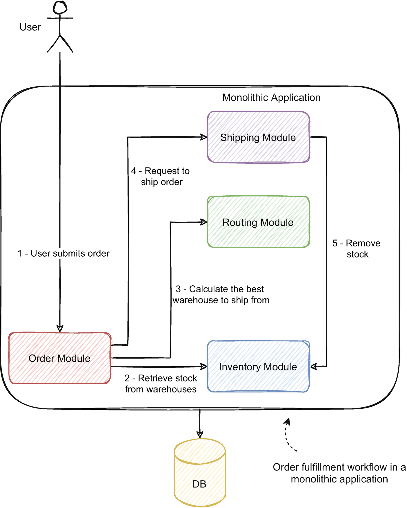

订单履行流程遵循我们刚刚讨论的流程：

- 用户提交订单，订单模块接收订单。
- 订单模块从库存模块请求每个仓库的库存信息，并验证是否有足够的库存来完成订单。
- 订单模块请求路由模块为该客户的地址和可用仓库计算最佳仓库。
- 当路由模块计算出最佳仓库时，订单模块请求发货模块发货。
- 运输模块（如果我们遵循协调器模式，也可以是订单模块）请求库存模块的库存更改并运送订单。

希望我们的电子商务平台一次没有一个用户使用它；这意味着它只会取得最小的成功，尽管它会使事情变得容易得多。随机数量的用户将浏览并提交他们自己的订单。假设另一个用户为我们同时购买的同一件商品提交了订单。应用程序将并行接收和处理两个订单。不幸的是，两个订单都来自美国，我们购买的产品在最近的仓库中只剩下一个库存单位。有了前面的流程，系统将履行哪个订单？
如果我们足够倒霉，而且我们在生产中总是倒霉，那可能是两个订单。想象一下，如果两个订单并行通过工作流，订单模块将检索库存并请求路由模块计算最佳仓库以检索库存。假设美国仓库有一个库存单位，英国仓库有一个库存单位。如果用户在美国下了两个订单，路由模块可能会回答这两个订单的最佳仓库是美国的仓库。推进时，两个订单将从同一仓库中检索库存。由于只有一个库存单位可用，因此根据实施情况，一个订单可能会为不存在的库存单位提前或失败。尽管如此，其他仓库中可能仍有库存可用于完成该订单。
在单进程应用程序中，更容易管理这个问题，我们可以使用多种策略。我们可以使用悲观的方法，锁定每个产品（或产品尺寸，取决于产品是否因尺寸而异）的订单处理。如果我们收到我们正在处理的产品的第二个订单，它将不得不等待第一个订单的处理完成。一个重要的细节是锁定每个产品；我们仍然可以并行处理不同的产品；我们只是避免同时加工相同的产品。此细节可确保应用程序保留部分性能且不会受到严重影响。
或者，我们可以使用乐观方法并假设没有并发。工作流通常会在没有任何锁定或验证的情况下运行。在最后一步，运输模块可以检测是否没有可用库存，并请求路由算法使用最新的库存再次运行，重新触发流程。
我们还可以划分我们的请求，以便应用程序永远不会同时处理同一产品的订单。这样，就可以构建高并发、高扩展性的系统，而无需锁定或重试；我们通过架构而不是实现来解决并发问题。我们现在不会详细介绍如何实现这一点，但我们将在本章末尾通过一个实际示例来详细介绍这个概念。
事件驱动服务中的并发性有何不同？事实上，其中一些策略仍然适用于事件驱动的服务，至少在某些用例中是这样。由于服务的分布式和水平可扩展性，其他人无法应用。让我们通过一个例子来说明这一点。图 6-2 显示了库存服务中的订单创建事件消费工作流。

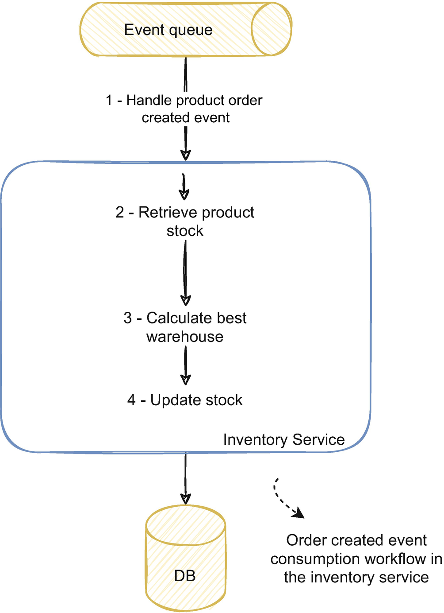

库存服务需要为提交给系统的每个订单更改库存。为此，它处理来自事件队列的订单创建事件。对于每个事件，该服务必须从所有仓库中检索当前产品的可用库存，计算满足订单的最佳仓库，并更新该仓库中产品的库存。
在这个例子中，我们可能会遇到一个并发问题，就像我们在上一个使用单体应用程序的例子中所做的一样。例如，如果我们同时收到为同一产品创建的订单的两个事件，该服务将获取两个订单的产品库存并计算最佳仓库。如果仓库相同，该服务将尝试同时从同一仓库检索库存，如果库存不足，可能会引发并发问题。
对于某些服务，在单线程中工作并完全避免并发问题可能就足够了；然而，这并不是最常见的用例。正如我们在本章开头所讨论的，我们将事件驱动的服务设计为可水平扩展并迅速响应变化的负载或使用需求。我们经常采用事件驱动架构来拥有具有这些特征的系统。需要扩展和处理越来越多的请求通常意味着我们需要高性能服务。单线程服务不太可能削减它；正如我们所讨论的，并发就是性能。
我们可以水平扩展单线程服务，但我们可能需要比使用并发和并行时更多的服务。即使托管在云提供商中，单线程服务也可能不会使用所有可用的物理资源。根据服务的作用，它们通常只使用适度比例的 CPU 和内存，即使在较低层的机器上也是如此。你可能会猜到，这不符合成本效益，而且我们没有充分利用可用资源。此外，由于是单线程，我们无法调整服务以充分利用可用资源。在使用并行性时，我们可以调整服务的数量，以及每个服务的并行度，以优化所需的最少机器（或容器）数量，最大使用物理资源，相应地优化成本和性能指标。
图 6-2 中的示例及其可能产生的并发问题与我们在使用单进程应用程序时讨论的问题具有相同的性质，如图 6-1 所示。事件驱动的服务与我们之前讨论的情况有何不同？在处理并发时，拥有同一服务的多个实例会增加额外的复杂性。图 6-3 说明了这种情况。

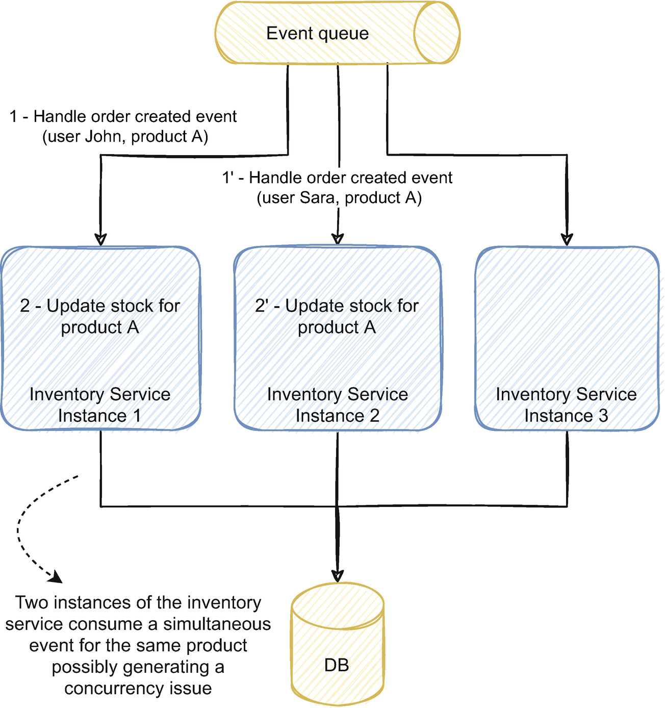

图 6-3 说明了库存服务的三个实例。所有三个实例都彼此独立地处理事件。它们也可以在每个实例内并行处理多个事件，因此我们有两个并行度，在每个实例内和实例之间。在此示例中，该服务同时接收针对同一产品（产品 A）的两个订单创建事件，一个针对用户 John，一个针对用户 Sara。
在服务的实例中，我们可以使用在单进程应用程序（如单体应用）中使用的相同策略。但是他们不能保证我们不会有并发，因为其他实例可能同时处理并发更改。例如，如果我们在实例 1 中锁定产品 A，则该锁定将仅在该实例上起作用；由于是一个单独的独立进程，实例 2 将不知道它。
对于没有经验的开发人员来说，这种并发问题可能看起来很牵强，不太可能。公平地说，其中一些问题发生的可能性很小。让两个不同的用户同时购买库存有限的产品的相同变体的可能性有多大？通常它归结为几毫秒的窗口。解决一个发生概率如此低的问题是否值得，即使它偶尔发生？有一些解决问题的方法比忍受每年发生一两次错误的代价更高。
最后，一切都与规模有关。我们在第 1 章中讨论了事件驱动架构如何成为解决具有挑战性的可伸缩性问题的答案，并且在现有应用程序难以满足给定规模的情况下最好地应用。当我们每秒消耗数十、数百或数千个事件时，并不是关于它如何可能不会发生。它会，每小时或每分钟几次。
这不仅仅是说我们的解决方案是高性能的和水平可扩展的，也是说它在规模上是一致和值得信赖的。无论未来业务需要多大的规模，无论你投入多少负载，这种问题都不会发生。我们不能掉以轻心，我们需要深思熟虑和可持续的策略来从头开始解决它。

## 6.2 悲观与乐观并发，何时和何时不使用

传统上，有两种类型的策略来处理并发，悲观和乐观。事实上，我提出了第三种方法，即完全避免并发，通过设计处理并发，而不是通过实现处理并发。本节将详细介绍悲观并发和乐观并发的区别，何时使用它们，以及架构和数据模型设计如何完全避免并发。
悲观并发和乐观并发是道歉和请求许可的区别 .1 悲观策略请求访问资源并且只会根据响应采取行动，而乐观策略假设他们可以访问资源，当他们没有时，他们道歉采取相应的行动。
让我们用上一节中讨论的示例来说明这一点。在图 6-2 中，我们讨论了库存服务必须如何获取库存、计算最佳仓库以及更新该仓库的库存。我们可以采取悲观的方法，在操作过程中锁定产品的库存数量。或者我们可以假设没有并发，计算最佳仓库，并尝试更新库存。如果在此期间库存发生变化，我们可能会失败或重试该操作。
悲观并发策略预先锁定资源。服务请求访问资源；如果它可用，则应用程序将其锁定，并且在应用程序释放资源之前可能发生的所有其他访问都不可用。假设资源不可用（另一个使用者或线程已经锁定了它）。在这种情况下，访问将失败，应用程序将等待释放锁或使操作失败。
乐观并发策略假设没有并发并在出现并发时采取行动。通常，不涉及锁定；应用程序的流程在没有同步的情况下运行。当应用程序将要保留更改时，它会验证自操作开始以来是否有任何更改。如果是，应用程序将中止或重试操作。

### 6.2.1 悲观与乐观的方法
悲观的方法是最容易推理的，因为一旦应用程序获得了锁，我们就可以以单线程的心态来推理程序的流程。这个属性极大地简化了我们理解和开发服务逻辑的方式。但是，它可能会对性能产生相当大的影响。由于我们正在锁定资源并阻止其他请求访问它，因此对同一资源的请求数量越多，应用程序响应所需的时间就越长。
乐观方法通常不涉及任何类型的锁定，也不会阻塞应用程序。在某些情况下，缺少锁会带来更高的性能；在合适的条件下（我们将在接下来详细介绍），它将表现为没有并发预防策略到位。但是，每次检测到写冲突时，它都必须重试该操作，这可能代价高昂。此外，在开发服务逻辑时使用并发代码进行推理更加复杂，并且很容易引入错误，而无需持续关注并发问题。重试还必须是幂等的，这是事件驱动服务中的一个常见问题，我们将在第 7 章详细介绍。
重试操作通常比获取和维护锁更昂贵。例如，在我们之前讨论的情况下，使用悲观方法并锁定库存服务的执行会影响性能。但是当服务检测到冲突时重试操作意味着服务必须获取库存、计算最佳仓库并再次尝试保存信息。如果这种情况发生得足够频繁，它可能比通过锁定来限制资源的访问要慢。想象一下，如果我们有 10 个并发用户尝试购买相同的产品，按照乐观的方法，10 个中的一个会成功，但其他 9 个会失败并且必须重试。在下一次重试时，有些可能会失败并且必须再次重试。在这些情况下，最好预先锁定资源并调解访问。
只有当手术成功的机会足够高时，乐观的策略才具有成本效益。要遵循的一个很好的规则是，当请求冲突的可能性很高时使用悲观方法，而在可能性较低时使用乐观方法。如果请求很可能发生冲突，我们会限制对资源的访问，以保证有序访问并防止连续重试。在仍然有可能但不太可能发生请求冲突的用例中，我们可以使用乐观方法并享受相同的性能，就好像我们没有防止并发的机制一样，除非对于导致并发的不太可能的请求。在并发概率较低的环境中使用悲观方法可能会严重影响一小部分事件的性能；因此，成本效益比较小。

### 6.2.2 通过实现和设计解决并发问题
例如，假设我们的电商平台有少量热门产品，活跃用户数以千计，多个用户同时订购同一产品的几率很高。在这种情况下，我们可能会从使用悲观的方法中受益更多。另一方面，假设产品的销售时间预计会更长，比如一个房地产销售平台，在这个平台上，房屋在相当长的一段时间内都在销售，而实际上只有少数用户要求购买房屋。在这种情况下，乐观的方法可能是最好的。
与大多数解决方案一样，它不是非黑即白的选择。我们可以使用这两种方法，也可以根据需要将它们结合起来。架构中甚至特定服务中的用例可能会受益于在一个地方应用悲观方法而在另一个地方应用乐观方法。
通常，困难的部分不在于决定哪种方法更有益，而在于随着时间的推移，它能够适应不同的需求。不同的系统和应用程序表现出不同的使用模式。并发的可能性和冲突模式经常随着时间的推移而变化；在有限的时间窗口内，高度并发的用例可能如此。例如，我们的房地产平台可能具有低并发模式，除非对于具有巨大需求并同时吸引数百名用户的零星、千载难逢的交易房屋。拥有一种不因用例而不同而因特定时间跨度而变化的策略是很复杂的。
为了处理这些情况，最好通过设计而不是实现来解决并发。在事件驱动服务的特定情况下，路由消息和使用端到端分区是最好的方法，因为它以高性能和透明的方式从整体上避免并发。然而，正如我们之前所讨论的，事件驱动架构通常不仅仅由事件驱动服务组成。有时，在现实世界中，我们需要结合异步和同步功能。在这些用例中，我们可能需要使用传统的乐观或悲观策略，但它们是例外而不是规则。
通过设计解决并发性并不总是可行或实用的。正如我们将在第 6.6 节中详细说明的那样，它还具有一些可能不适用于每个用例的限制。通过设计处理并发依赖于能够以不可能并发的方式设计系统。在事件驱动的架构中，通常基于事件路由。在各种用例中，路由事件并不总是可行的，例如，当我们没有合适的路由密钥或从外部系统集成时。在这些情况下，最好通过实现来解决并发问题。实现并发也更容易推理，因为它类似于传统的并发处理方法。在接下来的部分中，我们将首先通过实现策略来进行处理，因为它们将锻炼你对并发问题的思考过程，更容易掌握，并且在架构策略不切实际时是你工具箱中的宝贵工具。
数据建模也在并发中发挥作用。我们对数据建模的方式会影响性能以及我们处理并发的方式。在第 3 章中，我们在详细介绍 DDD 时讨论了聚合的大小以及如何不对同一聚合进行并行更改。聚合大小也会影响系统的并发程度，从而影响系统的性能。例如，假设我们的平台销售衣服，我们可以选择设计聚合以反映产品或产品的尺寸（如 XS）。如果我们选择产品粒度，我们可以同时处理不同的产品，如果我们选择尺寸粒度，我们可以同时处理不同尺寸的产品，甚至同一产品。较小的聚合大小具有更高的吞吐量，但也具有我们在第 5 章中讨论的所有消费者的含义，并将在第 8 章中进一步详细说明。
最后，我们在本章中讨论的处理并发的策略在同一服务的多个分布式实例（例如，多个库存服务实例）的范围内。你可能会问如何解决不同服务之间的并发问题（例如，订单和库存服务之间）。这些策略（除了端到端分区，正如你将看到的）在不同的服务中并不有效。虽然我们可以使用它们，但一个服务不应该锁定另一个；它们是自给自足的，应该能够独立扩展。为了管理不同服务的并发性，我们应该使用更高级别的方法，如 Saga，如第 4 章所述。

## 6.3 使用乐观并发

6.2 节讨论了乐观和悲观并发预防策略的工作原理以及何时应用它们。 但是我们如何在实践中使用它们呢？ 在本节中，你将通过一个实际示例学习如何应用乐观并发。
让我们看一下我们在第 6.2 节中讨论的涉及库存服务的相同示例。 在处理订单创建事件时，该服务必须检索产品库存，计算最佳仓库，并在相应仓库中移除该产品的库存。 图 6-4 说明了当服务处理同一产品的两个订单事件时的这个过程。

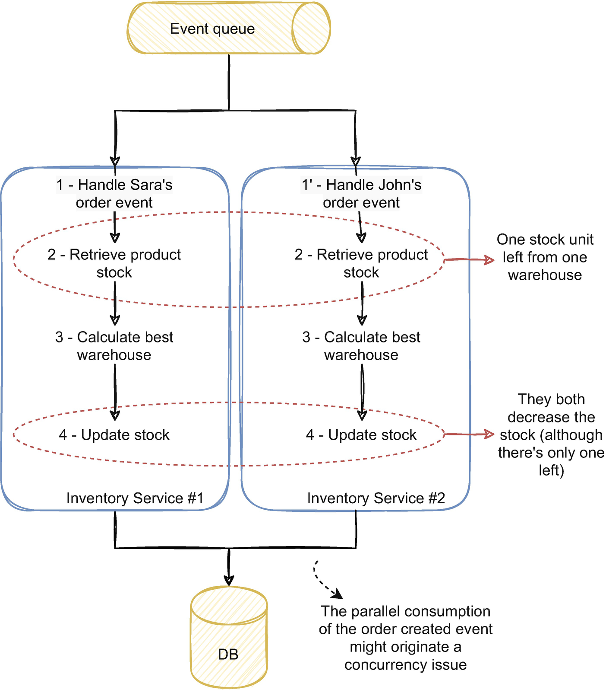

服务流程的两个实例同时为一个订单创建事件：一个来自 Sara，一个来自 John。两人都订购了相同的产品，在一个仓库中只剩下一个库存单位。如果更新库存的第四步只减少数量，则产品最终会出现负库存。一个直接的解决方案可能是在更新库存之前添加一个额外的步骤，以检查是否仍有足够的库存来执行操作。尽管如此，我们只会减少出现并发问题的机会，并不会完全消除它。正如我们所讨论的，即使机会很小，服务流程的事件规模和数量也会使不太可能发生的事件成为确定的。即使我们目前的规模很小，但当规模和吞吐量增加时，我们仍然有可能在未来发生这种情况。
我们如何使用乐观的方法来解决它？正如我们在 6.2 节中讨论的那样，乐观预防策略假设没有并发并在检测到并发时采取行动。在这种情况下，当服务更新库存时，如果该产品的库存自我们在第 2 步中提取后没有发生变化，它只会应用更改。如果是，则服务不会减少库存并且会，例如，重试该操作。
例如，如果服务使用 SQL Server，让我们来解决此解决方案。库存数据库将库存信息保存在包含有关产品、仓库和库存数量信息的表中。清单 6-1 说明了该表的示例架构。

```json
-- Create table stock
CREATE TABLE Stock #A
(
    ProductId int,
    WarehouseId int,
    Quantity int,
    LatestChangeTimestamp bigint, #B
    primary key (ProductId, WarehouseId)
)

UPDATE Stock SET Quantity = Quantity - ? WHERE ProductId = ? AND WarehouseId = ? #C
UPDATE Stock SET Quantity = ? WHERE ProductId = ? AND WarehouseId = ? #D
#A Stock table definition
#B Unix timestamp column
#C Update stock by decreasing the current quantity from the ordered amount
#D Update stock by setting the quantity to the calculated value by the service
```

在获取库存并计算仓库后，库存服务将更新此表中的数量列。它可以通过两种方式做到这一点，通过选择清单 6-1 中的两个更新之一。如果服务使用第一个更新库存，库存数量可能变为负数（1-1，然后是 0-1）。如果它使用最后一个，尽管只有一个数量可用，但通过将库存设置为零，这两个操作都会成功。
使用乐观的方法，我们需要知道在进行第二次更新时数据是否发生了变化。我们可以使用 LatestChangeTimestamp 列做到这一点。每次库存数量发生变化时，该列也会更新更改的时间戳。在图 6-4 的步骤 2 中，服务获取当前股票以及上次更新的时间戳。在步骤 4 中，如果时间戳仍然相同，服务仅更改股票。它可以使用类似于清单 6-2 中所示的更新操作。

```json
UPDATE Stock SET Quantity = ?
WHERE ProductId = ?
AND WarehouseId = ?
AND LatestChangeTimestamp = ? #A
#A Version clause
```

使用LatestChangeTimestamp 的条件下，只有在时间戳仍然相同的情况下才会应用更新；否则，它不会找到，因此不会影响任何行。我们使用了时间戳，但它可以是增量版本或其他有意义的字段。 Unix 时间戳是用作版本的简单属性，因为我们很容易从时间戳生成它；它是一个整数并且总是增加。操作之后，如果没有行受到影响，那么记录就是并发的目标，我们可以重试操作。在这种情况下，由于缺货，最后一个订单将无法完成。
像我们在此详述的乐观方法非常简单易用。它们不依赖于特定的技术或外部依赖。如果我们了解了这个机制，我们就可以不管技术如何应用它。当并发是一个问题时，这可能是一个简单而高效的解决方案。
在这个例子中，我们使用了 SQL Server ，但它可以应用于大多数数据库技术。事实上，许多技术都在幕后使用这种策略。例如，ElasticSearch 有一种管理并发的方法，它使用序列号 2（与我们讨论的版本或时间戳相同）以与我们在此处详述的非常相似的方式来解决并发问题。 Cassandra 有轻量级事务3 的概念，与我们刚刚讨论的机制非常相似。在 Cassandra 的上下文中也讨论了乐观锁定 4 的概念，它使用了相同的类似方法。 NEventStore，5 一种流行的事件源框架，可与 MongoDB 的持久性引擎一起使用，使用相同的概念来管理对同一聚合的并发更改。 EntityFramework 也有一个类似于我们讨论的乐观并发管理方法6。
这种方法的简单性和灵活性使其成为我们工具箱中的可行解决方案，并将其应用于我们认为合适的地方。正如我们在 6.2 节中讨论的那样，乐观并发在并发概率较低的环境中大放异彩。接下来详细介绍可能发生冲突的操作的环境以及它们如何从悲观方法中受益。

## 6.4 使用悲观并发
悲观的并发预防策略通常是处理并发的标准方法。它们更容易推理，因为它们保证不会同时发生其他操作。本节将讨论如何使用悲观的方法来处理并发。我们将通过一个类似于我们在第 6.3 节中详细介绍乐观并发时讨论的实例来处理实例。
让我们使用图 6-4 中所示的相同示例。库存服务的两个实例获取、操作和更新同一产品的库存数量。在单进程应用程序中（例如，如果我们只有一个库存服务实例），典型的方法是在服务处理该调用时锁定资源。但是由于内存锁只对本地实例有效，当我们有两个或更多服务实例时，这不是正确的方法。

### 6.4.1 事件驱动微服务中的分布式锁

我们可以使用的类似方法是分布式锁。分布式锁的工作方式与本地锁（如互斥锁）相同，但依赖于外部依赖来管理跨多个实例的锁。图 6-5 在我们之前讨论的同一示例中说明了这种方法。

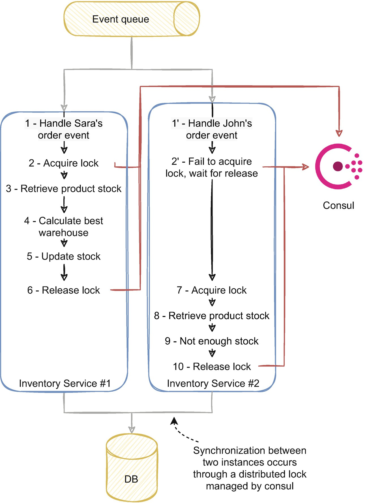

处理 Sara 事件的第一个实例成功获取锁。 然后它通过获取股票继续处理事件。 第二个实例接收 John 的命令并尝试获取相同的锁。 由于第一个实例已经获取了它，该服务将阻塞直到它被释放。 同时，首先，Sara 的订单已被完全处理，并删除了产品中仅剩的库存单位。 第一个实例前进到最后一步并释放锁。 通过释放锁，第二个实例开始处理约翰的订单并获取库存。 由于 Sara 的订单已经移除了库存，因此第二个实例将拒绝该订单。
让我们深入探讨这种情况如何在代码中发挥作用。 清单 6-3 说明了我们如何在库存服务中实现锁定逻辑。

```java
public async Task Consume(CancellationToken cancellationToken,OrderCreatedEvent orderCreatedEvent)
{
    // Generate lock key based on product id
    var lockKey = orderCreatedEvent.ProductId.ToString(); #A
    // Create consult client and lock
    var distributedLock = consulClient.CreateLock(lockKey);
    try
    {
        // Acquire lock for that product
        await distributedLock.Acquire(cancellationToken); #B
        // Fetch product's stock
        var stockList = await this.stockRepository.GetStockAsync(orderCreatedEvent.ProductId);
        // Calculate best warehouse for that order
        var bestWarehouseId = this.routingService.CalculateBestWarehouse(stockList, orderCreatedEvent.OrderId);
        // Change stock for that warehouse
        await this.stockRepository.UpdateStockAsync(
            orderCreatedEvent.ProductId,
            bestWarehouseId,
            orderCreatedEvent.Quantity);
    }
    catch (Exception)
    {
        // Any exception occurring during the execution of the process
        // is handled here
    }
    // Release the lock
    await distributedLock.Release(cancellationToken); #C
}
#A Generate lock key
#B Acquire lock based on the generated key
#C Release the lock once the operation finishes
```

我们创建和释放锁的方式与使用互斥锁或锁语句在本地内存中锁的工作方式非常相似。该服务不是在本地管理锁，而是依靠外部依赖项来管理同步，在本例中为 Consul。使用分布式锁的语句是对 Consul 的请求。在distributedLock.Acquire方法中，实例请求获取锁；如果成功，它将继续进行剩余的操作。如果该锁已被另一个实例使用，它将阻塞直到它被释放。一旦服务完成事件处理，实例就会释放锁并使其可用于其他实例，使用distributedLock.Release 方法。
重要的一点是我们如何生成锁定密钥。在此示例中，锁定密钥是产品 ID，由 lockKey 变量说明。我们可以选择一个静态键，例如“InventoryServiceKey”，而不是为每个事件生成不同的键。这意味着服务将尝试锁定事件消费，而与每个事件的事件内容无关。这样一来，服务就会成为单线程服务，服务的性能就会明显下降。我们也不会从阻止每个事件的消耗中获得太多收益，因为处理同一产品的同时更改可能会出现并发问题，而不是跨不同产品。
使用锁键作为产品id保证只有一个实例同时处理一个产品，但是不同的产品是并发处理的。这是一个重要的细节，因为它极大地有利于服务的性能。这个细节也与我们在第 3 章和第 4 章中讨论的有关聚合大小的内容有关。如果聚合范围相当大，则会对服务的性能产生负面影响，因为它限制了具有更高级别并发更改的能力。
我们使用 Consul 来管理锁，但还有其他选择。 ZooKeeper 是一种流行的提供分布式同步和配置的工具，是另一个可行的选择。 Kafka 过去使用 ZooKeeper 来管理有关跨节点的集群、主题和分区的信息。它还可以提供全局同步的完全分布式锁。7 Redis 也可以是一种选择，并且有几种分布式锁的实现Redis。8 Martin Kleppmann 还有一篇有趣的文章9 关于Redis 的fencing locks 方法，值得一看如果你想了解有关实施及其影响的更多详细信息。
你可能还记得我们在前几章讨论 Jepsen 测试及其在验证分布式系统安全性方面的用处。事实上，Jepsen 测试在过去发现了 Consul 的问题，10 例如，虽然它们被超越并且 Consul 完全符合 Jepsen 测试，但它们引发了一个有趣的问题，即我们的分布式服务如何与外部锁管理系统交互.事实上，如果服务崩溃、不可用或遭受网络分区，会发生什么？在这种情况下，Consul 将释放锁，但该服务实例可能仍会与其他实例同时更改信息。
Kyle Kingsbury 有一个关于分布式数据库的精彩演讲12，强调了其中的许多问题以及分布式锁的相关限制。分布式锁在某些用例中可能很有用，正如我们所讨论的，它可以是将悲观方法应用于并发的一种直接方法。然而，它们也受到有问题的限制，并可能导致服务处理无效状态。处理不一致和暂时性错误的技术会有所帮助，例如事件幂等性和版本控制，这将在第 7 章中详细介绍。它们还引入了第三方工具的额外依赖来管理锁。分布式锁在少量使用时以及在必须锁定的特定用例中很有用。但是，在大多数用例中，其他替代方案更直接且影响更小。

### 6.4.2 数据库事务作为分布式微服务中的并发方式
也许最常见的方法和最先想到的处理并发问题的解决方案是使用事务。事实上，它们可以是解决一些并发问题的一种非常直接且高效的方式。当我们水平扩展一个服务并添加更多实例时，它们都共享同一个数据库。我们可以将它用作所有实例之间的同步点，并且由于其广泛使用，大多数开发人员很容易理解事务。我们在这里不包括我们在第 4 章中讨论的分布式事务和两阶段提交协议。
我们如何解决我们在图 6-5 中详述的库存服务的并发问题？我们可以在获取库存时打开一个事务，计算最佳仓库，并在更新它时提交事务。这样，数据库保证在事务运行时没有其他实例更改相同的信息。我们经常听到交易问题及其对性能的影响；然而，通常情况下，这更像是一种理论问题，而不是实际问题。事务是一种非常优化的工具，即使在高吞吐量系统中也可以实现出色的性能。关系数据库通常与单体数据库相关联（正如我们在第 4 章和第 5 章中讨论的那样），但如果该服务从使用中受益，它们在应用于特定服务时与任何其他数据库一样有效。
一些数据库还根据应用程序指定的给定资源启用锁定和解锁服务。其中一个例子是来自 SQL Server 的 sp_getapplock13，它可以充当分布式锁，就像我们与 Consul 讨论的那样。我们在一些使用这种方法的用例中观察到了一些成功。尽管如此，与将数据库用作分布式锁相比，还有更可持续和直接的方法来处理并发。
尽管有用且直接，但事务对于长时间运行的操作可能会很麻烦，并严重影响系统的性能。我们讨论的例子相对简单，但想象一下，如果计算最佳仓库涉及更复杂的操作或与外部系统的通信。事务可能会在不可行的时间内锁定数据。
此外，这种系统中的事务管理往往会泄漏到应用程序或域逻辑。在实践中，我们如何替换事务的锁？最简单的方法之一是将操作包装在 TransactionScope 中（在 C# 中）。如果我们交换数据库技术，该代码是否会像预期的那样保持不变？可能不会。公平地说，我们不经常更改数据库技术，如果有的话。然而，它暗示了数据库的事务逻辑很容易传播到域和应用程序逻辑，这会使代码难以维护。
交易也仅限于支持它们的技术。许多 NoSQL 数据库不支持事务。总体而言，如果我们使用的是使用事务的数据库，它可以是处理并发问题的一种简单方法，并且可以快速解决一些紧迫的问题。尽管如此，正如我们在讨论分布式锁时所看到的，更好的解决方案是完全避免并发，我们也将在本章末尾讨论。

## 6.5 处理乱序事件
也可以从并发派生的一个相关概念是乱序事件。直到现在，当我们讨论来自事件流的服务消费时，我们总是假设流中的事件是有序的。然而，情况并非总是如此。由于多种原因，服务可以使用无序事件。本节将讨论事件如何变得无序以及我们如何处理和减轻它们的影响。
为什么事件排序很重要？让我们用一个例子来说明。假设我们有一个产品服务，它具有产品信息的聚合视图并将该信息公开给其他服务。它还处理来自库存服务的库存事件，并以非规范化读取模型在本地保存产品和库存信息。每次产品库存发生变化时，库存服务都会发布库存变化事件。例如，给定的产品有三个库存单位，用户购买了两次。库存服务将发布一个库存更改事件，第一次购买时剩余库存数量为 2，第二次采购时发布库存更改事件，剩余库存数量为 1。产品服务处理这些事件并将产品库存更新为数量 2，然后更新为数量 1，类似于我们在图 6-5 中讨论的内容。
但是如果这两个事件以错误的顺序到达怎么办？如果最早的事件（库存变为数量二）在最晚（库存变为数量一）之后到达，则产品服务会将库存更新为数量二，这并不反映产品的实际数量。

### 6.5.1 事件如何失序？

由于多种原因，可能会发生不正确的订购。同一队列的多个发布者也可以有一个不同步的时钟。跨机器的时钟同步通常使用 NTP（网络时间协议）完成；关于这个协议以及它如何实现跨机器时钟同步的考虑超出了本书的范围；但是，大多数提供商的中位数在毫秒范围内或更低。对于大多数用例，这种同步就足够了，并提供了令人满意的结果。
除了时钟同步问题之外，事件流可能一开始就没有正确的顺序。排序问题也可能与我们使用的消息代理技术有关。例如，当多个订阅者重新排队消息时，使用 RabbitMQ 的单个消费者可以观察到乱序消息。 14 网络分区也可能导致排序问题，具体取决于代理的配置。
弹性策略也会影响订购。例如，根据实现重试的方式，重试消息时可能会丢失顺序。我们经常讨论重放事件流以重建数据视图的能力。在某种程度上，无论是否预料，它都会危及消息排序，因为我们将开始使用较旧的消息。
并发性可以而且经常会在排序事件中发挥作用。即使事件在事件流中按顺序发布和存储，由于不同的处理速率，同一服务的两个实例（或什至同一服务的两个线程）同时消费消息也可能对它们进行排序。图 6-6 说明了这个例子。

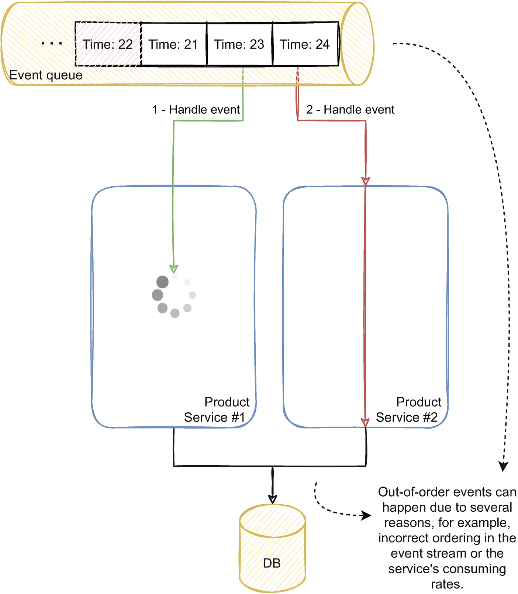

根据事件的处理逻辑，两个事件可能有不同的操作。即使两个事件具有完全相同的操作，关联的数据也可能不同，这意味着获取和处理该数据的时间不同。两个实例，甚至两个线程，将以略有不同的速率执行相同的操作（由于相关数据，甚至由于底层硬件和操作系统特性）。同时消费这两个事件足以让一个消费者偶尔比最近的事件更快地处理并发的旧事件。

### 6.5.2 用版本控制解决乱序事件

由于事件可能由于多种因素而失去顺序，我们可以做些什么来防止无效状态？一种方法是使用事件版本控制。事件反映了实体发生的变化。从概念上讲，事件的版本是更改时实体的版本。例如，如果我们的实体是产品，则产品创建事件可能具有版本 1；如果有人更改了产品的类别，它会发布一个版本 2 的事件；等等。
每个实体的顺序版本的概念与 DDD 聚合概念有关。实体与我们在域中定义的聚合相关。每次实体更改时，版本都会增加。每个版本都代表该实体在该给定时刻的状态。事件可以使用相同的版本并与触发事件的状态更改相关。
然而，在分布式系统中管理顺序的、唯一的和增量的版本可能很棘手15。例如，Twitter Snowflake 16 强调了在像 Cassandra 这样的分布式数据库中生成唯一 ID 的挑战。一致地生成这些 id 也会对繁重的工作负载产生性能影响。例如，时间戳或使用自纪元以来的毫秒数可能是一个有效的替代方案。这样，每个服务都可以轻松生成始终高于前一个的版本，尽管不是顺序的。
顺序版本可能与部分事件相关，其中事件没有实体的完整信息。例如，如果库存服务发布库存事件和缺货事件，则构建产品库存的服务不能跳过任何版本。否则，股票加起来不会达到正确的价值。在这些用例中，服务通常需要以确切的顺序（不能跳过版本）使用流中的每个事件。当一个服务表现出这种行为时，它可能更难推理并且通常弹性更小，我们将在第 7 章中讨论。
我们设计事件的方式也会对秩序的重要性产生影响。我们需要消耗流中的所有库存和库存，以获得最新的库存数量（这还有其他含义；例如，我们需要至少暂时允许负库存）。但是请注意，与库存变化相反，库存进出事件不是幂等的，这是一个重要的性质，我们将在第 7 章中讨论。
事件版本控制提供了一种方法来了解服务正在处理的事件是否比我们的内部状态更旧或更近。在我们与图 6-6 中的库存服务讨论的示例中，当使用版本 21 的事件时，我们可以检测到产品库存的当前版本是 22。然后我们可以决定做什么。
某些业务流程可能会受益于仍在处理事件或在给定窗口内延迟到达的所有事件。例如，如果我们需要在每次产品有最后一个库存单位时发送通知，那么订单就不会那么相关，我们可能希望处理每个事件，尽管事件到达的顺序。然而，在我们更新每个产品的当前库存的这个例子中，我们只对最新状态感兴趣，所以我们可以忽略旧事件。
请注意，即使使用事件版本控制并验证每个事件的版本，我们也不能绝对保证我们不会处理旧版本。两个服务可以同时处理顺序版本，并比旧版本更快地处理最新版本。我们仍然需要将其与我们之前讨论过的一种并发预防策略相结合。
版本控制事件总是相关的，并且通过使用聚合版本或时间戳，它对消费者使用很有用。在消费者端管理幂等性和无序事件很重要。我们还可以通过将消息路由到特定分区来将排序事件的责任委托给事件代理，我们将在 6.6 节中讨论。

## 6.6 使用端到端的消息分区来处理并发并保证消息排序
到目前为止，我们讨论了按实现策略排序和并发使用的解决方案。 我们讨论了可用于解决并发和排序问题的模式。 更好、更可持续的方法是完全避免并发和排序问题，通过设计解决并发问题。 本节将通过一个与我们在本章中讨论的示例类似的示例，并详细介绍消息流的内部工作原理以及我们如何对消息进行分区以完全避免并发。
让我们通过之前讨论的相同示例使用库存服务处理多个订单创建事件。 不要只关注库存服务，让我们看看从订单服务开始的流程。 图 6-7 说明了这个流程。

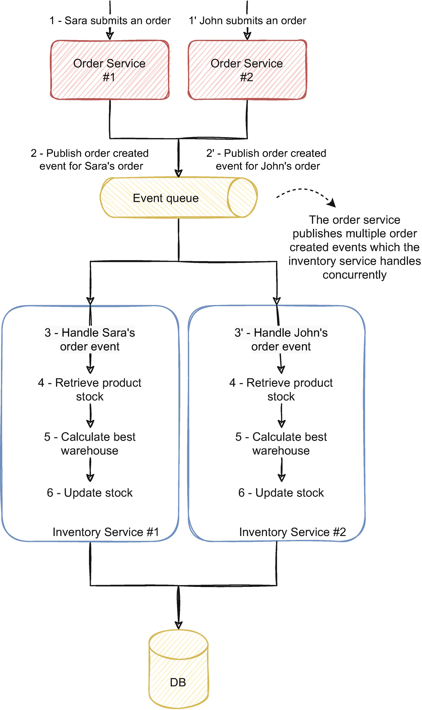

订单服务，比如库存服务，可以横向扩展，可以有多个实例；在图 6-7 中，它们每个都有两个。订单服务的每个实例处理多个订单请求；在这种情况下，Sara 和 John 都提交了订单。订单服务处理请求并发布事件，表明订单已创建并准备好遵循订单履行流程。库存服务处理这些事件并根据这些订单更改库存。由于 John 和 Sara 订购了相同的产品，只剩下一个库存单位，因此同时处理两个订单可能会产生与我们之前讨论的相同的并发问题。
我们如何通过对消息进行分区来解决这个问题？要理解这个概念，了解消息代理的内部工作方式很重要。为了说明这一点，让我们看一下 Kafka 并详细说明它是如何安排消息的。

### 6.6.1 使用 Kafka 的事件驱动消息路由的真实示例

在图 6-7 的示例中，订单服务向事件队列生成事件；在 Kafka 中，它被称为主题。库存服务订阅该主题并使用事件。事件被持久存储并在消费后保持可用（如我们在第 3 章中讨论的那样）。订单服务有多个生产者（因为订单服务有多个实例）和多个消费者，在本例中是各种库存服务实例。
在这种情况下，唯一的消费者是库存服务，但可能还有其他服务，也有多个实例读取主题。 Kafka 主题的剖析及其与不同服务的交互如图 6-8 所示。

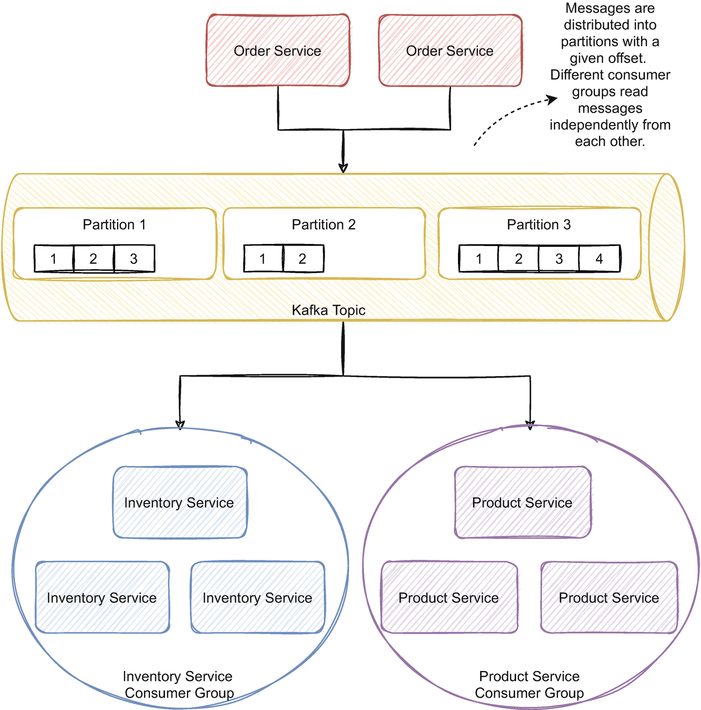

订单服务向 Kafka 主题发布消息。 Kafka 将这些消息分发到不同的分区。分区具有良好的可扩展性，因为它们允许生产者同时向多个节点写入数据和消费者读取数据。分区对于高可用性也很重要；分区可以跨多台机器复制以保证容错。
主题基本上是一个分布式追加日志；当服务发布消息时，代理将其附加到流的末尾。每条消息都有一个偏移量，表示每个分区在流中的消息位置。例如，如果给定的分区有 10 条消息，当生产者在流的末尾写入一条新消息时，它的偏移量为 11。
消费者从主题中读取并使用来自不同分区的消息。消息分发给具有相同消费者组的服务实例，每个消费者组充当一个消费者。图 6-8 中描述的示例显示了库存服务的三个实例和产品服务的三个实例。相同服务的实例具有相同的消费者组；不同的服务有不同的消费群体。例如，库存服务的三个实例中的每一个都消耗不同的消息；他们成群结队地在溪流中前进；因此，具有相同消费者组的不同实例永远不会收到相同的消息。不同的消费组将独立并发地从流中消费。例如，偏移量为 1 的消息将传递给库存服务的实例 1 和产品服务实例 2，但不会传递给同一消费者组中的多个服务实例。图 6-9 说明了两个服务的偏移量。

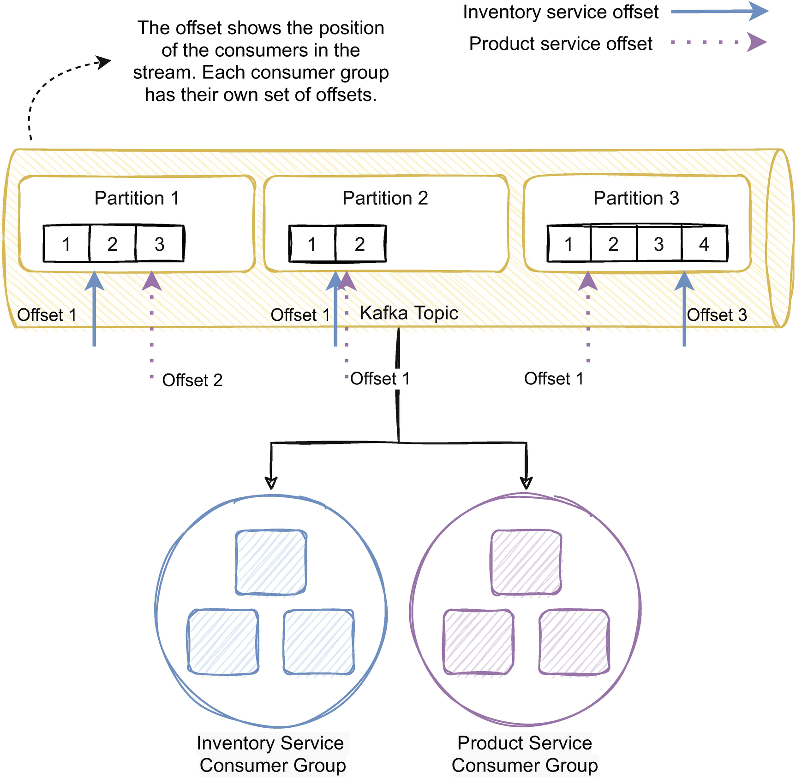

图 6-9 中的箭头说明了消费者在流中的位置。事实上，在Kafka中，消费者是廉价的；你可以将它们视为事件流中的一个指针——与临时消息代理相反，在这种情况下，消费者通常需要代理的额外工作，并且如果消费者开始在队列中堆积消息，则通常会很挣扎。如图 6-9 所示，消费者只在流中前进，消息保留在主题中并且不会被删除。如果一个新服务需要从流中消费，它就会有可用的消息。如果库存服务需要重建其状态，它只需将其偏移量设置为零并重新读取流。
主题的分区数量是系统可扩展性和性能的重要因素。 Kafka 为每个消费者分配了多个分区。例如，如果一个主题有六个分区，而库存服务有三个实例，则可能会为每个库存服务实例分配两个分区。在图 6-9 的示例中，我们有三个分区到三个服务实例；每个实例可能有一个分区。但是，如果我们决定通过再添加一个实例来进一步横向扩展库存服务会怎样？虽然一个消费者可以消费来自多个分区的消息，但每个分区只被一个消费者消费。因此，如果我们向库存服务添加另一个实例，则不会将其分配给任何分区；因此，新实例不会有任何负载。我们将无法进一步扩展服务。
我们可以在创建主题后更改分区数，但是添加分区不会改变现有数据的分区，这可能会给消费者带来麻烦，我们将在下一节中看到。分区的数量限制了我们的扩展能力；创建主题时一个可以说是合理的决定是预先计划主题的可伸缩性需求，并使用比当前需要更多的分区来创建它。该规划将为未来扩展服务提供空间。
Kafka 有两个关键特性可以帮助处理乱序事件和并发。在一个分区中，Kafka 保证事件的读取顺序与它们被写入的顺序相同。这保证了经纪人方面的订购；正如我们在 6.5 节中讨论的那样，事件仍然可以在消费者端失去顺序。需要注意的是，Kafka 只保证分区内的排序。一个主题有多个分区，因此不能保证跨分区和整个主题的排序。但是，在发布时，我们也可以定义事件的路由键。代理确保将具有相同路由键的事件传送到同一个分区。这个属性是我们可以用来避免并发和乱序消息的基本特征，我们将在下一节详细介绍。

### 6.6.2 事件驱动微服务中消息路由和分区的相关性
在本节的开头，在图 6-7 的示例中，我们讨论了库存服务如何通过同时处理订单服务的事件而出现并发问题。 并发问题是因为库存服务的两个实例同时处理同一产品的订单； 在这种情况下，John 和 Sara 订购了相同的产品。 John 的订单由一个实例处理，Sara 的订单由另一个实例处理。
但是，如果我们在订单服务中定义了一个路由键，这个例子会怎样呢？ 通过指定路由键，具有相同键的每条消息将被路由到相同的分区。 正如我们所讨论的，每个分区只有一个消费者。 如果我们使用产品 ID 作为路由键，则同一产品的每个订单都将被路由到同一个分区，并因此被路由到同一个消费者实例。 图 6-10 说明了这个流程。

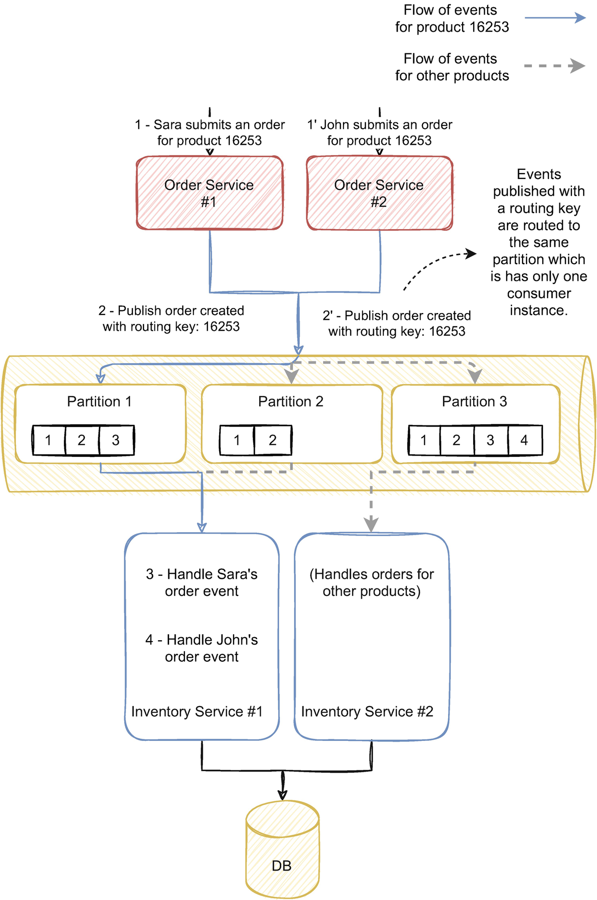

John 和 Sara 都试图购买产品 16253，它只剩下一个库存单位。订单服务使用产品 ID 作为路由键发布事件，在本例中为 16253。由于两个事件具有相同的分区键，因此它们都被路由到同一个分区，在本例中为分区 1。每个分区只有一个消费者;库存服务实例 1 正在处理来自分区 1 的事件，因此该实例肯定会收到这两个事件。该实例还将按照事件发布的顺序接收事件，因为在同一分区中保证排序。
看看这个例子，我们可能会认为其他服务的实例不会收到任何负载，但它们会继续接收事件，只是不是针对那个产品 id。其他实例仍在处理具有其他 ID 的其他产品。这种策略保证了每个具有相同分区键的事件都会被同一个实例处理，但每个实例都会继续处理分配给它们的分区的事件；因此，他们将继续加工其他产品。我们可以推理，好像我们为每个实例分配了一系列产品；范围内产品的事件将仅由相应的实例处理。
使用这种策略，我们只是将分布式并发问题转化为本地问题。这是否足以完全消除并发和排序问题？每个服务实例都可能具有并行性，因此每个实例内部仍可能出现并发问题。例如，我们可能会在一个实例中以正确的顺序接收 John 和 Sara 的订单，但两个线程可能会在实例内并发处理这些事件。但是，这样就不需要通过数据库或分布式锁管理器来同步多个实例。通过路由消息，我们避免了分布式并发问题，只处理本地并发问题，其中处理并发的传统机制是相关的。

### 6.6.3 使用端到端的分区来处理并发和排序

分布式同步很复杂，通常是复杂问题和极端情况的根源。可以说它不适合分布式事件驱动的思维方式，因为它在实例之间创建了强依赖关系。对消息进行分区是通过架构设计避免分布式同步的一种方式。然而，正如我们所讨论的，即使在本地范围内，并发仍然是一个问题。通过实现解决并发通常意味着复杂的开发，并且通常难以推理和维护。本小节将进一步介绍分区方法，并详细说明我们如何完全避免并发。
为了在服务的本地范围内处理并发，我们可以使用传统方法，如内存锁或我们在 6.3 和 6.4 节中讨论的技术之一。然而，一种可以说是通过设计处理并发的好方法是遵循我们在详细介绍代理的事件路由时讨论的相同方法。按照这种方法，我们可以将在服务中接收到的事件路由到特定路径。图 6-11 说明了这种情况。

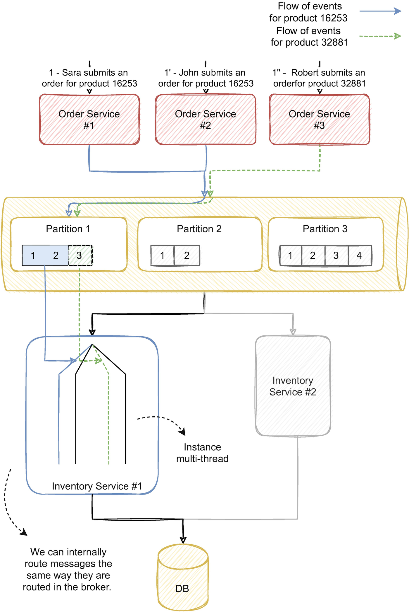

在库存服务的实例 1 中，我们详细说明了对应于服务并行度的几个线程路径。在这种情况下，服务并行处理四个事件。图 6-11 突出显示了两条路径，实线表示同一产品（ID 为 16253）的订单的两个事件的路径，虚线表示 ID 为 32881 的产品的第三个订单的路径。订单服务的三个实例使用产品 ID 作为分区键发布三个事件。代理将事件路由到分区 1，该分区分配给第一个库存服务实例。库存服务可以同时处理这三个事件，因为并行度可以同时处理四个事件。
但是，在处理事件时，我们可以根据路由键将它们路由到特定的线程路径。我们可以将具有相同键的事件转发到同一个线程，以便我们可以顺序处理它们。通过以单线程方式处理它们，不存在并发问题。服务本身是多线程的，因为其他线程将处理不同范围的路由键。例如，产品id为32881的事件将与产品id为16253的事件同时处理（如图所示），但id为16253的两个事件将依次处理；第二个只会在第一个完成时开始被消耗。我们可以使用代理使用的相同路由键甚至分区号来路由消息，只要分区数高于所有实例的并行数即可。
如果我们保证 order 服务按顺序发布事件，我们也避免了 ordering 问题。经纪人确保在分区内维护订单；如果我们在内存线程中分配消息时有相同的考虑，我们将保持端到端的顺序。
通过端到端分区，我们可以通过在服务内部和外部启用并行性并调整并行性以充分利用物理资源，同时完全避免并发和排序问题，从而实现更高的性能。它还避免了外部依赖、任何类型的锁定和重试的依赖。这种方法与事件驱动的思维方式有很强的协同作用；与服务的推理总是在事件流的上下文中。这是一种非常简单的方法，可以使用事件驱动的思维方式在没有性能开销的情况下完全消除排序和并发问题。开发可以在无并发上下文中实现，这大大降低了复杂性，并允许开发人员专注于业务逻辑而不是技术问题。

### 6.6.4 事件驱动微服务中端到端分区的局限性
正如我们所讨论的，端到端分区完全避免了并发并保证了排序。在完全事件驱动的架构中，它可以是跨服务一致应用的绝佳方法，但在某些用例中确实存在一些限制。它还有一些不显眼的警告，很容易被忽略。本小节将讨论这些限制并提出可能的解决方案。

#### 热点

事件代理使用分区键将事件路由到一个分区；因此，具有相同键的每个事件都将被路由到相同的分区。你可以想象如果整个事件集的很大一部分具有相同的键会发生什么情况；数据分布将在很大程度上不平衡。
例如，在我们之前讨论的用例中，我们使用产品 ID 作为分区键。但是想象一下，我们需要保证跨产品类别的并发性，并且我们不想同时处理具有相同类别的产品。我们可以使用类别 ID 作为分区键。假设我们的大部分产品目录由服装组成，而其他类别，如鞋子和配饰，只占整个目录的一小部分。通过这种设计，我们的大多数活动都将具有服装类别 ID。由于每个具有相同 id 的事件都会被路由到同一个分区，因此带有服装产品的分区将比其余分区大得多。
分区之间的这种不平衡称为热点。你可能还记得前几节的内容，分区数量对于性能和可伸缩性问题至关重要。在这种情况下，根据代理的设计，我们的大部分数据将分配给只有一个消费者的单个分区。这种不平衡也意味着单个实例将处理我们的大部分事件，这无疑会降低系统的性能。它还限制了扩展能力，因为无法将更多消费者分配给该分区。当消息数量非常大时，代理也可能会遇到困难；例如，Kafka 必须在一台机器中放置一个分区。如果我们有大量消息，将它们装入一台机器可能不切实际或成本高昂，而且代理可能难以妥善处理。
在我们的示例中，我们使用产品 ID 作为路由键；有些产品比其他产品更抢手，因此订单也更多，这是很自然的。拥有更多订单也意味着更多具有相同密钥的事件。但是，随着产品数量的增加，分区中的消息数量最终会趋于平均；订单少的产品将弥补订单多的产品。
选择分区键时的两个重要考虑因素是键的粒度和多样性。分区键需要足够细化以适应跨分区的均匀分布。它还需要有足够的多样性（比分区数大几倍）和足够多的不同值，以启用足够的路由选项。
可能存在没有足够的路由键可用的用例（正如我们在类别示例中讨论的那样），但这通常是例外。事件驱动的系统通常意味着大规模，尽管存在所有挑战，但它提供了足够的数据多样性以启用合适的路由键。但是，在选择路由键时要注意。

#### 瞬间热点
我们经常想到干净和柏拉图式的解决方案。如果我们收到三个事件并且有三个分区，则代理会将一个事件路由到每个分区。平衡，一切都应该如此。然而，在现实世界中，事情是混乱的、不可预测的，而且往往是混乱的。解决方案可能不会一直像我们预期的那样运行。
尽管大部分时间是可以预测的，但流量可能不稳定，并且可能会不时出现不可预测的模式。例如，在我们本节讨论的示例中，我们发布了订单事件并使用产品 ID 作为分区键。大多数时候，流量可能会比较稳定。然而，想象一下我们在我们的平台上投放了一款广受欢迎的产品，用户大量订购。这将临时生成大量具有相同路由键的事件，从而创建一个瞬时热点。
如果负载差异很大，系统的性能可能会在发生这种情况时下降。这通常是一种罕见的事件，并且系统可能会承担。但是，我们应该了解其含义，并了解是否会对业务产生相关后果。我们还应该设计我们的系统不经常产生瞬时热点。例如，我们应该避免使用相同密钥卸载大量事件的恢复过程。

#### 事件驱动和同步 API 的混合

端到端分区方法的一个明显限制是服务需要通过 API 处理事件和处理同步请求。尽管此类服务可能是事件驱动架构中的例外，但它们相对常见，并且可能使端到端分区方法不可行。此用例如图 6-12 所示。我们应该避免这种配置，优先使用完全事件驱动的方法或同步 API；同时拥有两者可能特别具有挑战性，尤其是当我们需要防止并发和排序问题时。话虽如此，在现实世界中，我们可能会找到这种方法。在这个拓扑中，我们不能直接应用端到端分区，因为路由和混合同步请求与事件可能不合适。

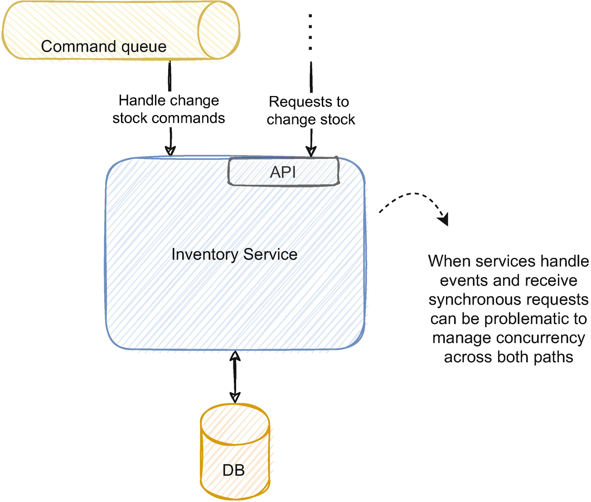

一种可能的方法是将同步请求转换为命令并将其发布到队列中。例如，库存服务会收到一个 POST 请求来更改库存，但它不会同步满足请求，而是将命令发送到命令队列。这样，我们将只有一个入口点，并且可以相应地路由命令。但是，如果 API 需要同步响应，这种方法可能不可行。如果是这种情况，我们仍然可以应用悲观或乐观的并发预防策略来管理这两种情况。

## 6.7 总结

在单个应用程序中处理并发与在分布式架构中处理并发有不同的含义。防止并发的传统策略通常不适用于分布式事件驱动服务。
我们可以通过实现或设计来解决并发问题。实施策略通常涉及乐观或悲观的方法。在事件驱动的系统中，端到端的分区模式可以成为处理并发的有效方法。
乐观的并发预防策略在并发可能性较低的环境中大放异彩。它们不涉及锁定，并且通常需要在检测到并发时重试该过程。
悲观并发预防策略适用于并发概率高的环境；它们锁定给定资源并阻止访问。它们通常依赖外部依赖来管理同步。
我们可以通过使用诸如 Consul 或 ZooKeeper 之类的外部工具来使用分布式锁来实现悲观并发。相反，我们也可以使用一些数据库技术或使用事务。
无序事件可能会带来麻烦并危及系统的一致性。我们可以使用事件版本控制来解决排序问题。
端到端分区是一种通过架构设计解决并发和排序问题的方法。在事件驱动的架构中，它可以说是我们解决这些问题的首选解决方案。它可以是处理排序和并发的一种干净、高效的策略。
热点可能是路由事件的一个有影响的结果。在定义分区键并相应地设计路由策略时，我们应该注意这个问题。

## 脚注

1. Full article exploring this concept in Maurice Herlihy, “Apologizing Versus Asking Permission: Optimistic Concurrency Control for Abstract Data Types,” March 1990, www.researchgate.net/publication/234778080_Apologizing_Versus_Asking_Permission_Optimistic_Concurrency_Control_for_Abstract_Data_Types
2. Full technical reference in Elastic.co, “Optimistic concurrency control,” www.elastic.co/guide/en/elasticsearch/reference/current/optimistic-concurrency-control.html
3. Full technical reference in Datastax.com, “Using lightweight transactions,” https://docs.datastax.com/en/cql-oss/3.3/cql/cql_using/useInsertLWT.html
4. More details in Sandeep Yarabarla, “Learning Apache Cassandra - Second Edition,” April 2017, https://learning.oreilly.com/library/view/learning-apache-cassandra/9781787127296/5e5991cb-eb1e-4459-9114-1d86e974e927.xhtml
5. GitHub project and details here: https://github.com/NEventStore/NEventStore
6. Full technical reference in “Handling Concurrency Conflicts (EF6),” October 23, https://docs.microsoft.com/en-us/ef/ef6/saving/concurrency
7. Referenced in ZooKeeper documentation in “ZooKeeper Recipes and Solutions,” https://zookeeper.apache.org/doc/r3.5.5/recipes.html#sc_recipes_Locks
8. Further details in Redis.io, “Distributed locks with Redis,” https://redis.io/topics/distlock
9. Full article in Martin Kleppmann, “How to do distributed locking,” February 8, 2016, https://martin.kleppmann.com/2016/02/08/how-to-do-distributed-locking.html
10. Further details in aphyr.com, “Jepsen: etcd and Consul,” June 9, 2014, https://aphyr.com/posts/316-jepsen-etcd-and-consul
11. Full analysis in consul.io, www.consul.io/docs/architecture/jepsen
12. Full talk in Kyle Kingsbury, “GOTO 2018 Jepsen 9: A Fsyncing Feeling,” May 8, 2018, www.youtube.com/watch?v=tRc0O9VgzB0&t=1526s
13. Further details in Microsoft documentation, March 14, 2017, https://docs.microsoft.com/en-us/sql/relational-databases/system-stored-procedures/sp-getapplock-transact-sql?view=sql-server-ver15
14. Further details in RabbitMQ documentation, “Broker Semantics,” www.rabbitmq.com/semantics.html
15. Further details in João Reis, “Unique Integer Generation in Distributed Systems,” September 20, 2018, www.farfetchtechblog.com/en/blog/post/unique-integer-generation-in-distributed-systems/
16. Further details in Twitter blog, Ryan King, “Announcing Snowflake,” June 1, 2010, https://blog.twitter.com/engineering/en_us/a/2010/announcing-snowflake.html