本章涵盖：

- 了解分布式微服务架构中的常见故障
- 事件驱动架构如何提供更可靠的流程
- 了解几种消息传递语义的影响以及如何将它们应用于事件驱动的服务
- 保存状态和发布事件时保持正确性
- 我们可以从 ACID 2.0 使用并应用于事件处理的内容
- 如何避免消息泄露
- 在事件驱动的服务中应用常见的弹性模式
- 如何修复事件驱动服务中的状态
- 使用隔板模式来控制故障

板桥大坝是中国的一座大坝。建成后，它遭受了一些施工和工程错误，这些错误被修复并对大坝进行了重大的重新设计。新设计后，它被称为“铁坝”，被认为牢不可破。 1975 年，台风妮娜 (Nina) 影响了附近的位置，虽然飓风强度的风可以说是台风最臭名昭著的特征，但热带气旋的另一个不为人知的后果是暴雨。台风妮娜受冷锋影响停止移动，连续三天在同一地点倾盆大雨。那个位置就是板桥大坝所在的区域。大量的水最终破坏了大坝的完整性并导致了灾难性的失败。七亿立方米的水流过周围地区。大坝的破坏引发了多米诺骨牌效应，引发了该地区其他 61 座大坝的倒塌。大坝倒塌引发了连锁反应，引发了世界历史上第三次致命的洪水。
典型微服务架构不可避免的挑战是处理级联故障，这类似于板桥大坝的这一特殊事件。有时，由于组件之间的同步请求链，一个非必要且有些孤立的服务可能会使整个架构崩溃。那个不起眼的服务的故障在同步调用的复杂网络中传播，最终将故障传播到停止重要业务流程的关键组件。
由于它们的异步性质，事件驱动的架构自然能够应对这些问题。服务之间的事件队列是负载高峰的天然屏障，并限制服务之间的直接依赖关系。单个服务中的一个故障不会在整个架构中传播；相反，它通常只影响该服务，从而赋予架构更高的弹性。
然而，与软件工程中的大多数事情一样，它是关于权衡和决定什么是给定用例的最佳选择。正如我们在第 1 章中所讨论的，事件驱动架构有其自身的一系列限制和挑战。其中之一是将事件视为真相的来源。事件不再是简单的信号；它们具有意义，对系统来说就像传统应用程序中的数据库一样重要。事件流中的一致性与数据库中的一致性一样重要且必要。当客户保存信息时，在单体应用程序中写入数据库失败与不在事件驱动架构中发布事件一样重要。
保证一致的方法对于在整个架构中实现一致性至关重要。正如第 5 章所讨论的，微服务架构的分布式特性迫使我们以不同的方式看待一致性。这种关于一致性的不同观点通常转化为依赖于我们可以应用于事件驱动架构的一组不同的属性。由于新版本的问题，状态可能会变得无效。在这些情况下，事件驱动服务提供了一种独特而强大的方法来通过回滚事件流来修复状态来恢复数据。弹性还与系统的可用性以及它如何处理其依赖项有关；当依赖关系失败时，像bulkhead 模式这样的模式可以帮助提供稳定性，我们将在本章中讨论。

## 7.1 微服务架构中的常见故障及其与事件驱动架构的关系
在构建功能时，我们经常关注解决方案的设计、可重用性和整洁度。想想怎么会出错，这通常是不自然的，就像把泥巴扔进原始杰作中一样。我们常常倾向于认为事情是理所当然的，数据库、事件代理、网络等。事情肯定会出错；在生产中，没有什么是理所当然的。我们应用程序的成功与其减轻失败影响的能力直接相关。本节将讨论分布式微服务架构中的常见故障以及它们在事件驱动架构中的相关性。
让我们分析一下我们之前讨论过的服务的典型拓扑。常规服务有自己的物理资源，可能有一个数据库，并与事件代理进行通信。它通过不同的协议与多种类型的外部依赖项进行通信。图 7-1 说明了这种拓扑。

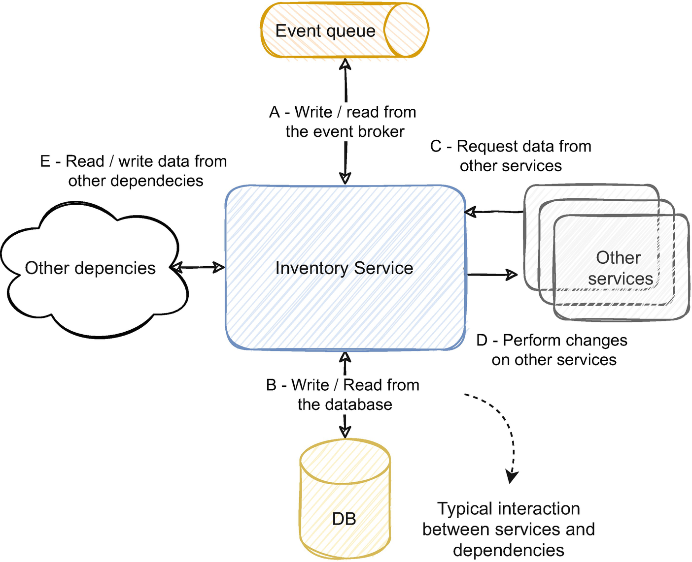
事件驱动的服务通常通过读取或写入事件或两者（A）与消息代理交互。他们可能需要通过从数据库 (B) 写入和读取数据来存储一些数据。尽管更为谨慎，但服务可能会通过 HTTP 请求 (C) 等方式同步从其他服务请求数据。他们还可能通过同步请求 (D) 更改其他服务上的数据。除了其他服务，它们可能有不同的依赖关系，例如，像 Redis (E) 这样的分布式缓存。
由于多种原因，这些交互中的每一个都可能失败。代理可能会面临灾难性故障并且无法访问。每个其他服务或数据库也可能发生同样的情况。由于底层硬件的问题，服务本身可能会遭受灾难性的故障。即使服务及其依赖项都健康，它们之间的通信也可能失败。我们通常使用未提及的假设来编写软件，例如我们对网络可靠性的信任（在分布式计算的谬误中进行了说明）。1 网络可能会失败，并且最终会像我们在图 7-1 中提到的所有其他依赖项一样失败。正如我们在第 6 章中所说，只要有足够的规模和时间，不太可能和牵强附会的问题就会变得确定。
基础设施组件和硬件可能会由于其物理组件而出现故障，尽管它们只会在极少数和孤立的情况下影响应用程序。但是，诸如虚拟主机故障或连接问题（如网络分区等)之类的网络问题更为常见。除了物理组件故障之外，维护操作可能会导致不稳定；我相信我们都与某种补丁或升级出错有关。运行服务和升级版本的操作系统的更新可能会引入问题，当然，在操作这些基础设施组件时也会出现人为错误。其他团队在架构中运营其他服务；新版本可能会引入错误或使服务不可用。
直接依赖，如同步请求，总体上增加了系统不稳定的可能性。在图 7-1 的用例中，我们描述了一个库存服务；其他服务可能会从它那里请求数据，比如订单服务来获取当前产品的库存。库存服务可能依赖于其他服务，例如获取仓库地址的位置服务。位置服务本身可能依赖于其他服务。这些服务中的每一个都有自己的依赖项，它们都可能失败并且最终会失败。整个系统的可用性通常会转化为所有服务的组合可用性，这种可用性较低且难以管理。这种级联故障，我们将在接下来详细介绍，是事件驱动服务可以缓解的微服务架构中的常见故障模式。

### 7.1.1 级联故障和事件驱动服务

由于多种原因，服务及其依赖项可能会失败。此故障可能会使服务不可用并导致请求失败。本地故障的影响有限，具体取决于服务的业务功能。然而，正如我们与板桥大坝所讨论的那样，当该故障触发架构中其他服务的级联故障时，影响会呈指数级增长，并可能导致整个系统停止运行。本小节将通过典型微服务架构的实际示例以及它如何在事件驱动架构中发挥作用。
在典型的微服务架构中，服务之间的通信是同步的，例如通过 HTTP 请求。这种架构容易产生复杂的同步请求网络。你可能还记得我们在第 4 章详细介绍分布式跟踪时提到的示例，即优步如何跟踪 1000 个微服务2及其复杂网络。在网络中，有几个服务依赖的大节点；如果其中之一变得不可用，则可能会影响整个架构。但也可以反过来；不太重要和更孤立的服务可能会将问题级联到其他更重要的服务上并加剧问题。让我们详细说明级联故障如何影响电子商务工作流，类似于我们迄今为止在微服务架构中讨论的那些工作流。

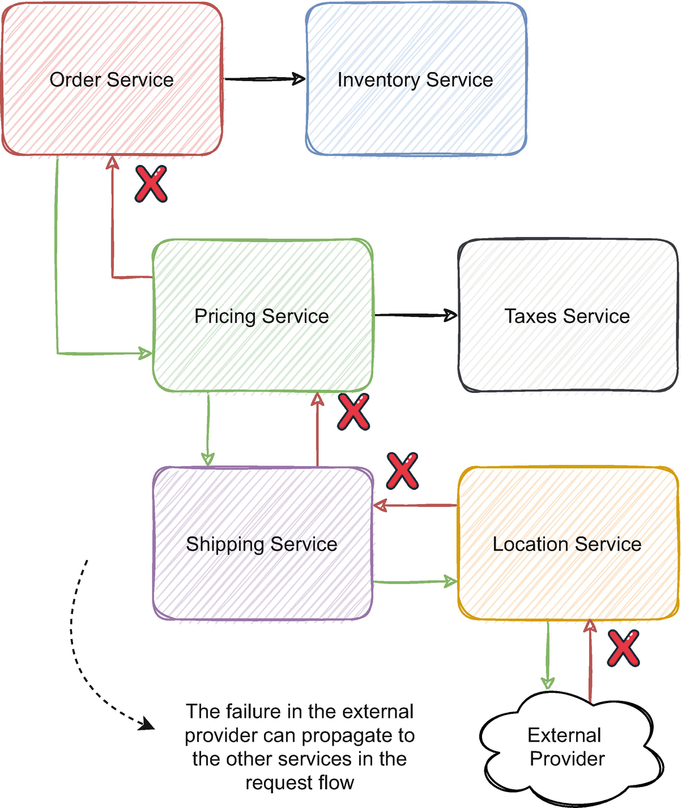
订单履行流程请求定价服务计算其收到的每个订单的费用。定价服务依赖于运输服务来处理运输和地址信息，后者依赖于位置服务，后者管理有关地理和国家/地区位置的更多通用信息。位置服务还依赖于外部提供商来获取国家/地区的信息。在示例中，位置服务无法从外部提供者获取数据。由于无法获取信息，它也将无法成功响应运输服务。故障会级联到其他上游服务，最终使订单履行过程失败。在这种情况下，一个相对孤立的问题，与业务无关，最终会影响主要订单履行流程。
在这种情况下，失败的是外部提供者。但它可能发生在我们之前讨论的任何其他服务的依赖项上。例如，数据库也可能出现故障，尽管数据库变得不可用的情况相对少见，但由于物理资源有限，负载高峰可能会使数据库陷入困境。在这些情况下，经常会出现一种奇特的现象。处理失败请求的常用方法是重试请求。当与过度负载作斗争的服务开始使某些请求失败时，由于重试策略，请求服务也增加了它们的吞吐量。我遇到过这种情况的一个特殊情况是服务由于连接问题而变得不可用。一旦团队解决了这些问题并且服务开始恢复，每个依赖项的额外重试吞吐量完全占用了服务的资源，并且由于负载过大而再次崩溃了服务。这个问题突出了适当的应对策略的必要性，例如退避重试和断路器（在下一节中进一步讨论)。
意外负载影响具有适度资源的服务也是级联故障的常见原因。想象一下，如果使用图 7-2 的相同示例，由于销售旺季，平台的使用率更高。订单服务可能会出现使用高峰，这通常会转化为对下游服务的更多请求。如果订单服务收到订单高峰，它可能会从定价服务请求更多信息来完成这些订单。定价服务可能会将负载峰值转换为运输服务，并将运输服务转换为定位服务。由于其重要性，订单、定价和运输服务可能拥有充足的资源。它们的重要性在订单履行流程中也很明显。但是，如果定位服务不在关键雷达范围内并且影响不大，则它可能具有适度的资源以具有成本效益。这样，过多的请求会影响服务，缩短其响应时间甚至使其不可用，这可能会级联到上游服务。
负载峰值甚至可能由于架构中发生的其他操作而发生。例如，假设税收服务需要更新所有系统的税收并临时从位置服务请求信息。批量操作和增加的负载可能会以相同的方式影响位置服务，将故障级联到关键订单履行流程。复杂的同步请求网络通常很容易受到此类问题的影响。当系统一端看似无害的操作最终影响另一端或整个系统时，我们可能会怀疑分布式微服务架构是否比单体应用程序更好。事实上，当我们面临这些挑战时，我们更接近于分布式单体，而不是真正的解耦和水平可扩展架构。
事件驱动的架构仍然容易受到这类问题的影响；在大多数架构中，同步请求通常是现实的。然而，事件驱动的方法提供了一种自然减轻级联故障影响的方法。之前的失败将如何影响事件驱动的架构？图 7-3 说明了相同的用例。

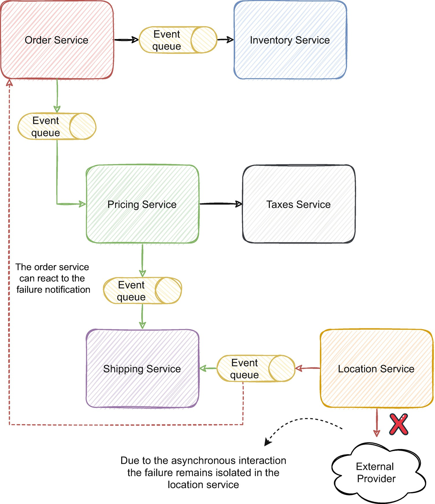
外部提供者的故障和位置服务的请求在该服务中保持隔离。事件队列提供的解耦减轻了故障的级联效应。假设运输服务使用位置服务来检索有关每个国家/地区的地理详细信息的附加信息。使用事件队列并使用该信息构建内部状态（以类似于我们在第 4.6 节中讨论的构建多个读取模型的方式)，服务变得自治并避免直接依赖。还是有影响的；当位置服务不可用时，这些地理位置的新更改不会更新，因为没有新事件到达运输服务。但是，影响远小于停止整个订单履行流程。

### 7.1.2 事件驱动服务中的负载均衡和速率限制器

上一小节提到了同步微服务的额外负载如何触发级联故障。通常管理额外负载和负载峰值的策略是使用负载平衡器。速率限制器也可以是一种有价值的策略，以保证服务在拒绝其他请求的同时不断响应某些请求。本小节将在典型的微服务架构中详细介绍这个概念，以及它与事件驱动架构的关系。
正如我们所讨论的，服务失败的原因有很多。在生产中，我们应该始终为每个服务拥有多个实例以保证高可用性。如果一个实例出现故障、无响应或出现连接问题，其余实例可以在遇到困难的实例恢复时满足请求。微服务架构通常使用负载均衡器来实现这一点。负载均衡器会跟踪服务的响应并相应地路由流量。如果一个实例出现问题，负载均衡器会将不可用实例的流量路由到其他运行状况良好的实例。图 7-4 说明了订单服务通过负载平衡器从库存服务请求信息。

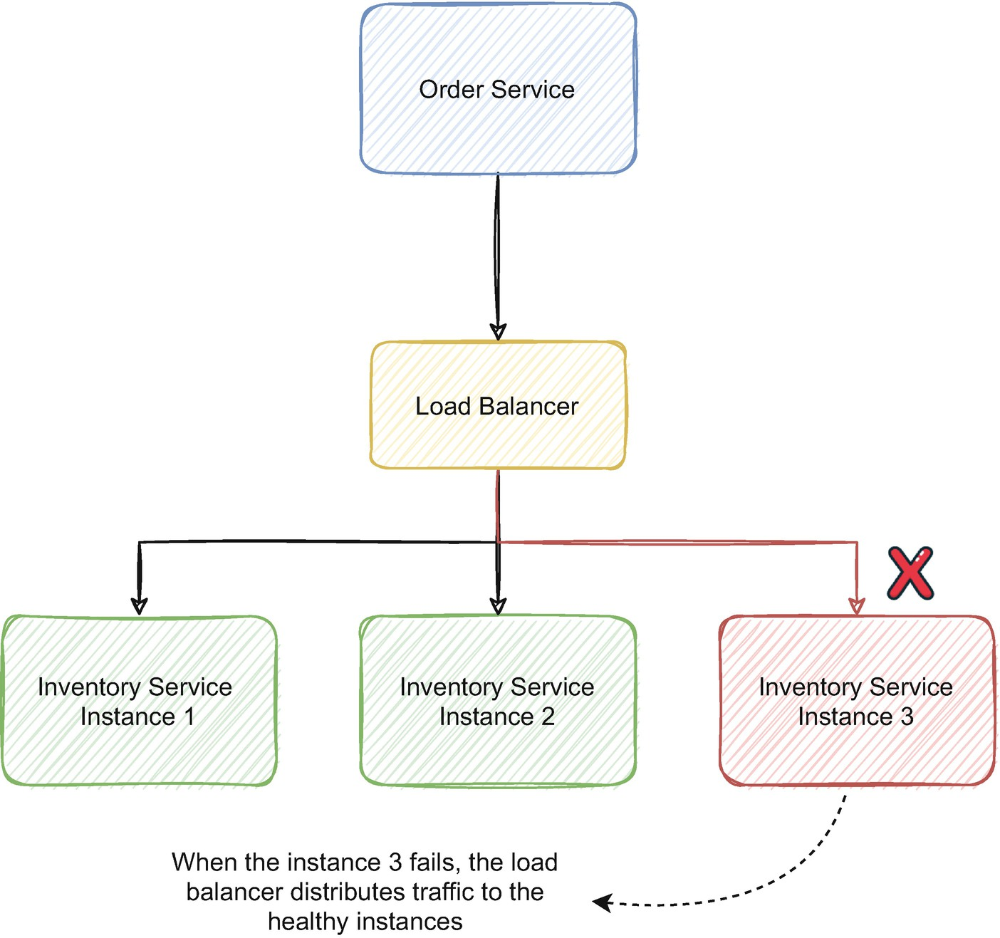
当库存服务实例 3 变得不可用时，负载均衡器会将实例的流量路由到其他运行状况良好的实例。拥有三个服务实例可提供更高的可用性。为了使库存服务完全不可用，所有三个实例都必须同时发生故障，这比一个实例发生故障的可能性要大得多。负载均衡器还可以了解服务响应时间是否在下降，而不是仅在实例不可用时做出反应。
负载均衡器通常与使用同步请求的实例相关。在事件驱动的服务中，负载均衡一般由事件代理管理。代理知道每个实例的状态并将消息分发给每个实例，如图 7-5 所示。

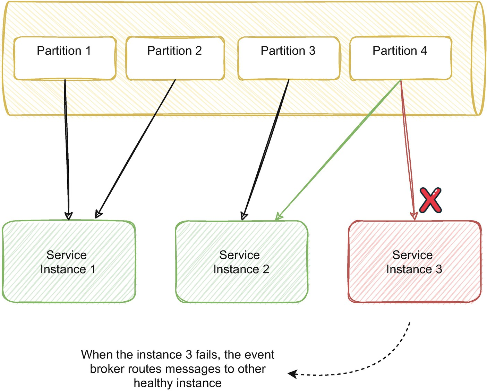

你可能还记得我们在第 6 章详细剖析 Kafka 主题时，消息代理中的主题可以分为多个分区，每个分区分配给一个消费者。在这种情况下，实例 3 变得不可用；代理可以检测到实例已关闭并将分区重新分配给另一个实例。事件代理可以充当负载均衡器，而无需外部工具来管理它；事件消耗使平衡更自然地发生。如果是临时故障，例如服务暂时失去与代理的连接，代理将在服务再次可用时将分区重新分配给恢复的实例。
服务失败的一个常见原因是意外的负载峰值或大量请求。 DDoS（分布式拒绝服务攻击）通常由外部架构的安全层来应对外部攻击。然而，一个类似的常见问题是内部服务的过度请求，一种内部 DDoS 攻击，但不是故意的。典型的微服务通常会建立并强制执行速率限制以保证服务的可靠性。
但是，速率限制器通常意味着拒绝某些请求；当它们超过指定的阈值时，服务会拒绝一部分请求。除了盲目拒绝一部分请求之外，服务还可以应用不同的策略。它可以优先考虑关键业务流量或优先考虑关键客户。但是，这意味着请求的一部分失败并通知客户端请求被拒绝（例如，通过 HTTP 状态代码 429 – 请求过多）。收到此响应后，客户端应调整并调节请求的数量。这种策略被称为背压，适用于不同的用例；拒绝请求通常（或总是）不理想。应用背压也会将复杂性推给客户端；他们需要被拒绝的请求，所以它经常迫使客户端使用临时重试策略。
这些方法通常看起来像是一种解决方法。我们有一个无法处理所需吞吐量的同步进程，因此我们拒绝请求，这迫使客户端通过稍后重试请求来应用半同步方法。完全采用异步方法通常更具弹性和透明性。速率限制器在事件驱动系统中可以说是无关紧要的。如果服务接收到的吞吐量高于它的处理能力，其影响将是建立延迟（要处理的消息数量增加）而不是失败。代理自然会排队比服务可以处理的更高的吞吐量。队列堆积了稍后要处理的事件，而不是将该责任推给客户端。此策略更具弹性，可避免拒绝或失败请求。服务的水平可扩展性还提供了增加或减少实例数量（甚至自动）的机会，以保证延迟不会增长到麻烦的值，因为它会影响最终的一致性，如第 5 章所述。
公开同步请求的服务受益于精心设计的负载平衡和速率限制策略。然而，对于完全事件驱动的服务，负载平衡和速率限制自然地融入了事件流的工作方式，与典型的微服务不同，不需要临时或外部依赖来管理它。这一特性使系统更具弹性并适应不断变化的吞吐量需求或意外的不可用情况。

## 7.2 理解消息传递语义
到目前为止，我们将与事件代理的交互描述为原子操作和一次性操作。 然而，正如你想象的那样，事情并没有那么简单。 正如我们在上一节中讨论的那样，服务和其他组件可能会失败，并且会影响整个系统的可用性和消息通信的可靠性。 在发布和使用消息时，服务和代理本身可能会失败并变得不可用。 本节将详细介绍这些故障如何影响消息消费和生产。
让我们通过一个简单的发布/订阅示例来工作。 图 7-6 说明了我们在前几章中讨论的示例的一个常见用例； 订单服务向消息代理发布一个事件，库存服务使用它。

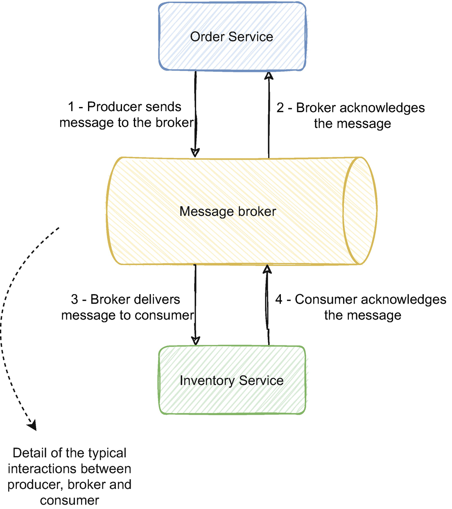
如示例所示，当订单服务发布事件时，通常有两个步骤与之相关：将消息从订单服务传输到代理以及代理对消息接收的确认。在消费者方面，它的工作原理类似；库存服务从消息代理接收消息并确认它。
这些步骤中的每一个都可能失败，并可能引发不同的一致性问题：

- 经纪人或订单服务与经纪人之间的连接可能不可用。订单服务将无法将消息发布到代理。
- 收到消息后，代理可能会失去与订单服务的连接，或者服务可能会崩溃，无法确认消息的接收。
- 库存服务或库存服务与代理之间的连接可能不可用。代理将无法将消息传递给消费者。
- 消费者（在这种情况下是库存服务）可能无法向代理确认消息的接收和处理。

如果订单服务未能将消息传递给代理，它可能会重试该消息，因为这些失败中的每一个都可能并且通常是暂时的。即使在长时间中断的情况下，到达的请求迟早也需要重试。重试步骤 1 不太可能影响流一致性，因为还没有消息到达代理。
但是，如果第 2 步失败了怎么办？消息到达broker，broker内部将其持久化，但是当它确认消息时，订单服务崩溃，或者网络暂时不可用。当服务恢复时，它无法知道是消息发布失败还是确认失败。它可能会重试消息发布，但在这种情况下，消息已经到达代理；订购服务只是不知道它有。发布重试将在代理上生成重复消息。
类似的情况也可能发生在消费者方面。收到消息后，库存服务可能会崩溃或失去与代理的连接。如果是这样，则无法确认消息接收。如果发生崩溃，它可能会重新处理它正在处理的最后一条消息，从而导致重复的消息消耗。
根据生产者和消费者的行为，我们可以有不同的消息传递语义：

- 最多一次传递：消息可能无法传递，但不会多次传递。例如，在图 7-6 中，如果订单服务发布了一条消息，但消息代理在保存消息时出现内部错误并返回错误，则该消息可能尚未被代理处理。使用最多一次语义，订单服务在遇到此错误时不会重试操作。这意味着消息永远不会被复制，但并非所有消息都会到达消费者。我们避免重复消息，但我们也接受我们可能会丢失消息。
- 至少一次传递：消息将始终传递，但可能会传递多次。在我们之前讨论的同一个用例中，如果订单服务没有收到经纪人的确认，它可以重试操作。代理已经收到消息，只是未能确认。通过重试，我们最终会发布重复的消息。因此，我们保证消息总是被传递，但可能不止一次。
- 仅一次传递：消息将始终传递给消费者，而不会重复。在这种情况下，订单服务可能会收到错误，即使重试操作，消息也只会到达库存服务一次。 Exactly-once 是最理想的交付语义，但在分布式系统中也异常难以保证。

表 7-1 恢复了每个传递语义的影响。
表 7-1 不同传递语义的特征回顾

| 交付语义 | 优点                                 | 缺点                                        |
| -------- | ------------------------------------ | ------------------------------------------- |
| 最多一次 | 没有消息重复<br/>高性能<br/>实际执行 | 在失败的情况下可能会丢失消息                |
| 至少一次 | 保证交货<br/>实际执行                | 在失败场景中可能有消息重复<br/>性能受到影响 |
| 恰好一次 | 没有消息重复<br/>保证交货            | 非常难以保证和实施                          |

这类问题与两位将军的问题有关。 3 通过不可靠的网络协调多个分布式组件的挑战使得实现强一致性策略变得异常困难，例如实现一次传递语义。
由于缺乏验证（例如等待超时）或重试，最多一次交付通常与更高的性能相关联。但是，这也意味着我们可能会不时丢失消息。例如，在部署新版本的服务或应用程序时，该服务可能正在处理消息；使用这种方法，当服务或应用程序停止部署时，你可能会因为处理中断而丢失一些消息。丢失消息通常是不可接受的，尤其是在具有历史重要的业务关键数据的流中。但是，它对于不太重要和高负载的用例可能很有价值。例如，像遥测数据一样，如果新的近期数据经常发布并且历史记录中没有任何价值，则某些用例可能会在失败场景中丢失消息。
至少一次交付通常会影响性能，但通常不是很重要；毕竟，失败会发生，但不会经常发生。它指出消息将始终被传递，但可能有重复。根据实现的不同，重复的消息可能会产生错误的结果或重复的工作。
在分布式系统中，Exactly-Once 交付异常难以保证。即使我们只关注生产者和消息代理之间的交互，为了保证一次性交付，我们可能需要我们的服务和消息代理之间的协调。并非所有消息代理都公开此功能；有些是这样，我们接下来将与 Kafka 讨论。通常，只有当流中的所有组件都参与协调时，才有可能实现端到端的恰好一次语义。即使有启用它的代理，他们通常也会在消息生产和消费中这样做。在消费者依赖外部依赖来处理事件（如数据库或外部服务）的用例中，将这些保证扩展到这些依赖是非常困难的。 Exactly-once 交付提供了理想的保证，但通常是不切实际的。
那让我们去哪里呢？三个交付语义中的两个可能会给我们留下不正确或丢失的数据，而最后一个非常难以实现。这真的取决于用例，我们不能给你一个一刀切的规则，但这里有一些可以说是实用的指导，可以帮助你做出决定。如果消息代理支持 Exactly-once 则非常好，不会对性能造成太大影响，而且我们不需要过于复杂的解决方案来支持它。最多一次适用于你可以承受丢失消息（经常刷新的数据，例如我们讨论的遥测数据）的用例。然而，丢失数据是一个可怕的想法，在许多情况下都不可行。
如果我们依赖于一次性语义，我们可能会使用我们可能需要的更强假设来实现事件消费，并降低系统的灵活性。例如，可能更难从错误引入的错误状态中恢复（即，重试和事件重放可能变得不切实际）。至少一次可以说是最灵活和标准的解决方案。实现至少一次交付可以很简单，通过将事件消费设计为幂等的（在第 7.4 节中详细介绍），如果发现重复，我们可以避免错误的状态。我们可能有重复的工作，但如果我们在数千或数百万个事件中两次处理少量消息，那么它可能不会很重要。幂等性设计使整个系统更具弹性和灵活性（例如，倒回事件流可能是一种有效的方法）。

### 7.2.1 Kafka 中的 Exactly-Once 交付语义
Kafka 在 0.11 版本中引入了一次性语义。它通过使用类似于 TCP 的序列号实现消息幂等性并组合跨不同主题的事务来实现恰好一次。吞吐量性能的影响可以说是很低的，与至少一次相比只有 3%，与最多一次相比只有 20%。
对于明确需要恰好一次的系统来说，这是一个很好的替代方案，可以说影响很小。用 Kafka 实现一次，主要是配置和简单。4 它有我们之前讨论过的消费具有外部系统依赖的警告；我们需要额外的协调来有效地实现一次语义，5 这在某些用例中可能很麻烦或不可能。
然而，正如我们所讨论的，我们可能会受益于设计至少一次并遵循 ACID 2.0（在第 7.4 节中详细介绍）以保证可靠性和弹性。我们为消息处理注入了额外的灵活性，并且不受更严格的消息处理保证的约束。

## 7.3 事件驱动微服务中保存状态和发布事件时避免不一致

事件驱动的服务通常对事件做出反应并应用它们自己的域逻辑，通常在域的实体中生成不同的状态。他们通常需要保存状态并发布反映该更改的事件。我们讨论了事件流一致性的重要性以及我们如何将其用作在整个组织中共享状态的媒介。当我们保存状态并发布事件时，我们正在执行两种不同的操作，其中任何操作都可能失败。如果一个失败，我们最终会得到一个不反映服务内部状态的事件流。本节将讨论避免这种不一致的方法，通过一个用例工作，并讨论可能的解决方案。
大多数有状态服务通过保存某种状态来处理向它们发出的请求。例如，图 7-7 说明了处理订单提交请求的订单服务。

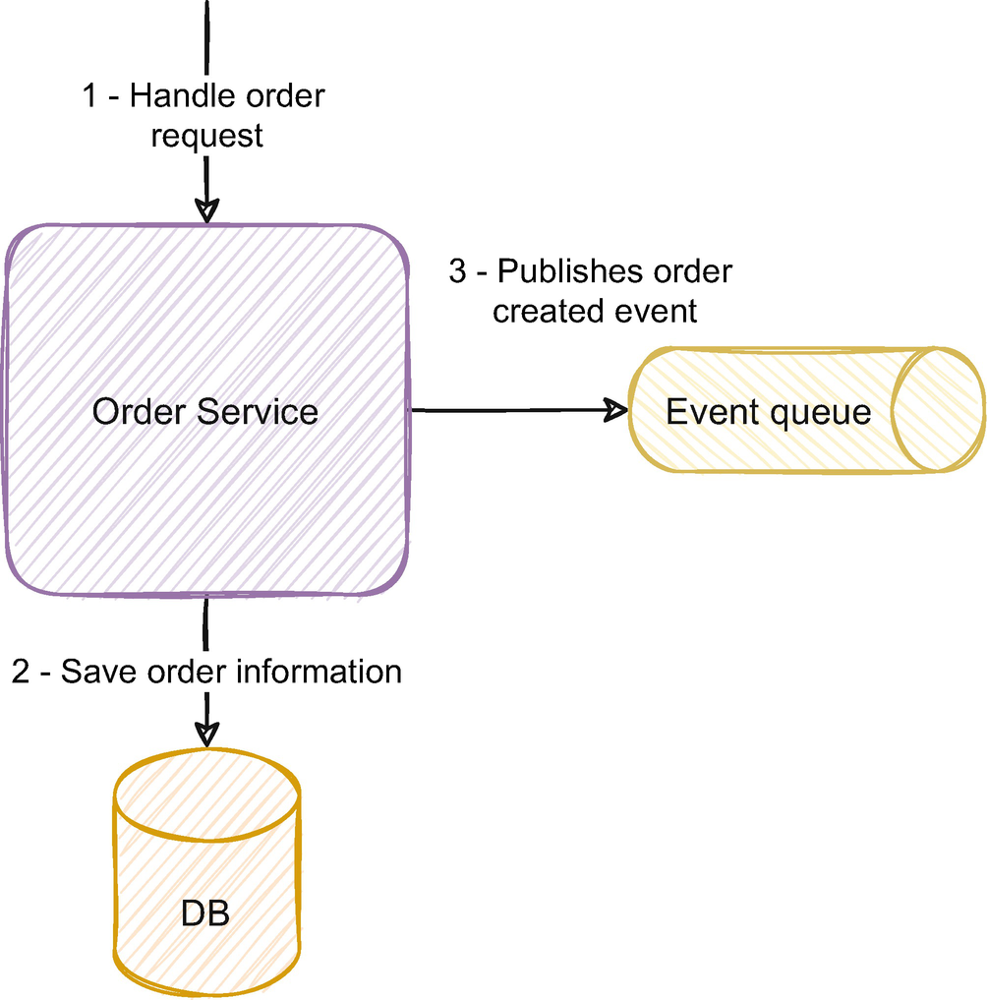

该服务将订单信息保存在数据库中，然后发布一个事件通知生态系统订单已创建。在订单履行过程中有两个步骤（保存状态和发布事件）的挑战是保证两个操作的原子性。如果服务在将信息保存在数据库中时遇到问题，它将使请求失败，但不会损害数据库和事件流之间的一致性。失败很麻烦，需要解决，但不会产生不一致的状态。但是，如果服务保存了新订单但未能发布事件，则事件流将与数据库发散。流将不再代表订单的实际状态并且会不一致。
这种情况给系统的恢复带来了额外的复杂性。需要解决服务与消息代理的连接问题，但这不足以使系统恢复到有效状态。当事件代理或服务的连接不可用时，服务已经将订单信息保存到数据库中，但服务没有发布相关事件。请求失败可能是不允许的，因为更改已经持久化了。事件流是每个其他服务的数据源，具体取决于订单信息。如果事件流不一致，我们会将问题传播到整个生态系统。
这个问题与我们在第 4 章中讨论的编排模式特别相关。假设订单履行过程取决于一系列编排的步骤。在这种情况下，一个没有通知它已经完成处理订单的服务，如果没有其他机制，它可能会停止以下操作。

### 7.3.1 事件流作为唯一的真相来源

正如我们所讨论的，事件驱动还涉及将数据库作为事实来源并将其更改为事件流的思维方式的改变。鉴于此，我们可以使用事件流作为主要的信息来源，而不是数据库。这对我们讨论的例子意味着什么？我们可以发布事件，然后通过对同一事件做出反应来更新当前状态。图 7-8 说明了这种情况。

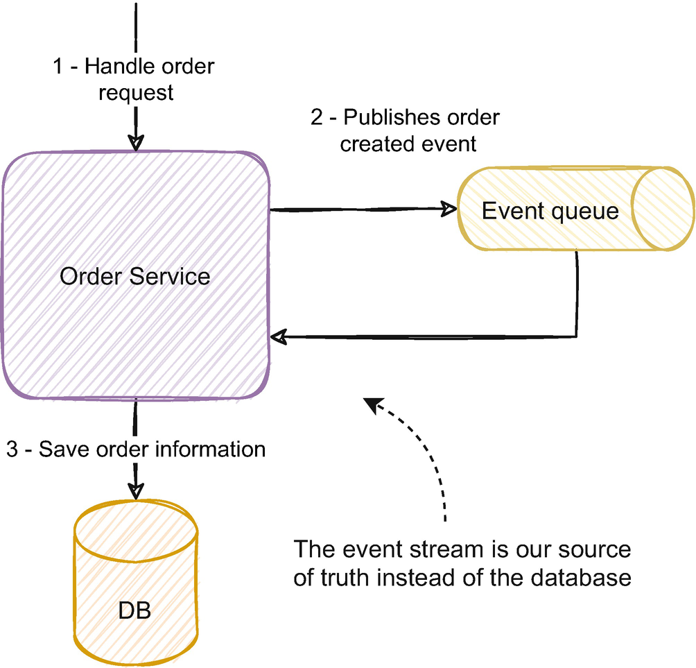
订单信息仅通过对订单创建事件做出反应来保存。 这样，我们保证事件流是真实的来源； 当前状态来自同一个流。 如果数据库更新失败，我们不应该确认事件的处理。 成功的处理需要处理事件并更新状态（我们将在第 7.5 节中详细说明如何完成此操作)。
这个用例与我们在第 4 章中讨论的事件源和 CQRS 模式非常相似。如果事件被无限期地持久保留，则事件队列有效地充当事件源存储。 事件流也是系统的写模型，而数据库是读模型。 如果我们完全应用 CQRS 模式并将写入和读取分离到单独的服务中，我们可以进一步分离职责。 图 7-9 说明了这种隔离。

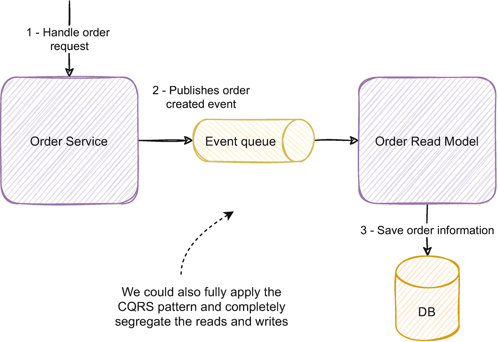

订单服务接收订单并发布事件，而订单读取模型对这些事件做出反应并更新每个订单的当前状态。订单服务负责发布事件，订单读取模型负责更新数据库中的状态。通过这种方式，我们可以单独并以弹性方式处理每个故障。
尽管此解决方案与事件驱动的思维方式密切相关，但它有一些相关的警告。只要涉及的服务是无状态的流处理器，即不依赖本地状态来应用其域逻辑，这种方法就是一个很好的解决方案。如果是这样，它将取决于最终一致的存储，并且我们冒着对陈旧数据执行域验证的风险。例如，在图 7-7 中，如果订单服务收到订单更改并需要获取当前订单，则队列中可能存在尚未应用于读取模型的事件。
事件源通常从聚合（在本例中为顺序）加载所有事件并按顺序应用它们，生成最新状态。但是，大多数消息代理没有这种类型的查询功能。除非我们将数据库用作队列（尽管并非闻所未闻）6，否则可以说其他技术更适合这样做。它通常归结为读取整个队列并使用持久消息代理过滤正确的实体（或订单 ID）。尽管这是可能的，但对于大量事件来说，这是非常不切实际的并且非常消耗资源。例如，人们经常讨论 Kafka 是否可以用作事件溯源存储。有一篇有趣的文章 7 关于如何使用 Kafka Streams 和状态存储实现这一点；有了它，我们可以避免消耗整个主题的挑战。8 但是，我们也可能会遇到我们提到的最终一致性问题。服务应根据事实来源应用领域逻辑和验证；如果我们不能检索当前实体的事件流，那么保证领域逻辑的正确性会很麻烦。

### 7.3.2 事件驱动微服务中的发件箱模式

当需要获取状态、应用域逻辑、首先更新状态、然后发布事件时，发件箱模式是标准解决方案。它通常涉及两组更新，一组用于实体数据，另一组用于发件箱事件表。操作的原子性通常由一个包含两个操作的事务来保证，尽管我们还将探索非事务数据库的替代方案。
在我们讨论的涉及订单服务的示例中，假设我们将订单信息保存在订单表中。为了应用这种模式，我们还将创建一个发件箱表来保存要发布的事件。当收到订单提交时，订单服务会将新订单插入订单表，并将事件插入发件箱表。图 7-10 说明了两个订单服务表。

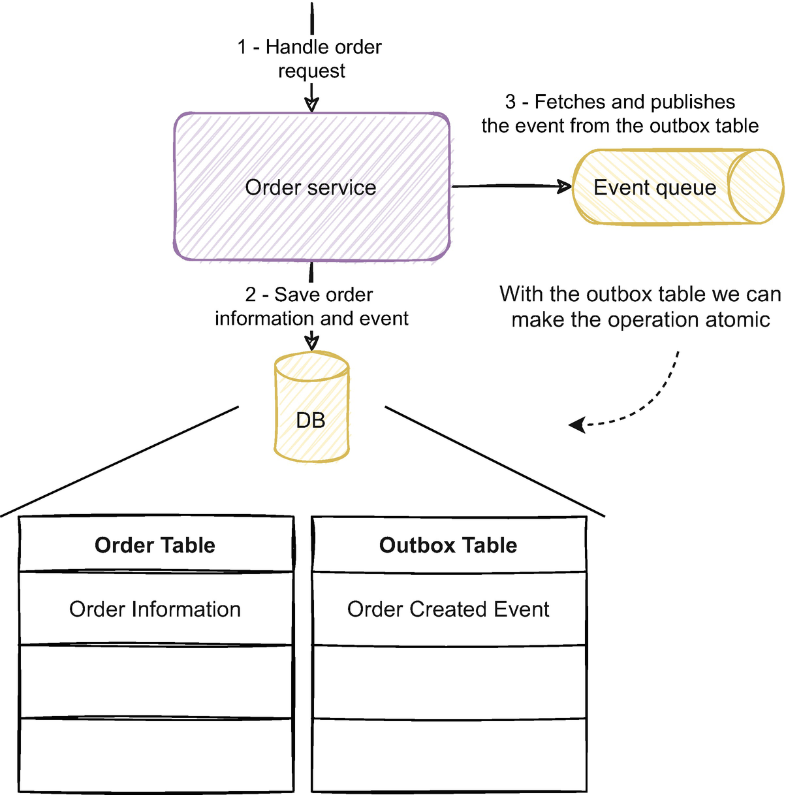

订单服务在收到订单提交请求时，将订单信息保存在订单表中，将事件保存在发件箱表中。由于这两个操作都发生在同一个数据库中，我们可以使用事务使它们具有原子性；他们要么失败，要么一起成功。订单服务内的异步进程可以从发件箱表中获取事件并将它们发布到消息代理。如果服务将信息保存在数据库中并且发布事件失败，它仍然会保存在发件箱表中。当连接恢复时，进程可以获取和发布失败的事件。一旦事件被发布，服务就可以从表中删除它们。
如果服务崩溃，发件箱表中可能有未发布的事件，因为服务可能会在将信息保存到数据库和发布事件之间停止。启动时，服务可以获取事件并将它们发布到代理。为了获取发件箱表的事件，我们可以实现一个轮询表的临时过程。一个可以说是更好的解决方案是仅在发生故障并且服务启动时才这样做。正常运行时，服务可以直接保存发布，无需等待轮询过程；这避免了轮询间隔延迟进程。
正如我们在第 2 章中讨论的那样，我们可以使用 CDC（更改数据捕获）代替实现临时轮询过程。例如，如果我们使用带有 debezium 的连接器，Kafka 支持开箱即用。9 它可以检测变化数据库并将消息直接发布到 Kafka。
这种模式依靠事务数据库的 ACID 属性来保证流程的可靠性。但是，如果我们使用的数据库不支持跨不同表的事务怎么办？一个可能的解决方案是保证数据库写入是幂等的（多次应用该操作总是产生相同的结果；我们将在第 7.4 节详细说明）并且在两次写入成功之前不确认消息处理成功。
假设在订单表中保存信息时，操作是一个upsert；也就是说，保存两次相同的订单会产生相同的结果，并且不会因重复键错误而失败，例如。如果服务保存了订单信息，然后无法写入发件箱表（例如服务崩溃），就会出现不一致；该服务更改了状态，但未发布反映该更改的事件。但是，该服务也没有确认创建订单的命令。当服务恢复时，它会再次处理相同的命令并写入两个表。由于第一个操作是幂等的，它不会有效地改变任何东西，其余的操作将恢复并发布丢失的事件。我们将在第 7.4 节和第 7.5 节中进一步详细介绍这些策略。

### 7.3.3 事件驱动微服务中避免不一致的事务和补偿动作
解决这种一致性问题的第一个选项可能是使用事务。如果我们使用支持它们的数据库，则避免此问题的一种可能解决方案是将整个操作包装在一个事务中。该服务将打开一个事务，写入数据库（我们在本节开头讨论的保存状态步骤），发布事件，并提交事务。如果发布失败，交易也会失败。但是，我们不能忘记数据库和事件流是两个独立的组件。一个重要的细节是我们可以发布事件，然后事务可能无法提交。与数据库的连接可能会暂时失败或在发布后不可用。在那种情况下，我们会出现不一致，但反过来，事件流可能会有服务持久化的更改。
当事件发布失败时，我们可以不使用事务，而是撤消保存在数据库中的更改。我们可以有一系列补偿操作来恢复在事件发布之前所做的事情。补偿操作也适用于不支持事务的数据库。然而，它们也有类似的限制。如果补偿动作失败，我们最终会得到一个不一致的状态。
尽管仍有失败的机会，但事务性和补偿性操作显着降低了离开不一致状态的可能性。仅当与数据库和消息代理的连接同时失败时，才会在不发布事件的情况下保存状态，反之亦然。在第 6 章中，我们讨论了不可能的事件在足够大的范围内几乎是不可避免的。如果这种情况能够发生，那么它最终肯定会发生。
但是，我们也应该以务实的眼光看待问题和解决办法。如果问题发生的可能性很小，那么完美解决方案的努力可能就不值得；如果它们的影响不够相关，我们也许可以忍受一些问题。这种推理让我脊背发凉，如果你处理生产系统的时间足够长，它可能也会让你脊背发凉。显然，我不建议遵循这一推理路线作为标准，但我们也需要务实并选择正确的权衡。交易和补偿行动可能是该范围内的可行解决方案；当更可持续的方法不切实际时，它们通常很熟悉且易于实施。

## 7.4 在事件驱动的微服务中应用 ACID 2.0 作为弹性策略
分布式系统中的故障被认为是我们必须在解决方案中纳入和考虑的变量。典型的弹性策略以某种方式包含重试策略。重试技术也适用于事件驱动的服务；如果服务的依赖项或服务本身失败，则在处理消息时，常见的弹性策略是重试消息消费。根据服务设计，消费过去已经消费过的消息可能会很麻烦。本节将讨论如何在事件处理中应用 ACID 2.0 的概念（结合性、交换性、幂等性和分布式）并使用它们来实现容错。
使用重复的消息可能成为一个常见的用例，例如，如果我们需要重放事件流以修复由于错误而损坏的数据。发生暂时性故障时，重试非常有用；事实上，瞬时故障通常比跨越相当长一段时间的中断更常见。但是，如果没有采取适当的措施，多次执行相同的操作可能会产生错误的结果。
想象一下，如果我们有一个服务来管理产品库存并发布库存变化事件。产品服务存储所有产品目录的信息，包括库存。为了更新库存信息，它处理库存服务发布的库存事件。图 7-11 说明了这个例子。

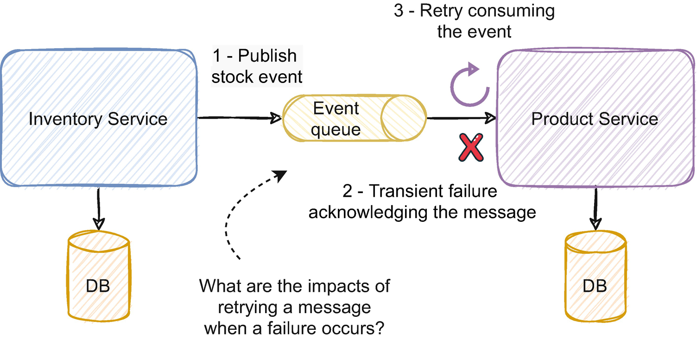

该示例说明了产品服务在使用库存服务中的事件时确认事件处理时面临瞬时错误。在第一次尝试时，产品服务可以检索事件并将更改写入数据库，但无法向事件代理确认成功处理。作为一种弹性策略，产品服务会重试消费相同的事件。重试过程将消耗相同的事件并从头开始处理。在第二次尝试时，服务可以确认并成功处理事件。但是，该服务将库存更改写入数据库两次，根据产品服务对事件的消费方式，产生了错误的产品库存值。例如，如果库存服务发布了一个缺货事件，表明产品库存减少了，它将减去库存两次。
正如我们在 7.2 节中讨论的那样，精确一次语义通常很难保证。为了确保每条消息都得到处理，我们经常依赖至少一次消息传递语义。由于消息代理的故障或上游服务，服务可能会收到重复的消息，因此是至少一次语义。在这些情况下，服务应该能够接收和生成带有重复消息的有效状态。
事件处理通常受益于理解一组有关维护 CALM10 定理捕获的分布式一致性的原则。 CALM（作为逻辑单调性的一致性）指出，在不改变已经发生的事情的情况下处理一组渐进的事实的系统可以安全地在最终一致的存储上运行。这个概念与事件驱动方法密切相关；事件反映了实体的演变状态，代表了一个已经发生但不应改变的事实。 ACID 2.0（结合性、交换性、幂等性和分布式 11）体现了一组与 CALM 定理密切相关的设计模式。通过将这些特性应用于分布式系统，我们可以实现分布式一致性和逻辑单调性。 12
第 5 章讨论了分布式系统对传统一致性的影响以及在 CAP 定理下维护规则原子一致性的困难。 ACID 2.0 背后的巧妙首字母缩写词提出了在分布式系统下反思一种新型一致性的挑战，这与关系数据库中的传统 ACID 相对。 ACID 2.0 基于三个主要属性，关联性、交换性和幂等性，它们发生在分布式系统中（ACID 2.0 中的 D）。
关联性和可交换性将系统执行无序操作的能力转化为在事件驱动的系统中容忍无序事件的能力。幂等性是系统多次执行相同操作并获得相同结果的能力。在事件驱动系统中，它转化为多次处理同一事件并获得相同结果的能力。
我们如何将 ACID 2.0 属性应用于事件处理？一种可能的方法与事件模式和事件的设计方式有关。在我们之前讨论过的例子中，缺货事件（一个表示用户移除或购买库存的事件；基本上这个项目的库存减少了一个数量）不是幂等的。如果我们多次处理同一个缺货事件，服务将根据处理它的次数减少库存，每次都会产生不同的结果。库存服务可以发布库存更改事件，而不是发布缺货事件，以告知产品的当前库存数量。清单 7-1 说明了这两个事件的示例。

```
StockOut
{
    ProductId: 15251212,
    Size: "XS",
    Quantity: 1
}
StockChanged
{
    ProductId: 15251212,
    Size: "XS",
    CurrentQuantity: 5
}
```

这些事件具有相似的信息，但缺货事件表示从项目中删除库存数量。库存更改事件表示产品的当前库存。如果产品服务多次消费同一个库存变化事件，它总是会产生相同的结果；它会不断更新产品的库存到相同的数量。我们将事件模式更改为幂等的。我们还使重试操作安全。然而，我们也改变了事件的意义；库存变化事件通常比缺货事件具有更少的域价值。如果用户买入一个库存单位并减少库存，则断货事件清楚地反映了用户的意图；库存变动事件并不能简单地解释它。尽管如此，适应消费者的需求是必不可少的，在这种情况下，库存变化事件可以说是最合理的选择（我们将在第 8 章进一步讨论事件模式设计）。
与事件模式相关的一个重要考虑因素是缺货事件与订单无关。我们只需要处理一次；顺序无关紧要（不考虑负面库存验证）。如果服务发布更改的库存，则订单很重要；我们只想要最新的数量，因此最新的库存变化事件。我们可以使用我们在第 6 章中讨论的事件版本控制来管理订单。在这种情况下，与大多数决策一样，它是关于权衡利弊并选择一组优于其他属性的属性。订单通常易于管理；幂等性更具挑战性并提供强大的弹性，在类似情况下更有用。
但是，更改事件架构并不总是可行的。另一种方法是使事件消费具有幂等性。在第 6 章中，我们讨论了如何使用事件版本控制来处理无序消息。我们可以使用类似的策略来保证处理是幂等的。例如，如果我们只处理每个事件版本一次，我们就可以将事件处理变成幂等的。在缺货事件示例中，如果我们存储我们已经处理过的版本，我们可以在收到重复事件时忽略它。这样，多次使用同一个事件就没有影响。我们也可以通过忽略 id 或事件日期的重复更改来获得相同的结果，具体取决于事件。
当重复的事件会产生无效的结果并且我们不享受有序的、仅一次的保证时，我们可能需要推理如何将事件消耗变为幂等且与顺序无关。事件模式或事件版本控制可以是解决方案；有时我们可以改变我们消费事件的方式并使其具有幂等性；有时它甚至可以作为一个业务流程来解决。我们应该内化的主要内容之一是理解重复事件的影响并建立使消费幂等的策略。

## 7.5 避免事件驱动微服务中的消息泄漏

我们经常会错过的一个不起眼的细节是如何保证消息不会在出现错误的情况下丢失。当服务确认事件成功，然后由于错误而无法处理它时，就会发生消息泄漏；如果没有正确的方法，服务可能会丢失该事件。处理消息时，从消息代理检索消息的标准方法是及时确认它们。虽然高效且直接，但当遇到意外故障时，它会产生消息泄漏。本节将通过一个示例说明这种情况以及我们如何解决它。
你可能还记得我们在 7.2 节（图 7-6）中详细介绍了服务和消息代理之间的交互，并讨论了消费者如何在从代理检索事件后确认事件的处理。图 7-12 说明了定价服务的这种情况。

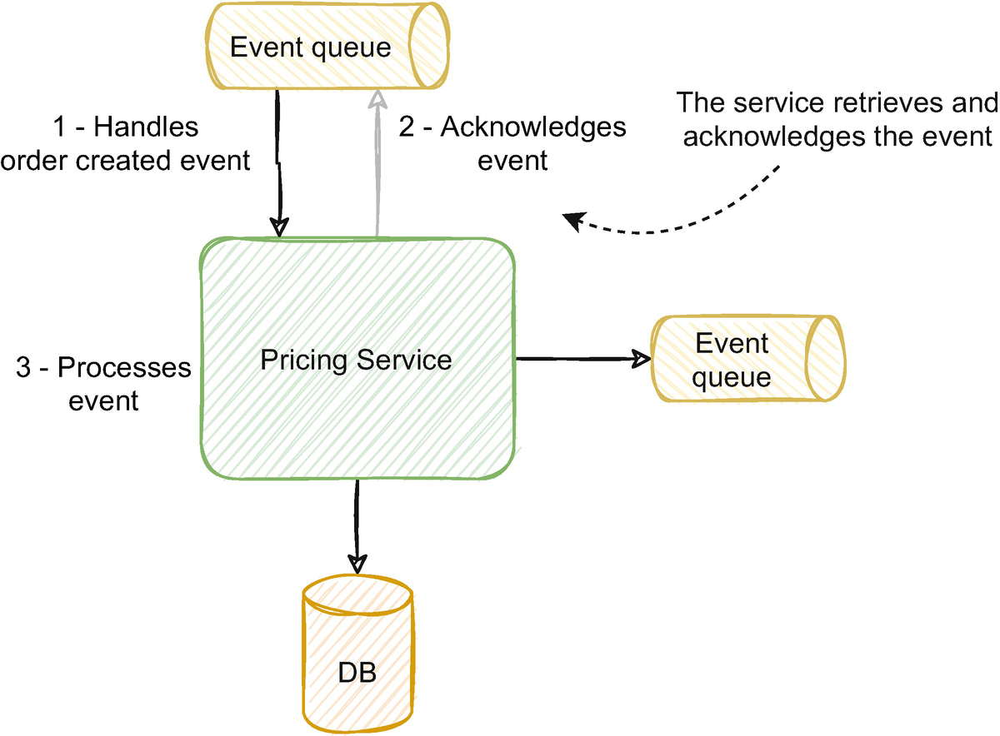

该服务从消息代理检索订单创建事件，确认该事件，然后继续执行操作以处理该事件。这种实现通常是与消息代理交互的标准方式；例如，Kafka 有一个自动提交消费者配置，默认情况下是启用的，它会在接收消息时定期自动提交偏移量。在 RabbitMQ 中，你可以在消费者中选择自动和手动确认（手动确认是默认的）。
这个细节很重要，因为如果服务崩溃或依赖项之一失败，我们已经确认了消息，代理已经将其标记为已消费。在 Kafka 中，偏移量已经提交；在 RabbitMQ 中，broker 已经从队列中移除了消息；等。服务向代理确认消息，但它仍在内存中处理它。任何使服务从内存中丢失消息的问题都会泄漏该消息。如果服务崩溃，或者（根据部署过程）部署新版本可能会发生此问题，则可能会发生此问题。这意味着我们可能会在每次服务崩溃时甚至在我们部署服务时丢失消息。
更合适的方法是仅在处理完成后确认消息。服务检索消息；完成它需要的所有处理，在这种情况下，是与订单相关的定价逻辑；并确认消息。该服务可能具有并行性并处理多条消息，但只会在完成事件处理中涉及的所有操作后才确认每条消息。这样，如果服务崩溃，它将重新处理它在崩溃之前正在处理的事件，而不是丢失它们。
想象一下，定价服务还发布了一个事件，表明为每个订单计算的价格。这两种方法标志着定价服务事件发布中至少一次和最多一次语义之间的区别。如果服务立即确认订单事件，则服务可能会在发送定价事件之前崩溃，但永远不会发送重复事件。但是，如果服务在发布定价事件后确认订单事件，它可能会发送两次。如果服务在事件发布后崩溃，它将重新处理发送重复事件的相同事件。根据我们需要的消息传递语义，我们可以自动或手动确认消息。但是，为了不丢失消息，确认应该是手动的。

### 7.5.1 中毒事件

不丢失事件和忽略具有损坏或意外信息的事件之间存在细微差别。由于不可预见的数据或验证失败，服务可能无法处理某些事件。在这些情况下，我们应该忽略该事件吗？如果服务由于验证失败而无法处理事件，忽略它可能是有意义的，但也有可能由于错误或意外数据而导致服务无法处理事件。
在这些情况下，我们可以修复服务并重放或更改偏移量以重新处理这些事件。使用死信队列13 也是一种选择。当处理事件失败时，我们可以将其发布到只有失败事件的队列并恢复正常工作。然后一个临时进程或一个特定的消费者可以处理或重新排队事件。 Uber 有一篇文章解释了他们如何使用 Kafka 来实现这一点。14 当在失败事件之后发布了大量事件时，死信队列可能是有意义的，因为它可能需要重新处理许多已经成功的事件。但是，对于持久消息代理，由于事件是持久的并且仍然可用，因此在可能的情况下移回偏移量和重新处理通常是一个更简单的解决方案。

## 7.6 在事件驱动的微服务中应用常见的弹性模式
正如我们在本章开头所讨论的，事件驱动的服务可能有一组外部依赖关系。每个依赖项或服务与依赖项之间的网络连接可能会失败。当发生此类故障时，我们可以采用一组传统方法。本节将详细介绍这些策略，并通过将它们应用于事件驱动服务的实际示例进行工作。
事件驱动服务享有更高级别的解耦和独立性，可避免将错误级联到上游服务。但是，服务本身可能会面临来自其依赖项的意外错误。这些故障的影响通常仅限于服务的范围；例如，即使上游服务失败，读取模型仍可能响应请求。由于服务不再处理更新，数据将变得陈旧，但事件驱动架构的性质允许系统做出响应。即使系统的一部分不可用，让平台继续响应通常更有价值。
尽管范围通常较小，但服务有其自身的作用和关键的业务价值。服务依赖可能会失败，服务应该足够可靠以维持正确操作并尽快恢复。我们还应该最大限度地提高可用性并在面临本地依赖失败时保持弹性。

### 7.6.1 重试作为事件驱动微服务中的弹性方法

重试是处理瞬态错误的标准方法。你可能在访问外部服务或依赖项时实施了某种重试机制。事实上，瞬态和网络错误的持续存在凸显了重试的用处。由于多种原因，请求可能会不时失败；重试请求通常比手动恢复数据更好。
在事件驱动服务中，我们可以在处理流程的不同操作中应用重试策略。如图 7-13 所示，我们可以在访问外部依赖项（如其他服务或数据库）或将重试策略应用于事件消费本身时使用重试策略。

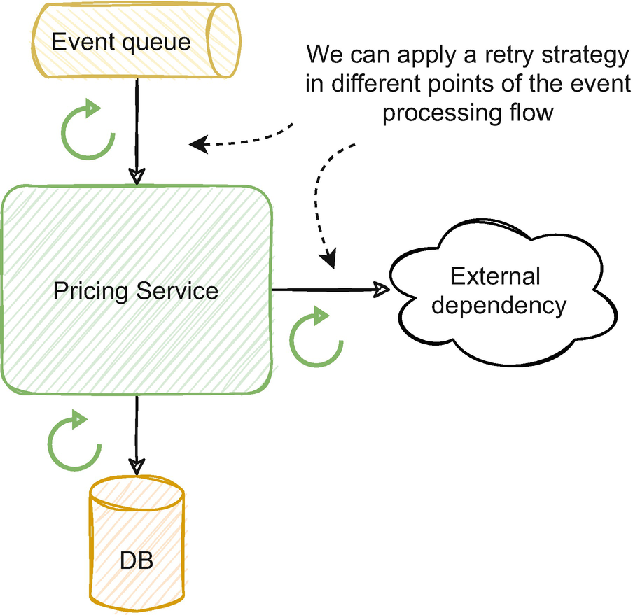

在处理瞬态问题时，将重试策略应用于外部依赖项通常更有用。我们也可以在事件消费层面进行重试；在消费时，如果发生错误，我们可以重试整个事件处理流程。在处理最终一致性、乐观并发或无效域逻辑（我们需要再次执行流程中的所有操作）时，这种重试通常更有帮助。
有一篇引人入胜的文章 15 详细介绍了 Google 如何通过使用重试策略在其某些服务上实现 99.9% 的延迟 SLA（我们在第 5 章中也提到了这篇文章）。由于服务必须发出另一个请求，因此重试具有更高的资源消耗；然而，正如文章中所详述的那样，通过正确的方法，它可以非常小（在文章用例中仅为 2%）并显着提高可靠性和可用性。重试通常与超时有关；在定义和触发超时时，我们可以重试请求。文章中讨论的一个可以说是很好的方法是了解典型的延迟并在取消和重试请求之前为 95% 的预期延迟指定超时。
正如在级联故障中所讨论的那样，通过向已经陷入困境的服务添加额外的负载，重试可能会很麻烦。一种常见的方法是使用具有指数退避和最大限制的重试。重试策略应始终具有最大重试次数，以避免产生更大的影响或停止消耗。想象一下，服务收到一个带有意外数据的事件；如果我们无限期地重试消费，服务将无限期地尝试处理事件，从而影响吞吐量。重试也应该只针对通过重复请求可能成功的条件执行。我们应该能够过滤总是失败的条件。
指数退避重试也有助于限制额外负载对依赖项的影响。我们可以连续发出额外的请求，但请求之间的时间间隔呈指数增长。我们还可以增加一个随机值（也称为抖动）来随机化时间间隔。抖动有助于避免跨不同服务意外编排的负载峰值。
当所有重试都失败时，我们也可以有不同的策略。我们可能有对服务逻辑或其他我们可能能够继续处理的逻辑至关重要的依赖项，尽管有一些降级。例如，如果与数据库的连接失败，它可能会影响服务使用的所有类型的事件。但是，如果缓存机制失败，我们可能仍会在没有缓存的情况下处理事件，但可能会降低吞吐量。当关键组件发生故障时，一个可以说是很好的方法是应用断路器（我们将在接下来详细介绍断路器）而不确认失败的消息（如第 7.5 节所述）。这样，一旦服务恢复，服务就不会尝试处理额外的消息并重新处理失败的消息。

### 7.6.2 事件驱动微服务中的断路器

重试非常适合瞬时故障或短时间不可用。但是，在面临更长时间的中断（多次重试后仍然存在的故障）时提供弹性可能需要不同的方法。重试不太可能成功的操作可能毫无意义或加剧本已困难的情况。相反，应用程序应该避免频繁的请求并以最合适的方式处理故障。断路器模式可以成为防止服务发出过多请求的安全网。本小节将详细介绍该模式的工作原理以及我们如何将其应用于事件驱动的服务。
事件驱动的服务可以具有外部依赖项，例如数据库或分布式缓存。例如，假设我们有一个定价服务，负责根据国家/地区和折扣规则计算订单的价格。在这种情况下，它可能依赖于像 Redis 这样的分布式缓存。 Redis 的临时连接问题可以使用重试来处理，但我们可能会受益于应用断路器模式来处理更长的中断。此示例如图 7-14 所示。

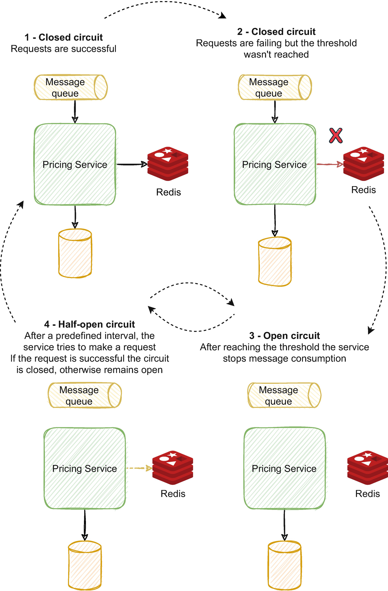

定价服务对订单事件做出反应，并使用 Redis 和数据库来处理其域逻辑。在正常工作模式下，电路被认为是闭合的；外部请求成功并处理事件。断开和闭合电路的概念源于实际的电路断路器。它们是设计用于在遇到问题时中断电流的电气开关；因此，当处于关闭状态时，电流流动，而处于打开状态时，电流停止。该模式使用相同的概念：当服务正常处理时，断路器关闭，当遇到问题时，断路器打开并停止处理流程。
如果定价服务在访问 Redis 时遇到问题，请求将开始失败。当失败请求的数量超过定义的阈值时，断路器打开。在这种情况下，它会停止消息消费，从而停止对 Redis 的请求。在这种状态下，断路器被认为是断开的。但是，服务不能永远保持这种状态；有时，该服务会尝试访问 Redis。当请求失败时，电路将保持打开状态。当请求最终成功时，它将关闭电路并恢复消息消费。
对队列中的事件做出反应的优势之一是服务不会丢失数据或请求失败。上游服务会持续发布事件；一旦服务恢复并恢复消息消费，它可以处理中断期间排队的事件。该服务可能会滞后于生态系统中发生的最新变化，并且可能会增加工作量；然而，这比失败或丢失这些请求要好。如果消息数量非常多，我们可以通过添加更多实例来水平扩展以更快地减少滞后并在滞后清除时将其移除。
断路器还提供了在适用时选择合适后备的可能性，从而为创建更具弹性的服务提供了机会。在这种情况下，我们可以用回退代替外部依赖，而不是停止事件消费。例如，当面临 Redis 中断时，服务可以回退到内存缓存；它可能不如分布式的高效，但可能足以让服务在中断恢复时处理正常的需求。

## 7.7 事件驱动微服务中的数据恢复和状态修复

前几节讨论了如何保证消息被可靠地发送和处理。我们还讨论了如何不丢失事件并确保处理收到的每个事件。通过这些方法，我们提供了控制故障和避免数据修复过程的工具。但是，数据仍然可能被损坏，或者服务可能会产生不良状态（例如，由于错误）。本节将讨论我们如何使用持久事件代理来恢复数据和修复服务的状态。
让我们通过一个类似于我们在前几节中讨论的例子的实际例子来工作。定价服务处理来自队列的订单创建事件，处理费用，在数据库中生成内部状态，并发布通知订单费用的事件。我们发布了改变税收计算方式的新功能，但不幸的是，我们引入了一个错误。由于我们的全面监控和警报，我们很快注意到了这个问题，并回滚了发布。这种情况如图 7-15 所示。

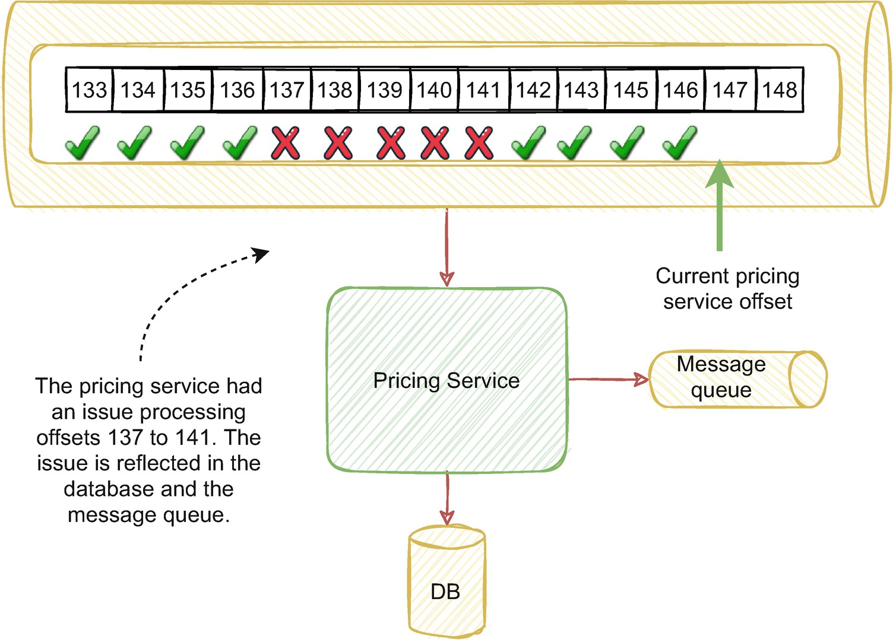

但是，定价服务针对一组事件以无效版本运行。该服务存储了这些事件生成的状态，可以安全地假设我们的部分数据已损坏。这种情况还有一个加重因素；由于收费错误，服务发布的事件也会受到影响，这也可能会影响到下游服务。
在传统的单体应用程序中，一个可能的解决方案是识别受影响的订单并运行一个临时进程来通过运行数据库脚本来恢复它们。在这种情况下，它可能有点简单，因为所有数据都在一个数据库中，我们可以在单个操作中更正所有内容，即使它通常是一个容易出错的过程。在同步微服务架构中，它可能更具挑战性；数据库脚本可能不够用，因为定价服务的依赖项不会受到影响（在同步架构中，事件队列将被对需要定价数据的服务的直接请求所取代）。另一种方法是运行一个临时进程来调用服务来修复受影响的订单。如果没有执行此操作的查询功能或订单数量过多，则识别具有无效状态的订单也可能具有挑战性。
在事件驱动的服务中，一个可以说是直接的解决方案是将服务的偏移量更改为引入错误之前的偏移量。在图 7-15 的情况下，我们可以将定价服务的偏移量从 147 更改为 137，该服务将重新处理受影响的事件（从 137 到 141），并修复状态。缺点是从偏移量 142 到 146 的事件即使成功也会被重新处理，因此我们在第 7.4 节中讨论了幂等性的重要性。
该服务已经发布了无效事件，如果我们不使用文档，它们应该保持原样。你可能还记得在第 3 章中，文档具有实体的完整状态，而事件代理仅保留最新的（正如我们在 Kafka 压缩主题中讨论的那样）。这可能看起来很奇怪，但事件代表了过去发生的事实；如果指控实际上是错误的，那么事件历史应该反映这一事实。为了修复状态，通过返回偏移量，服务将发布具有正确信息的新事件，从而修复将对这些事件做出反应的下游服务。正如我们之前所讨论的，该服务仅在状态发生变化时才发布事件。在这种情况下，服务将仅发布与服务更正的无效订单相关的事件。虽然服务对已经成功的订单进行了重新处理，但不会改变任何状态，不会反映在新的事件中，因此不会影响下游服务的额外负载。
我们提到错误的事件应该保持原样，除了文件。在这些用例中，队列不会保留历史记录，而是保留最新状态。由于我们将发布具有正确信息的新文档，因此该服务还将更正文档队列中的数据，因为代理只会保留最新的文档。无效的会更旧，因此会被经纪人清除。
如果我们应用本章中讨论的其他策略，这种方法可能仅限于错误和类似问题，因为已经考虑到了中断。然而，即使我们没有这些策略，这个解决方案也可以成为从泄漏事件或随机中断中恢复的一种有价值的方法。
请注意，此方法不涉及任何临时手动流程或特定开发来恢复状态。我们使用服务用于处理常规事件的相同流；我们只是倒回事件队列并重新处理。拥有持久事件队列的美妙之处在于，除了能够从历史中获取价值并生成新的数据视图之外，还拥有可持续恢复状态所需的所有工具。

## 7.8 事件驱动微服务中的舱壁模式
舱壁通常在船舶中用作控制故障的手段。他们把船分成几个独立的分区；如果船体受损并且某一部分受损，舱壁保证故障不会蔓延到船的其余部分。一艘船仍然可以航行，但有一些被淹没的隔板；隔板避免了灾难性的故障。本节将讨论我们如何将类似的概念应用于事件驱动的架构。
另一方面，泰坦尼克号有舱壁，但它们并没有阻止船沉没。泰坦尼克号的舱壁没有全长，主要是因为不会妨碍乘客在整艘船上的舒适度和移动。由于它们不够高，舱壁在损坏的隔板上没有装水，软件工程相当于在规划会议中将弹性开发标记为“很好”。
无论如何，隔板如何应用于事件驱动的服务？让我们对定价服务使用相同的示例。该服务处理订单创建事件，处理每个订单的费用，并将状态保存在数据库中。假设我们还有一项税务服务，负责管理每个国家/地区的税收变化。我们讨论了为什么每个服务都应该有自己的数据库；但是，数据库集群可以有多个数据库。例如，如果我们使用 MongoDB，我们可能希望将多个与域相关的数据库分组在同一个集群中。也许更多的理论参考可能会将此称为反模式，说实话，理想的情况是每个服务都有完整的隔离数据库集群。然而，由于实际和金钱的原因，情况往往并非如此，也不是由于确凿的原因。尽管我们经常忘记，一个维护成本相当高的解决方案，即使具有出色的性能和可扩展性属性，也不是一个很好的解决方案。毕竟，我们正在为企业构建工具。
当税收发生变化时，它们会在税收服务中产生批量操作，这对数据库来说非常重要。额外的负载使集群资源匮乏，并可能影响税收和定价服务，如图 7-16 所示。

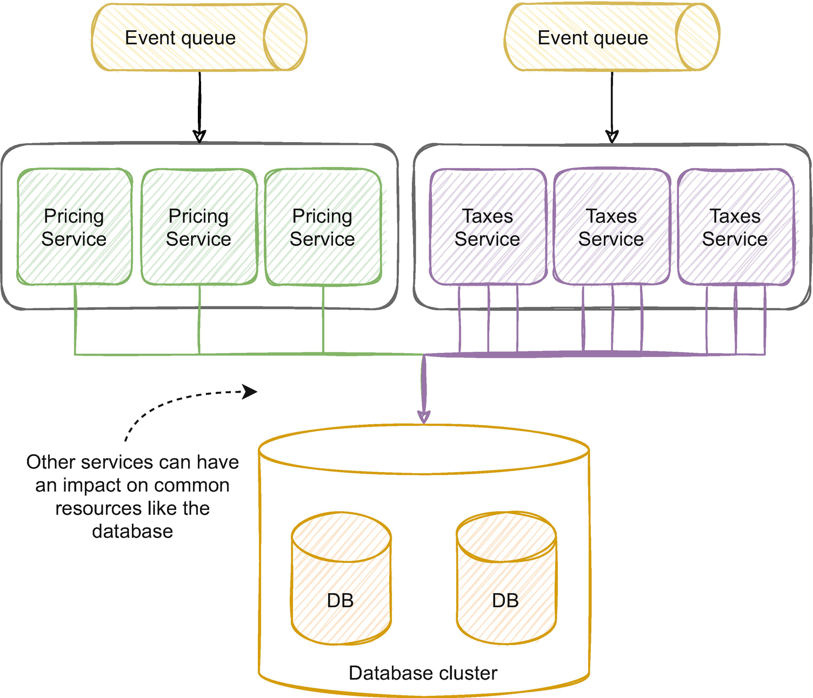

为了减轻税收服务造成的影响，我们可以通过调整税收服务的并行度来应用舱壁模式。我们在第 6 章讨论过，我们可能有一个服务的多个实例，每个服务实例都具有并行性以优化物理资源。通过降低并行度，我们还可以减少服务对数据库集群的影响。如果服务有多个实例，我们也可以减少它们的数量。并行度和实例数量是我们应该从头开始在我们的解决方案中包含的基本参数，以调整服务性能并减轻这种影响。
显然，税务服务的处理速度会较慢，但与应用于每个订单的费用相比，批量操作的处理速度可能更慢。舱壁模式是关于遏制失败；该服务的处理速度可能较慢，但不会将问题传播到定价服务或在税收服务中运行的其他进程。在这种情况下，作为更可持续的解决方案，我们可以升级数据库或将其分成不同的集群，以避免影响，正如我们之前讨论的那样。但是，如果说批量操作可能需要一段时间才能以适度的并行性完成，这可能无法证明成本是合理的，并且可能更合理且更具成本效益。我们可以将此方法应用于任何类型的依赖项、分布式缓存或对另一个服务的同步请求。当对其他服务使用同步请求时，舱壁模式可能是一个可以说是很好的解决方案，因为这些服务可能容易受到级联故障的影响。上游服务中的隔板方法可能会很快避免广泛的影响。

### 7.8.1 优先队列

管理意外负载影响的另一种方法是将操作隔离到不同的队列中。在前面的示例中，税收服务收到了可能反映异常消息到达率的批量操作。由于通常情况下，批量操作的优先级低于生态系统中实时发生的更改，因此我们可以将它们委托给优先级较低的队列。
通过隔离队列，我们可以为每个队列分配不同的资源。与处理批量操作的队列相比，具有定期日常更改的队列可能具有更高的并行度。这样，我们可以调整每个队列的并行度，以保证更高优先级的队列没有延迟。较低优先级的队列以可持续的速度处理，而不会影响服务的依赖关系和资源。假设服务可能滞后于低优先级队列，这应该没问题，因为不需要实时处理更改。我们可以将运行时间较长的进程委托给低优先级队列，并将重大业务变更委托给更高优先级的队列。

## 7.9 结论
我们在本章中讨论的所有模式如何应用于服务的依赖关系？图 7-17 说明了这些模式如何与典型服务拓扑及其依赖项的初步讨论相关（图 7-1）。

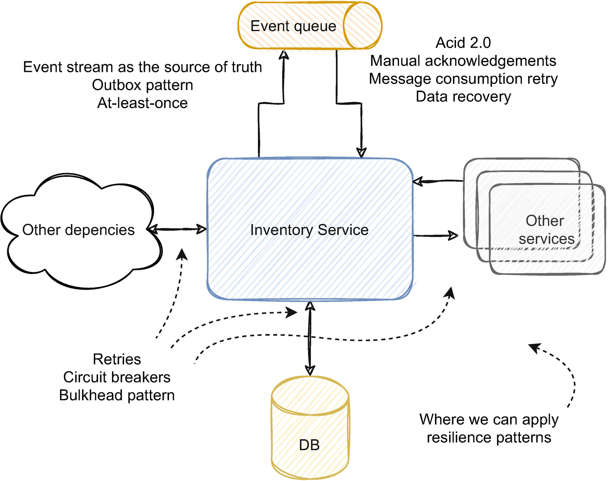

在其他服务、分布式缓存、数据库等典型的外部依赖项中，通常与使用重试、断路器和隔板模式相关。在发布消息时，我们可以使用事件流作为真实来源、发件箱模式，并以至少一次语义发布。我们可以根据ACID 2.0消费消息，手动确认/提交，重试消息消费，使用数据恢复策略。
如果我们应用本章中讨论的模式，我们可以保证我们可靠地处理事件并且没有泄漏。我们还保证服务依赖项的安全性以及调节流量和负载的方法。

## 7.10 总结

服务有多个依赖项，每个依赖项都可能由于多种原因而失败。我们需要保证这些故障不会影响服务的可靠性和正确性。
由于其解耦性质，事件驱动的服务不太可能遭受级联故障。
由于与事件代理的交互，负载平衡和速率限制通常已经包含在事件驱动服务的设计中。
事件传递可以具有三种不同的语义：至少一次、至多一次和恰好一次。 Exactly-once 是最有用也是最难保证的。最多一次丢失消息，但通常具有更高的性能。至少一次可能会产生重复的工作，但它很容易实现并确保不会丢失任何消息。
服务的状态必须反映事件流。我们可以通过使事件流成为事实来源、使用发件箱模式或使用事务和补偿操作来实现这一点。
将 ACID 2.0 属性应用于消息消费可以提供更高的弹性和灵活性，尤其是在与重试策略相关联时。
手动确认或提交可以保证消息不会在故障情况下丢失。
重试和断路器是常见的弹性模式，我们可以应用它们来使服务更具弹性并调节对外部依赖项的吞吐量。我们可以将断路器与回退结合起来，使服务对常见故障具有弹性。
重绕事件流可以成为恢复数据的强大工具。
隔板模式可以包含局部故障的扩散。优先队列也可以作为一种可行的选择来调节具有不同紧迫性的流量，而不会使服务资源不堪重负。

## 脚注

1. Further details in “Fallacies of distributed computing,” https://en.wikipedia.org/wiki/Fallacies_of_distributed_computing
2. Full presentation by Yuri Shkuro, September 9, 2019, “Conquering Microservices Complexity @Uber with Distributed Tracing,” www.infoq.com/presentations/uber-microservices-distributed-tracing/
3. Check “Two Generals’ Problem,” https://en.wikipedia.org/wiki/Two_Generals%27_Problem
4. Full details in this article by Neha Narkhede, June 30, 2017, “Exactly-Once Semantics Are Possible: Here’s How Kafka Does It,” www.confluent.io/blog/exactly-once-semantics-are-possible-heres-how-apache-kafka-does-it/
5. Full walkthrough in “How to maintain message ordering and no message duplication,” https://kafka-tutorials.confluent.io/message-ordering/kafka.html
6. Full documentation in https://kafka.apache.org/documentation/#semantics
7. Detailed example in this article by Microsoft, 2012, “Exploring CQRS and Event Sourcing,” http://download.microsoft.com/download/e/a/8/ea8c6e1f-01d8-43ba-992b-35cfcaa4fae3/cqrs_journey_guide.pdf
8. Full article by Adam Warski, March 13, 2018, “Event Sourcing Using Apache Kafka,” www.confluent.io/blog/event-sourcing-using-apache-kafka/
9. Further details on why Kafka isn’t suitable for event sourcing in this article by Jesper Hammarbäck, August 18, 2020, “Apache Kafka Is Not for Event Sourcing,” https://dzone.com/articles/apache-kafka-is-not-for-event-sourcing
10. Further details on how to implement in this article by Rod Shokrian, October 1, 2019, “Event-Driven Architecture and the Outbox Pattern,” https://medium.com/engineering-varo/event-driven-architecture-and-the-outbox-pattern-569e6fba7216
11. Full article by Peter Alvaro, Neil Conway, Joseph M. Hellerstein, and William R. Marczak, January 9–12, 2011, “Consistency Analysis in Bloom: a CALM and Collected Approach,” https://people.ucsc.edu/~palvaro/cidr11.pdf
12. Very interesting article by Pat Helland and Dave Campbell, June 7–10, 2009, “Building on Quicksand,” https://database.cs.wisc.edu/cidr/cidr2009/Paper_133.pdf
13. Full article by Peter Bailis and Ali Ghodsi, April 9, 2013, “Eventual Consistency Today: Limitations, Extensions, and Beyond,” https://queue.acm.org/detail.cfm?id=2462076
14. Article on how to implement it by Robin Moffatt, March 13, 2019, “Kafka Connect Deep Dive – Error Handling and Dead Letter Queues,” www.confluent.io/blog/kafka-connect-deep-dive-error-handling-dead-letter-queues/
15. Full article by Ning Xia, February 16, 2018, “Building Reliable Reprocessing and Dead Letter Queues with Apache Kafka,” https://eng.uber.com/reliable-reprocessing/