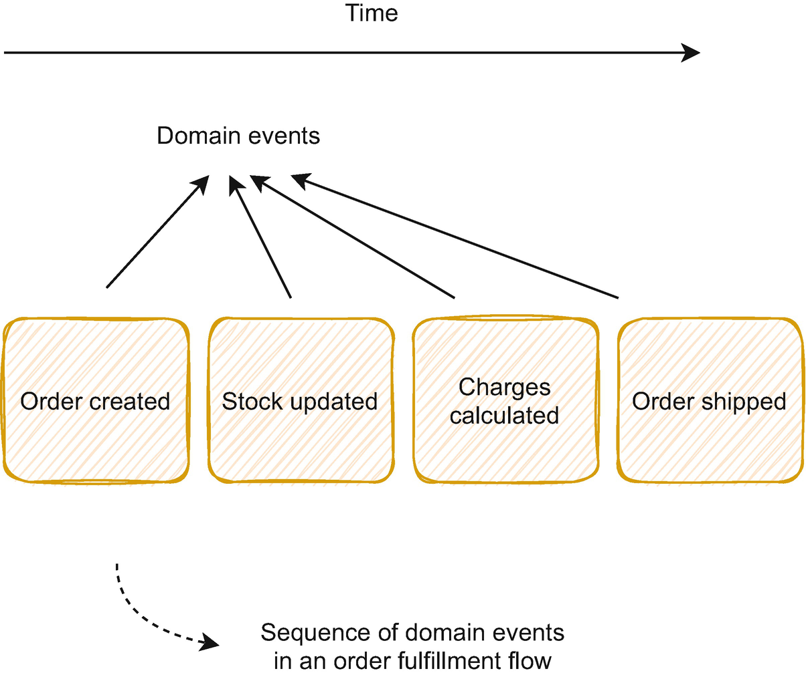
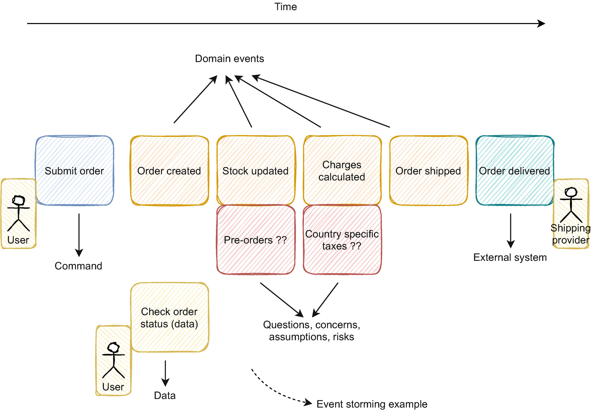
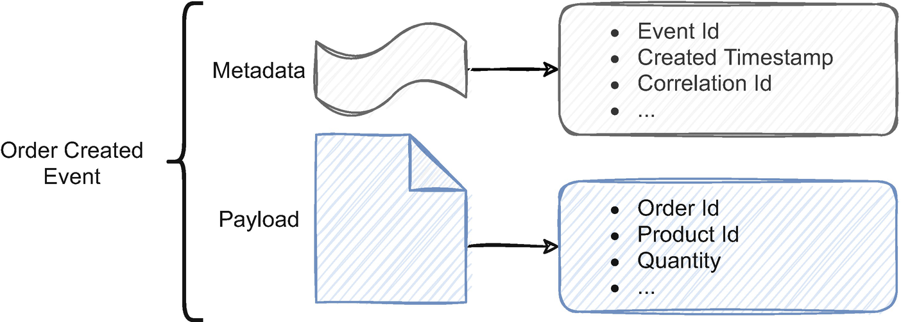
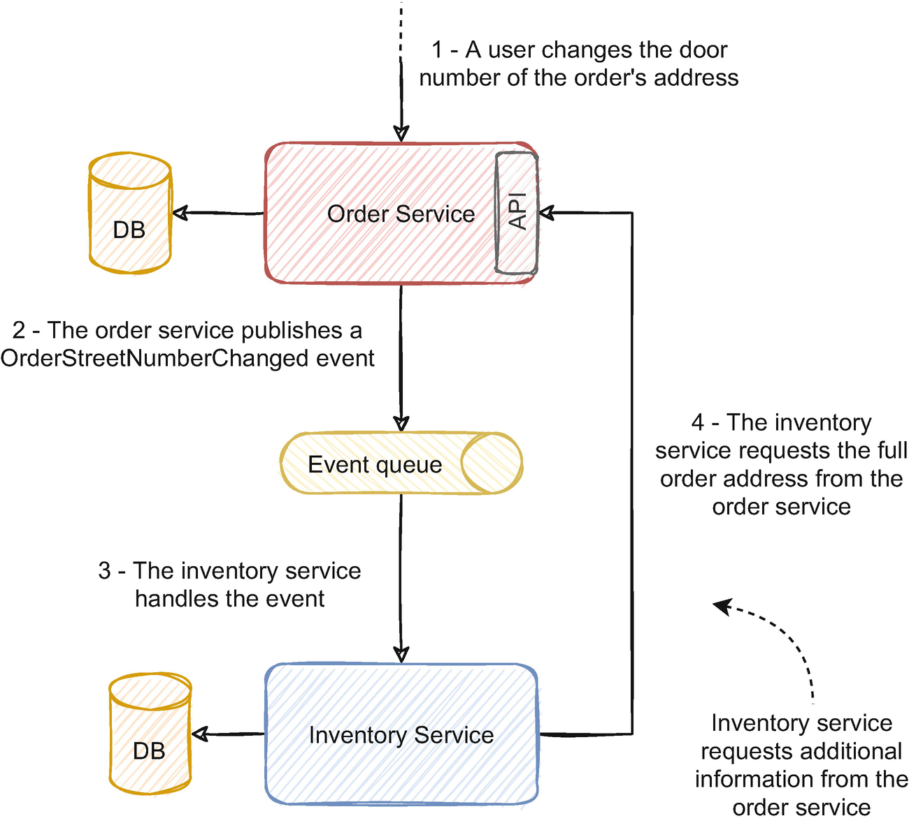
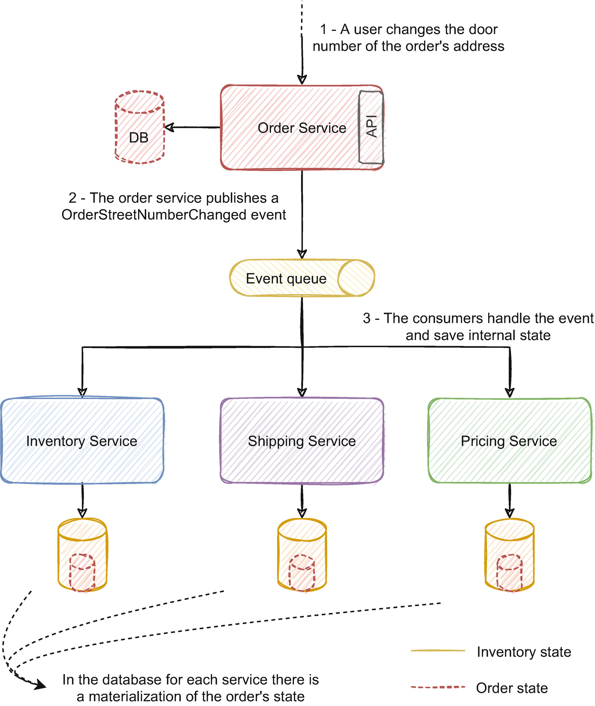
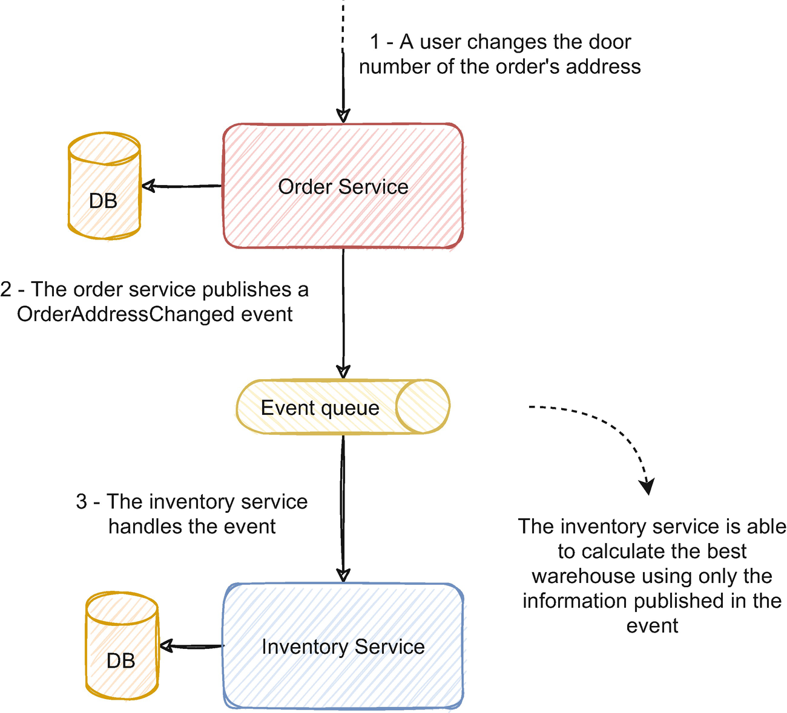
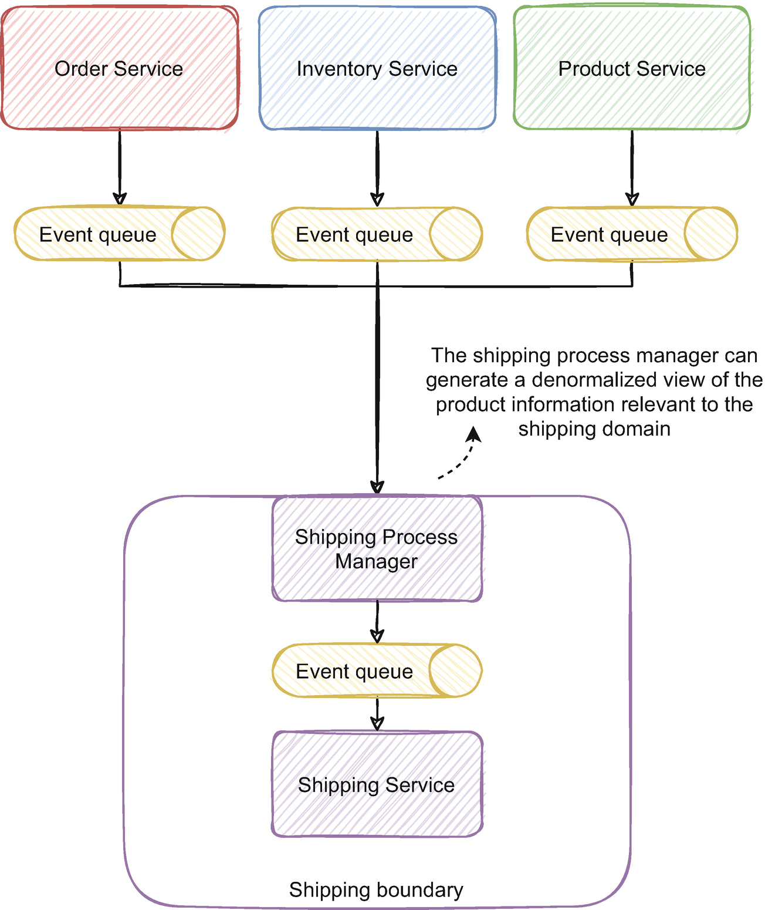
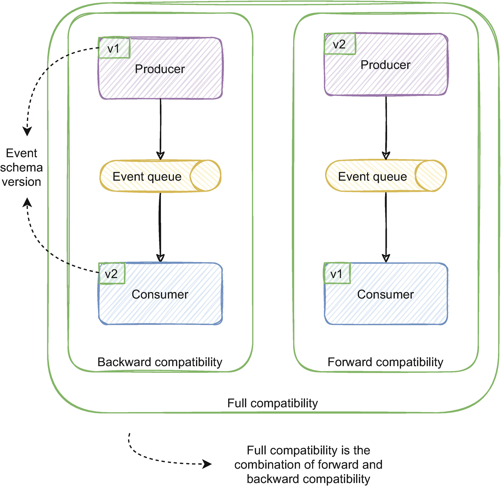
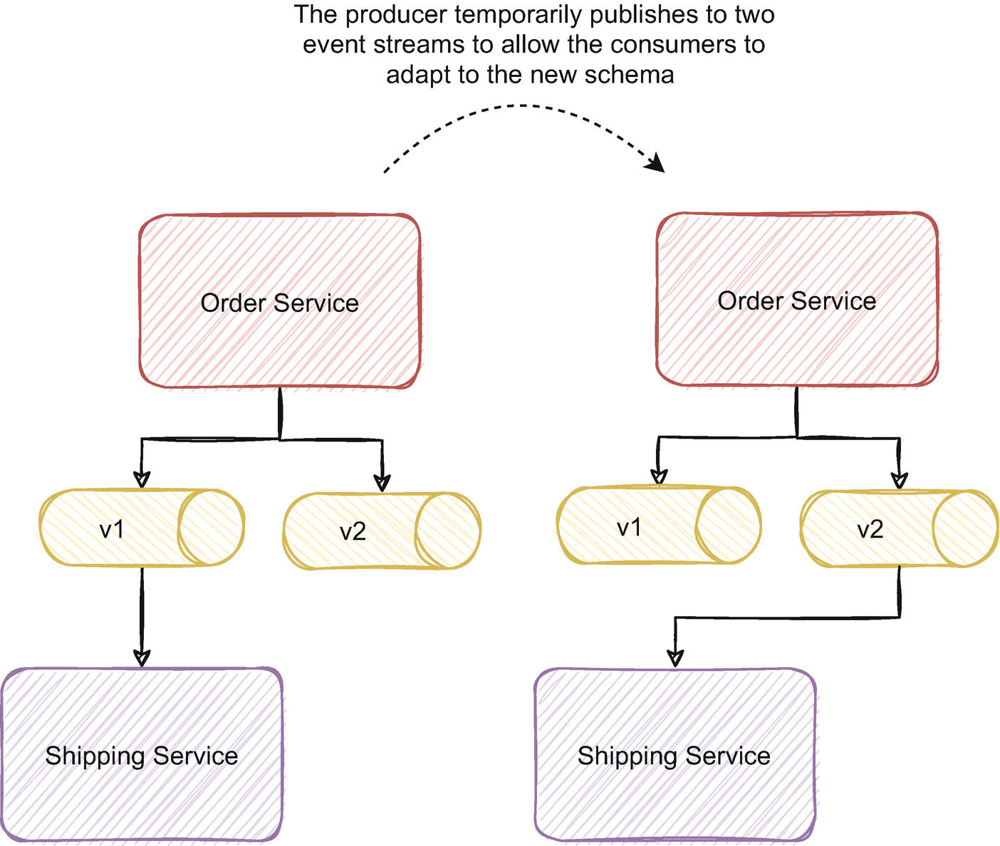
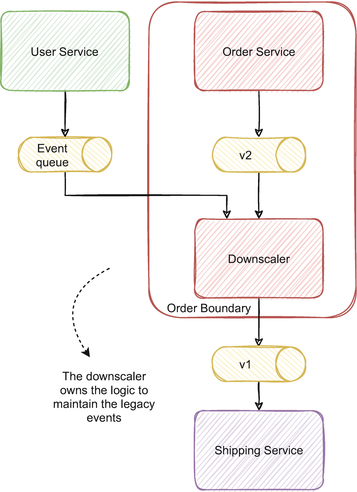

本章涵盖：

- 使用事件风暴建模事件
- 使用和了解哪些信息受益于在事件标题中传输
- 设计小型活动及其影响
- 设计大型和非规范化事件及其影响
- 了解让消费者参与事件模式设计的重要性
- 避免重大更改以及如何演化事件模式

达尔文曾经说过，生存下来的不是最强壮或最聪明的物种，而是适应性最强的物种。事件很像它；设计活动没有一劳永逸的规则；它们通常需要适应每个用例，并牢记消费应用程序的要求。事件是每个事件驱动架构的本质；正如我们在前几章中讨论的那样，它们是在整个公司共享数据的一种有意义且可持续的方式。它们代表了企业保留其价值并以解耦和可扩展的方式公开它的历史。在流媒体和可扩展媒体中公开数据为强大的用例奠定了基础。事件是事件驱动架构中的血液流动；为每个用例设计正确的事件模式成为关键的设计考虑因素。
我们讨论了拥有持久事件代理和保留事件历史记录的优势。这是一个强大的概念，直到你必须在事件模式中插入一个重大更改，然后与处理多个事件模式的挑战相比，历史似乎就没那么有价值了。本章还将讨论如何处理模式更改并通过一个用例来说明我们如何处理模式演变。
设计活动通常是一个灰色地带；有标准的最佳实践，但盲目遵循它们会严重影响架构并产生复杂的变通方法。了解不同设计方法的含义、权衡利弊并做出深思熟虑的决策是实现可维护和可扩展的解决方案的基础。本章将讨论这些权衡，并通过使用不同方法的用例来解释优缺点。虽然它不会为你提供始终设计正确模式的灵丹妙药，但它会为你提供做出持续决策并为每个用例选择适当影响的注意事项。

## 8.1 事件风暴和事件驱动的微服务
事件风暴是一种对复杂业务流程进行建模的技术，它与事件驱动架构具有高度的协同作用。它分享了一些 DDD 概念，但它专注于我们通常可以直接转换为代码的事件时间线。事件风暴的完整实现超出了本书的范围，它在 Alberto Brandolini 的书（其最初的作者）1 中得到了充分的阐述。本节将为你提供进一步探索它的基础，以及为什么事件风暴与事件驱动架构及其事件建模相关。
事件风暴是一种工具，可用于获得对复杂领域的更高水平的理解，并促进对领域业务流程的共同理解。它涉及将业务流程建模为由白板上的即时贴表示的事件流。技术和业务专家使用不同颜色的贴纸对业务流程中的领域事件、命令、组件、外部系统和问题的序列进行建模。在一个相对较短的会话中，大约一个小时，可以模拟一个相当复杂的业务流程，只要合适的人在房间里并提供适当的调解。可以安排更多的会议来深入研究不清楚的主题或进一步详细说明更高级别的流程。
这也是关于在同一个房间里聚集合适的人并对业务流程进行时间建模。不是专注于像典型建模方法（如 UML、序列图等）那样的结构，而是专注于映射过程中发生的连续事件的时间线。作为集体学习和对整个端到端流程进行建模的工具，它非常有益。它还有助于识别可能在项目后期成为问题的早期差距、障碍、误解和灰色区域。
那么，我们该如何应用呢？关于事件风暴的关键点是在事件风暴会议中是否有合适的人在场。应该有开发团队和领域专家的元素。如果我们没有合适的人参加会议，我们应该推迟它并保证每个人都在场。一旦我们收集了所有相关人员并明确定义了会话的目标（例如，事件映射订单履行流程），我们应该要求参与者使用事件对流程进行建模。事件由橙色便签代表，应放置在一个大的开放区域。大面积很重要；我们希望参与者描绘出这个过程，而不是在没有实际支持的情况下进行无谓的讨论。放置便利贴的狭窄空间限制了思考过程；没有实际支持的讨论往往没有真正的结论或行动要点；我们想避免这种情况。然后参与者应该将过程映射为一系列事件。图 8-1 说明了订单履行流程中的事件序列。



最有价值的第一步是将业务流程建模为一系列领域事件。该序列本身极大地增加了会话中每个人的过程的知识。一个可以说是很好的第一次互动是让主持人向参与者询问业务流程的一个事件并将其写下来，这通常有助于打破僵局并开始活动。领域事件是与业务专家相关的业务事件。领域专家可以根据这些事件在时间线中流动时解释该过程。以这种心态呈现业务流程为讲故事提供了一个有价值的框架，即使没有技术背景，任何人也很容易理解。一个重要的调节技巧是让领域专家映射事件，开发人员探索它们的含义，而不是开发人员指导思考过程。
一旦你有了领域事件的主要流程，你就可以添加事件风暴会话的其他典型元素：

- 我们刚刚讨论过的领域事件（通常用橙色便签表示）
- 用户命令，用户操作（通常用蓝色贴纸表示）
- 问题、风险、假设和顾虑，我们用它们来表示可能存在的差距或需要进一步分析的流程部分（通常用粉红色贴纸表示）
- 角色/演员，发起行动的人（通常用黄色贴纸表示）
- 外部系统，来自外部系统的事件（通常由浅蓝色/青色粘性贴纸表示）
- 数据、数据咨询以做出决定或读取模型（通常以浅绿色即时贴表示）

我发现通常最好映射域事件序列，然后迭代添加有关其他类型工件的详细信息。最终，它可以演变成类似于图 8-2 的样子。



一个重要的细节是问题/粉红色贴纸；如果参与者在讨论某个主题时遇到困难，请将其写在其中一个便签上。它促进了每个人的协作，如果讨论时间过长，我们可以标记并继续。此外，遵循典型的发散、探索和收敛方法可能是有益的。你希望参与者讨论整个过程和事件的顺序（发散和探索）。接下来，尝试理解混乱，将每个人分组以组织事件流（收敛）。
这个过程促进了积极的协作，以发现正确的事情要做。在大型微服务架构中，开发人员往往会实施专注于单个或少数服务的项目，很容易丢失端到端流程的全貌。照他们说的去做也很容易，这可能不是正确的事情。事件风暴极大地有利于知识的传播并阐明项目的主要目标。
DDD 经常提到的一件事是领域专家。事实上，在大型组织中，没有一位领域专家；通常，存在知识孤岛。在每个筒仓中，都有一个或几个专门从事该筒仓的领域专家；几乎没有人了解所有筒仓。事件风暴在这些环境中大放异彩，我们可以将每个领域专家带到会议中。会议中的每个人可能都不知道所有事情，但每个人的综合知识都提供了非常有见地的见解。它还提供了一个用于组验证的平台，就像对领域专家完成的流程建模的代码审查一样。
事件风暴与事件驱动架构具有高度协同性，因为领域事件通常映射到技术领域事件，还有什么比领域专家的输入更好的设计这些事件的方法呢？它还强调了一些有益的架构决策。例如，在图 8-2 中，我们有一个订单创建领域事件和一个检查订单状态数据模型；这可能会直接转化为 CQRS 模式。它通常被证明是从模型到实际实现的平滑转换。
有关更多详细信息和审核指南，我们强烈推荐 Alberto Brandolini 的书；他还在值得一看的 NewCrafts 会议上发表了精彩演讲。 2 Paul Rayner 也发表了精彩演讲，其中包含一些节制技巧和详细介绍事件风暴概念。 3

### 8.1.1 事件风暴的局限性是什么？

事件风暴可能不适合简单直接的领域。例如，如果一个域可以通过 CRUD 实现清楚地表达，那么通过事件对其进行建模可能是不够的。然而，就像 DDD 一样，通过练习获得的理解和知识通常非常有价值。
在具有复杂相互作用的更广泛的过程和领域中，节制变得尤为重要。经验丰富的节制可能很难找到，对于第一次尝试事件风暴 4 的人来说可能是一个挑战。 Game Storming 一书可以对某些框架有所帮助。
一项挑战通常是让合适的人参加会议；领域专家通常很难确定。合适的领域专家的存在通常是做或做的要求；我们需要合适的人参加会议才能富有成效。它也成为分布式团队的一个问题；人们在同一个房间里会产生一种独特的氛围，并促进一种与人们远程协作不同的协作类型。你可能仍然从练习中受益，但它可能没有那么有价值。

## 8.2 事件模式：标题和信封
事件的有效载荷显然是事件的关键部分。然而，一个经常被忽视的细节是事件的标题。在某些用例中，事件受益于在标题或事件的信封中提供一些通用属性。本节将讨论使用信封的优点和缺点，并将通过一个用例来说明哪些信息可以与添加到一个或多个信封相关。
每个事件都有一些相关的信息，与其内容或来源无关。这种类型的通用信息或元数据可以使用通用结构（如事件的标题或信封）共享，如图 8-3 所示。在整个组织中拥有标准化属性可以帮助通用流程或实用程序（如跟踪），而无需深入研究事件的有效负载。它还提供了更好的隔离；事件的有效载荷将只包含与发生和域相关的信息，而我们可以将具有更抽象性质的基础设施信息隔离到一个孤立的结构中。



元数据提供有关事件的上下文信息，而有效负载提供事件的信息。它类似于 HTTP 请求；请求的正文携带请求的有效载荷，HTTP 标头包含更多关于请求的上下文信息。事件的元数据可以使用信封或通过消息头传输。消息信封就像事件有效负载周围或内部的包装器，具有所有事件通用的标准结构。大多数消息代理也支持消息标头，并且与 HTTP 标头非常相似，它们通常以键值方法建模，具有定义自定义值的灵活性。

### 8.2.1 事件模式中的标题与信封

通常有两种方法来实现事件包络，一种是组合结构，一种是平面结构。扁平结构将信息添加到事件的有效负载旁边，其属性包含所有元数据信息。组合结构更受欢迎，类似于实际的信封；信封是一个带有上下文信息和抽象有效载荷的包装器。清单 8-1 说明了应用于订单创建事件的两种类型的信封。
```json
Composed OrderCreatedEvent
{
    Metadata:
    {
        EventId: 1231,
        Timestamp: "2021-01-30T11:41:21.442Z"
    },
    Payload:
    {
        OrderId: 3621,
        ProductId: 2184,
        Quantity: 2,
        UserId: 164
    }
}

Flat OrderCreatedEvent
{
    Metadata: [{"EventId": 1231}, { "Timestamp": "2021-01-30T11:41:21.442Z"}],
    OrderId: 3621,
    ProductId: 2184,
    Quantity: 2,
    UserId: 164
}
```

每个具有扁平结构的事件都有一个特定于事件元数据的属性。虽然组合结构将其隔离在更高级别，但事件有两个根字段：一个用于元数据，另一个用于有效负载。组合字段中的元数据也可以是动态属性的通用数组，尽管定义静态元数据字段有其优点。例如，如果我们为公司定义标准信封，我们可以强制执行特定字段，例如相关 ID 或用户 ID 以进行审计。它还激发了对信封定义的合作（尽管这可能是优势或劣势，具体取决于公司）。
然而，信封往往会妨碍活动，有时可能难以处理。它引入了额外的信息来序列化和反序列化有性能影响；此外，信封的变化往往难以管理。如果更改事件的架构需要大量的沟通和对齐，想象一下当所有事件共享相同的包络时更改包络的架构。同时处理使用信封的源和不使用信封的源也会变得困难，这通常会导致额外的代码开销。有一篇有趣的 Confluent 文章 5 进一步探讨了值得一看的不同信封。
标题通常倾向于简化这个过程；我们可以在事件标题中共享常见的上下文信息，并且通常提供更好的概念隔离；有效载荷有事件，头有元数据。标头是大多数代理的常见功能，由于它们是动态的和可选的，它们使不同的用例更容易处理。为了保证跨服务的一致性，大多数用例可能会受益于具有自定义标头和公司想要实现的标头的通用定义。但是，强制要求存在特定的标头比较困难；如果一个需求要求在所有服务中绝对存在给定信息，那么信封可能有助于强制执行该需求。这取决于用例，但总体而言，使用标头往往是一种更灵活且侵入性更小的方法。

### 8.2.2 事件中的相关上下文信息

信封和标题非常适合共享常见的上下文信息。但是什么样的信息可以用作元数据或上下文数据？这在很大程度上取决于用例，你甚至可能会发现定义仅与你的域或业务相关的特定自定义标头很有帮助。但是，通常有对大多数用例有用的通用信息；本小节将详细介绍上下文信息的一些常见用例。通过这种方式，你可以推断它是否对你的用例有意义，以及通常在元数据中发送哪种信息。
HTTP 在请求、响应甚至常见的标头方面有相当详细的定义。该定义提供了跨系统、公司和服务的互操作性。有一个明确的合同要遵守，并且对系统如何工作有一些假设促进了沟通和发展。事件作为公司间通信的媒介，尤其是在事件驱动的架构中，可以说可以从类似的定义中受益。 CloudEvents6 是一种给出此定义的方法，并提供了描述事件数据的规范。它提供了一些强制性和可选上下文属性的示例。以下是一些通常与大多数用例相关的示例：

- id：事件的id。拥有事件 id 通常对调试、跟踪甚至管理幂等性很有用（就像我们在第 6 章中提到的那样）。每个事件必须是唯一的；生成唯一的增量 id 可能很麻烦；使用 UUID（通用唯一标识符）可能会有所帮助。
- 相关 ID：将不同操作关联在一起的 ID。例如，当我们讨论编排模式时，会编排几个服务来完成一个订单。订单服务创建订单，库存服务管理订单的库存，定价服务计算费用等。每个服务都会发布一个事件；拥有跨所有服务的关联 id 是一种快速获取单个订单范围内所有操作的方法。
- 来源：发布事件的服务和操作。当单个服务中的不同进程可以生成事件时尤其重要。
- 版本：聚合的版本。通常对于管理幂等性和调试目的很有价值。
- 时间戳：事件发生的日期。也与调试和跟踪目的相关。当版本不存在时，管理并发性会很有帮助。
- 优先级：事件的重要性。我们可以将事件分配给具有不同优先级的不同流（正如我们在第 6 章中讨论的那样）。
- 用户 ID：触发事件的用户 ID。通常用于审计和调试目的。

## 8.3 Town Crier 事件模式
设计事件模式时可能会出现几个问题。一个常见的设计问题是事件应该有多少信息以及它应该有多大。一个经常讨论的最佳实践是将事件设计得很小，并且只携带有关触发它的更改的信息。遵循这种方法通常会产生城镇警报事件（也称为事件通知 7）。这个词来自真正的镇上的呐喊者，他们通常通过在街上大喊大叫来通知人们重要的公告。在中世纪的英格兰，大多数人无法阅读报纸；市内传讯者是传播新闻的重要方式。镇上的传话员大声喊出公告的中心部分，并且通常会在当地旅馆张贴一张附加说明，以防有人想了解更多信息。 Town Crier 事件遵循类似的方法；事件以最少的细节发布，订阅服务可以请求有关对生产服务的更改的附加信息。本节将讨论这种设计事件模式的方法，并通过使用订单提交流程的用例对其进行说明。
让我们通过一个与我们在前几章中讨论过的示例类似的示例。订单服务管理电子商务平台的订单。用户提交订单并可以编辑他们的信息，只要订单没有达到给定的状态。在这种情况下，用户更改了订单地址的门牌号。清单 8-2 说明了一个可能的事件，仅使用最少的信息来反映此更改。

```json
OrderStreetNumberChanged
{
    OrderId: 3621,
    AddressStreetNumber: 21
}
```

保持事件模式小而单一对于整个系统来说是极好的。小事件易于处理，在序列化和反序列化方面更快。它们通常对消息代理和服务资源的影响也较小。与 DDD 思维方式一致的一种通常的好方法是根据用户的意图设计事件。在这种情况下，在设计 OrderUpdated 与 OrderStreetNumberChanged 时考虑一下；第一个我们不知道哪个是用户的确切意图，后者清楚地表示仅更改地址街道号码的意图。以这种方式设计事件可以捕获流程的业务价值，并为事件注入领域价值。事件流将清晰地捕获用户的意图和业务流程的流程。域本身不仅仅位于服务的逻辑上，也位于事件流中。保留此域值作为审计或根据业务需求重建不同的数据视图时非常有用。然而，根据用例的不同，这种最小化的设计也可能给消费者带来一些挑战。
该事件只有与更改相关的基本信息、用户更改的订单的 id 和新的街道号码。假设库存服务处理订单事件以反映库存变化并计算满足订单的最佳仓库。每次订单地址发生变化时，都必须重新计算最佳仓库并反映产品库存的变化。计算满足订单的最佳仓库的路由算法基于其完整地址。在这种情况下，此事件模式设计对库存服务提出了挑战。服务需要完整地址来计算最佳仓库，但事件只有新地址街道号码。在处理部分事件时，库存服务必须从订单服务请求整个订单的地址，如图 8-4 所示。



获取剩余地址信息的附加远程请求具有我们在前几章中讨论的影响。库存服务现在同步依赖于订单服务，容易受到级联故障的影响。如果订单服务出现问题，库存服务可能会直接受到影响，而不仅仅是异步处理事件。缩放也可能成为一个问题；如果我们需要通过添加更多实例来水平扩展库存服务，它将触发对订单服务的额外请求，这些请求也可能需要进行扩展。这种拓扑更接近于我们之前讨论过的分布式单体。如果订单服务的读取模型最终一致，则使用事件可能还需要额外的复杂性。例如，假设订单服务应用 CQRS 模式并异步更新库存服务使用的读取模型 API。在这种情况下，API 中的信息可能不是事件的最新信息。理想情况下，我们希望消费者能够在不重复外部依赖的情况下处理事件。
当消费者需要对触发事件的特定变化做出反应时，部分和小事件通常很有帮助。例如，每次用户更改订单中的任何内容时，订单服务都可以发布 OrderUpdated 事件。尽管如此，在这种情况下，库存服务唯一关心的是地址。如果库存服务正在使用 OrderUpdated，它必须了解发生了什么变化；订单中的任何数据都可能已更改，而不仅仅是地址。它可能需要存储订单地址的一些元数据以了解地址已更改，而不是订单数据中的其他内容以做出相应的反应。在这种情况下，可以说更好的选择是发布 OrderAddressChanged 而不是 OrderUpdated 或 OrderStreetNumberChanged。
当消费者需要对触发更改的域过程做出反应时，Town Crier 事件是相关的。根据这种变化来设计它们是一个很好的方法，但我们需要注意使事件与消费者充分相关，以便在不依赖同步依赖的情况下依赖它。

## 8.4 蜜蜂事件模式

在处理具有最少信息的事件时请求附加数据的另一种方法是保持有关事件实体的内部状态。这种方法产生了一个有趣的效果，其中事件的状态跨多个服务持久化。它在许多方面类似于蜜蜂对花授粉的影响。授粉是通过产生受精的动物活动在花之间转移花粉粒。授粉不是蜜蜂故意进行的，它是蜜蜂旅行的意外后果。花粉粘在蜜蜂的身上，随着蜜蜂的移动，花粉从一朵花传播到另一朵花。 Bee 事件（也称为事件携带状态转移 8）非常相似；消费者处理事件并在本地保存事件数据，主动将事件状态分散到多个服务中，即使这可能不是生产系统的意图。本节将通过一个带有蜜蜂事件的示例，并详细说明对整体架构和消费者的影响。
在图 8-4 中，我们讨论了一个使用订单服务的实际用例。收到 OrderStreetNumberChanged 事件后，库存服务向订单服务发出同步请求以获取附加地址信息。为了避免我们之前讨论的同步请求的限制，库存服务可以在内部保存每个订单的地址。随着订单服务发布的每个部分事件，库存服务将在内部更新每个订单的地址。 OrderCreated 事件会更新该订单的地址，OrderStreetNameChanged 会更新街道名称，OrderStreetNumberChanged 会更新街道号码等。这样，库存服务可以从其本地数据库中获取完整的地址来计算满足命令。
该解决方案保留了事件驱动服务的解耦特性。服务只依赖自己的资源来做自己的业务逻辑，不依赖外部依赖，有效避免了同步请求的弊端。它还具有性能提升，因为从本地数据库获取信息通常比远程请求更快。存储订单信息的视图还提供了以对服务最有利的方式实现它的机会。每个服务只会以它需要的粒度存储其用例的相关信息。一个明显的后果是订单信息将分散在多个服务中，如图 8-5 所示。



在这种情况下，库存、运输和定价服务需要订单地址来分别计算库存变化、发货和计算国家/地区的税收。为了访问订单的完整地址，他们将其保存在内部并通过将每个新事件应用于其内部状态来保持更新。 Bee 事件最终将订单状态传输给每个消费者。
将订单状态分布在所有消费服务中会对服务的资源产生影响；它将需要额外的数据库空间，尽管当前的磁盘空间不像以前那样重要。真正的挑战可能是准确地初始化和维护数据。在传统应用中，这可能很麻烦；然而，正如我们在第 7 章中讨论的，新服务可以通过从一开始就读取事件流来初始化订单状态；新事件将触发业务逻辑并更新订单元数据。订单服务中的错误可能会影响其他服务的元数据，但保证事件流是事实来源；修复也发布到流中，这将自动修复消费者的状态。
在更复杂的情况下，订单服务必须对其内部架构进行大量重构，这最终可能会影响其他服务。这些情况可能很难管理并最终需要多个团队的协调。为了避免复杂的挑战，我们需要保证每个域都是隔离的并且有明确的界限。库存服务中的订单状态应该只与库存服务相关，而不是订单服务的副本。反腐败层应该保证每个边界中只存在相关信息。明确的隔离应该避免订单服务中的内部架构更改传播到其他服务。如果消费者仅仅依赖于事件契约，订单服务可以随着事件契约逐渐迁移其模式（我们将在 8.6 节进一步讨论模式演变）。
使用这种方法可以解决具有小事件模式的影响。与通过远程请求请求信息相比，它更符合事件驱动的思维方式。虽然通常通过远程请求请求数据在开发方面更容易、更快，但这种解决方案在频繁应用时往往更具可持续性。它保留了服务的域隔离并促进了更具弹性的特性。

## 8.5 事件模式金发姑娘原则
在第 8.4 节和第 8.5 节中，我们讨论了小事件模式如何对每个服务有益，但如何影响整体架构。我们很容易争论是否值得设计一个小事件模式，如果它以一种使消费服务请求或存储数据视图的方式影响架构。本节将通过在大事件模式和小事件模式之间找到中间立场来讨论不同的方法。
Goldilocks 原则 9 也适用于事件模式；我们应该避免大事件，小事件可能难以消费，但在某些用例中，事件模式大小可能恰到好处。让我们继续我们在第 8.3 节和第 8.4 节中讨论的示例；使用town Crier 或 bee 事件解决了消耗部分事件的挑战。在事件驱动的架构中，团队通常拥有通常与其领域相关的不同服务的所有权（如第 4 章所述）。不同的团队可能维护订单服务和库存服务，管理订单服务的团队很容易设计最有利于他们的上下文的事件，在这种情况下是发布。从生产者的角度来看，发布小事件通常更容易、更直接；正如我们所讨论的，问题在于消费者。在设计事件模式时，一个经常被忽视和必不可少的考虑因素是始终牢记消费者的需求和用例。让当前和未来的消费者参与讨论可以避免复杂的解决方案。例如，订单服务可以发布 OrderAddressChangedEvent，而不是发布 OrderStreetNumberChanged 事件，如清单 8-3 所示。

```json
OrderAddressChanged
{
    OrderId: 3621,
    StreetName: "Palm Avenue",
    StreetNumber: 21,
    State: "FL",
    City: "Tampa",
    Postal: 33619,
}
```

订单服务可以发布订单的完整地址，而不是仅发布更改的信息，例如街道号码，即使用户更改的唯一信息是街道号码。在大多数用例中，建议设计一个适应消费者需求的更全面的事件。在这个例子中，库存服务将避免任何外部依赖或额外的内部状态，如图 8-6 所示。



这样，库存服务将能够仅使用事件的信息来计算最佳仓库，避免其他解决方案的复杂性开销。根据用例的不同，在生产方使用附加信息来丰富事件可能会更困难，但对消费者而言可能非常有益。
需要注意的是不要向事件添加太多信息，尤其是不在服务范围或域中的信息。如果库存服务需要国家/地区的地理位置，这是另一个服务域，则不建议在订单事件中添加该信息。大型事件也可能反映出服务的职责过多，可能需要检查其边界。
事件也可能失去其领域意义； OrderAddressChange 比 OrderStreetNumberChanged 包含更少的域值，因为不再清楚用户更改了哪个字段。如果消费者需要对街道号码的变化做出特别的反应，那么后者通常比第一个更可取。
作为消费者，你可能无法请求更改现有事件。例如，如果它们来自外部工具或遗留应用程序，或者附加信息需要重大更改，则根据消费者的需求进行调整可能不切实际。在这些情况下，你可能必须遵循镇上的叫喊者或蜜蜂事件模式之一。一个可以说是合理的推理是优先考虑蜜蜂事件并避免服务之间的直接依赖关系。作为一种更快、更具战术性的方法，镇压者事件可能更可取，因为它们通常实施起来更快，但避免频繁应用。
找到一个中间地带或金发姑娘的甜蜜区可能很棘手，需要对整体架构有更深入的了解，因此让消费者参与进来的重要性。我们经常争论该解决方案是否能够经受住时间的考验，并尝试对可能的用例进行未来研究。尽管如此，有时对当前用例采取更务实的方法可能比针对可能永远不会发生的用例优化解决方案产生更好的结果。尝试遵循增量方法，让现有消费者参与并针对这些用例进行设计，然后迭代最合适的设计。

## 8.6 非规范化事件模式

随着微服务架构变得越来越复杂，服务变得越来越细粒度，你可能会遇到需要多个事件流信息的挑战。由于难以管理不同数据源的并发性和一致性，因此处理多个事件流可能是一项挑战。本节将讨论我们如何通过对事件模式进行非规范化来克服这一挑战。
跨不同组件分布的数据是迁移到微服务架构的结果。正如我们所讨论的，这有几个优点，但也被证明是分布式架构最困难的挑战之一。尽管许多用例很好地适应了这种分布式特性，但有些用例却没有。相反，他们需要更全面和聚合的信息视图。如果没有复杂的解决方案或陷入构建单体服务的陷阱，提供聚合和非规范化的视图可能会非常困难。此外，我们在第 6 章中讨论的策略对于解决并发和排序问题非常有用。但是，它们需要消耗单个事件流。如果一个服务消费来自不同服务的数据，则各种事件可以有不同的粒度和路由键。
例如，送货服务负责在处理付款后将订单从仓库运送到用户的地址。该服务可能需要使用来自三个不同服务的事件：订单、库存和产品服务。该服务需要一个非规范化的订单视图，其中包含产品、库存和仓库的信息来处理每个订单。此示例如图 8-7 所示。



为了构建订单的聚合视图，我们可以使用流程管理器将来自不同流的信息连接到更大的非规范化模式中。订单服务事件将仅包含有关订单的信息、有关库存的库存事件以及有关产品的产品事件。流程经理将负责将每个订单的信息合并为一个与运输域逻辑相关的更大事件。
我们之前提到过，每个边界如何可以只使用与该边界相关的部分信息来查看其他边界的实体。然而，反之亦然；实体的视图也可以更大。运输边界中的订单实体比其余服务更大、更全面，反映在更大的非规范化事件模式中。
流程管理器充当反腐败层并丰富订单数据。这样，拥有运输域逻辑的运输服务就可以处理订单，而无需处理合并多个事件流的复杂性。运输边界中的内部订单事件流也有效地反映了运输边界内订单的视图，并且可能对其他服务有用，例如读取模型。
警告是保证流程经理不会产生广泛的责任。流程管理器负责调整和合并信息并创建事件的非规范化视图；如果有的话，它不应该有实质性的域逻辑。使用非规范化事件模式通常会产生更大的事件，这些事件具有我们在 8.3 节中讨论的挑战。尽管如此，应用事件路由和按设计处理并发和顺序的优势通常超过较大事件的影响。

## 8.7 事件驱动微服务中的模式演化

事件模式与 API 契约一样重要，并且通常难以更改。在 API 上插入重大更改可能非常复杂，并且需要所有使用者的协调。这同样适用于事件模式，尽管我们可以遵循一些策略来简化这种转换。本节将讨论对事件模式进行哪些类型的更改是安全的，并通过一些实际用例详细介绍这些策略。
事件模式随时间变化；我们可能需要根据新的用例添加新信息或分解旧信息。对事件模式的更改可能会产生更大或更小的影响，具体取决于更改的性质。通常情况下，我们不能简单地同时更改架构和消费者。在服务适应新变化的时期内，对事件模式的更改会延长。任何改变事件模式的人都知道影响也很重要。强制执行兼容性规则也是避免意外或不可预见影响的好方法。一些序列化系统，如 Avro，10 可以实现这些规则，并使它们在生产者和消费者之间透明，并避免架构中的更严厉更改。11 在发展架构时通常有四种兼容性类型：向后、向前、完全和不兼容。

### 8.7.1 向后兼容

消费者可以使用新模式读取旧模式生成的事件。它允许消费者使用新旧模式读取事件。让我们用示例 8-4 中的事件来说明向后兼容性更改的示例。

```json
OrderCreatedEvent
{
    OrderId: 15251212,
    ProductId: 1147421,
    Address: "9980 Rock Maple Street",
    Quantity: 1,
    OrderedAt: "2021-01-23T18:25:43.511Z",
    UserId: 12168,
    UserName: "John Allan"
}
```

假设我们创建了一个新服务来管理用户信息，并且不再希望在订单事件中发布用户名。删除 UserName 字段将是向后兼容的更改。已经更新到新模式的消费者（没有用户名的 OrderCreatedEvent）将能够使用旧模式的事件（带有用户名字段的事件）；他们会忽略旧的领域。
当生产者和消费者设计新模式并使其在功能之前可用时，向后兼容的更改可能特别有用。事件模式可用；即使生产者仍在使用旧模式发布事件，消费者也可以更新到新模式。一旦功能可用，服务就可以发布新模式，因为消费者已经更新。
从具有旧事件架构的流中重放事件时，它也可能会有所帮助。如果事件模式演变为不同版本并且没有升级（旧事件转换为最新模式），向后兼容的更改允许消费者在需要时重新处理旧事件流。

### 8.7.2 向前兼容

消费者可以使用旧模式读取使用新模式生成的事件。即使消费者没有更新到新模式，他们仍然可以使用新模式接收事件。
例如，在示例 8-4 中，如果我们需要在事件中添加一个 country 字段，这将是一个向前兼容的更改。在大多数情况下，具有旧模式（没有 country 字段）的消费者将能够使用新字段来消费事件；他们可以简单地忽略它。
当生产者开发新功能并使用新模式发布事件时，向前兼容性尤其重要，消费者将在未来更新。由于这通常是新功能的实现方式，因此保证向前兼容性对于管理新开发通常非常有用。

### 8.7.3 完全兼容

完全兼容是向后兼容和向前兼容的结合。消费者可以使用旧模式读取新事件，使用新模式读取旧事件。由于完全兼容需要能够定义删除或添加新字段的默认值，因此仅某些消息格式支持。例如，JSON 格式不支持完全兼容的更改，而 Protobuf 和 Avro 则不支持可选字段。
想象一下，如果我们想在清单 8-4 中的事件中添加一个描述字段。这是一个向前兼容的更改，但它不是向后兼容的，因为具有新模式的消费者在接收没有该字段的旧事件时不知道在描述字段中填写什么。但是，如果我们能够在描述不存在时定义默认描述，那将使更改完全兼容。当我们删除一个字段时，对于非前向更改也可以这样说。

### 8.7.4 不兼容

可能存在不兼容的更改。对架构的一些更新以某种方式对其进行了更改，它们与具有不同版本的消费者完全不兼容。例如，如果我们将示例 8-4 中的 UserId 更改为 UUID，这将是一个不兼容的更改。使用新模式的消费者将无法处理旧事件，使用旧模式的消费者将无法处理新事件。
不兼容的更改很难管理，因为在典型的拓扑中，消费者和生产者必须同时更新架构。在分布式架构中，这通常是不可能的。由于每项服务都是独立的，并且具有独立的部署程序，因此协调同时发生的变更非常具有挑战性。

### 8.7.5 管理变更

前向、后向和完全兼容类型如图 8-8 所示。这些具有仔细协调的兼容性类型支持模式的增量演变。如果我们支持这三种兼容性类型中的任何一种，我们就可以在不进行实质性更改的情况下管理模式演变，只需协调即可。




但是对于我们需要更多结构性和不兼容更改的情况呢？例如，在示例 8-4 中，我们如何将地址字段从字符串更改为包含隔离字段中的地址数据的结构化对象？清单 8-5 举例说明了新的事件模式。

```json
OrderCreatedEvent
{
    OrderId: 15251212,
    ProductId: 1147421,
    Address:
    {
        "StreetName": "Rock Maple Street",
        "StreetNumber": 12,
        "City": "Orlando",
        "State": "FL",
        "Country": "USA",
    }
    Quantity: 1,
    OrderedAt: "2021-01-23T18:25:43.511Z",
    UserId: 12168,
    UserName: "John Allan"
}
```

地址字段类型的更改是不兼容更改的一个示例；将其应用于事件的唯一方法是同时更改消费者和生产者。然而，同时改变消费者和生产者可能有风险，不可能或不切实际。不是在单个转换中应用更改，我们可以将其分为两个步骤：将不兼容的更改转换为向前兼容的更改，然后转换为向后兼容的更改。
我们可以添加新的地址结构以及现有的地址结构。添加新字段是向前兼容的更改；具有旧架构的消费者仍然可以处理此事件。使用新字段发布事件允许消费者按顺序适应新结构。我们可能有几个不同的应用程序使用我们的事件；他们每个人都有不同的优先事项和路线图；通过公开一个新领域，我们为每个消费者提供了在正确时间更改为新结构的灵活性。一旦所有消费者都适应了新格式，我们就可以删除旧的地址字段作为向后兼容的更改。
一个合理的方法是定义一个最大周期来维护旧字段并让消费者适应。有一段时间而不是瞬间改变更容易管理；我们让消费者逐步适应新数据。如果出现任何问题，他们可以回滚到旧字段，这也是一种更安全、更有弹性的方法。
8.7.6 事件流版本控制
应用我们之前讨论的增量进化可能是一个很好的方法。尽管如此，当我们需要对事件模式进行大量重新设计或停止事件并用新事件替换它时，这可能不切实际。在这些情况下，我们需要一种更可持续的方法来管理模式演变。本小节将详细说明事件版本控制如何成为与这些情况相关的方法。
如果管理不当，迁移模式可能是有风险的，甚至是创伤性的。与我们部署到现场的大多数开发一样，我们希望避免大爆炸式发布。我们要保证变化是增量的，当它们出错时，我们可以回滚到以前的版本。保护这些保证的一种方法是使用流版本控制。每个事件模式版本都发布到一个流；当我们需要进化架构并创建新版本时，我们会使用新架构创建一个新流。图 8-9 说明了这种方法的一个示例。



订单服务将事件的架构从版本 1 演变为 2。最初，它开始将版本 2 事件发布到单独的流，同时还维护版本 1 流。消费者，在这种情况下是运输服务，可以进行所需的更改以适应新模式。一旦所有消费者都使用新的事件模式，订单服务就可以取消旧模式的范围，只使用最新的模式。订单服务还应将旧模式流中的所有现有事件重新发布到新模式，以保证事件历史记录以及新流具有所有相关数据。
这种方法允许消费者在没有大爆炸的情况下逐渐转移到新的流。如果出现任何问题，他们也可以将消费回滚到旧流。发布到两个流的缺点是保证每个事件都发布到两个流或不发布；我们必须确保两者一致并拥有相同的数据。为此，我们可以使用我们在第 7 章中讨论的策略之一。 Kafka 还支持将事件同时发布到两个流 12 时的事务。
8.7.7 在演化事件模式时使用降频器/升频器
事件模式的深刻变化通常与领域概念的变化或留下某种我们不再想要支持的遗留表示相关联。使用流版本控制的缺点是，负责域的服务必须维护生成旧事件模式的逻辑，直到所有消费者都适应新的事件模式，这可能需要相当长的时间。这种方法的替代方法是将遗留逻辑分离到一个单独的组件中，通常称为缩减器。本小节将使用图 8-9 中的相同用例，但使用缩减方法。
有时，当我们进行实质性更改时，维护旧模式可能具有挑战性。例如，假设我们将管理用户地址的逻辑移到管理用户的服务中。我们需要从清单 8-5 中的事件中删除地址信息。使用旧模式发布事件需要维护（或获取）来自该服务的地址信息。在所有消费者都适应新范式之前，维护该逻辑对订单服务没有好处。为了维护专注于管理订单的订单服务的职责，我们可以将遗留逻辑委托给不同的组件，即缩减程序。图 8-10 说明了相同的示例，但使用了降频器。



降尺度器使用来自新订单事件和用户事件的信息来维护旧订单事件。这种模式的优点是保持订单服务（域的所有者）干净并且只关注我们对域的愿景，而没有处理遗留事件的额外复杂性。一旦所有消费者都使用新版本，我们就可以停止降频器。降尺度器仅负责维护旧模式，并且仅在需要时才相关。这种方法是利用事件驱动架构的高解耦性质和微服务的灵活性将遗留逻辑隔离到包含的服务的一个例子。一旦不再需要旧逻辑，我们只停止服务；我们不必更改订单服务中的任何内容。它可以自由进化，无需等待消费者适应。使用 upscaler 的相同方法也可以进行相反的操作（将旧版本架构调整为新版本）。
当消费者需要花费大量时间来适应新模式时，这种模式是相关的。否则，创建和发布单个服务可能不值得。我们也不需要创建单独的组件；降尺度器可以是订单服务上的一个单独模块，只要我们能保持它与周围逻辑解耦即可。关键是我们要中断逻辑的时候，要直截了当，不影响主要的服务逻辑。

## 8.8 总结

事件风暴是一种根据事件流对业务流程建模的宝贵策略。它提供了一种协作方式来获得对域和时间业务流的更高级别的理解。事件风暴会话的输出事件对于设计服务的领域事件和技术架构也很有价值。
有与大多数事件相关的公共信息，例如相关 ID 或版本。这些通用属性通常最好与通用结构（如信封或事件标头）共享。
处理town Crier 事件的消费者会收到上游域中的变化通知。当事件架构没有所有必需的数据时，服务会请求附加信息。当消费者需要对触发事件的特定变化做出反应时，部分和小事件通常很有用。但是当消费者需要通过同步请求请求附加信息时，其他选项通常更有利。
处理蜜蜂事件的消费者保持关于事件实体的内部状态。它比通过远程请求请求信息更符合事件驱动的思维方式，但缺点是将事件的状态分散到多个服务中。
考虑到消费者的需求和用例是设计事件模式的一个关键问题。它可以显着简化架构，避免消费者侧复杂的解决方案。
消费者应该能够仅使用其领域中的信息和事件信息来做出他们需要的决定。这种方法将包含每个服务之间的依赖关系，并实现真正解耦的可扩展架构。
我们可以使用流程管理器对事件模式进行非规范化，并用附加信息丰富事件以简化消费者。
有四种兼容性类型：向前、向后、完全和不兼容。 Forward、backward 和 full 有助于在不改变生态系统的情况下逐步发展模式。无兼容性类型需要更复杂的解决方案。
为了管理事件模式中更深刻和结构性的变化，我们可以使用流版本控制或降频器/升频器。

## 脚注

1. Book by Alberto Brandolini, “Event Storming,” www.eventstorming.com/book/
2. Talk in NewCrafts Conferences, Alberto Brandolini, “Introducing EventStorming,” June 9, 2015, https://vimeo.com/130202708
3. Talk in Saturn 2017, Paul Rayner, “EventStorming: Collaborative Learning for Complex Domains,” May 31, 2017, www.youtube.com/watch?v=vf6x0i2d9VE
4. Book by Dave Gray, Sunni Brown, and James Macanufo, “Gamestorming: A Playbook for Innovators, Rulebreakers, and Changemakers,” August 17, 2010, www.amazon.com/Gamestorming-Playbook-Innovators-Rulebreakers-Changemakers/dp/0596804172
5. Full article by Alexei Zenin, “How to Choose Between Strict and Dynamic Schemas,” November 9, 2020, www.confluent.io/blog/spring-kafka-protobuf-part-1-event-data-modeling/
6. Project in GitHub, https://github.com/cloudevents/spec/blob/master/spec.md
7. Article by Martin Fowler, “What do you mean by “Event-Driven”?”, February 7, 2017, https://martinfowler.com/articles/201701-event-driven.html
8. Article by Martin Fowler, “What do you mean by “Event-Driven”?”, February 7, 2017, https://martinfowler.com/articles/201701-event-driven.html
9. Wikipedia page at https://en.wikipedia.org/wiki/Goldilocks_principle
10. Avro home page in http://avro.apache.org/
11. Article in confluent documentation, “Schema Evolution and Compatibility,” https://docs.confluent.io/platform/current/schema-registry/avro.html
12. Article by Apurva Mehta and Jason Gustafson, “Transactions in Apache Kafka,” November 17, 2017, www.confluent.io/blog/transactions-apache-kafka/