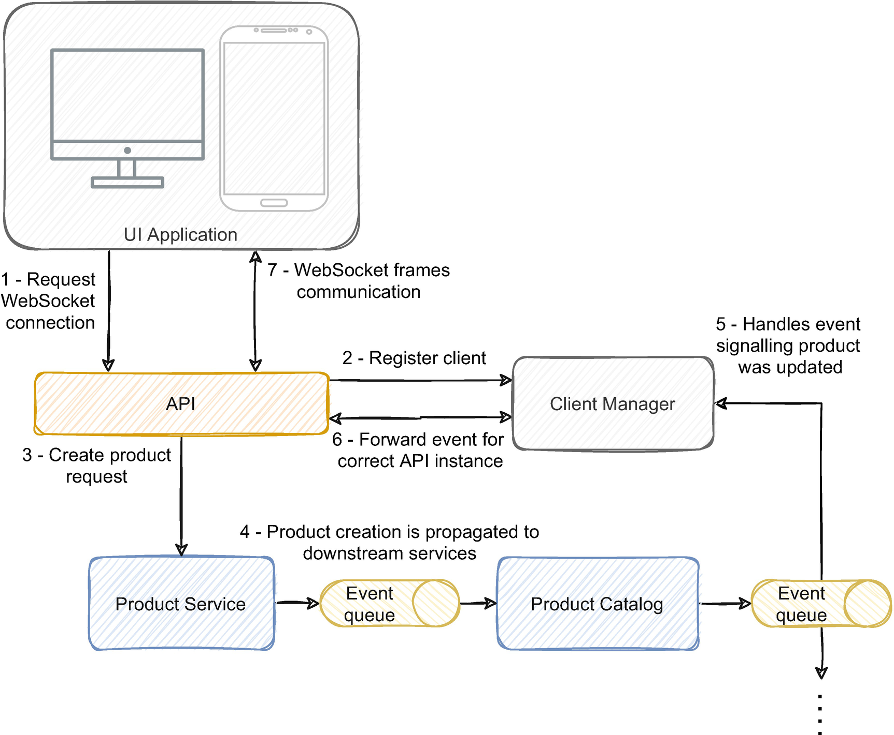

本章涵盖：

- 使用具有 API 组合的聚合层为 UI 构建信息
- 通过模块、页面和部分应用 UI 组合来与分布式数据进行交互
- 使用后端作为前端来提供数据的非规范化视图
- 基于任务的 UI 如何与管理事件驱动架构的异步性相关
- 使用事件驱动的 API 来支持响应式 UI

当我们构建一个完全隔离、高度可扩展、顶级的微服务架构平台时，我们往往会忘记谁在使用功能，通常是用户界面。你可能听说过 1979 年宾夕法尼亚州发生的三英里岛事故，当时核电站的反应堆部分熔化并导致辐射泄漏，导致数千人撤离。这是美国商业核电站历史上最重大的事故。尽管没有受伤，但在可预见的未来，它有可能使整个地区无法居住。导致事件的整个事件链源于对 UI 的误解。在关闭命令失败后，核反应堆主系统的安全阀卡住并长时间保持打开状态，导致大量核反应堆冷却剂逸出。缺乏冷却剂导致反应堆熔毁。为什么操作人员不手动关闭阀门？阀门打开时界面上的灯亮，阀门关闭时熄灭。但是当系统发出关闭阀门的信号时，灯熄灭了，而不是在阀门物理关闭时。所以，电脑发出信号，灯灭了，但阀门并没有真正关闭，导致操作人员没有注意到阀门是打开的。如果你在足够长的时间内处理事件驱动服务和最终一致性，这种类型的问题会让人感觉太熟悉了。通知用户操作已完成与仅在发生更改后才发出更改信号之间存在差异。
并非所有人都有构建微服务平台的唯一使命；我们中的一些人的原始目的是用令人敬畏的界面取悦用户。尽管我会接受处理最终一致性的挑战，而不是每天对齐响应式网页中的每个元素，但从 UI 的角度观察复杂架构的工作还是令人眼花缭乱的奇迹。
微服务为传统 UI 方法增加了一层复杂性；由于高度的数据碎片，获取信息成为一项重要的任务。某些用例可能需要来自不同域的数据的聚合视图。当每个域都由具有独立数据库的隔离服务隔离时，检索跨域数据的聚合视图可能非常具有挑战性。微服务架构公开的平台应该与用户界面无关，因为无数客户端可以访问它；可以有桌面用户、移动用户，甚至与 API 的外部交互。该平台应该支持这些用例。然而，对于不同的用例来说足够抽象通常会给如何以可接受的性能回答特定用例带来挑战。
本章将通过一些示例来说明我们如何克服这些挑战，并探索一些实现与用户界面通信的方法。尽管其中一些可以通过 UI 层解决，但它们可能不适合更复杂的数据密集型用例。事件驱动架构的构建方式使我们可以轻松共享、转换和构建不同的数据视图，以适应更复杂的用例。事件也与 UI 的反应性质保持一致；在这两者之间架起一座桥梁非常有价值，我们将在本章末尾讨论。

## 9.1 在分布式微服务架构中使用聚合层构建UI
在典型的单体应用程序中，后端可以以一种简单的方式向 UI 提供聚合信息，因为所有数据通常都位于同一个数据库中。当我们隔离每个域并将域的数据分发到具有独立数据库的单独服务中时，从不同域获取信息可能很麻烦。本节将介绍使用聚合层来促进 UI 中数据的获取，并讨论 API 组合的影响。
假设我们有一个电子商务平台的 UI，它显示产品列表、用户当前的订单信息以及用户最近购买的类似产品的推荐。理想情况下，我们希望在单个请求中从后端检索所有数据并将其显示在界面中。但是，数据的不同部分可能位于不同的域和不同的服务中。图 9-1 说明了这个例子。

过滤和聚合逻辑也将集中在单个前端应用程序和一个可部署单元中。这种方法通常会受到我们在第 1 章中讨论的单体应用的缺点的影响。当多个团队拥有同一个应用程序的所有权时发布新功能可能很难管理。
此外，UI 必须发出三个单独的请求来填充单个屏幕。例如，由于移动用户的网络速度和带宽限制，过多的请求可能会很麻烦。从微服务获取的数据可能不适合 UI 的需求，例如，即使 UI 可能只需要产品名称，产品服务也可能返回所有产品信息。
我们可以用来改善这种情况的典型方法是在微服务和 UI 之间使用聚合层。 UI 不是从每个微服务请求信息并聚合它，而是从聚合层请求信息，如图 9-2 所示。

聚合层具有以适合 UI 的最佳格式获取、连接和转换数据的逻辑。这样，UI 不会发出三个单独的请求，而是发出一个只返回所需信息的请求。通过减少 UI 请求的请求数量和数据大小，我们优化了请求的响应时间和所需的带宽。
尽管我们优化了 UI 的请求，但这个负责协调微服务请求的通用组件本身可能会成为一个整体。随着我们添加更多微服务和不同类型的 UI 不断增长，聚合层也在不断增长。由于 UI 支持各种用例、用户体验和设备，因此在单个应用程序中管理所有不同的需求可能具有挑战性。这种内部微服务平台和外部客户端之间的隔离层往往会增长并成为交付的瓶颈。
这两种模式，单个前端应用程序和使用聚合层，通常最适合具有开发 UI 和平台的全栈团队的小型应用程序。与单体应用一样，在应用程序简单且不支持很多需求的情况下，采用这些模式通常是有益的。随着应用程序的增长，管理起来就更具挑战性。

## 9.2 前端后端（BFF）

随着应用程序的增长并包含更多用例和不同的用户体验，聚合层可能难以管理。第 1 章讨论了单体应用如何成为业务增长的束缚；聚合层也有同样的缺点。由于它是将前端和后端粘合在一起的一块，因此它在价值的持续交付中起着举足轻重的作用。例如，如果我们需要在产品列表中添加更多产品信息，我们可能不仅需要更改产品列表 UI 和产品服务，还需要更改聚合层。如果所有其他 UI 都需要做同样的事情，那么所有交付都会触及聚合层，这可能会成为瓶颈。本节将讨论前端的后端作为解决该挑战的一种方式。
我们在微服务平台上公开的功能通常被设计为通用且与用例无关。例如，我们的平台可能会公开几个 REST 端点，其中包含供外部应用程序交互的概念资源，例如订单、产品、库存等。 事实上，微服务支持的功能集中在它们的领域，并且通常作为通用公开任何界面都可以与之交互的概念。例如，我们可能会根据订单履行业务流程设计订单服务，并根据该设计将其公开，这可能会或可能不会与 UI 的需求保持一致。这种不匹配不一定是坏事；微服务平台应该遵循领域概念并公开更多概念性功能，因为它可以被无数用例使用，从图形用户界面到与外部系统的集成。但是，平台功能与 UI 需求之间的不匹配需要在某处解决。正如我们所讨论的，聚合层可能是一种选择；然而，它很快就会变得臃肿并且难以跟上每个不同的用例。
这就是前端后端的用武之地。与其将每个用例分组到单个应用程序中或将该责任委托给 UI，不如由单个后端支持特定 UI 的功能。例如，我们在第 9.1 节中讨论的产品列表 UI 可以由为该用例构建的特定后端支持。其他 UI，如订单详细信息 UI 和移动界面，每个都由其自己的后端支持，如图 9-3 所示。

在该示例中，我们在 Web 浏览器上托管了一个产品列表和一个订单详细信息 UI，在移动设备上有一个产品列表。这三个用例中的每一个都由其自己的后端支持，为此目的而量身定制。通常担心避免将微服务平台设计与 UI 应用程序的需求耦合。例如，订单管理平台功能应该与订单管理应用程序 UI 设计无关。如果另一个 UI 甚至与外部系统的集成决定使用平台的功能，则无需进一步开发即可。前端的后端可以填补这一空白并适应 UI 和平台的要求，而无需担心与特定 UI 需求的耦合，因为它们是为此目的而构建的。
这个例子提出了一个问题，即我们应该如何设计后端。例如，我们真的需要两个产品列表后端吗？嗯，一个相当好的方法是了解用例以及用户如何与应用程序交互。 Web UI 将包含有关推荐和订单详细信息的信息；但是，由于大小和带宽限制，我们可能不会在移动 UI 中显示所有这些部分。移动 UI 也可能会比 Web UI 显示更少的产品，并且可能具有不同的界面（我们浏览产品的方式可能不同；在 Web UI 上，我们可以使用分页，而在移动设备中，滚动可以更合适）。这些可能是为每个都有独立后端的有力理由。团队的组织也是一个重要因素。如果同一团队同时开发 Web 和移动 UI，那么只有一个后端可能是合理的。与微服务一样，拥有一个承担过多责任的后端和多个团队在处理它可以成为构建更细粒度的一个很好的指标。
当后端和前端有独立的团队时，BFF 可以带来好处，以抽象下游平台功能并提供更高的职责分离。 BFF 可能不会使所有功能都可以集中在没有依赖关系的单层中的简单应用程序受益，因为它们增加了整体架构的复杂性。一个合理的方法是当存在复杂的逻辑来聚合多个服务以及高度多样化的用例和前端技术时使用它们。
BFF 在具有更全面搜索要求的更大数据集上仍然存在局限性。在 BFF 中保存状态，这在 Redis 和其他技术中并非闻所未闻，可能不是专门为 UI 提供服务的后端的最佳方法。 BFF 和我们在 9.1 节中讨论的模式都依赖于 API 组合，这在某些用例中可能难以管理。第 9.4 节将详细介绍这些限制并讨论在事件驱动架构中解决它们的方法。

## 9.3 微服务架构中的 UI 分解模式

正如我们所讨论的，为 UI 获取信息的一种方法是从微服务请求数据。我们可以通过使用一个聚合层来进一步优化请求，该层根据 UI 需求获取、连接和调整数据。然而，随着我们 UI 的增长和需求的发展，UI 的职责也在变化。 UI 应用程序可以增长并受到与单体相同的限制。本节将讨论我们如何将单个 UI 应用程序分解为更小的部分。
当 UI 负责有限的一系列职责并且简单明了时，我们可能会从使用单个 UI 应用程序中受益。与后端单体应用一样，在单个应用程序中工作的小团队可能会受益于拥有单个应用程序，而不是处理管理多个较小应用程序的复杂性。然而，随着应用程序的增长和承担更多的责任，开发团队也在增长。边界可能会消失，发布变得更加复杂和不常见，并且团队花费越来越多的时间来协调开发。
为解决这些困难而出现的一种模式是微前端。它依赖于将 UI 分离为更小的独立开发和部署的应用程序。不同的团队拥有不同的微前端。它还为全栈团队提供了机会，这些团队在架构中拥有较小的领域，并且可以实现 UI 和平台功能。与后端和前端的不同团队以及管理两者之间的依赖关系相比，全栈团队通常可以更一致地交付价值。然而，这种方法需要合适的公司背景和能力；但它在交付方面可能比隔离的平台和 UI 团队更灵活。微前端通常可以通过应用程序分解、页面分解和部分分解来实现，以下部分将对其进行详细介绍。

### 9.3.1 UI 应用程序分解模式

应用程序分解涉及将不同的目的与不同的应用程序分开。在将单个较大的 UI 应用程序分解为较小的 UI 应用程序时，它可能是一种有效的方法。一个全面的 UI 可能会聚合几个不同的职责，这可能会受益于具有隔离的代码库、不同的团队所有权和发布周期。它具有将单体解构为微服务的相同思维方式；为一组域构建具有明确目的的较小 UI 应用程序可以促进域隔离。正如我们之前讨论的那样，它也可以成为小型团队自上而下构建功能的催化剂，从微服务到 UI。
明显独立的领域、用例，甚至是聚集在同一个应用程序中的用户组，都可能表明 UI 应用程序有太多责任，可能会从隔离中受益。例如，电子商务管理应用程序可能会受益于分离订单履行应用程序和客户管理应用程序，如图 9-4 所示。

在此示例中，订单履行流程和客户管理应用程序具有两个不同的目的和业务流程。像这样的情况可能会受益于为每个用例划分应用程序和构建微前端。理想情况下，每个应用程序都将映射到一个微服务；然而，随着微服务变得更加细粒度，这可能很难实现。客户管理应用程序是这种方法的不错选择；开发用户服务的团队还可以构建客户管理应用程序。订单履行应用程序，因为它包含更重要的职责和概念，可能依赖于几个服务；在这些情况下，我们可能会受益于更细粒度的隔离，如以下两种模式，页面和部分分解。

### 9.3.2 UI 页面分解模式

页面分解按每个页面将应用程序分解为更细粒度的级别。我们可以通过不同的页面来查看应用程序。例如，订单履行应用程序可能具有管理库存、监督订单流、请求订单发货、组织运输提供商等的功能。每个功能可能由一组不同的页面支持，如图 9- 5.

库存和产品服务支持库存管理功能；订单管理页面由订单服务支持。在这种情况下，库存服务可能依赖于产品服务来支持库存管理页面的全部功能，因为库存本身可能没有多大意义，可能需要丰富产品信息。然而，这个依赖不需要是直接的同步依赖；库存服务可以使用产品事件流构建产品数据的自定义视图以支持 UI。
这种方法的主要优点是没有 UI 或中间层来请求和聚合来自多个来源的数据。按页分解有助于在同一应用程序内进行更细粒度的隔离，这可能有助于隔离职责和边界。它也经常更清晰地转化为服务平台。如果我们有库存管理页面，它们很可能会依赖库存服务、订单服务上的订单履行、运输服务上的运输等等。
页面隔离通常对 Web 有很好的翻译；导航将基于页面，这与 Web 的性质相一致，如果每个页面涉及不同的服务，则具有进一步的协同作用。 SPA（单页应用程序）作为一种设计应用程序以适合单个页面的方式变得流行。 SPA 有几个优点；例如，大多数资源（如脚本、CSS、HTML 等）只加载一次，这通常会使应用程序更快。但是，对于更复杂的应用程序，它们很快就会变得臃肿。导航通常涉及脚本。另一方面，多页应用程序通常会导致简单的开发；要导航，我们只需转到单独页面上的不同位置，而无需 SPA 通常具有的复杂逻辑。尽管它们对于移动应用程序的映射可能不那么清晰，但对于 Web 上更全面的应用程序来说，它们可能是一个不错的选择。

### 9.3.3 UI Section 分解模式

有些用例可能会完全转换为页面和微服务。例如，库存管理页面可能是应用它的合理用例。但是，可能存在整个页面功能可能依赖于多个不同服务的用例。随着我们构建更细粒度的服务，这种聚合视图越来越受到关注。我们可以采用的另一种类似的、更细粒度的方法是按部分分隔 UI。
我们在图 9-1 中讨论的示例有一个 UI，其中包含产品列表、当前订单信息和相关产品的推荐。页面的每个部分都有一个合理分离的功能，可以转换为不同的服务，因此需要在 UI 或中间层上聚合来自各种服务的结果。一种不同的方法是将 UI 组合到每个部分的不同微前端中，这些微前端在不同的服务中都有它们的来源，如图 9-6 所示。

每个部分使用不同服务提供的功能；例如，要列出产品信息，产品列表前端可以仅依赖于产品服务。我们可能仍需要执行三个单独的请求来提供 UI 的全部功能。尽管如此，对于每个用例都有隔离的部分，我们可以适应只显示 UI 上对带宽限制（如移动设备）更敏感的部分的子集，具体取决于页面的用例。
一个重要的考虑因素是能够构建由独立微前端支持的独立部分。每个部分都可以单独部署，这意味着我们可以在推荐部分实现新功能并部署它，而无需更改产品列表和订单信息部分。仍然需要一个 UI 来将各个部分拼接在一起；但是，该部分的前端支持主要功能。这种分离到不同前端的灵活性促进了不同团队对同一 UI 的协作，这对于应用程序或页面分解来说可能很难做到。
也推动了全栈团队的建设；产品listing和产品服务可以由同一个团队开发，独立交付价值。拥有一个具有自主权的团队从上到下交付新功能的能力通常会促进交付并使业务更快、更直接地交付价值。
当我们可以将用例分离到不同的页面时，页面分解会更有益。通过页面分解，我们可以避免组成和支持不同部分的通信的复杂性。在提供广泛功能的复杂和更全面的单页 UI 中，部分分解可能是一种有价值的方法。它可以是一种很好的方法来分离职责并为不同的团队提供一种可扩展的方式来为相同的 UI 做出贡献。

## 9.4 API 组合的局限性

9.1 节讨论了 UI 或聚合层如何使用同步请求从微服务平台获取信息。当数据很小并且集中在少数服务中时，聚合来自多个微服务的数据可能是一种有效的方法。例如，要构建一个 UI 来提供订单的详细信息，我们可能需要向订单和产品服务发出几个请求。另一方面，处理来自不同来源的大量数据和聚合数据的要求可能会很麻烦。从不同来源获取和聚合信息通常称为 API 组合模式。你可能还记得，我们在第 4 章中简要讨论了 API 组合；本节将进一步详细说明并通过用例详细说明此方法的局限性以及何时最有用。
在我们在图 9-1 章节开头讨论的示例中，UI 的不同区域使用不同的信息。在那种情况下，它可能是可控的，因为每个部分与其他部分没有很强的关系。例如，产品列表与推荐和订购部分没有很强的关系。但是，当单个组件必须合并信息并在同一部分中提供时，聚合来自不同来源的数据可能会受到广泛限制。例如，列表页面可能必须提供产品目录的更聚合视图，其中包含来自不同域的相关信息。具有此功能的 UI 示例如图 9-7 所示。

产品列表页面提供有关产品描述、当前可用库存和用户所在国家/地区的产品价格的信息。它还允许用户按类别过滤产品并定义价格范围。这些类型的需求是相当简单的用例；在实际情况下，可能会提供更全面的过滤器列表以及排序功能。
使用 API 组合，应用程序将从每个单独的服务请求信息，这在简单的用例中可能很简单。但是，当需要对跨多个服务的数据进行更全面的操作时，这在数据密集型用例中变得非常具有挑战性甚至禁止。在这个例子中，listing 页面显示了六个产品；从产品服务中请求六种产品，从定价和库存服务中请求价格和库存数量可能是负担得起的；它可能只需要三个请求。如果我们应用类别过滤器会怎样？这将是相似的；我们将请求中的过滤器应用于产品服务，并从其他服务中获取结果信息。但是，如果我们按类别过滤并使用价格范围，例如，所有价格低于 50 美元的服装项目会怎样？我们需要将类别过滤器应用于产品服务，将价格过滤器应用于定价服务。如果我们从产品服务中请求六件服装产品，然后获取价格，可能只有其中的一部分低于 50 美元。我们需要提出一系列后续请求，直到我们找到一组满足所有标准的产品；所需的请求数量很快就会变得不可行。想象一下现在我们只想展示有库存的产品；我们需要从所有过滤器的三个服务中获取结果。如果我们添加排序，它会变得更加棘手。
最终，企业需要更全面的搜索。在这些具有大量数据的用例中使用 API 组合将需要 UI 或聚合层的大量请求，通常会导致性能不佳。也许我们可以负担得起发出一些请求来获取信息，但是当每个服务中有数十万个实体时，从下游服务中获取所有数据并将其加入内存就变得不可接受了。它还将对聚合响应的组件的资源产生相当大的影响。想象一下，如果满足结果的产品不在第一页上，则组件必须逐页获取，保留结果，将它们与其他服务的响应（也可能在结果的末尾）连接起来列表），然后选择符合过滤器的那些。如果数百个用户发出相同的请求，肯定会影响组件的内存和 CPU。 ElasticSearch 实际上以类似的方式工作 1 并警告深度分页的影响，这可能会因内存不足而导致节点宕机。通过将此策略应用于复杂的需求，我们可能会遇到类似的限制。
某些要求可能需要数据的聚合视图，以支持更全面的信息查看方式。事件驱动架构的设计方式可以有效地支持数据共享。我们可以通过处理不同的事件流来持续构建优化的数据视图，如图 9-8 所示。

这种方法与 CQRS 模式非常相似。每个服务充当写入模型并拥有每个域的规则和逻辑，而目录服务只是构建每个服务信息的非规范化视图。该视图针对搜索需求进行了优化，能够支持更全面的数据视图。这种方法的一个基本考虑是保证域逻辑完全依赖于相应的服务；例如，定价域逻辑不能存在于目录服务中，只能存在于定价服务中。目录服务应该只处理与其支持的用例相关的信息。例如，折扣率可能是相关信息，但如果没有任何用例支持它，那么目录服务应该忽略它（例如使用反腐败层)。
一个重要的陷阱是将目录服务本身转变为整体。如果开始出现更细粒度的服务，我们可能会觉得需要向目录服务添加更多功能和不同类型的搜索。这实际上取决于用例，但遵循 BFF 的相同方法，针对每个用例或用户体验使用模型可能是一种明智的方法。如果服务的责任太大，我们应该考虑拆分它。
另一个重要的问题是服务的所有权。理想情况下，同一团队将能够开发 UI 并拥有此组件，以允许在不依赖其他团队的情况下实现新功能。基于事件流和 UI 开发后端功能，特性往往会更快地交付。但是，根据组织的不同，可能很难找到开发这两个组件的技能。
API 组合仍然有效；例如，显示用户订单详细信息的 UI 可能只需要向下游服务发出几个请求即可检索所需信息，而且我们几乎不会从专门的服务来构建非规范化视图中受益。但是，它有局限性；如果你发现 API 组合具有足够的性能来支持用例，它通常是最简单和最直接的解决方案。在需要更全面的视图和过滤的用例中，构建专用模型可能是保证可接受性能的合理方法。

## 9.5 基于任务的用户界面
到目前为止，我们讨论了在使后端功能适应前端 UI 要求时遇到的困难以及我们可以用来克服这些挑战的模式。但是，我们还没有详细说明 UI 的实际外观。尽管 UI 设计和 UI 用户体验的概念超出了本书的概念，但事件驱动架构在用户与应用程序和整个系统的交互方式方面引入了不同的挑战。对这些挑战的合理理解和对 UI 设计的深思熟虑可以大大平滑用户与平台的交互。本节将讨论基于任务的 UI 如何帮助简化交互并提供向事件驱动、面向领域的架构的平滑过渡。
传统的 UI 通常是基于 CRUD 的。我们打开一个 UI，应用程序获取当前状态，我们更改某些表单中的数据并提交更改，应用程序将新状态保存在数据库中。例如，假设我们有一个为电子商务平台创建产品的应用程序，我们可以有一个包含多个表单的 UI 来提交产品信息，例如品牌、类别、价格、库存单位等。一旦我们填写了必填字段，我们可以提交产品数据，如图9-9所示。

产品信息在一次交互中提交；它仅限于数据输入而不是业务流程。这种方法简单、直接且易于理解，并且有利于应用程序不需要对复杂域建模的简单用例。该过程仅限于传输和操作 DTO（数据传输对象）；该服务获取数据，映射到 DTO，并将其传递给 UI； UI 更改它并将其发送回要保存的服务。
你可能还记得，当我们讨论 DDD 时，命令和事件应该反映用户的意图；他们的设计充分体现了商业领域的价值。在 CRUD 风格的 UI 中，用户的意图经常丢失或意义非常有限；在操纵当前状态时恢复交互。
对更复杂的域和更复杂的业务流程采用这种方法通常会导致应用程序无法捕获真正的域工作流。当操作软件的人不得不编辑一系列应用程序或 UI 上的信息时，你可能有过这样的亲身经历。操作的工作流程写在一张纸上或记在某人的脑海中（例如转到 UI X 并编辑某些内容，转到 UI Y 并更改其他内容）。这是给定系统/业务的错综复杂，还是系统未能对用户需要做的事情进行建模？当然，这种设计在较简单的系统中是有价值的；更复杂的领域和流程可能会受益于不同的方法。图 9-10 中的示例还强调了映射到微服务架构时的另一个挑战；有属于不同领域的不同信息集。

将不同领域聚合在一起的 UI 不一定是坏事，这通常是业务的要求。但不同领域的信息变化通常意味着不同的行动和意图。它还回避了如何保证单个更新的一致性的问题。例如，按提交按钮，库存服务可能会成功保存库存信息，而产品服务可能会因错误而无法提交产品信息。当一项服务失败而其他服务成功时，我们应该展示什么？显示一条错误消息说“部分信息提交失败”可能是一种方法，但肯定是一种可疑的用户体验。
基于任务的 UI 通常用于帮助用户在旅程中前进并指导他完成一个过程。每个更改也更清晰地映射到用户的意图，更容易映射到每个域的命令。例如，我们可以对 UI 建模，通过分离不同的任务来转换每个用户的操作，如图 9-11 所示。

每个上下文都有不同的屏幕并映射到相应的服务和域。例如，管理产品价格的屏幕专用于该任务，更清楚地反映用户的意图。这种设计还有助于将用户操作转换为命令。更改产品价格命令语义比编辑产品命令更有意义并且具有更多域值。
由于为每个隔离的任务构建命令，基于任务的 UI 通常映射得更清晰，并且与分布式架构具有更高的协同作用。每个任务都有一个单独的命令，它很可能会转化为具有相似含义的事件，为更有意义和领域丰富的事件流铺平道路。捕获用户意图的事件流往往更有价值，并且与未来的需求更相关。
通常，具有简单流程的简单域不会从这种方法中受益太多。如果用户的操作本质上是 CRUD，那么 CRUD 的方式显然更有利。事件驱动架构通常对复杂域进行建模；但是，不要陷入到处应用这种设计的陷阱。在复杂的架构中，有几个域；有些非常复杂，可以从这种方法中受益，而另一些则可能很难从中受益。
可以说，我们可以从基于任务的 UI 中提取的最有用的好处，即使我们最终不使用它们，也是关注用户为什么以及如何尝试实现其目标。业务流程的可用性和性质是设计的基石。

## 9.6 事件驱动的 API

事件驱动 API 的异步特性通常会将原本同步的操作转换为异步操作。例如，像单体应用这样的单进程应用程序中的订单履行过程可能是一个同步过程，用于提交具有所有条件的订单提交。然而，在事件驱动架构中，订单履行可能是几个事件驱动服务的编排。异步操作在整个架构中可能更常见。为了确保友好的 Web 体验，我们可能会从同步 CRUD 用户界面（其中反馈是即时的）转变为在工作流中显示请求进度的用户界面，向用户显示状态或警报。
随着响应式 UI 的出现，事件驱动的前端实现变得越来越流行。它们与异步方法具有很高的协同作用；随着状态的进展，异步更新可以无缝地交付给用户。尽管像 XMPP（可扩展消息传递和存在协议）这样的旧协议仍然很流行，并且传统上用于提供此功能，但可以使用更新的轻量级替代方案。 WebSockets 2 最近作为双向通信和双向流量的解决方案变得非常流行。 Server-Sent Events3 也是一种有价值的替代方法，尽管专注于以单向通信将新数据推送到客户端。 WebHooks 4 也是一种使用自定义回调向客户端实现单向通知的有趣方法。所有三种方法都是异步实时通信的有效选择，很像事件驱动的微服务架构。
后端和前端都采用事件驱动的思维方式（尽管具有非常不同的用例、工具和不同的规模）的方式很奇特，但它们之间的通信通常使用同步 HTTP API 调用。事实上，长期以来，提供无缝后端异步接口供 UI 应用程序使用的选项很少。由于防火墙的挑战、缺乏细粒度角色或基于资源的访问控制以及缺乏明确的标准和访问异步事件的直接方法，Kafka 或 RabbitMQ 等微服务消息代理可能不适合向 UI 应用程序交付异步事件。
事实上，由于清晰、完善的标准，像 REST 这样的传统同步 API 是大多数平台中的常见功能。 OpenAPI5 等标准简化了不同系统的开发和集成，无需复杂的协调。 AsyncAPI6 越来越多地填补了异步 API 的空白。它是一个基于 OpenAPI 的开源项目，旨在为具有消息驱动基础的异步实现提供规范。它支持多种消息传递协议并提供工具来定义事件模式和语义以连接、订阅、发布和与 API 交互。它还支持广泛的工具，类似于 OpenAPI，如代码生成、API 发现和事件管理。它可以成为记录和设计异步 API 的一种有价值的方法。

### 9.6.1 事件驱动结合WebSockets

让我们通过一个示例来说明异步功能如何使用 WebSockets 与 UI 交互。假设我们有一个 UI 来创建产品，并且企业只考虑创建的产品在产品目录中可用后进行管理。产品目录是异步更新的，因此用户知道产品何时在目录中可用是很有用的。图 9-12 说明了这个例子。

用户通过 UI 应用程序创建产品，这会触发对 API 组件和产品服务的请求。产品服务创建产品并发布一个表示更改的事件信号，产品目录服务使用该事件在目录中注册该产品。产品目录可能会处理不同的流以丰富产品的非规范化模型（类似于我们在图 9-8 中讨论的内容），还发布了一个事件，表示产品创建。
UI 应用程序首先在 API 上注册自己并请求 WebSocket 连接。客户经理负责跟踪注册的客户并处理在目录中发出产品创建信号的事件。每次创建产品时，客户端管理器都会处理该事件并通知 UI 产品创建成功。
为什么我们需要客户端管理器组件？我们不能只处理来自 API 的事件吗？向前端应用程序交付事件的挑战是将正确的事件交付给正确的客户端。所有组件都可以（并且可能会）水平缩放，这意味着每个组件都有多个实例。如果有多个产品目录服务、UI 应用程序和 API 实例，我们如何保证将事件传递到创建产品的正确客户端？
一个可能的解决方案是让每个 API 实例处理所有事件并过滤与连接到该实例的客户端对应的事件。它可以是小规模用例的一种选择；然而，对于大型事件流，它很快变得不切实际。客户端管理器可以帮助管理所有现有客户端并将每个事件传递到相应的 API 实例，该 API 实例与客户端具有 WebSocket 连接。

### 9.6.2 事件驱动结合服务器发送事件

在用例中，我们不需要双向通信通道；服务器发送的事件可能是一个有效的替代方案。 Server-Sent Events 是一种仅订阅协议，它提供了一种订阅事件流的方法，并且是一种将异步数据传送到前端应用程序的轻量级方法。
我们在上一节中讨论的使用服务器发送事件的用例的方法在很大程度上保持不变。 UI 应用程序不使用与后端的双向连接，而是使用 EventSource7 对象打开与 API 的持久连接。客户端管理器组件将事件流转发到 API。图 9-13 展示了我们之前讨论过的相同用例。

事件流的传递是单向的，而不是双向连接。 Server-Sent Events 还支持简单的错误处理，生成可以在前端应用程序中更可持续处理的错误事件。与 WebSockets 的一个主要区别是它们使用 HTTP 请求来维护持久连接（也通过 HTTP/2 进行多路复用）而不是专用协议。
WebSockets 在移动用例中往往更重量级；由于它们建立双向连接，因此需要全双工天线，这在大多数用例中会影响带宽和功耗。 Server-Sent Events 通过 HTTP 实现单向流量，与 WebSockets 相比，它倾向于减少总数据使用量和电池电量。 8

### 9.6.3 事件驱动结合WebHooks

实现与前端应用程序的单向异步通信的另一种替代方法是通过 WebHooks。 WebHooks 以我们习惯的反向流程工作；订阅者注册一个回调，服务器将调用该回调来传递事件流（它们通常被称为反向 API）。与 Server-Sent Events 类似，通信通过 HTTP 发生并且不应用任何专门的协议。
与其他替代方案的主要区别在于回调机制。让我们使用 WebHook 来完成我们在上一节中讨论的相同示例。产品创建流经产品和产品目录服务，我们将相应的事件传递给前端应用程序，如图 9-14 所示。

前端应用程序通过对 API 的 HTTP 请求订阅事件流，并注册一个回调 URL，后端将使用该 URL 传递事件流。产品创建流经这些服务，产品目录服务最终会生成一个事件来表示更改。客户端管理器将处理该事件并将其传递给负责将流传递给前端应用程序的回调模块。为此，模块通常会向提供新事件的回调 API 发出 POST 请求。
WebHooks 的局限性在于依赖 HTTP 回调端点来传递事件。由于实施和安全问题，在面向用户的应用程序（如移动应用程序或浏览器）中托管公开暴露的 HTTP 端点通常是不切实际的，甚至是不可行的。通常，WebHook 应用于作为服务器的前端或 BFF，并且可以可持续地实现此功能。然而，当我们需要单向通信来推送通知或事件传递时，它们是一个有趣的选择。

## 9.7 总结

- 当我们需要聚合来自不同服务的数据时，聚合层可以帮助优化带宽和响应时间。它通常最适用于简单的应用程序和包含的用例。我们应该避免给聚合层增加太多责任的陷阱；如果代码有一个吸引人的地方，它通常会。
- BFF 可以对下游平台功能进行抽象，并提供更高的职责分离，从而避免在单个聚合层上增加过多的职责。它们还支持对 UI 需求的密切优化，而无需担心将平台功能与特定 UI 用例耦合。
- 我们可以将 UI 应用程序分解为更小的组件，以最好地适应底层微服务平台。可以在应用程序、页面和节级别进行分解；我们可以使每种模式适应最合适的用例。
- API 组合是一种有用且直接的解决方案，用于获取要在少量请求中显示的数据。但是，在需要全面过滤和排序要求的用例中，构建专用模型可能是保证可接受性能的合理方法。
- 由于为每个隔离的任务构建命令，基于任务的 UI 通常与分布式架构具有更高的协同作用。它们通常还旨在帮助用户推进旅程并指导他完成一个过程。每个更改也更清晰地映射到用户的意图，更容易映射到每个域的命令。
- 事件驱动的 API 可以成为事件驱动架构中传统同步 API 的有价值的替代方案。我们可以使用它们以可持续的方式异步通知用户生态系统的变化。
- 为了实现事件驱动的 API，我们可以使用 WebSockets、Server-Sent Events 和 WebHooks。 WebSockets 提供了一种在 UI 和后端之间实现双向通信的方法。 Server-Sent Events 和 WebHooks 是单向事件传递和推送通知的不错选择。

## 脚注

1. Article in ElasticSearch documentation, “Paginate search results,” www.elastic.co/guide/en/elasticsearch/reference/current/paginate-search-results.htm
2. Protocol definition in “The WebSocket Protocol,” December 2011, https://datatracker.ietf.org/doc/html/rfc6455
3. More information in “Server-send events,” https://developer.mozilla.org/en-US/docs/Web/API/Server-sent_events
4. Wikipedia page in “WebHook,” https://en.wikipedia.org/wiki/Webhook
5. Specification in “OpenAPI Specification,” February 15, 2021, https://spec.openapis.org/oas/v3.1.0
6. Specification in “AsyncAPI Specification,” www.asyncapi.com/docs/specifications/v2.0.0
7. More information in https://developer.mozilla.org/en-US/docs/Web/API/EventSource
8. Full article in Martin Chaov, “Using SSE Instead Of WebSockets For Unidirectional Data Flow Over HTTP/2,” February 12, 2018, www.smashingmagazine.com/2018/02/sse-websockets-data-flow-http2/
